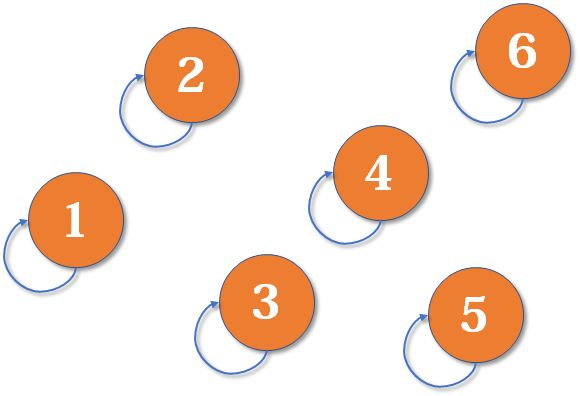
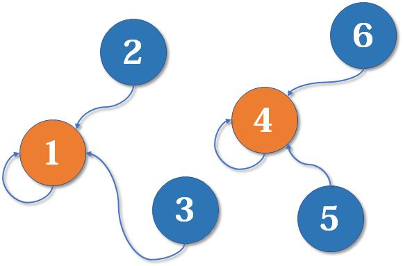
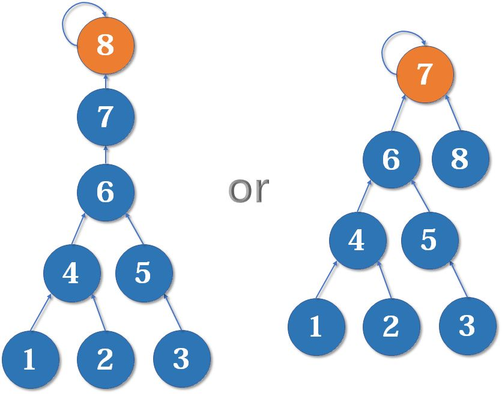

# Algorithm - Disjoint Set

Created by : Mr Dk.

2021 / 01 / 11 21:42

Nanjing, Jiangsu, China

---

## About

**并查集** 是一种树型的数据结构，用于处理一些不相交集合的合并。一些元素，从一开始各自属于一个集合，随着条件的逐渐给出，集合之间会互相合并，直到最终操作结束，不同元素可能会分属不同的集合。其中主要包括两个主要操作：

* 合并 - 把两个不相交的集合合并为一个集合
* 查询 - 查询两个元素是否属于一个集合

## Theory

最开始，每个元素分属一个类型，可以初始化一个数组，数组中的每个元素分别代表一个类型：

```c++
vector<int> collection(length);
for (size_t i = 0; i < collection.size(); i++) {
    collection[i] = i;
}
```

此时集合图示为：



接下来，随着条件的给出 (比如元素 A 和元素 B 同属一类)，分属不同集合的元素需要被合并到一个集合中：



在每个集合中，都会有一个 **代表元素** (即根结点)。只需要使元素中的代表元素指向要合并的元素，就能合并集合：


以上过程完全可以由一个数组来实现：

```c++
int find_root(vector<int> &collection, int i) {
    return collection[i] == i ? i : find_root(collection, collection[i]);
}
```

```c++
void merge() {
    collection[find_root(i)] = find_root(j);
}
```

## Path Compression

随着集合的合并，可能会导致形成越来越长的链，从而导致每次的 **查询** 操作耗时长。可以对路径进行压缩，从而优化查询操作的时间复杂度：


另一种实现的 `find_root()` 算法能够天然实现路径压缩。在递归结束后，顺便更新每个结点所在集合的 root 结点：

```c++
int find_root(vector<int> &collection, int i) {
    if (collection[i] != i) {
        collection[i] = find_root(collection, collection[i]);
    }
    return collection[i];
}
```

## Rank

两个集合合并时，原则上应当使简单的集合并入复杂的结合中，这样到根结点的路径变长的结点数更少：



可以为每个结点维护一个 `rank[]` 数组，记录以每个结点为根的树深度。一开始所有元素的深度都为 1。合并时，把深度较小的结点往深度较大的结点上合并。

路径压缩和按秩合并同时启用时，树的深度将会变得不准确，但是总比没有按秩合并的性能要好。

---

## References

[知乎专栏 - 算法学习笔记 (1)：并查集](https://zhuanlan.zhihu.com/p/93647900/)

---

