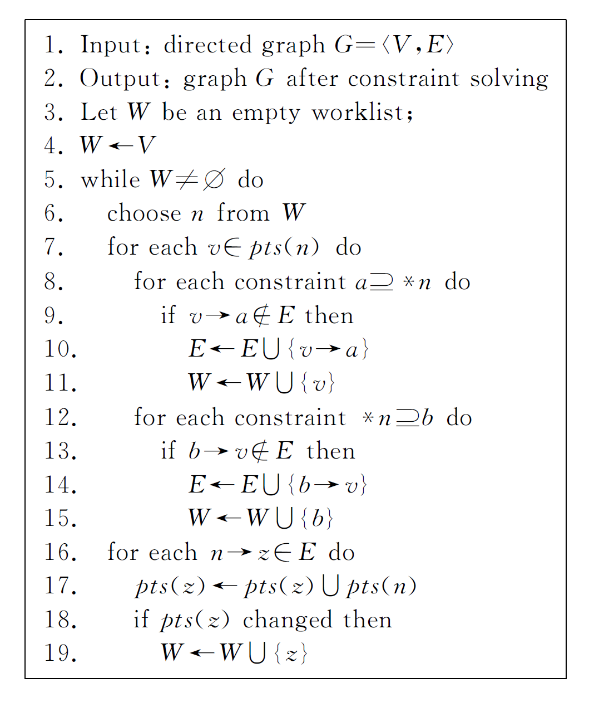

# Compiler - Andersen Point-to Analysis

Created by : Mr Dk.

2019 / 05 / 24 10:07

Nanjing, Jiangsu, China

---

## About

指针分析是一类特殊的数据流问题

是静态程序分析的基础

* 近似
* 保守
* 在效率和精度之间折衷

精度

* flow-sensitive
* context-sensitive

对于 flow-insensitive 的指针分析方法主要有两种：

* inclusion-based
  * 基于 constraint set 求解
  * 又被称为 subset-based 或 constraint-based
  * Andersen-Style
* unification-based
  * equivalence-based
  * Steensgaard-Style

简要了解了一下 Andersen-Style 的分析算法

---

## Andersen Point-to Analysis

不关心数据类型，只关心指针层面的赋值

代码行可以抽象为：

| Assignment | Constraint Type     | Constraint Type | Constraint | Meaning                      |
| ---------- | ------------------- | --------------- | ---------- | ---------------------------- |
| `a = &b;`  | Referencing         | Basic           | `a ⊇ {b}`  | `loc(b) ∈ pts(a)`            |
| `a = b;`   | Aliasing            | Simple          | `a ⊇ b`    | `pts(a) ⊇ pts(b)`            |
| `a = *b;`  | Dereferencing read  | Complex         | `a ⊇ *b`   | `∀v∈pts(b), pts(a) ⊇ pts(v)` |
| `*a = b;`  | Dereferencing write | Complex         | `*a ⊇ b`   | `∀v∈pts(a), pts(v) ⊇ pts(b)` |

其中，`{}` 代表内存内容，`loc()` 代表内存地址，`pts` 代表指针指向的位置

换句话说 - 

* `a = &b` 代表 b 对应的内存单元肯定在 a 的指向范围内
* `a = b` 代表所有 b 指向的单元，a 也都有可能指向
* `a = *b` 代表对于每一个 b 指向的单元 v，v 指向的 a 也有可能指向
* `*a = b` 代表对于每一个 a 指向的单元 v，b 指向的 v 也有可能指向

---

## Constraint Graph

基于这种约束关系，可以建立约束图 (Constraint Graph)

* 图中的结点为变量或抽象内存区域
* 每一个结点关联一个 point-to set
* a &rarr; b，当且仅当一下三种条件成立：（代表指向集的传递方向）
  * `pts(b) ⊇ pts(a)` (`b = a;`，a 需要将其指向集全部传递给 b)
  * `a ∈ pts(v) && pts(*v) ⊆ pts(b)` (...)
  * `pts(a) ⊆ pts(*v) && b ∈ pts(v)` (...)

初始约束图的创建由 __简单约束__ 和 __基本约束__ 构成

* 为每个变量建立结点
* 根据基本约束，为每个结点标注指向集
* 为每个简单约束建立一条边

接下来，进行算法迭代，对 __复杂约束__ 进行推导

直到所有结点的指向集都被找全，算法结束

---

## Andersen Algorithm

首先将所有结点加入到工作队列中

当工作队列不为空时，每次选择工作队列中的一个结点 `n`

* 对于 `n` 的指向集中的每个元素 `v`
  * 对于每一个满足复杂约束 `a ⊇ *n` (物理含义 `a = *n;`)
    * 如果不存在 v &rarr; a，就添加这条边，并将 `v` 加入工作队列 
    * （因为 `v` 的指向集传递路径发生了更新，指向集流向需要更新）
  * 对于每一个满足复杂约束 `*n ⊇ b` (物理含义 `*n = b;`)
    * 如果不存在 b &rarr; v，就添加这条边，并将 `b` 加入工作队列
    *  （因为 `b` 的指向集传递路径发生了更新，指向集流向需要更新）
* 对于图中由 `n` 出发的每一条线 n &rarr; z (`n` 的指向集传递方向)
  * 将 `n` 的指向集中的内容全部传递给 `z`
  * 如果 `z` 的指向集发生了变化 (从 `n` 的指向集中传递了新的指向)
    * 则将 `z` 加入工作队列
    * （因为 `z` 的指向集发生更新，新的指向集需要流向 `z` 所有的传递路径）

直至工作队列为空，算法结束

从宏观上来看这个算法：寻找每个结点的完整指向集

* 先根据简单约束和基本约束构造图的初始状态

  * 简单约束和基本约束中的指向集是直接、显而易见的

* 然后根据所有的复杂约束逐步推导每个结点的指向集、流向路径

  > 复杂约束之间有依赖关系，一次迭代不能找全所有的指向集、流向路径；
  >
  > 所以需要不停迭代，直至所有结点的指向集、流向路径都不更新为止。
  >
  > 这也是工作队列存在的意义。

* 工作队列的作用就是，当结点的指向集、流向路径发生更新时，记录发生更新的结点

  * 发生更新的结点，其指向集需要被重新推断

* 当工作队列为空时，说明每个结点的指向集已经找全，且没有更新了

  * 因此算法可以结束

总体来说，对于一个结点，如果：

* 从它出发的路径增加了
* 其指向集中的元素增加了

那么它就要被加入工作队列中，因为：

* 它的指向集需要通过新的边传递到新关联的结点
* 它的指向集中的新元素需要通过已有的边传递到所有已关联结点

接下来，当算法继续迭代，轮到该结点时，完成上述更新操作

当工作队列为空时，说明所有结点的指向集都已经无需再被更新

在算法结束后，每个结点下标注的指向集，就是该结点可能指向的所有结点

* 可以从结点画箭头到所有其指向的结点，得到指针指向图

---

## References

[1]陈聪明,霍玮,于洪涛, 等.基于包含的指针分析优化技术综述[J].计算机学报,2011,34(7):1224-1238. DOI:10.3724/SP.J.1016.2011.01224.

<https://blog.csdn.net/dashuniuniu/article/details/78704741>

<https://blog.csdn.net/majestyhao/article/details/49961585>

<https://www.youtube.com/watch?v=erIkdIwypbE&list=PLImH0vIYinFnC_ELNAdbzo_hSZJRKJ5Rg&index=5&t=3s>

---

## Summary

这个东西也太难了叭

花了一天时间终于看懂了

关于算法类的东西

我一直觉得 想看进去太难了

但如果看进去了

就会特别佩服发明者的智慧

我觉得算法发明者真的有非常强的形式建模能力

将问题抽象到了图中

并用算法表示了思路

这正是数学和计算方法的魅力吧

---

