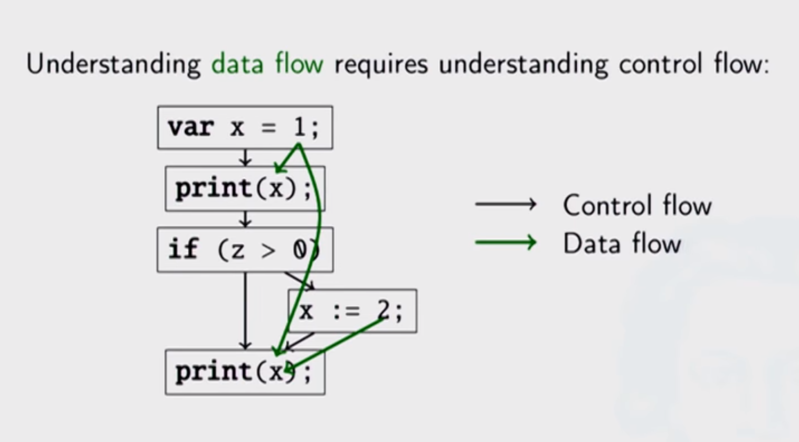
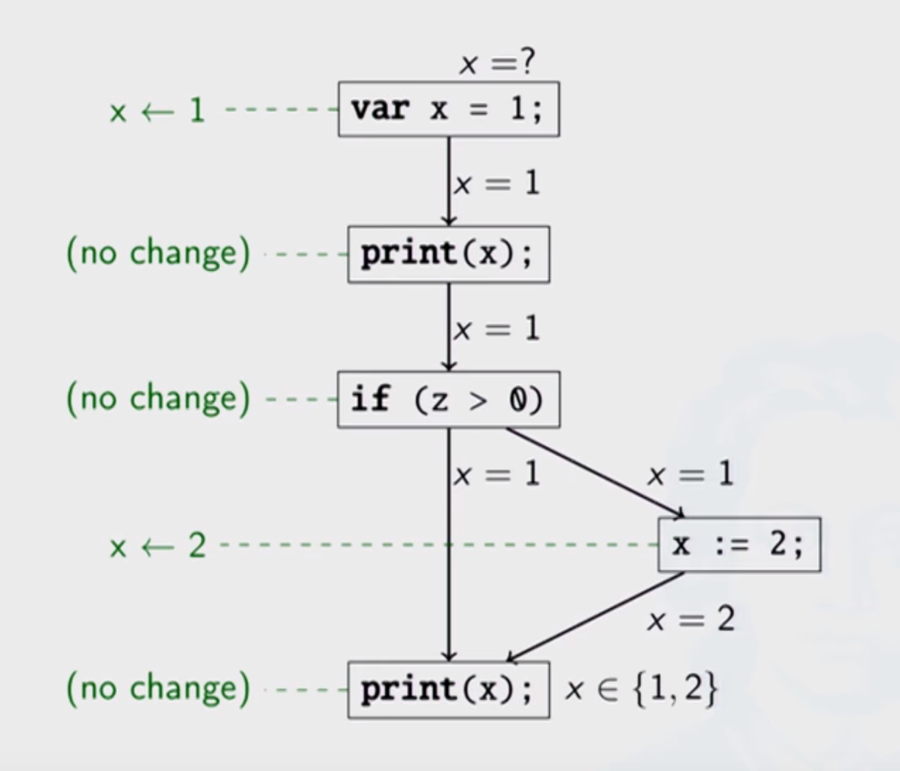
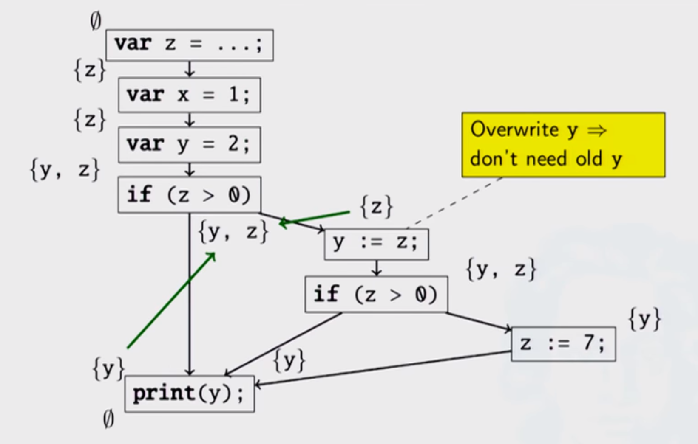
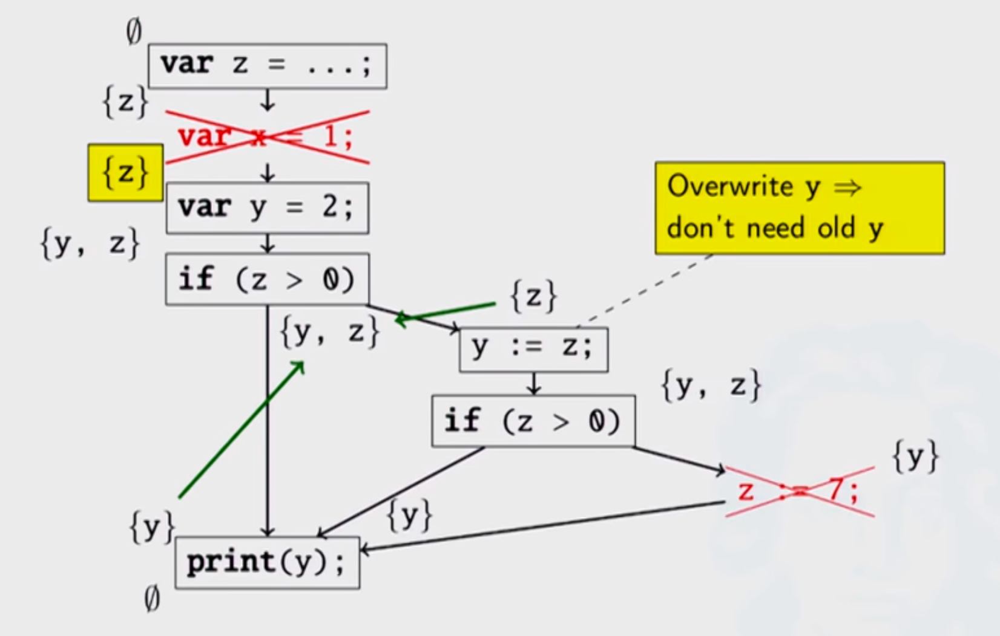
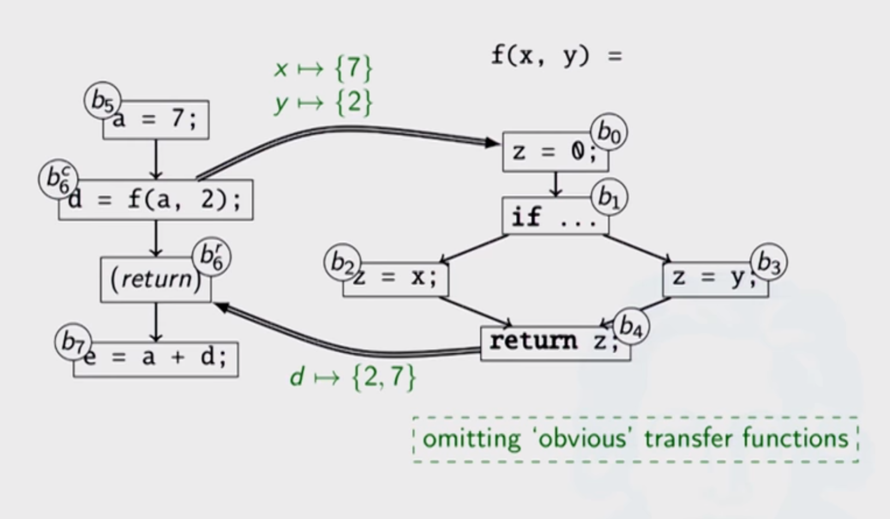
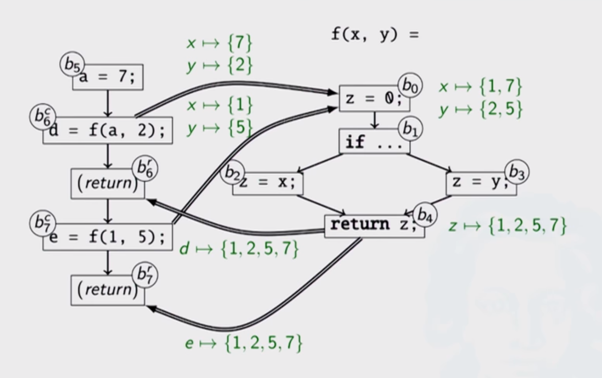
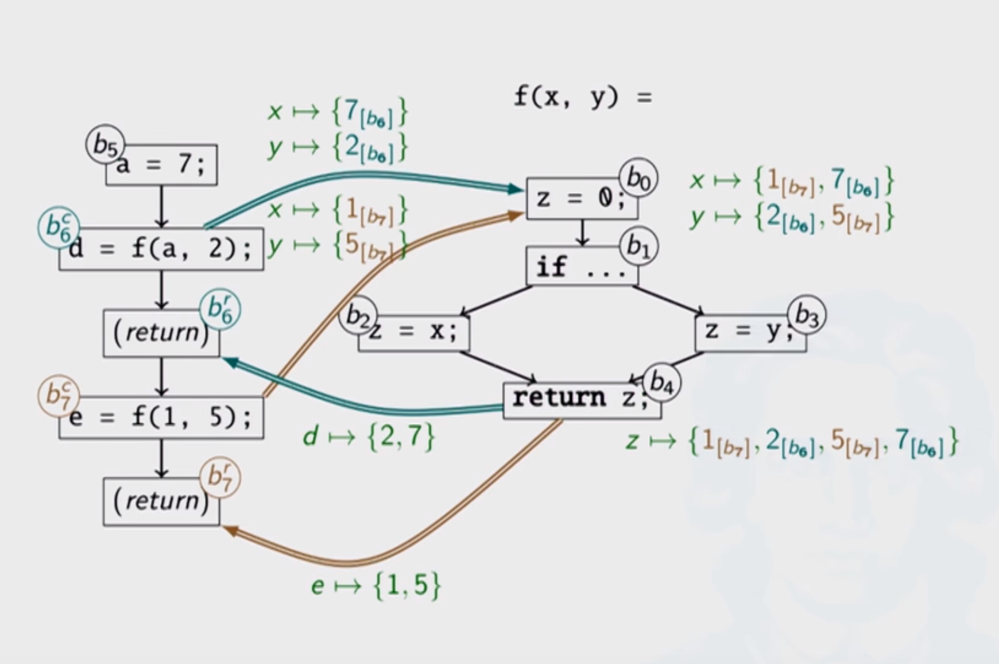

# Compiler - Data-flow Analysis

Created by : Mr Dk.

2019 / 05 / 19 19:29

Nanjing, Jiangsu, China

---

## About

一种静态分析的方法

可被用于分析不同类型的数据

* 常量
* 变量
* 表达式

应用场景：

* BUG-finding tools
* Compilers

## Base

基于 Control-flow Analysis

* 起点：被赋值的位置
* 终点：被使用的位置

通过检查某一个变量是否被改变，可以得到：

## Live Variables Analysis

Optimize Unnecessary Variables

* 某次赋值后，变量是否会在之后的程序中被使用
* 需要找到变量被赋值的地方，并向前寻找

从 Control-flow Graph 的终点开始 - backward analysis

依次标注每个 Basic Block 所 __依赖__ 的变量集合：

* 赋值不是依赖
* 如果依赖的值与旧值无关，则可以被覆盖
* 如果依赖被赋值，则可以将依赖去掉

将代码与依赖进行对比，可以删去之后未被使用的赋值和变量：

## Observations

1. Can be run __forward__ or __backward__
2. May have to __join__ results from multiple sources
3. __Loops__ is non-trivial

## Inter-Procedural Analysis

过程间的数据流分析

在多次调用同一个子函数的过程中

如果进行 context-insensitive 的分析

* 可以 cover 所有的程序执行路径
* 不够精确，有很多不可能出现的 data-flow

比如一次调用的输入参数为 `{2, 7}`，一次为 `{1, 5}`

输出的可能值为 `{1, 2, 5, 7}`

但输入 `{2, 7}` 的输出不可能为 `{1, 5}`，反之亦然

如果要进行 context-sensitive 的分析，就需要过滤 valid path

_Meet over Valid Paths (MVP)_ 分析

* Context-sensitive version of MOP

* Inter-procedural data-flow analysis 由于存在过程调用而变得不准确
* 可通过如下途径提高准确性：
  * 将调用点拆分为 调用点 + 返回点
  * 对调用点和返回点分别添加 flow edge
  * 添加 call string 进行 context-sensitive 的分析

---

