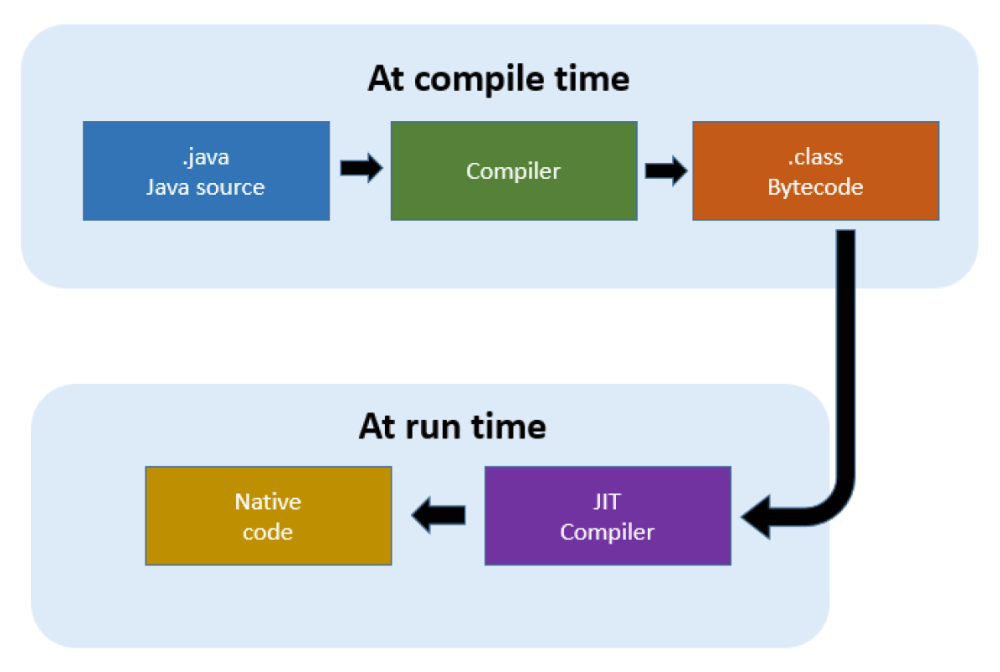

# Compiler - JIT

Created by : Mr Dk.

2019 / 05 / 23 11:41

Nanjing, Jiangsu, China

---

## Java JIT Compiler

Java 的核心 - "Write once, run everywhere" - `bytecode`

Bytecode 可被解释或编译为目标代码，或直接执行在 bytecode 特定的 ISA 上

Java Virtual Machine (JVM) 实现了 bytecode 的解释

为了提高性能，JIT 编译器在运行时与 JVM 进行交互

* 将部分 bytecode 序列编译为机器码
* 硬件可以直接执行机器码
* 不需要经过 JVM 解释大量相同的代码

JIT 编译 bytecode 会被算进总体执行时间内

* 如果 JIT 编译的函数不会被经常执行
* 会比 JVM 直接解释 bytecode 占用更多的执行时间

JIT 将 bytecode 编译为机器码，会进行部分优化

* 数据分析
* 栈操作转换为寄存器操作
* 通过寄存器分配，减少内存访问
* 减少共同子表达式
* ...

JIT 编译器的优化等级越高，在执行时占用的时间越长

---

## Overview

JIT 编译器是 JRE 的一个组件

在运行时提升 Java 应用的性能

Java 程序包含很多个类的 bytecode

运行时，JVM 载入 bytecode，并开始解释

JVM 解释 bytecode 带来的额外计算和内存开销

导致 Java 应用比机器码的执行更慢

JIT 通过运行时将 bytecode 编译为机器码

提升 Java 应用的性能

JIT 编译器默认被使用

JVM 对于 JIT 编译后的机器码会直接调用，而不再解释相关的 bytecode

JIT 也需要额外的处理时间和内存占用

---

## Reference

<https://aboullaite.me/understanding-jit-compiler-just-in-time-compiler/>

---

## Summary

写了不少 Java 程序了

但是对于 JVM 中的运作机制还是不太了解

而且，一直知道 Java 不是一门解释型语言

又知道 JVM 会进行解释

这个矛盾一直埋在心里

今天看来，所谓的编译，是将 `.java` 编译为 `.class` 的 bytecode

然后再由 JVM 对 bytecode 进行解释

所以，在编译阶段，Java 和 C/C++ 一样

只不过 Java 为了跨平台

在编译阶段只生成了 bytecode

相当于一种中间表示形式

然后这些 bytecode 可以在运行时经过不同平台的 JVM 解释执行

所以说 Java 在运行时的速度上不如 C/C++

因为 C/C++ 编译链接结束后直接得到了可执行文件（机器码）

硬件可以直接执行机器码

但是对于不同平台，C/C++ 就需要编译链接不同的机器码

有些头文件在不同的平台上可能支持还不一样

所以 C/C++ 不能支持跨平台

---

