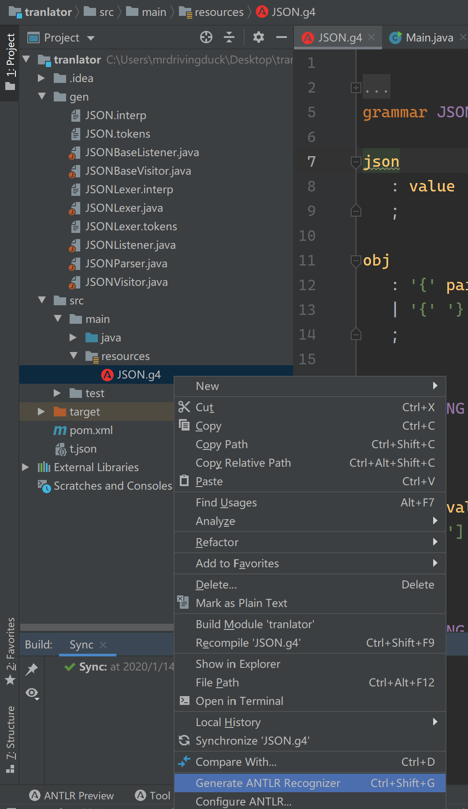
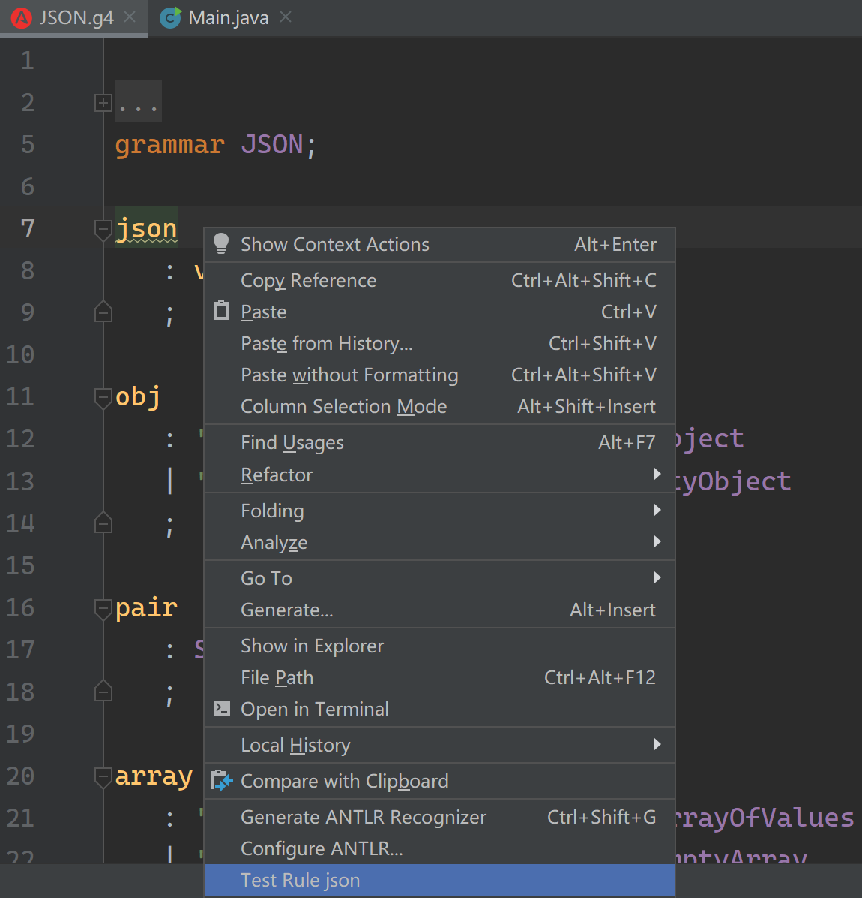

# ANTLR - Basic

Created by : Mr Dk.

2020 / 01 / 14 17:25

Nanjing, Jiangsu, China

---

**ANTLR (ANother Tool for Language Recognition)** 是一套计算机语言处理框架，可用于对特定语法的语言进行词法分析、语法分析、语法树构建。最新的 ANTLR v4 规定了一套 **g4** 语法。g4 语法可以针对对象语言进行类似 *巴克斯范式 (Backus-Naur From, BNF)* 的描述。ANTLR 可以将 g4 语法文件直接转换为词法分析和语法分析的 Java 代码 (或其它实现语言)，这样就可以得到一个 Java 实现的语言识别器，比如：

* SQL 识别器
* JSON 识别器

除了用于自动生成 Java 代码，ANTLR 还提供一个 [Runtime 工具](https://github.com/antlr/antlr4)，用于为自动生成的 Java 代码的执行提供支持。Runtime 需要作为依赖 (如 Maven) 引入。对于流行通用的编程语言、格式，开源社区都已经提供了 [现成的 g4 语法文件](https://github.com/antlr/grammars-v4) 🤞

本文以生成一个 Java 版本的 JSON 解析器作为 🌰。

---

## Example

以下是 *grammars-v4* 中提供的 JSON 语法文件 `JSON.g4`

```
/** Taken from "The Definitive ANTLR 4 Reference" by Terence Parr */

// Derived from http://json.org
grammar JSON;

json
   : value
   ;

obj
   : '{' pair (',' pair)* '}'
   | '{' '}'
   ;

pair
   : STRING ':' value
   ;

array
   : '[' value (',' value)* ']'
   | '[' ']'
   ;

value
   : STRING
   | NUMBER
   | obj
   | array
   | 'true'
   | 'false'
   | 'null'
   ;


STRING
   : '"' (ESC | SAFECODEPOINT)* '"'
   ;


fragment ESC
   : '\\' (["\\/bfnrt] | UNICODE)
   ;
fragment UNICODE
   : 'u' HEX HEX HEX HEX
   ;
fragment HEX
   : [0-9a-fA-F]
   ;
fragment SAFECODEPOINT
   : ~ ["\\\u0000-\u001F]
   ;


NUMBER
   : '-'? INT ('.' [0-9] +)? EXP?
   ;


fragment INT
   : '0' | [1-9] [0-9]*
   ;

// no leading zeros

fragment EXP
   : [Ee] [+\-]? INT
   ;

// \- since - means "range" inside [...]

WS
   : [ \t\n\r] + -> skip
   ;
```

有了这个文件，可以借助 ANTLR 的工具直接生成识别 JSON 的 Java 代码。

ANTLR 提供命令行版本的工具，但更方便的还是集成在 IDEA 中的插件：



对语法文件进行 `Generate ANTLR Recognizer` 后，可以看到自动生成了一些文件。其中核心的文件是：

* `JSONLexer.java` - 词法分析代码
* `JSONParser.java` - 语法分析代码

生成的其它的文件接下来再作解释。接下来，在项目中引入 ANTLR Runtime 依赖。由 ANTLR Runtime 支持，这些类就可以被实例化了：

```java
public static void main(String[] args) {
    CharStream input = CharStreams.fromString("{}");
    JSONLexer lexer = new JSONLexer(input);
    CommonTokenStream tokens = new CommonTokenStream(lexer);
    JSONParser parser = new JSONParser(tokens);
}
```

运行该程序，可以看到指定的输入是否可以被该识别器所接受。

此外，插件还带有语法树预览的功能，在语法文件的 *top-level rule (顶层语法规则)* 右击 `Test Rule <rule_name>`：



从文本框或文件接收测试输入后，就能看到预览的 AST：


---

## Listener && Visitor

使用 ANTLR 框架的更多需求是，当进入或退出某条语法规则的时候，我们可能想做一些事情，比如在 AST 上做一定的转换。ANTLR 允许我们在语法树上注册回调函数，并提供了两种遍历方式 - listener 和 visitor。

### Listener

使用 ANTLR 的代码生成工具，得到了一个 `JSONListener.java`

这是一个接口文件，里面定义了 **进入** 和 **退出** 每一条语法规则的函数：

```java
public interface JSONListener extends ParseTreeListener {
    /**
     * Enter a parse tree produced by {@link JSONParser#json}.
     * @param ctx the parse tree
     */
    void enterJson(JSONParser.JsonContext ctx);
    /**
     * Exit a parse tree produced by {@link JSONParser#json}.
     * @param ctx the parse tree
     */
    void exitJson(JSONParser.JsonContext ctx);
    /**
     * Enter a parse tree produced by the {@code AnObject}
     * labeled alternative in {@link JSONParser#obj}.
     * @param ctx the parse tree
     */
    void enterAnObject(JSONParser.AnObjectContext ctx);
    /**
     * Exit a parse tree produced by the {@code AnObject}
     * labeled alternative in {@link JSONParser#obj}.
     * @param ctx the parse tree
     */
    void exitAnObject(JSONParser.AnObjectContext ctx);
    
    // ...
}
```

实际上内部继承了 ANTLR Runtime 的 `ParseTreeListener` 类。在大部分情况下，我们只希望指定某几个规则的行为，其它的什么也不做。

ANTLR 已经自动生成了一个 `JSONBaseListener.java`，该类实现了上述接口中定义的每一个 `enter` / `exit` 函数，但每个函数的实现都是空的。我们只需新建一个继承自 `JSONBaseListener` 的 Class，并只需要 override 我们想要操作的那几条规则对应的函数即可。

* 如果 override `enter` 函数，则是一种先序遍历的逻辑
* 如果 override `exit` 函数，则是一种后序遍历的逻辑

遍历的具体过程：

1. 遍历到一个结点时，自动调用 `enter` 函数
2. 自动遍历所有的子结点
3. 子结点遍历完毕后，自动调用 `exit` 函数

在遍历到某一结点时，可以通过参数中的 context 取得结点上的信息。

遍历的基本代码如下：

```java
// 用之前实例化的 parser，实例化从顶层规则开始的语法树 (json 是顶层规则)
ParseTree tree = parser.json();
// 实例化一个 listener
JSON2XML.XMLEmitter listener = new JSON2XML.XMLEmitter();
// 实例化 walker
ParseTreeWalker walker = new ParseTreeWalker();
// 通过 walker，向语法树上注册 listener 并遍历
walker.walk(listener, tree);
```

### Visitor

ANTLR 的代码生成工具也自动生成了一个 `JSONVisitor.java`

这个文件也是一个接口，里面定义了访问到每一条语法规则对应结点的函数：

```java
public interface JSONVisitor<T> extends ParseTreeVisitor<T> {
	/**
	 * Visit a parse tree produced by {@link JSONParser#json}.
	 * @param ctx the parse tree
	 * @return the visitor result
	 */
	T visitJson(JSONParser.JsonContext ctx);
	/**
	 * Visit a parse tree produced by the {@code AnObject}
	 * labeled alternative in {@link JSONParser#obj}.
	 * @param ctx the parse tree
	 * @return the visitor result
	 */
	T visitAnObject(JSONParser.AnObjectContext ctx);
    
    // ...
}
```

与 listener 的区别在于，`visit` 函数在访问到某个结点时被触发。如果还想继续访问子结点，需要显式调用 `visitChild()` 函数。否则，遍历深度就在该结点中止。

同样，代码生成工具生成了 `JSONBaseVisitor.java`，该类实现了接口中定义的所有函数，并在每个函数中默认调用了 `visitChild()` 函数以继续进行遍历：

```java
/**
 * {@inheritDoc}
 *
 * <p>The default implementation returns the result of calling
 * {@link #visitChildren} on {@code ctx}.</p>
 */
@Override public T visitJson(JSONParser.JsonContext ctx) { return visitChildren(ctx); }
```

如果需要自定义实现逻辑，只需新建一个继承自 `JSONBaseVisitor` 的 Class，并 override 对应函数即可：

```java
JSONBaseVisitor visitor = new JSONBaseVisitor();
visitor.visit(tree); // 实例化 visitor，并 visit 语法树
```

### Label

对于某一条语法规则，如果想生成更加细粒度的函数进行分别处理该怎么做？

比如，对于 JSON 中 value 的取值：

```
value
   : STRING
   | NUMBER
   | obj
   | array
   | 'true'
   | 'false'
   | 'null'
   ;
```

想对数字 (`NUMBER`)、布尔值 (`true` / `false`)、空值 (`null`) 作特殊处理，而对其它的不作。按照默认的模式，应当只会生成 `enterValue()` / `exitValue()` / `visitValue()`，无法满足这一需求。那么可以在语法文件中加入 label，细化要产生的函数：

```
value
   : STRING  # String
   | NUMBER  # Atom
   | obj     # ObjectValue
   | array   # ArrayValue
   | 'true'  # Atom
   | 'false' # Atom
   | 'null'  # Atom
   ;
```

> 注意，label 在一条规则中要么全加，要么全不加

然后重新使用 ANTLR 的代码生成工具，可以看到额外产生了四组函数：

* `enterString()` / `exitString()` / `visitString()`
* `enterObjectValue()` / `exitObjectValue()` / `visitObjectValue()`
* `enterArrayValue()` / `exitArrayValue()` / `visitArrayValue()`
* `enterAtom()` / `exitAtom()` / `visitAtom()`

这样，就可以按类别分别实现自定义操作了。

---

## Case-Insensitive Lexing

对于 SQL 等一些 (关键字以外) 大小写不敏感的语言的处理方式：

* [Case-Insensitive Lexing](https://github.com/antlr/antlr4/blob/master/doc/case-insensitive-lexing.md#custom-character-streams-approach)

---

## Summary

这套工具由旧金山大学的 [Terence Parr](https://github.com/parrt) 教授开发。我本人很佩服这套框架的定位：类似于 LLVM 编译器的前后端解耦，ANTLR 实现了语法和应用逻辑的解耦，使我们在大部分应用场景下，不用太关心语法的具体细节，不再需要专门实现语法的解析逻辑，因为 ANTLR 帮我们完成了最复杂的 **语法 → 应用程序** 的自动转换。(实际上也就是词法、语法分析代码的自动生成)

此外，具体的语法细节由相关方面的专家代为完成，有了这套框架，开发与语言相关的应用将更为容易。

---

