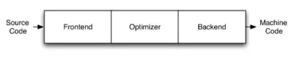
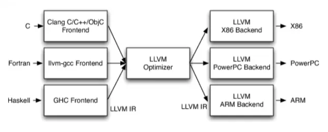
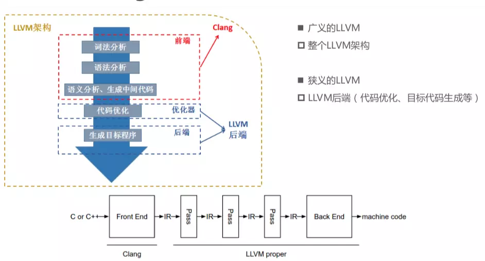
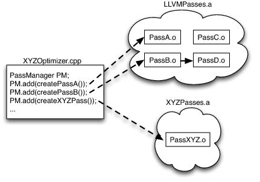
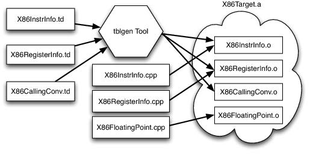

# Compiler - LLVM Architecture

Created by : Mr Dk.

2019 / 05 / 23 11:09

Nanjing, Jiangsu, China

---

## Architecture

传统的编译器架构：



- Frontend，前端：词法分析、语法分析、语义分析、生成中间代码
- Optimizer，优化器：中间代码优化
- Backend，后端：生成机器码

GCC 的前后端耦合严重。支持新的编程语言、支持新的硬件平台会变得非常困难。

LLVM 架构：



- 不同的前后端使用相同的中间代码：LLVM Intermediate Representation (LLVM IR)
- 如果需要支持一种新的编程语言，只需要实现一个新的前端
- 如果需要支持一种新的硬件平台，只需要实现一个新的后端
- 优化阶段通用，只针对 LLVM IR，与前端后端无关

## Existing Language Implementation

在 LLVM 出现之前，所有的开源语言实现无法共享代码，或只针对其支持的特定源语言。在传统编译器架构下，有三个看起来比较成功的案例。

### Java & .NET Virtual Machine

这些系统提供：

- JIT (Just-In-Time) Compiler
- Runtime Support
- Well-defined Bytecode Format

任何可以编译为 bytecode 的语言，都可以重用优化器、JIT、Runtime，但也导致了编译不符合这类模型的语言时性能下降。

### Unfortunate but Popular Way to Reuse

将输入源文件翻译为 C 代码，并输入 C 编译器中：

- 实现有效的异常处理很难
- 较差的 debug 体验
- 编译速度变慢
- 对于 C 不支持的特性可能会引发问题

### GCC

GCC 被设计为一个整体的应用，无法将 GCC 嵌入到其它应用中：

- 作为 run-time/JIT
- 提取或重用部分功能
- 想用 GCC 做代码分析的人不得不使用整个 GCC

GCC 无法以库的形式被重用

- 大量全局变量的使用
- 设计简陋的数据结构
- 繁重的代码量
- 大量使用宏

分层问题：

- 后端依赖前端的 AST 产生调试信息
- 前端产生后端的数据结构
- 整个编译器依赖命令行接口建立的全局数据结构

## Sub-projects of LLVM

### LLVM Core

广义上的 LLVM 指的是以上的整个架构，狭义上的 LLVM 指 LLVM 核心后端：

- 优化器
- 机器码生成器

[LLVM Official](http://llvm.org/):

> The **LLVM Core** libraries provide a modern source- and target-independent **optimizer**, along with **code generation** support for many popular CPUs (as well as some less common ones!) 
>
> These libraries are built around a well specified code representation known as the **LLVM intermediate representation ("LLVM IR")**.
>
> The LLVM Core libraries are well documented, and it is particularly easy to invent your own language (or port an existing compiler) to use LLVM as an optimizer and code generator.

借助这一后端，开发者可以很方便地实现某个编程语言的前端，从而实现该编程语言的编译器。

### Clang

> "LLVM native" C/C++/Objective-C compiler

Clang 是 LLVM 的一个子项目，是 C/C++/Objective-C 的编译器前端：

- 编译速度快 (3x faster than GCC when compiling Objective-C code in a debug configuration)
- Useful error and warning messages
- Provide a platform for building great source level tools

> The **Clang Static Analyzer** is a tool that automatically finds bugs in your code, and is a great example of the sort of tool that can be built using the Clang frontend as a library to parse C/C++ code.



IR 由 Clang 生成，并由 **Pass** 进行优化，通过 LLVM Core 生成对应的机器码。

### LLDB

基于 LLVM Core 和 Clang 的调试工具，比 GDB 的更省内存。

### libc++ & libc++ ABI

C++ 标准库的实现，包括对 C++11 和 C++14 的支持

## LLVM IR

LLVM IR 是 LLVM 在编译器中表示代码的方式。设计目标：

- 支持轻量级的 run-time 优化
- 跨函数 / 跨过程优化
- 整体程序优化

是一个定义完善的中间语言。

C 程序：

```c
unsigned add1(unsigned a, unsigned b) {
    return a+b;
}

// Perhaps not the most efficient way to add two numbers.
unsigned add2(unsigned a, unsigned b) {
    if (a == 0) return b;
    return add2(a-1, b+1);
}
```

LLVM IR：

```
define i32 @add1(i32 %a, i32 %b) {
entry:
    %tmp1 = add i32 %a, %b
    ret i32 %tmp1
}

define i32 @add2(i32 %a, i32 %b) {
entry:
    %tmp1 = icmp eq i32 %a, 0
    br i1 %tmp1, label %done, label %recurse
recurse:
    %tmp2 = sub i32 %a, 1
    %tmp3 = add i32 %b, 1
    %tmp4 = call i32 @add2(i32 %tmp2, i32 %tmp3)
    ret i32 %tmp4
done:
    ret i32 %b
}
```

LLVM IR 是一个低层的类 RISC 虚拟指令集，三地址形式，支持类似汇编中的 label。与大部分 RISC 指令集不同：

- LLVM 拥有一个简单的类型系统
  - `i32` 是一个 32-bit integer
  - `i32**` 是一个指向 32-bit integer 的指针的指针
- 调用被抽象为带有指定类型参数的 `call` 和 `ret`
- 不使用固定数量的寄存器，使用无限的暂存单元，以 `%` 表示

LLVM IR 拥有三种同构形式：

- 文字形式 - `.ll`
- 内存数据结构形式
- 高效、高密度的磁盘 bitcode 格式 - `.bc`

`llvm-as` 将 `.ll` 转换为 `.bc`；`llvm-dis` 将 `.bc` 转换为 `.ll`。

LLVM IR 为编译器提供了一个 **极乐世界**，优化器不被源语言或目标平台约束。在另一个角度来说，LLVM IR 必须被设计得足够好：

- 需要足够简单，以便从前端语言生成
- 需要足够有表现力，以便优化器针对特定的目标平台进行优化

## LLVM Optimization

大部分优化遵循三个部分：

1. 找到要被转换的模式
2. 检验转换是否是安全的 / 正确的
3. 进行转换，更新代码

举例 - 减法优化

- `X - X` 可被优化为 `0`
- `X - 0` 可被优化为 `X`
- `(X * 2) - X` 可被优化为 `X`

LLVM IR 形式：

```
%example1 = sub i32 %a, %a

%example2 = sub i32 %b, 0

%tmp = mul i32 %c, 2
%example3 = sub i32 %tmp, %c
```

LLVM 向高层语言提供指令简化接口进行转换：

```c++
// X - 0 -> X
if (match(Op1, m_Zero()))
    return Op0;

// X - X -> 0
if (Op0 == Op1)
    return Constant::getNullValue(Op0->getType());

// (X*2) - X -> X
if (match(Op0, m_Mul(m_Specific(Op1), m_ConstantInt<2>())))
    return Op1;

return 0; // Nothing matched, return null to indicate no transformation.
```

其中，`Op0` 和 `Op1` 分别为左右操作数，`match()` 和 `m_()` 函数都可以进行模式匹配。于是，实现了一个减法优化的 `SimplifySubInst()` 函数。该函数的调用者是一个分发器，根据指令的操作码，分发对应指令的每一个优化函数。

```c++
for (BasicBlock::iterator I = BB->begin(), E = BB->end(); I != E; ++I)
    if (Value *V = SimplifyInstruction(I))
        I->replaceAllUsesWith(V);
```

## LLVM Implementation

### Architecture

在 LLVM 架构下

- 前端负责语法分析、语法检验、错误诊断，将代码转换为 AST，再转换为 LLVM IR
- IR 被 optimization passes 优化
- 后端负责目标平台机器码的生成

LLVM IR 是优化器能获得的完全且唯一的接口。

### Collection of Libraries

LLVM 被设计为一个库的集合，而不是像 GCC 或 JVM 那样整个的命令行编译器。优化器的实现：

- 以 IR 作为输入，对 IR 进行处理，输出更优化的 IR
- 优化器被组织为多个独立的 optimization passes 的流水线形式
- 每个 pass 都有机会对输入进行处理
- 根据优化等级可运行不同的 passes

每个 pass 被实现为 `Pass` 类的子类。每个类都在各自内部的匿名命名空间中，需要暴露一个实例化 pass 函数。

```c++
namespace {
    class Hello : public FunctionPass {
    public:
    // Print out the names of functions in the LLVM IR being optimized.
        virtual bool runOnFunction(Function &F) {
            cerr << "Hello: " << F.getName() << "\n";
            return false;
        }
    };
}

FunctionPass *createHelloPass() { return new Hello(); }
```

Passes 被编译为一个或多个 `.o` 文件，然后被构建为 archive libraries (`.a` in Unix)。Passes 之间松耦合，要么完全独立，要么明确声明依赖的其它 passes。LLVM PassManager 根据声明找到所有的依赖。

基于 library 的设计允许实现者选择特定的 pass 及其执行顺序，进行特定的优化，比如：

- 如果所有代码都在一个大函数体内，就不需要浪费时间使用 `inline` pass 了
- 如果几乎没有指针，那么指针分析也不需要了
- ...

LLVM PassManager 不知道每个 pass 中的具体细节，开发者可以自由实现针对某种语言的优化 pass。在对应的 passes 被选定后，编译器被构建为可执行的动态库：

- 每个 pass 的 `.o` 中声明了 `create()` 函数
- 每个优化器存在于库 `.a` 中
- 只有实际被用到的 passes 及其依赖才会被链接进来



独立优化器的思想：

- LLVM 提供很多库，但不知道如何使用它们
- 库的使用者 (e.g. Clang) 决定如何使用这些库，以达到最好的效果

## LLVM Code Generator

LLVM 的 code generator 负责用 IR 生成对应平台的机器码

- 每个平台的 code generator 应当是完全独立的
- 同时，它们也需要解决类似的问题，向寄存器赋值

LLVM 将代码生成问题拆分为独立的 passes：

- 指令选择
- 寄存器分配
- 安排
- 代码布局优化
- 汇编
- 其它默认运行的内置 passes

开发者可以：

- 选择默认的 passes
- 覆盖默认的 passes
- 实现特定平台的自定义 passes

LLVM 为每一个平台提供一个目标描述语言，形容每个平台的信息：target description (`.td` files)。比如，x86 平台的所有寄存器信息：

```
def GR32 : RegisterClass<[i32], 32,
    [EAX, ECX, EDX, ESI, EDI, EBX, EBP, ESP,
     R8D, R9D, R10D, R11D, R14D, R15D, R12D, R13D]> { … }
```

定义了寄存器位数、名称。

某条指令的信息：

```
let Constraints = "$src = $dst" in
def NOT32r : I<0xF7, MRM2r,
    (outs GR32:$dst), (ins GR32:$src),
    "not{l}\t$dst",
    [(set GR32:$dst, (not GR32:$src))]>;
```

- 指令名：`NOT32r`
- 编码信息：`0xF7`
- 输入 / 输出分别来自 32-bit 寄存器
- 汇编格式
- 首行 `let` 表示寄存器使用的约束（必须使用同一个物理寄存器）

将所有的 `.td` 文件输入 `tblgen` 工具：



此外，还需要开发者写一些 `.cpp`，实现特定平台的优化 passes，共同编译为后端的库。

## Reference

[LLVM](http://www.aosabook.org/en/llvm.html)
