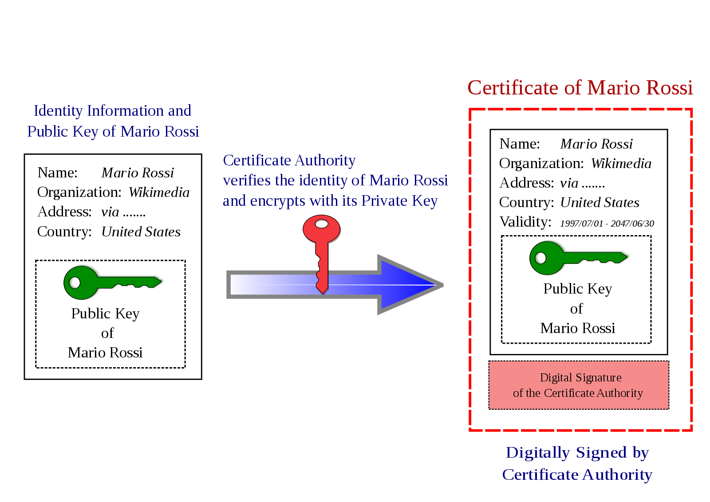
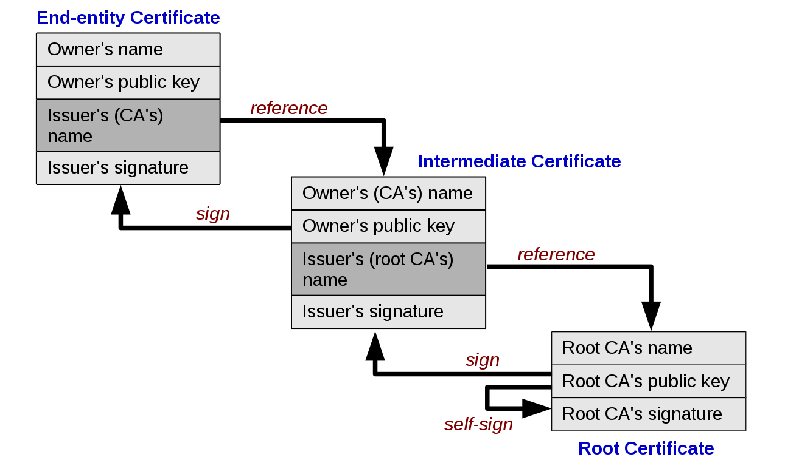

# Cryptography - Keystore & Certificates

Created by : Mr Dk.

2019 / 08 / 07 16:52

Nanjing, Jiangsu, China

---

## Keystore

突然想研究研究 HTTPS 的实际使用，所以看了一下数字证书的相关知识。最终问题转化为使用 JDK 自带的 `keytool` 工具管理密钥。

__Keystore__ 是一个用于存放公钥和证书的存储设施，里面能够存放不同类型的条目。应用最多的两类条目：

* Key entries - 以被保护的格式存放，可以包含：
  * 密钥
  * 私钥及对应的公钥证书链
* Trusted certificate entries
  * 包含另一方的公钥证书 public key certificate (PKC)
  * Keystore 的拥有者相信这些证书的公钥确实来自证书所有者

Keystore 中的所有条目都需要被一个唯一的 aliase 来进行访问。

* 生成密钥或公私钥对并加入 keystore
* 向信任的证书列表中加入证书和证书链
* 随后的操作必须使用相同的 aliase 进行操作

对于一个 aliase，需要制定一个密码用于所有的操作。`java.security` 包中提供了 `KeyStore` 类的实现，用于操作 keystore。Oracle 在 JDK 中内置了一种默认实现：

* 将 keystore 实现为一个文件，格式为 `JKS`
* 用独立的密码分别保护每个私钥
* 使用一个密码保护整个 keystore 的完整性

`keytool` 工具将 keystore 的路径在命令行中以文件名的形式传入，并转换为 `FileInputStream`，载入 keystore 信息。

---

## Public-Key Certificate

其中指定了 subject 的公钥以及其它信息，并由 issuer 进行数字签名。

### Public Keys

公钥被用于认证签名。

### Signature

由实体的私钥加密，从而使签名不可伪造。

### Entity

证书被用于解决公钥发放的问题。Certification Authority (CA) 扮演一个被通信双方都信任的第三方角色，可以为其它 entity 的证书进行签名。由于 CA 签订了法律条约，因此只产生合法的、可信赖的证书。

---

## X.509 Certificates

X.509 标准定义了证书中需要包含哪些信息，以及其中的数据格式。证书中的所有数据被编码为两种相关的标准 - ASN.1/DER:

* Abstract Syntax Notation 1 - 描述数据
* Definite Encoding Rules - 形容数据存储和传输的方式

X.509 证书除去签名以外，包含下列数据：

* Version - v1, v2, v3
* Serial number - 用于与其它证书进行区分
* Signature algorithm identifier - CA 对证书签名所用的算法
* Issuer name - 对证书进行签名的 entity 的 X.500 Distinguished Name

  ```
  CN=Java Duke, OU=Java Software Division, O=Oracle Corporation, C=US
  ```

* Validity period - 公开有效的时间
  * 有效期长度由私钥的强度、证书的价格等确定
* Subject name - 证书公钥所有者的 X.500 Distinguished Names
* Subject public key information - 密钥、密钥算法、密钥参数



---

## Certificate Chains

当新的密钥对刚被生成时，证书链一开始只有一个 __自签名证书__ ：

* 即 subject == issuer，证书中的签名是由生成密钥中的私钥加密的
* 证书的签名可以由证书中的公钥认证

接下来，产生一个 Certificate Signing Request (CSR) 并发送给 CA。在 CA 回应并导入后，自签名证书被替代为证书链：

* 证书链的最顶端是 CA 签名认证 (CA 私钥加密) 后的证书，包含了 subject 的公钥
* 下一个证书用于认证 CA 的公钥 (用于解开前一个证书的 CA 签名)
* 直到证书链的最后，是一个 CA 的自签名证书，认证了自身的公钥

或者是另一种情况：CA 之间的交叉认证。总之，到最后总是会到达一个自签名的 root certificate。证书链中的每个证书都用于认证链中前一个证书的公钥。



最底层的根 CA 证书是自签名的。根 CA 的公钥是公开的，可以从可信的介质中获得。一些软件中已经包含了默认信任的 CA 列表，这些软件称为 root program - 比如：

* Microsoft Root Program
* Apple Root Program
* Mozilla Root Program
* Oracle Java Root Program
* ...

比如，浏览器使用操作系统对应的 root program 来使用证书：

* Windows 上的 Chrome 信任 Microsoft Root Program 提供的证书
* macOS 上的 Chrome 信任 Apple Root Program 提供的证书
* Firefox 在所有平台上都使用 Mozilla Root Program 提供的证书
* ...

Root program 通常用它们包含的证书，提供一系列合法的功能。

---

## Reference

https://docs.oracle.com/javase/8/docs/technotes/tools/windows/keytool.html

https://en.wikipedia.org/wiki/Public_key_infrastructure

https://en.wikipedia.org/wiki/Public_key_certificate

https://en.wikipedia.org/wiki/Authorization_certificate

---

