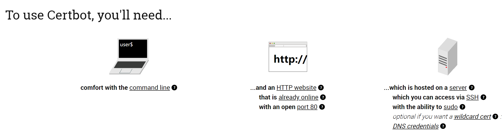
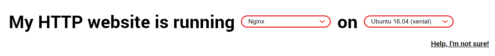

# Cryptography - Let's Encrypt

Created by : Mr Dk.

2020 / 04 / 04 0:43

Ningbo, Zhejiang, China

---

最近在开发一个微信小程序的后端，服务器需要支持 HTTPS 并备案。既要支持 HTTPS，那么就一定要有一个被签发的证书。找正规的 CA 机构签发证书是要时间要钱的。而 [Let's Encrypt](https://letsencrypt.org/) 是一个非盈利性组织提供的免费、开放的证书颁发机构 (CA)，可以用它来免费签发证书。

## *Certbot*

目前，官方推荐的签发工具是 [certbot](https://certbot.eff.org/)，在其 [GitHub](https://github.com/certbot/certbot) 仓库上也有代码。关于这个工具的原理我没有研究，只能根据运行过程大致猜测。

想要运行 certbot，要满足几个条件：

* 一台服务器，并能够 SSH 连接到它上面进行操作
* 一个已经在开放的 **80** 端口上运行的 HTTP 网站



然后，根据你使用的 **OS** 和 **Web Server** ，*certbot* 分别提供了相应的步骤和自动化工具。根据步骤，可以一步一步地产生证书，并自动将证书添加到 Web server 的配置文件中。比如想为一台 *Ubuntu 16.04* 服务器签发证书，这个证书由 *nginx* 使用，就按如下方式选择：



然后该网站会告诉你接下来的步骤：

1. 将 *certbot* 加入到 PPA 中
2. 用 `apt` 从 PPA 中安装 *certbot*
3. 以 `--nginx` 选项运行 *certbot*，签发证书并自动配置到 *nginx* 上
4. 证书有效期为 90 天，*certbot* 会产生一个 *cron* 任务 (定时任务) 自动刷新证书

## *Nginx* Configuration

证书生成完毕后，*cerbot* 自动修改了我的 nginx 配置文件 (作为前提条件的 HTTP 网站已经运行在 nginx 上)。其中 `<hostname>` 为自己申请的域名，并需要将该域名通过 DNS 解析到这台服务器上。

```nginx
server {
    server_name www.<hostname>.cn <hostname>.cn;
    listen 80;
	rewrite ^(.*)$ https://${server_name}$1 permanent; # 将 80 端口的访问转移到 443
}

server {
	server_name www.<hostname>.cn <hostname>.cn;
	location / {
		root /root/homepage;
		index index.html;
	}

	listen 443 ssl; # managed by Certbot
	ssl_certificate /etc/letsencrypt/live/<hostname>.cn/fullchain.pem; # managed by Certbot
	ssl_certificate_key /etc/letsencrypt/live/<hostname>.cn/privkey.pem; # managed by Certbot
	include /etc/letsencrypt/options-ssl-nginx.conf; # managed by Certbot
	ssl_dhparam /etc/letsencrypt/ssl-dhparams.pem; # managed by Certbot
}
```

## Certificates

证书被生成在一个特定位置 (`/etc/letsencrypt/live/<hostname>/`)，包含以下四个文件：

* `cert.pem`
* `chain.pem`
* `fullchain.pem`
* `privkey.pem`

其中，`privkey.pem` 保存了私钥；`cert.pem` 是签发的最终证书，保存了公钥。可以使用 `openssl` 查看证书：

```console
$ openssl x509 -in cert.pem -noout -text 
Certificate:
    Data:
        Version: 3 (0x2)
        Serial Number:
            03:2d:cc:e8:26:d7:27:1e:cf:e2:d5:f6:a4:4a:92:76:be:1d
        Signature Algorithm: sha256WithRSAEncryption
        Issuer: C = US, O = Let's Encrypt, CN = Let's Encrypt Authority X3
        Validity
            Not Before: May 23 09:03:07 2020 GMT
            Not After : Aug 21 09:03:07 2020 GMT
        Subject: CN = mrdrivingduck.cn
        Subject Public Key Info:
            Public Key Algorithm: rsaEncryption
                RSA Public-Key: (2048 bit)
                Modulus:
                    00:b3:4f:39:51:cf:55:7e:b9:de:9c:b9:ad:20:87:
                    4b:69:8c:b8:74:d3:c9:16:4a:63:6e:62:f8:7d:24:
                    5c:b8:ea:cd:44:a8:a4:32:2f:e5:84:25:b8:9d:f6:
                    78:3c:72:69:e1:8e:d2:ad:02:d9:c8:28:24:0e:67:
                    5b:20:4f:4f:b6:9c:ca:b1:c0:90:b3:28:1a:69:a7:
                    a6:9a:a5:c0:ab:4f:a4:c0:6b:f3:d5:50:93:02:75:
                    74:ed:ba:1e:f1:05:3a:4c:53:2c:88:d2:01:c4:12:
                    eb:b6:ce:e2:6f:21:de:2b:e8:04:d9:17:45:09:1b:
                    b8:0e:ac:43:b2:55:af:8e:32:3f:ca:bb:15:54:c2:
                    71:49:44:6e:5c:75:d9:65:e1:ad:e4:1c:44:df:53:
                    a4:e5:77:af:ba:e1:5b:5f:e1:29:df:96:d0:8e:b0:
                    6f:06:48:b9:e1:16:47:e8:d6:6b:4e:aa:5a:9f:75:
                    26:df:d9:1f:b5:fe:74:29:9d:17:b7:9b:99:43:5a:
                    29:b7:1d:5a:0a:3e:c9:9f:76:c5:b6:78:9b:55:d8:
                    87:07:47:b7:54:59:db:d6:b7:45:3f:0e:4e:c0:8f:
                    ae:c0:93:68:8d:2a:5e:86:d1:04:a9:30:5c:2a:38:
                    9e:34:30:d8:e4:2a:98:3c:82:b6:1a:91:db:23:72:
                    ef:17
                Exponent: 65537 (0x10001)
        X509v3 extensions:
            X509v3 Key Usage: critical
                Digital Signature, Key Encipherment
            X509v3 Extended Key Usage:
                TLS Web Server Authentication, TLS Web Client Authentication
            X509v3 Basic Constraints: critical
                CA:FALSE
            X509v3 Subject Key Identifier:
                E4:0E:96:45:DA:A7:B7:C3:05:4A:5C:85:83:73:43:C7:4A:22:93:89
            X509v3 Authority Key Identifier:
                keyid:A8:4A:6A:63:04:7D:DD:BA:E6:D1:39:B7:A6:45:65:EF:F3:A8:EC:A1

            Authority Information Access:
                OCSP - URI:http://ocsp.int-x3.letsencrypt.org
                CA Issuers - URI:http://cert.int-x3.letsencrypt.org/

            X509v3 Subject Alternative Name:
                DNS:mrdrivingduck.cn, DNS:www.mrdrivingduck.cn
            X509v3 Certificate Policies:
                Policy: 2.23.140.1.2.1
                Policy: 1.3.6.1.4.1.44947.1.1.1
                  CPS: http://cps.letsencrypt.org

            CT Precertificate SCTs:
                Signed Certificate Timestamp:
                    Version   : v1 (0x0)
                    Log ID    : 5E:A7:73:F9:DF:56:C0:E7:B5:36:48:7D:D0:49:E0:32:
                                7A:91:9A:0C:84:A1:12:12:84:18:75:96:81:71:45:58
                    Timestamp : May 23 10:03:07.985 2020 GMT
                    Extensions: none
                    Signature : ecdsa-with-SHA256
                                30:46:02:21:00:DE:1F:30:39:B6:43:FA:2D:C7:12:C3:
                                94:DE:12:90:FC:6C:B3:46:01:4C:B7:3E:5F:11:B1:4C:
                                90:07:1D:60:33:02:21:00:C6:12:AF:BE:14:81:25:D6:
                                39:C1:58:E4:0C:5F:4C:9C:43:F5:4E:CC:18:F5:ED:54:
                                3A:79:AF:17:61:E4:E1:D5
                Signed Certificate Timestamp:
                    Version   : v1 (0x0)
                    Log ID    : 07:B7:5C:1B:E5:7D:68:FF:F1:B0:C6:1D:23:15:C7:BA:
                                E6:57:7C:57:94:B7:6A:EE:BC:61:3A:1A:69:D3:A2:1C
                    Timestamp : May 23 10:03:08.020 2020 GMT
                    Extensions: none
                    Signature : ecdsa-with-SHA256
                                30:45:02:21:00:84:D1:B1:25:E8:B0:D7:5D:FE:F0:34:
                                B7:DB:32:A4:4E:0D:84:DD:55:C1:60:24:3F:BA:6D:63:
                                EE:E6:1B:44:46:02:20:2D:D8:DF:90:FE:AE:A4:6F:AC:
                                2F:50:28:03:4D:FD:4A:36:FE:7E:4A:72:A0:6C:3B:A6:
                                33:31:91:0E:81:E4:C9
    Signature Algorithm: sha256WithRSAEncryption
         07:0c:63:d0:8a:b7:f5:35:f8:65:00:20:f2:c4:ca:27:52:72:
         55:92:9a:ee:5e:da:1c:1b:b5:f1:fc:8d:db:61:02:7c:46:58:
         0e:21:67:44:91:08:fe:2b:f6:27:72:24:8b:1d:80:5a:f8:d7:
         aa:2f:25:82:9b:ee:9f:59:5a:32:e3:a2:6e:8e:03:7e:0c:6b:
         e9:af:90:77:93:e8:00:56:74:f5:a1:1b:74:dd:3f:ce:34:b2:
         b4:f2:fc:9b:1b:1c:5f:21:d9:7f:1b:85:67:09:26:ee:1d:e1:
         ae:3c:5c:50:a5:ee:61:d7:8e:30:a7:49:0c:e4:7a:4c:00:60:
         2f:dd:30:d9:9c:b8:79:fb:23:b2:22:a3:f2:e9:11:65:2e:c9:
         fe:ad:22:d3:b9:73:81:4c:98:cc:5c:fb:41:51:13:3d:79:36:
         b4:8c:7e:e5:24:60:0f:4e:a1:fa:9a:8d:19:e4:c0:94:08:ea:
         46:b8:fa:ce:dd:e9:db:72:83:4c:61:e1:0d:ac:52:0c:e5:33:
         7a:ce:5b:dc:42:90:93:3e:f7:49:98:1d:ce:3b:e3:1e:e2:ab:
         e5:f7:1e:d2:a2:00:97:06:b7:75:ac:db:45:44:58:00:12:4c:
         e8:28:61:7a:60:82:c2:49:0b:bf:fd:61:8f:b5:8e:3b:3f:d1:
         22:ff:60:63
```

其中，`chain.pem` 应当是签发证书 `cert.pem` 到 CA 根证书中间的证书链条；`fullchain.pem` 是包含了 **最终签发证书** 和 **中间证书链** 在内的 **完整证书链条**。

## **记坑**

这次使用 Vert.x HTTPS Server 作为后端。Server 初始化代码是这样写的：

```java
public void init(final Vertx vertx) {
	server = vertx.createHttpServer(new HttpServerOptions()
		.setSsl(true)
		.setPemKeyCertOptions(new PemKeyCertOptions()
			.setKeyPath(Config.getConfig().get("tls", "keyPath"))
			.setCertPath(Config.getConfig().get("tls", "certPath"))
		)
	);
}
```

关于 `keyPath`，很显然是使用私钥 `privkey.pem`；而证书路径，我一开始使用的是 `cert.pem`，即只有签发证书不包含证书链的那个 keystore。

然后微信小程序前端就出了问题：测试时都是 OK 的，真机调试时，iOS OK，Android 的请求无法发出去。虽然用了一些在线测试网站都正常，但还是没解决问题。Baidu 上搜索没有一个有效答案 (顺便真心吐槽一下国内的技术氛围)，反正大致意思都是说证书有问题。

后来从上面的 *nginx* 配置文件中受到启发。在 *nginx* 的配置中，私钥用的是 `privkey.pem`，证书用的是 `fullchain.pem`。看来，如果缺少了中间的证书链，HTTPS 的认证不能成功。另外还在 [StackOverflow](https://stackoverflow.com/questions/54305577/lets-encrypt-with-vert-x) 上找到了一个相关的具体问题。于是按照答案，将证书的路径由 `cert.pem` 换为 `fullchain.pem`。一开始 Android 前端好像说还是不行，我还正郁闷着呢 😓，突然就看到屏幕上打出来日志，访问来源是 *MI 6*，成功啦！😆

## References

[简书 - Let's Encrypt 证书申请及配置](https://www.jianshu.com/p/1a792f87b6fe)

[Certbot](https://certbot.eff.org/)

---

