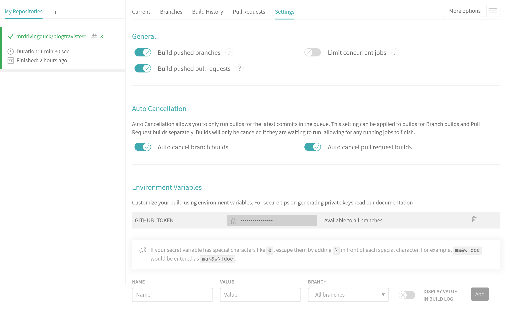
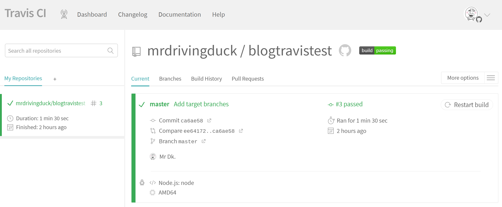

# DevOps - Travis CI

Created by : Mr Dk.

2020 / 06 / 16 0:34

Nanjing, Jiangsu, China

---

## What is Travis CI?

持续集成 (Continuous Integration) 是一种自动化的软件运维服务，在代码发生变更时，自动运行构建、测试、部署，并反馈结果。这样，每次提交代码都可以看到构建、测试和部署结果，避免了合并一大堆代码后的人工查错。

[Travis CI](https://www.travis-ci.org/) 是一个与 GitHub 集成的开源持续集成工具。只需要将一个 `.travis.yml` 配置文件放到 GitHub 仓库中，每次对这个仓库的 push 或 pull request 都会触发 Travis CI 的构建、测试、部署的工作。在 Travis CI 的官网上可以看到构建、测试、部署的结果。很多知名项目仓库中的 README 里都有 Travis CI 构建状态的图标 (build failed 或 build pass)，其实就是一个指向 Travis CI 官网中该仓库构建状态的图标。

Travis CI 每次被触发时，都会根据 `.travis.yml` 中指明的配置，创建一个运行环境，然后运行 `.travis.yml` 中写好的脚本进行构建、测试。最后，还可以运行脚本进行自动部署、自动代码合并等。

## Example: GitHub Pages

这是一个很实际的例子。用 Vue.js 实现了一个博客网站。一个 Vue.js 工程需要在 Node.js 环境中运行 `npm install` 安装依赖，然后运行 `npm run build` 在工程目录的 `dist/` 下生成网站的静态资源。

想要在 GitHub Pages 上托管这个博客，需要每次自行运行 `npm run build` 后，将 `dist/` 目录下的静态资源 push 到 `gh-pages` 分支上。Travis 能够对这个过程完全自动化。带来的效果就是：

* 每次改好 Vue.js 的代码并 push 到仓库里后，触发 Travis CI
* Travis CI 自动创建一个 Node.js 的运行环境，通过 Git 从项目仓库 clone 代码
* 分别运行 `npm install` 和 `npm run build`
* 自动将 `dist/` 目录下的所有资源 push 到 `gh-pages` 分支上

首先，GitHub 的账号需要和 Travis CI 进行关联，这样 Travis CI 才能够访问 GitHub 账号下的所有仓库，并开启对用户指定的仓库进行监视。另外，由于部署操作需要对 GitHub 账号下的仓库进行 `git push` 操作，因此需要在 GitHub 中为 Travis CI 生成一个带有 *repo* 权限的 *Personal Access Token (PAT)*。这个 PAT 会被设置在 Travis CI 为这个 GitHub 仓库提供的环境变量中：



仓库中的 `.travis.yml` 配置为如下形式：

```yaml
language: node_js
node_js:
  - "node"

cache: npm

script: npm run build

deploy:
  provider: pages
  skip_cleanup: true
  token: $GITHUB_TOKEN
  keep_history: true
  target_branch: gh-pages
  local_dir: ./dist/
  on:
    branch: master
```

当这个仓库的 Travis CI 被触发后，首先，根据配置文件，Travis CI 会创建一个 Node.js 的运行环境。然后运行 `script` 中的命令进行构建。最终，根据 `deploy` 中的选项完成部署：

* `on branch master` - 在 `master` 分支变动时触发部署
* `local_dir` - 被部署的资源在项目根目录下的相对路径
* `target_branch` - 目标部署分支
* `keep_history` - 对部署分支进行增量式的 commit，而不是 force push
* `token` - 使 Travis CI 环境有权限向目标分支 push 的 GitHub PAT
* `skip_cleanup` - Travis CI 是否清理构建过程中产生的文件 (比如 `dist/`)，对于这个场景来说显然不能清理

触发 Travis CI 后，进行了一次自动构建和自动部署。产生的日志如下：

```console
Worker information

Build system information

$ git clone --depth=50 --branch=master 

$ nvm install node

Setting up build cache

$ npm ci

$ npm run build

The command "npm run build" exited with 0.

store build cache

$ rvm $(travis_internal_ruby) --fuzzy do ruby -S gem install dpl

Installing deploy dependencies
Logged in as @mrdrivingduck (Mr Dk.)
Preparing deploy
Deploying application
cd /tmp/d20200615-7023-1ks2h9e/work
Initialized empty Git repository in /tmp/d20200615-7023-1ks2h9e/work/.git/
Switched to a new branch 'gh-pages'
cd -
cd /tmp/d20200615-7023-1ks2h9e/work
commit 0a6cf084bc66ca259f9fd76d465dec442b9ed5ce
Author: Deployment Bot (from Travis CI) <deploy@travis-ci.org>
Date:   Mon Jun 15 14:30:37 2020 +0000
    Deploy mrdrivingduck/blogtravistest to github.com/mrdrivingduck/blogtravistest.git:gh-pages
 LICENSE                         |  21 +++++++++++++++++++++
 avatar.jpg                      | Bin 0 -> 177873 bytes
 black.jpg                       | Bin 0 -> 9532 bytes
 css/app.a5901a0a.css            |   1 +
 css/chunk-0b2cb087.d8034c97.css |   1 +
 css/chunk-25341c1c.de855032.css |   1 +
 css/chunk-2ede58bc.107a4fa0.css |   1 +
 css/chunk-4a4f0973.4909dcbd.css |   1 +
 css/chunk-6084b0d6.2d581108.css |   1 +
 css/chunk-620092d0.238f4f55.css |   1 +
 ...
 83 files changed, 197 insertions(+)
cd -
Done. Your build exited with 0.
```

运行完成后，显示了表示成功状态的绿色：



---

