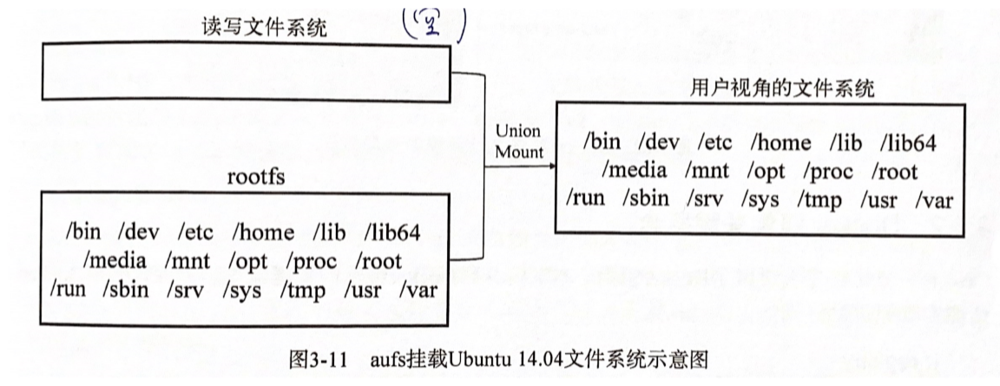

# Docker - Image & Storage Management

Created by : Mr Dk.

2020 / 09 / 21 17:46

Nanjing, Jiangsu, China

---

## Docker 镜像管理

Docker 镜像是一个只读版的 Docker 容器模板，含有启动 Docker 容器所需的文件结构和内容，是 Docker 容器的静态视角。

### rootfs

rootfs 是 Docker 容器启动时，内部进程可见的文件系统，也就是 Docker 容器的根目录。通常包含一个 OS 运行所需的文件系统，比如 `/bin`、`/lib`、`/usr` 等。

传统 Linux 内核启动时，会挂载一个只读的 rootfs，在系统检测其完整性后，再将其切换为可读写模式。在 Docker 中，Docker daemon 为 Docker 容器挂载 rootfs 时，也会将其设置为只读模式。挂载完毕后，利用 _联合挂载 (union mount)_ 技术在 rootfs 的挂载点上再挂载一个空的读写文件系统。当 Docker 容器运行过程中，文件系统发生变化时，发生变化的内容将会写到读写文件系统，并隐藏只读文件系统中的旧版本文件。

### Docker 镜像的特点

- 分层
  - 修改容器中的文件时，只对最上层读写文件系统进行变动，不覆盖下层已有文件系统的内容
  - `docker commit` 提交修改后的文件系统时，只保存读写文件系统中的被更新过的文件
- 写时复制
  - 只有对只读文件系统中的文件修改时，才将其复制到读写文件系统中，并应用修改
- 内容寻址
  - 对镜像层的内容计算校验和，生成一个内容 hash 作为镜像层 (文件系统) 的唯一标志
- 联合挂载
  - 联合挂载技术可以在 **一个挂载点** 同时挂载多个文件系统，多个文件系统中的目录将被整合



### 镜像构建过程

如果使用 `docker commit` 命令 - 只提交容器镜像发生了变更的部分 (即读写文件系统)：

1. 确定是否暂停容器运行
2. 将容器的 **可读写层** 打包
3. 在层存储中注册打包后的可读写层 (也就是带有差异的文件集合)
4. 更新镜像历史信息，在镜像存储中创建新的镜像，记录元数据
5. 给镜像添加 tag 信息 (如果指定)

如果使用 Dockerfile + `docker build` 命令构建镜像：

1. Docker client 在本地准备好构建上下文，然后将上下文信息发送到 Docker server
2. Docker server 创建一个临时目录，将上下文中的文件系统解压到这个目录下
3. 读取并解析 Dockerfile，遍历指令，分发到不同的模块执行
4. 为每条指令生成一个临时容器，执行一条指令，就使用 `commit` 生成一个镜像层
5. Dockerfile 中所有指令对应的层的集合，就是 build 的结果
6. 如果指定了 tag 参数，那么给镜像打上对应的 tag

---

## Docker 存储管理

### Docker 镜像元数据管理

Docker 镜像在设计上将 **元数据** 与 **文件** 的存储完全隔离。

#### Repository 元数据

Repository 是具有某个功能的 Docker 镜像的 **所有迭代版本** 构成的镜像库。 其元数据包含所有 repository 的名字及其名下所有版本镜像的名字 + tag (比如 `ubuntu:20.04`)，以及该版本镜像相应的镜像 ID (目前 Docker 使用 SHA256 来计算镜像 ID)。这些元数据用于管理 repository 与镜像 ID 的映射关系。

```console
$ sudo cat /var/lib/docker/image/overlay2/repositories.json | python -mjson.tool
{
    "Repositories": {
        "hello-world": {
            "hello-world:latest": "sha256:bf756fb1ae65adf866bd8c456593cd24beb6a0a061dedf42b26a993176745f6b",
            "hello-world@sha256:4cf9c47f86df71d48364001ede3a4fcd85ae80ce02ebad74156906caff5378bc": "sha256:bf756fb1ae65adf866bd8c456593cd24beb6a0a061dedf42b26a993176745f6b"
        }
    }
}
```

#### Image 元数据

其中包含了镜像的一些元信息，如：

- 镜像架构
- OS
- 镜像默认配置
- 容器 ID 和配置
- 创建时间
- Docker 版本
- 镜像构建历史
- rootfs

将镜像与构建镜像的镜像层关联了起来。Docker 会根据 `diff_ids` 计算出镜像层的存储索引 chainID。

```console
$ sudo cat /var/lib/docker/image/overlay2/imagedb/content/sha256/bf756fb1ae65adf866bd8c456593cd24beb6a0a061dedf42b26a993176745f6b | python -mjson.tool
{
    "architecture": "amd64",
    "config": {
        "ArgsEscaped": true,
        "AttachStderr": false,
        "AttachStdin": false,
        "AttachStdout": false,
        "Cmd": [
            "/hello"
        ],
        "Domainname": "",
        "Entrypoint": null,
        "Env": [
            "PATH=/usr/local/sbin:/usr/local/bin:/usr/sbin:/usr/bin:/sbin:/bin"
        ],
        "Hostname": "",
        "Image": "sha256:eb850c6a1aedb3d5c62c3a484ff01b6b4aade130b950e3bf3e9c016f17f70c34",
        "Labels": null,
        "OnBuild": null,
        "OpenStdin": false,
        "StdinOnce": false,
        "Tty": false,
        "User": "",
        "Volumes": null,
        "WorkingDir": ""
    },
    "container": "71237a2659e6419aee44fc0b51ffbd12859d1a50ba202e02c2586ed999def583",
    "container_config": {
        "ArgsEscaped": true,
        "AttachStderr": false,
        "AttachStdin": false,
        "AttachStdout": false,
        "Cmd": [
            "/bin/sh",
            "-c",
            "#(nop) ",
            "CMD [\"/hello\"]"
        ],
        "Domainname": "",
        "Entrypoint": null,
        "Env": [
            "PATH=/usr/local/sbin:/usr/local/bin:/usr/sbin:/usr/bin:/sbin:/bin"
        ],
        "Hostname": "71237a2659e6",
        "Image": "sha256:eb850c6a1aedb3d5c62c3a484ff01b6b4aade130b950e3bf3e9c016f17f70c34",
        "Labels": {},
        "OnBuild": null,
        "OpenStdin": false,
        "StdinOnce": false,
        "Tty": false,
        "User": "",
        "Volumes": null,
        "WorkingDir": ""
    },
    "created": "2020-01-03T01:21:37.263809283Z",
    "docker_version": "18.06.1-ce",
    "history": [
        {
            "created": "2020-01-03T01:21:37.132606296Z",
            "created_by": "/bin/sh -c #(nop) COPY file:7bf12aab75c3867a023fe3b8bd6d113d43a4fcc415f3cc27cbcf0fff37b65a02 in / "
        },
        {
            "created": "2020-01-03T01:21:37.263809283Z",
            "created_by": "/bin/sh -c #(nop)  CMD [\"/hello\"]",
            "empty_layer": true
        }
    ],
    "os": "linux",
    "rootfs": {
        "diff_ids": [
            "sha256:9c27e219663c25e0f28493790cc0b88bc973ba3b1686355f221c38a36978ac63"
        ],
        "type": "layers"
    }
}
```

#### Layer 元数据

对应每一个镜像层的元数据，实际上只包含这个镜像层的具体文件包。用户在 Docker 宿主机上下载了镜像层元数据后，Docker 会根据其中的文件包，以及 image 元数据，构建本地的 layer 元数据。新的镜像层上传到 registry 时，也只是上传文件包，本地元数据不会被上传。

Docker 定义了两种接口，分别用于描述只读镜像层和读写镜像层：

- roLayer (`/var/lib/docker/image/[graph_driver]/layerdb/sha256/[chainID]/`)
- mountedLayer (`/var/lib/docker/image/[graph_driver]/layerdb/mounts/[container_id]/`)

只读镜像层的元数据包含：

- chainID - 用于索引该镜像层，所以元数据的存储使用了这个 ID
- diff - 镜像层校验码
- parent - 父镜像层
- cache-id
- size - 镜像层大小

```console
$ sudo ls /var/lib/docker/image/overlay2/layerdb/sha256/9c27e219663c25e0f28493790cc0b88bc973ba3b1686355f221c38a36978ac63
cache-id  diff  size  tar-split.json.gz
```

其中，diff 使用 SHA256 基于该镜像层文件包中的内容计算而来，可以防止镜像层被篡改。而 chain-id 是用于索引该镜像层的 ID，由当前层和所有祖先镜像层的 diff 计算得到。如果镜像层位于最底层 (没有父镜像层)，那么 chain-id 就是 diff。

而读写镜像层的元数据有些不同：

- init-id
- mount-id
- parent

```console
$ sudo ls /var/lib/docker/image/overlay2/layerdb/mounts/2c5f1d785fd6f788caef17982901e898568ecfa4babb882d9487f9bc61a3a52b
init-id  mount-id  parent
```

结合之后的存储驱动来理解它们各自的功能。

### Docker 存储驱动

Docker 中管理文件系统的驱动为 GraphDriver，其中定义了一套统一的存储接口：

- `String()` - 返回驱动名称字符串
- `Create()` - 创建新的镜像层
- `Remove()` - 删除一个镜像层 (根据指定的 ID)
- `Get()` - 返回指定 ID 层挂载点的绝对路径
- `Put()` - 释放一个层使用的资源
- `Exists()` - 查询指定 ID 的层是否存在
- `Status()` - 返回驱动的状态
- `Cleanup()` - 释放由这个驱动管理的所有资源

另外，还有四个管理镜像层之间差异的接口：

- `Diff()` - 将指定 ID 的层与其父镜像的改动文件打包返回
- `Changes()` - 返回指定镜像层与父镜像层的差异列表
- `ApplyDiff()` - 将差异应用到指定 ID 的层，返回新的镜像层大小
- `DiffSize()` - 计算指定 ID 层与父镜像层的差异，返回相对于基础文件系统的差异大小

GraphDriver 中提供了一个实现上述四个函数的 `naiveDiffDriver` 结构。总之，在 Docker 中添加一个新的存储驱动时，要实现上述 12 个函数。

每个存储驱动都会向 GraphDriver 注册自己，加入到 GraphDriver 维护的 `drivers` 列表中。当需要创建一个存储驱动时，GraphDriver 会根据名字从 `drivers` 中找到驱动，调用其初始化函数，得到一个相应的 Driver 对象。优先级如下：

1. 从 `DOCKER_DRIVER` 和 `DefaultDriver` 环境变量中查找驱动名
2. 从驱动优先级列表中查找一个可用的驱动 - aufs、btrfs、zfs、devicemapper、overlay、vfs
3. 若上述驱动查不到可用的，那么查找所有注册过的驱动，找到第一个注册过的、可用的驱动并返回

#### AUFS

AUFS (Advanced Multi-layered Unification Filesystem) 是一种 **支持联合挂载** 的文件系统，也就是支持将不同的目录挂载到同一个目录下，而挂载操作对用户来说透明。

AUFS 的每一层都是一个普通文件系统。在读取一个文件 A 时，将从最顶层的读写文件系统开始向下寻找，如果当前层没有，则根据层之间的关系到下一层文件系统中查找，直到找到第一个 A 文件并打开它。当要写入 A 文件时，如果 A 文件不存在，就在读写层中新建一个；否则也是从顶层开始查找，直到找到 A 文件，然后将 A 文件复制到读写层中，再应用修改。

> 由此可以看出，在容器中第一次修改某个文件时，如果文件很大，将会产生巨大的磁盘 I/O 开销。

在删除一个文件时，如果这个文件仅存在于读写层中，那么直接删除文件即可；否则需要先删除读写层中的备份，然后在读写层创建一个 `whiteout` 文件来标识这个文件不存在，而不是真正删除底层文件。

Docker 的工作目录位于 `/var/lib/docker`。在该目录下，如果使用了 AUFS 作为存储驱动，就会有一个 `aufs` 文件夹。该文件夹下会有三个目录：

- `/mnt` - AUFS 的挂载目录
- `/diff` - 所有的文件系统数据
- `/layers` - 每一个层的层存储文件，记录层级关系

最初只有 `/diff` 目录不为空，包含了文件系统的实际数据来源。最终这些文件系统 (层) 一起被挂载到 `/mnt` 目录上。

在 Docker 中，镜像管理部分和存储驱动部分的设计是分离的。在存储驱动中，镜像层或容器层拥有了新的标识 ID：

- 在镜像层 (roLayer) 中称为 cache-id
- 在容器曾 (mountedLayer) 中称为 mount-id

新建一个镜像层的步骤如下：

1. 在 `/mnt` 和 `/diff` 下创建与 mount-id 同名的子文件夹
2. 在 `/layers` 目录下创建与 mount-id 同名的文件 (用于记录该层所依赖的所有其它层)
3. 寻找该层依赖的所有镜像层，并将依赖的 mount-id 写入上述文件中 (父镜像层及其祖先镜像层)

随后 GraphDriver 将 `/diff` 下所有属于容器镜像的层以 **只读** 方式挂载到 `/mnt` 下，然后再挂载一个名为 `<mount-id>-init` 的文件系统作为最后一个只读层。`<mount_id>-init` 的文件系统主要重新生成了以下文件：

- `/dev/pts`
- `/dev/shm`
- `/proc`
- `/sys`
- `/.dockerinit`
- `/.dockerenv`
- `/etc/resolv.conf`
- `/etc/hosts`
- `/etc/hostname`
- `/etc/console`
- `/etc/mtab`

这些文件与容器内的 **环境** 息息相关，但并不适合被打包作为镜像的文件内容，而又不适合直接在宿主机上修改。所以 Docker 专门设计了这一层，单独处理这些文件。这一层 **只会在容器启动时添加**。只有这些文件在容器运行过程中被改变并 `docker commit` 后，才会持久化这些变化。否则，**保存镜像时不会包含这些内容**。严格来说，Docker 容器的文件系统层次为：

- 最上层的读写文件系统
- Init 层
- 只读层

也就是说，所有文件系统的实际内容均保存在 `/diff` 下，包括可读写层目录。在容器启动时，这些文件系统会被联合挂载到 `/mnt` 下。`/mnt` 相当于是一个工作目录。当容器停止时，`/mnt` 目录下相应的 `<mount-id>` 目录被卸载，但是 `/diff` 目录下相应的文件夹依然存在。

最终，通过 `docker commit` 提交镜像后，最新的文件系统差异会保存到 `/diff` 文件夹下一个以新的 cache-id 命名的文件夹中，这就是新的镜像层。以原来的 mount-id 命名的文件夹依旧存在，直到对应的容器被删除。

#### Device Mapper

> 没看懂...

#### Overlay

OverlayFS 是一种新型的联合文件系统，允许用户将一个文件系统与另一个文件系统重叠，在上层文件系统中记录更改，而下层文件系统保持不变。与 AUFS 相比，OverlayFS 在设计上更简单，理论上性能更好。OverlayFS 中包含四类目录：

- `lower` / `upper` - 被挂载的目录
- `merged` - 目录联合挂载点
- `work` - 辅助功能

当同一个路径的两个文件分别存在于两个目录中时，位于 `upper` 中的文件将会屏蔽 `lower` 中的文件；对于同一个路径的文件夹，位于 `lower` 中的文件和文件夹将会与 `upper` 中的合并。

第一次以 write 方式打开一个位于 `lower` 中的文件时，OverlayFS 将执行 copy_up 将文件从 `lower` 复制到 `upper` 中，但 copy_up 的实现不符合 POSIX 标准。

最后为容器准备 rootfs 时，只需要将相应的四类目录联合挂载即可。

---

## References

[知乎 - Docker 容器实战 (七) - 容器中进程视野下的文件系统](https://zhuanlan.zhihu.com/p/86890896)

[Wikipedia - chroot](https://zh.wikipedia.org/wiki/Chroot)

[腾讯云社区 - 干货 | Docker 文件系统的分层与隔离](https://cloud.tencent.com/developer/article/1114569)

---
