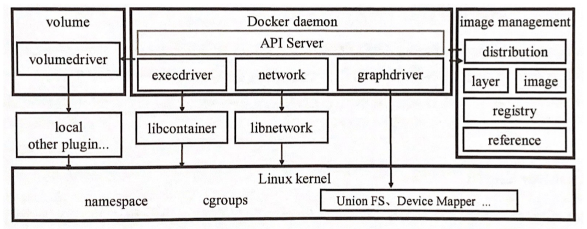

# Docker - Libcontainer

Created by : Mr Dk.

2020 / 09 / 20 0:34

Nanjing, Jiangsu, China

---

## Docker Architecture

Docker 使用了传统的 C-S 架构模式。Docker 的后端是松耦合的：

Docker daemon 是 Docker 架构中的主要用户接口，提供了一个 API Server 来接收 Docker client 的请求，然后根据请求分发到不同的模块执行相应的动作。

### Docker Daemon

Docker 最核心的后台进程，负责响应来自 Docker client 的请求，然后将这些请求翻译为相应的系统调用，完成容器管理操作。其启动过程相当复杂，主要需要进行的工作包含：

- 初始化 Docker 容器的配置信息
- 检测系统支持及用户权限
- 配置 daemon 的工作路径
- 配置容器所需要的文件环境
- 创建 daemon 网络
- 初始化 execdriver
- 创建 daemon 实例
- 恢复已有的 Docker 容器

### Docker Client

Docker 客户端是一个泛称，不止是 Docker 官方的 CLI 工具，同时泛指所有遵循 Docker API 协议的客户端。以 Docker CLI 为例，客户端需要进行的工作有：

- 解析命令 flag
- 创建一个 client 实例
- 找到命令对应的执行函数 (通过命令名 + 反射机制)，向 daemon 发起请求，附带解析出的参数
- 读取来自 daemon 的运行结果

### Drivers

Docker 将底层系统调用屏蔽后，封装为统一的驱动方便调用者使用：

- Execdriver - 对 Linux namespaces、cgroups 等系统调用进行了二次封装，默认的实现是 Docker 官方实现的 libcontainer 库
- Volumedriver - 是 volume 数据卷存储操作的最终执行者，负责 volume 的增删改查
- Graphdriver - 所有与容器镜像相关操作的最终执行者，记录镜像层之间的关系，已经支持的 graphdriver 包含：
  - aufs
  - btrfs
  - zfs
  - devicemapper
  - overlay
  - vfs

### Network

由单独的 libnetwork 库实现，负责创建容器通信所需网络、容器的 network namespace、虚拟网卡、IP、端口等。

## Libcontainer

容器是一个与宿主机 **共享内核** 但与系统中其它进程资源相隔离的执行环境。Docker 通过对 namespace、cgroups、capabilities 以及文件系统的管理和分配来隔离出一个容器运行环境。

在客户端接收到 `docker run` 命令后，客户端通过解析命令行参数，向 Docker daemon 的 API server 发送请求。Docker daemon 接收到请求后，利用请求中的参数实例化一个 container 对象，创建容器，并响应客户端。

客户端接收到响应后，会再次发送 `start` 的请求，这一次，容器才会被真正启动。API server 接收到 `start` 命令后，会告诉 Docker daemon 启动容器。此时，创建容器需要的 **配置信息** 已经在上一步容器创建的过程中赋值完毕，Docker daemon 将调用 `daemon.ContainerStart()` 启动容器。接下来的任务就交给 execdriver 乃至 libcontainer 负责命令 OS 启动容器。Docker daemon 将为 execdriver 提供三个参数：

- `commandv` - 该容器需要的所有配置信息
- `pipes` - 用于将容器的 STDIN、STDOUT、STDERR 与 daemon 相连接 (相当于先 `pipe()` 再 `fork()`)
- `startCallback()` - 回调函数

接下来的工作将会在 execdriver 中展开。

### 创建逻辑容器 Container

Execdriver 接收到容器启动的配置信息后，会首先加载一个预定义的模板配置 (里面都是容器启动的默认值)，然后向这个模板中依次填充 daemon 传来的配置信息 (其中包含了容器的 namespace、cgroups，以及未来容器将要运行的进程信息和参数)。根据这个配置，execdriver 将会创建一个 **逻辑容器对象** Container。

> 创建逻辑容器的过程需要使用到 **工厂模式**。对于 Docker daemon 来说，只需要提供一套配置信息就够了；而对于 libcontainer 来说，由于其封装了不同 OS 的底层细节，因此需要根据不同的平台创建出完全不同的逻辑容器对象。

创建逻辑容器对象的具体操作：

- 验证容器运行的根目录、容器 ID、容器配置的合法性
- 验证容器 ID 不会发生冲突
- 在容器运行的根目录下创建容器工作目录
- 返回一个逻辑容器对象 (包含容器启动后需要的所有配置、容器 ID、容器工作目录)

### 启动逻辑容器 Container

在这一阶段将会创建两个 Process 实例。一个名为 Process，是将要在容器内运行的进程，其创建参数就是 Docker daemon 传入的参数 (进程启动命令、参数、环境变量、输入流、输出流、错误流)；另一个名为 ParentProcess，负责 **从容器外部** 处理物理容器的启动工作。

ParentProcess 的创建位于这一步中：

- 创建一个管道，用于与未来容器内的进程进行通信 (在容器内网卡初始化完成之前)
- 构造用于启动容器内 init 进程的 cmd 对象，为 cmd 对象从 Container 对象中获取启动命令、参数等信息
- 为 cmd 对象添加环境变量 `LIBCONTAINER_INITTYPE=standard` 告诉容器进程当前执行 **创建** 操作 (与 `docker exec` 区别)
- 将容器需要的 namespace 添加到 cmd 对象的 `Cloneflags` 中
- 将 Container 对象中的容器配置与 Process 的 EntryPoint 信息合并，加入到 ParentProcess 中

接下来逻辑容器开始启动物理容器。

### 用逻辑容器创建物理容器

- 使用上述 cmd 对象创建一个新进程，并为其设置 namespace
- 把容器进程的 PID 加入到 cgroup 中管理，至此隔离环境初步创建完成
- 创建容器内部的网络设备 `lo` 和 `veth`
- ParentProcess 通过管道发送容器配置到容器内进程中
- ParentProcess 通过管道等待容器内进程初始化完毕

也就是说，ParentProcess 基于 cmd 对象启动了一个子进程作为容器内的初始进程。之后，ParentProcess 通过管道来指引容器内进程的初始化过程。即，它首先需要与这个容器进程隔离开，然后在容器外部对这个进程进行管理和维护。

在容器内部，子进程自行完成如下初始化工作：

- 获得与 ParentProcess 相连的管道描述符
- 通过管道获取 ParentProcess 传来的容器配置 (namespace、网络等)
- 从容器配置信息中获取并设置容器的环境变量
- 设置容器自身的 namespace
- 初始化网络设备 (网络设备初始化完成之前只能通过管道通信)
- 设置路由
- 创建 mount namespace
- 在 mount namespace 中设置挂载点并挂载 rootfs 和文件设备，切换进程的 `root` 到 rootfs 的根路径
- 写入 hostname 等信息
- 比较父进程 ID 是否发生改变
- 最终使用 `execve()` 执行容器配置中的命令和参数
  - `Args[0]` 对应 EntryPoint
  - `Args[1,2,3]` 对应指令后的参数

## Docker Daemon 与容器之间的通信方式

有如下几种可选方式：

- 通过 signal - 因为 namespace 使得信号操作变得复杂
- 对内存进行轮询访问 - 效率低下
- Socket 通信 - 容器初始状态下网络栈也是隔离的，无法通信
- 文件和文件描述符 (管道)

首先由 ParentProcess 创建一对管道，然后 clone 出子进程，子进程默认打开了这个管道描述符。ParentProcess 将容器配置等信息发送到子进程后，关闭了自己这一端的发送管道，然后等待子进程完成初始化后发送 EOF 关闭相反方向的管道。

---
