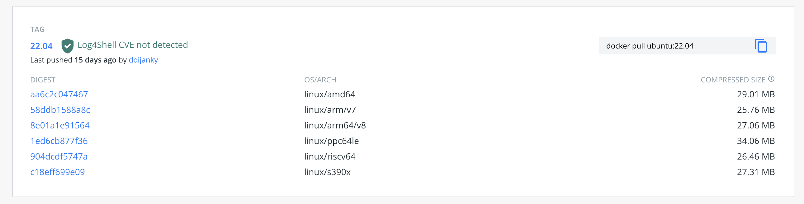

# Docker Multi-Arch Image

Created by : Mr Dk.

2022 / 05 / 15 16:15

Hangzhou, Zhejiang, China

---

## Background

近日，由于工作上的需要，要把软件打包构建到 Docker 镜像中，并且该 Docker 镜像还要支持 **多种 CPU 架构**。其实之前已经或多或少使用过多架构的镜像了。记得有一次在一台 x86 CPU 的机器上构建了一个镜像并 push 到 DockerHub 上以后，在 Apple M1 的 MacBook 上 `docker pull` 时看到了警告：

```
The requested image's platform (linux/amd64) does not match the detected host platform (linux/arm64) and nospecific platform was requested.
```

所以，一个镜像如果想在特定 CPU 架构上运行，就要为这个 CPU 架构打一个独立的镜像。为每个 CPU 架构上的镜像打一个 tag 可以解决问题，但是不够优雅。因为 tag 一般来说用来区分镜像内软件的版本，而不是用来区分镜像的运行平台。Docker 已经将镜像的运行平台维护在 manifest 中。以 DockerHub 上的 Ubuntu 官方镜像为例：



Tag 的作用是标识镜像 Ubuntu 的 22.04 / 20.04 / 18.04 ... 等版本，但每个 tag 上有多个 OS/ARCH。可以看到，Ubuntu 支持在 amd64、armv7、arm64(v8)、ppc64le、riscv64、s390x 架构的 Linux 上运行。


那么，如果我也想打一个 multi-arch 的镜像怎么办呢？只能在相应 CPU 架构的机器上才可以构建镜像吗？

## Buildx

并不是。在一台机器上，使用 [Docker BuildX](https://docs.docker.com/buildx/working-with-buildx/) 插件，以与 `docker build` 类似的方式，就可以构建出多架构镜像。Docker BuildX 使用 QEMU 在一台机器上模拟运行另一个 CPU 架构的指令，从而实现在一台机器上构建多个 CPU 架构的镜像。

所以第一步肯定是安装 Docker BuildX。搞定之后，看看目前支持的 CPU 架构有哪些：

```bash
$ docker buildx inspect --bootstrap
Name:   default
Driver: docker

Nodes:
Name:      default
Endpoint:  default
Status:    running
Platforms: linux/amd64, linux/386
```

可以看到，目前支持的只有 32/64 位的 x86 CPU。很正常，因为这台机器目前就安装着 Intel 的芯片。那么如何做到使用 QEMU 模拟其它 CPU 架构的指令呢？根据 [Docker BuildX 的文档](https://docs.docker.com/buildx/working-with-buildx/#build-multi-platform-images)，看起来需要向当前机器的 `binfmt_misc`（此处有点眼熟 🤭 爷青回）接口挂载其它 CPU 架构的二进制文件处理函数。处理函数内估计封装了 emulate 其它 CPU 指令的逻辑。使用文档内提供的一行命令，安装所有可以支持的 binfmt：

```bash
$ docker run --privileged --rm tonistiigi/binfmt --install all
Unable to find image 'tonistiigi/binfmt:latest' locally
latest: Pulling from tonistiigi/binfmt
2b4d0e08bd75: Pull complete
c331be51c382: Pull complete
Digest: sha256:5bf63a53ad6222538112b5ced0f1afb8509132773ea6dd3991a197464962854e
Status: Downloaded newer image for tonistiigi/binfmt:latest
installing: ppc64le OK
installing: riscv64 OK
installing: mips64le OK
installing: arm64 OK
installing: arm OK
installing: s390x OK
installing: mips64 OK
{
  "supported": [
    "linux/amd64",
    "linux/arm64",
    "linux/riscv64",
    "linux/ppc64le",
    "linux/s390x",
    "linux/386",
    "linux/mips64le",
    "linux/mips64",
    "linux/arm/v7",
    "linux/arm/v6"
  ],
  "emulators": [
    "qemu-aarch64",
    "qemu-arm",
    "qemu-mips64",
    "qemu-mips64el",
    "qemu-ppc64le",
    "qemu-riscv64",
    "qemu-s390x"
  ]
}
```

再次查看 BuildX，可以看到 `Platforms` 中多出了很多 CPU 架构：

```bash
$ docker buildx inspect --bootstrap
Name:   default
Driver: docker

Nodes:
Name:      default
Endpoint:  default
Status:    running
Platforms: linux/amd64, linux/386, linux/arm64, linux/riscv64, linux/ppc64le, linux/s390x, linux/arm/v7, linux/arm/v6
```

准备完毕，接下来就可以开始构建了。`docker buildx build` 命令与 `docker build` 有一些细微的差别。首先需要创建一个 builder：

```bash
$ docker buildx create --name multibuilder
$ docker buildx use multibuilder
```

然后使用这个 builder 进行构建：

```bash
$ docker buildx build \
    --push \
    --platform linux/amd64,linux/arm64 \
    --tag xxx/xxx:latest \
    --file Dockerfile .
```

经过体验，native 指令集（对我的机器而言是 amd64）的镜像构建速度最快，远快于 QEMU 对其它指令集的模拟。但是这种方法只需要一台机器就可以构建能够运行于所有 CPU 平台上的镜像了。

---

## References

[Preparation toward running Docker on ARM Mac: Building multi-arch images with Docker BuildX](https://medium.com/nttlabs/buildx-multiarch-2c6c2df00ca2)

[Getting started with Docker for Arm on Linux](https://www.docker.com/blog/getting-started-with-docker-for-arm-on-linux/)

[Docker Buildx](https://docs.docker.com/buildx/working-with-buildx/)

[docker buildx build](https://docs.docker.com/engine/reference/commandline/buildx_build/)
