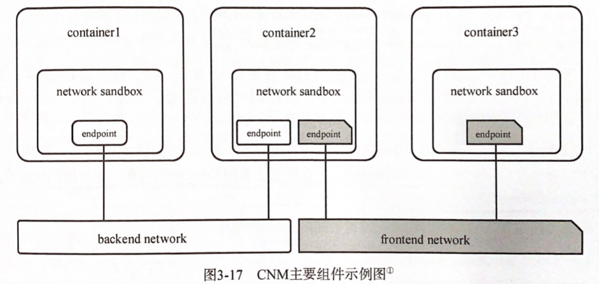
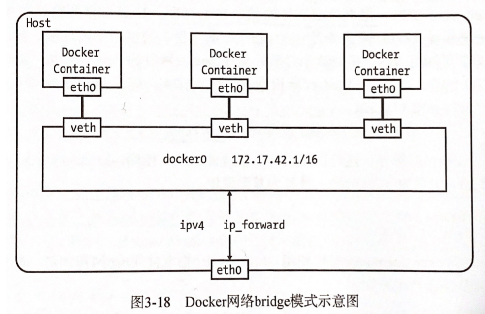

# Docker - Network

Created by : Mr Dk.

2020 / 09 / 23 19:46

Nanjing, Jiangsu, China

---

## Architecture

Docker daemon 通过 libnetwork 对外提供的 API 完成网络的创建和管理，而 libnetwork 则使用了 CNM (Container Network Model) 来完成网络功能的提供。CNM 中的组件包含：

* 沙盒 (sandbox) - 包含一个容器的网络协议栈信息，实现可以是 Linux network namespace
* 端点 (endpoint) - 一端加入沙盒，一端加入网络，实现可以是 veth pair
* 网络 (network) - 一组可以互相连通的端点，实现可以是 Linux bridge、VLAN 等



Libnetwork 内部提供了五种内置驱动，提供不同类型的网络服务：

* Bridge 驱动 - 使 Docker 容器连接到 Docker 网桥上，容器与外界通信使用 NAT
* Host 驱动 - Docker 容器与宿主机共用一个 network namespace，容器可以直接使用宿主机 IP 与外界通信
* Overlay 驱动 - 最适合大规模云计算虚拟化环境
* Remote 驱动 - 调用用户自行实现的网络驱动插件
* Null 驱动 - Docker 容器拥有自己的 network namespace，但不为容器进行任何网络配置

查看主机上的所有网络：

```console
$ sudo docker network ls
NETWORK ID          NAME                DRIVER              SCOPE
49c8b8421404        bridge              bridge              local
1a0d737a8d51        host                host                local
58d7652aeb9e        none                null                local
```

由于没有创建任何网络，以上三个网络都是 Docker daemon 默认创建的，也是无法被删除的。

## Bridge Driver

在 Docker 安装完毕后，在宿主机上会多一块名为 `docker0` 的网卡。`docker0` 实际上是一个网桥，功能上相当于是一个交换机，为连接在其上的设备转发数据帧。网桥上的 veth 网卡相当于交换机上的端口：



`docker0` 的 IP 地址是连接于其上面的所有容器的默认网关地址。这个网桥是在 Docker daemon 启动时自动创建的。用户可以自定义 `docker0` 的设置：

* `--bip=CIDR` - 设置 `docker0` 的 IP 地址和子网范围
* `--fixed-cidr=CIDR` - 限制 Docker 容器获取 IP 的范围
* `--mtu=BYTES` - 指定 `docker0` 的 **MTU**

在 Docker 安装完成后，宿主机 OS 的路由表中会多出一些规则。

以下规则对从容器内发出的数据帧进行 SNAT (源地址转换)。这样，从 Docker 容器内访问外网的流量，从外部看就是从宿主机上发出的，无法察觉到 Docker 容器的存在：

```
-A POSTROUTING -s 172.17.0.0/16 ! -o docker0 -j MASQUERADE
```

当 Docker 容器对外暴露端口后，以下规则对外界访问 Docker 的数据帧进行 DNAT (目的地址转换)，从而使得外界可以与容器通信。Docker 的转发规则默许所有的外部 IP 访问容器 - 当然，这也可以被人为限制：

```
-A DOCKER ! -i docker0 -p tcp -m tcp --dport 5000 -j DNAT --to-destination 172.17.0.4:5000
-A DOCKER -d 172.17.0.4/32 ! -i docker0 -o docker0 -p tcp -m tcp --dport 5000 -j ACCEPT
```

Docker 容器之间的通信也受到路由表的限制。当所有容器接入 `docker0` 的子网，只满足了相互通信的第一个条件；另外，Docker daemon 还会在路由表中添加额外的规则：

```
-A FORWARD -i docker0 ! -o docker0 -j ACCEPT
```

当 Docker daemon 启动参数 `--icc` (允许容器间相互通信) 被设置为 `false` 时，以上规则会被 `DROP`。

在 Docker 容器与外界通信的过程中，还涉及数据包在多个网卡之间的转发 (`docker0` 到 `eth0`)。这需要将宿主机内核的 ip-forward 功能打开。对应的 Docker 启动参数为 `--ip-forward=true`。

另外，Docker 镜像中 `/etc` 目录下的三个文件会在容器启动后被覆盖：

* `/etc/hostname`
* `/etc/hosts`
* `/etc/resolv.conf`

可以通过 `--hostname=<HOSTNAME>` 和 `--dns=<IP_ADDRESS>` 来设置容器的 hostname 和 DNS。对这三个文件的修改不会被 `docker commit` 保存。

---

## Link

当 Docker daemon 的 `--icc` (允许容器间通信) 参数被设置为 `false` 时，如何解决容器间的通信问题？Docker 的链接系统可以在两个容器之间建立一个安全的通道。

使用链接的方式：

```bash
sudo docker run -d -P --name web --link db:webdb training/webapp python app.py
```

其中 `--name` 参数指定了正在启动的容器 (接收容器) 的名称，`--link` 指定了想要链接到的容器 (源容器) 名或 ID，以及 `:` 后的源容器别名。Docker 将链接信息以下面两种方式保存在 **接收容器** 中：

* 接收容器的环境变量 - 在容器启动过程中，Docker 会查询并复制源容器中的环境变量
  * `<alias>_NAME`
  * 预先设置在源容器中的部分环境变量也会设置到接收容器的环境变量中
  * 接收容器会为源容器的暴露端口设置环境变量
* 接收容器的 `/etc/hosts` 文件
  * 源容器的 IP + 别名
  * 源容器重启后，自动更新 `/etc/hosts` 文件 (源容器 IP 可能会发生变化)
  * 使用别名来配置应用程序，就不需要担心容器 IP 的变化了

`/etc/hosts` 文件也是在容器启动时被设置的。Docker 将寻找接收容器的所有源容器，并将所有源容器的别名和 IP 地址添加到接收容器的 `/etc/hosts` 文件中。当容器重启后，自身的 `hosts` 文件和以自身为源容器的接收容器的 `hosts` 文件都会更新。

在修改 `/etc/hosts` 文件后，Docker 还会为容器的通信设置路由表规则。比如，容器 B 要与容器 A 的 5000 端口进行通信，那么就要在路由表中添加两条规则：

```
-A DOCKER -s 172.17.0.2/32 -d 172.17.0.1/32 -i docker0 -o docker0 -p tcp -m tcp --dport 5000 -j ACCEPT
-A DOCKER -s 172.17.0.1/32 -d 172.17.0.2/32 -i docker0 -o docker0 -p tcp -m tcp --sport 5000 -j ACCEPT
```

这两条规则能够保证两个容器的 TCP/5000 端口上的流量不会被丢弃。Docker 会在容器启动的过程中遍历正在启动的容器的所有源容器，从而得到源容器的所有暴露端口。遍历每一个暴露端口，为其在路由表中添加上述两条规则。

更新的 Docker 链接通过 DNS 解析的方式解决了传统链接系统中，由于容器重启造成注入的环境变量更新不及时的问题。

---

