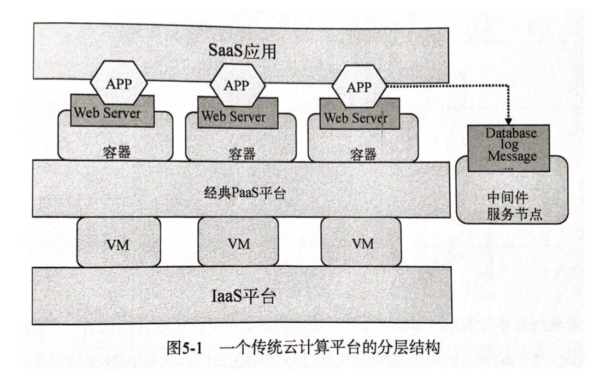
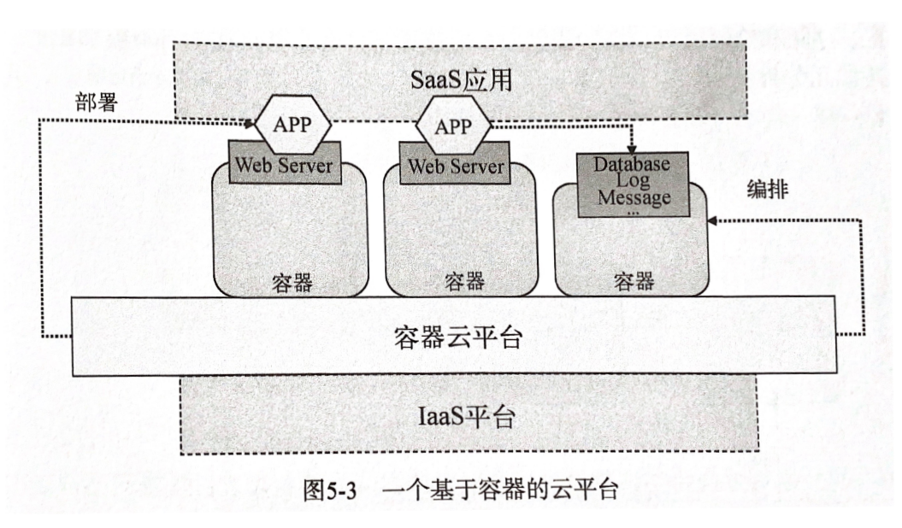

# Docker - Orchestration & Deployment

Created by : Mr Dk.

2020 / 09 / 30 23:21

Nanjing, Jiangsu, China

---

## Cloud Computing Architecture

由 IaaS 平台接管所有资源虚拟化的工作，由 PaaS 平台接管所有运行时环境和应用支撑工作，由用户部署的应用和服务的 API 提供 SaaS 服务。



通常，应用实例都会运行在 PaaS 提供的容器环境中，租户从始至终都无法感受到容器的存在。

容器云，是以容器为资源分割和调度的基本单位，封装整个软件运行时环境，为开发者和系统管理员提供用于构建、发布和运行分布式应用的平台。容器云的最直观形态是一个大规模的 **容器集群**。容器会被按照功能或依赖敏感性进行分组，不同容器组之间的容器完全隔离，相同组内的容器允许一定程度的共享。



作为 PaaS 级别的平台，容器云需要解决的问题有：

- 如何保证同一个应用的不同容器实例分布在不同或指定的宿主机结点上？
- 当一个宿主机结点意外退出的时候，如果保证该结点上的容器实例能够在其它结点上恢复？
- 如何维护当前容器实例运行情况与期望运行情况一致？
- 容器的网络应当如何配置，尤其是跨主机环境
- 孤儿容器的处理
- 挂载 volume 的数据该如何备份
- 如何合理限制硬件资源

问题就全部集中在容器的 **编排 (Orchestration)** 和 **部署 (Deployment)** 上：

- 编排，指根据被部署对象的耦合关系、环境依赖，制定部署流程中各个动作的执行顺序，保证流程可以在全新的环境中被重现
- 部署，指按照编排所指定的内容和流程，在目标机器上进行初始化、存放依赖和文件、运行部署动作

---

## Swarm/Machine/Compose 三剑客组合

### 编排小神器 Fig/Compose

Fig 于 2014 年被 Docker 收购并成为 Docker 的官方项目 Compose。在生产环境中，整个团队的容器数量可能极其庞大，容器之间的联系和拓扑结构也很可能非常复杂。因此迫切需要一种类似 Dockerfile 定义容器的机制，能够定义容器集群的编排和部署的工具。Dockerfile 重现一个容器，而 **Compose** 重现容器的配置和集群。

Compose 扮演的角色类似于 Docker client 的加强版，将 `docker run` 所需要的参数列表固化在了一个 YAML 的配置文件中。Docker 根据 Compose 的编排指令，执行具体的容器部署工作。比如，用 Compose 描述两个服务：

```yaml
web:
  build: .
  command: python app.py
  ports:
    - "5000:5000"
  volumes:
    - .:/code
  links:
    - redis

redis:
  image: redis
```

当使用 Docker 时，容器间的关系，尤其是类似 `link` 和 `volumes-from` 的参数，本需要人工记录容器之间的关系。一旦需要更新或重启容器，就需要在启动参数中添加，并以正确的顺序执行 `docker run`。在 Compose 的数据结构中，所有容器都会按照 `link` 关系进行排序，对这些容器的重新创建操作都会严格按照正确的顺序执行，保证更新后的容器集群没有问题。

对于 `volume-from` 参数，Compose 也会按照拓扑关系重新引用新容器的 volume。由于 Compose 在重建重启时会删除原容器并新建一个同名容器，删除原容器会导致容器的 volume 引用丢失。Compose 使用了一个中间容器暂时引用旧容器的 volume。在重建容器之后，新容器就可以引用中间容器的 volume 获得旧容器 volume 中的内容，此时中间容器使命完成。

Compose 的劣势在于其面向单宿主机部署。如果想要提供完善的面向服务器集群的编排部署，Compose 需要与 Machine 和 Swarm 联动。

### 跨平台宿主机环境管理工具 Machine

Machine 的主要功能是帮助用户在 **不同的云主机提供商** 上创建和管理虚拟机，并在虚拟机中安装 Docker。用户只需提供登陆凭证，Machine 就能自动在不同的云平台上部署 VM 了。无形中相当于屏蔽了不同云平台之间的差异，减少了用户在不同云平台提供商之间切换的成本。

首先，对于虚拟机的支持，Machine 针对不同 OS (Windows / OS X / Linux) 上的不同虚拟机软件 (VirtualBox / VMware Fusion / Hyper-V) 都提供了一套驱动，使其能够自动创建、管理虚拟机。用户不再需要打开一个个虚拟机软件，而是直接通过一条命令就能查看所有由 Machine 管理的虚拟机。

其次，对于 IaaS 平台，Machine 发挥开源社区的力量，为在各个主流 IaaS 平台的自动部署 VM 提供了一套驱动。Machine 设计了一套 API，对应目标云平台的驱动需要完成的功能：

- Create 功能 - 分配资源创建机器，并配置好 SSH 保证可以连接
- Remove 功能 - 从云平台上完全移除机器实例
- Start / Stop / Kill / Restart 功能 - 对机器实例的状态进行操作
- Status 功能 - 返回机器当前的运行状态

Machine 将所有的宿主机资源，不管是来自本地还是来自云平台，都放到了一个资源池中供用户使用。用户得以尽可能少地在消除不同平台的差异上消耗精力。

### 集群抽象工具 Swarm

Swarm 能够将多台宿主机抽象为一台主机。另外，还能够提供对宿主机资源的分配和管理。Swarm 通过在宿主机上添加标签信息，来将宿主机资源进行细粒度的分区。

对于 Swarm 集群，结点被分为两类：

- Swarm Agent - 运行 Docker daemon，需要保证版本一致
- Swarm Manger - 与所有 agent 通信，并对外提供 Docker 远程 API

通常需要让所有的 agent 统一到网络上的某个位置进行服务注册，然后 manager 实时到服务注册的位置获取最新的 agent 信息。当用户使用 Docker 客户端与 manager 通信时，manager 会选择要给 agent 执行命令。

在创建 Swarm 集群时，会向 DockerHub 的服务发现地址发送一个 POST 请求，获得一个 token，即 **集群 ID**。启动每一个 agent 结点后，向集群注册自身。Discovery 服务根据收到的集群 ID 将 agent 结点收归到某个集群的管理中，agent 结点会定时向 Discovery 服务发送心跳。Manager 启动后，会定期到 Discovery 服务中获取集群中的所有 agent 信息。

对于使用 Docker 客户端的用户，他所面对的就是 **一台** 宿主机。只需要使用 `docker -H <cluster_id>` 的命令即可。

服务发现的本质是为了让所有 agent 把自身信息保存到一个 manager 能拿到的地方。除了 DockerHub 官方提供的 Discovery 服务外，Swarm 也支持使用 _etcd_、静态文件、_Consul_、_ZooKeeper_ 等其它方式实现这个功能。

#### Swarm 的集群调度策略

Manager 收到用户请求后，需要将请求发送到合适的宿主机上，实现屏蔽多台宿主机的功能。可能收到的请求类型有：

- 对已创建的容器进行操作 - 直接转发请求到相应宿主机
- 针对镜像的操作
- 创建新容器 - 涉及到集群调度
- 获取集群整体信息

Swarm 提供了 **filter** 和 **strategy** 两个概念来实现集群调度。Filter 负责给筛选给定条件的宿主机。比如，某个 agent 在启动 Docker daemon 时会为自身添加一些标签信息：`docker -d --label storage=ssd`。而用户在创建容器时，可以通过 `constraint` 环境变量筛选指定标签的宿主机：`docker run -d -P -e constraint:storage=ssd ...`。

在使用了 filter 之后，Swarm 通过 strategy 来选出最终运行容器的宿主机。可选策略如下：

- Random 策略 - 随机选择一台候选宿主机
- Binpacking 策略 - 权衡宿主机 CPU、内存占用率后，选择能分配到最大资源的候选宿主机
- Spread 策略 - 把每个容器平均地部署到每一个结点上

#### Swarm 高可用

一旦 Swarm manager 发生故障，那么整个集群将会瘫痪。Swarm 已经支持了 leader elect，如果主 manager 发生故障，那么备用的 manager 将会替代原来的 manager，完成故障转移。任何时间都会有一台 manager 正常工作，保证系统的稳定性。

---
