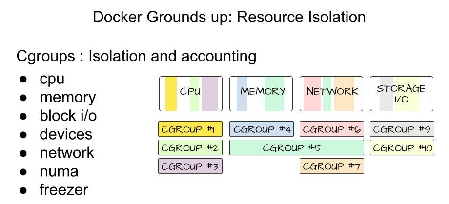
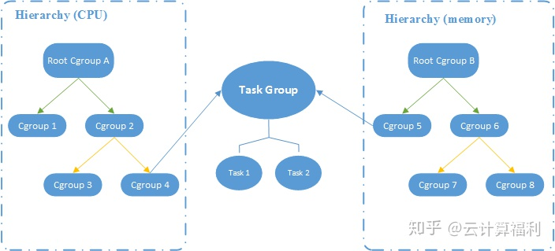

# Linux - Control Group

Created by : Mr Dk.

2020 / 09 / 19 16:47

Nanjing, Jiangsu, China

---

Docker 使用 namespace 来实现资源的隔离，构建出了一个相对封闭的容器环境。而另一个内核功能 - cgroups - 则用于限制被 namespace 隔离起来的资源，并能够为资源设置权重、计算使用量、操控进程的启动和停止等。

## What is cgroups?

> cgroups 是 Linux 内核提供的一种机制，能够根据需求把一系列系统任务及其子任务整合到按资源划分的不同组内，从而为系统资源管理提供一个统一的框架。

cgroups 的特点如下：

- API 以伪文件系统的方式实现，用户态程序可以通过文件操作实现 cgroups 的组织管理
- cgroups 可以细粒度到线程级别
- 所有资源管理功能都以子系统的方式实现
- 子任务创建之初与父任务处于同一个资源组

本质上，资源组是附加在程序上的一系列 hook，在程序运行时对资源进行调度时触发相应的资源追踪和限制。

cgroups 的作用主要有如下几个：

- 对任务使用的资源总和进行限制 (比如设定一个内存使用上限)
- 控制任务运行的优先级
- 统计资源使用量
- 对任务执行挂起、恢复的操作

以一个场景为例，体现了 cgroups 的作用：

```
CPU :          "Top cpuset"
                /       \
        CPUSet1         CPUSet2
           |               |
        (Professors)    (Students)

        In addition (system tasks) are attached to topcpuset (so
        that they can run anywhere) with a limit of 20%

Memory : Professors (50%), Students (30%), system (20%)

Disk : Professors (50%), Students (30%), system (20%)

Network : WWW browsing (20%), Network File System (60%), others (20%)
                        / \
        Professors (15%)  students (5%)
```

## How cgroups is organized?

cgroups 中的资源控制以 cgroup 为单位实现，其中包含了受控的任务 (进程或线程)，以及一个或多个子系统。子系统就是一个资源调度控制器，对于不同的系统资源，存在相应的不同子系统，如 CPU 子系统、内存子系统。一系列 cgroup 以树状结构排列为层级，每个层级绑定相应的子系统进行资源控制。

cgroups 的组织有如下几个基本规则，但是依旧没看懂...：

- 同一层级可以附加一个或多个子系统
- 一个子系统可以附加到多个层级，当且仅当，目标层级只有唯一一个子系统
- 新建一个层级时，系统中所有任务默认加入这个层级的 root cgroup
- 任务被 fork/clone 时创建的子任务默认和原任务在同一个 cgroup 中

找了两张图大致示意：





## Subsystem

子系统实际上是 cgroups 的资源控制系统，每种子系统独立地控制一种资源：

- blkio - 为块设备限制 I/O
- cpu - 调度程序控制任务对 CPU 的使用
- cpuacct - 自动生成任务对 CPU 资源使用情况的报告
- cpuset - 为 cgroup 中的任务分配独立的 CPU 和内存
- devices - 开启或关闭 cgroup 中任务对设备的访问
- freezer - 挂起或恢复 cgroup 中的任务
- memory - 设定 cgroup 中任务对内存的使用量，并自动生成使用报告
- pref_event - 对 cgroup 中的任务进行统一的性能测试
- net_cls - 使用等级识别符标记网络数据包

Linux 中以文件系统的形式实现了 cgroups。除了 VFS 接口外，内核没有为 cgroups 提供任何访问和操作的系统调用。首先需要 mount 这个文件系统：

```console
$ mount -t cgroup
cgroup on /sys/fs/cgroup/cpuset type cgroup (rw,nosuid,nodev,noexec,relatime,cpuset)
cgroup on /sys/fs/cgroup/cpu type cgroup (rw,nosuid,nodev,noexec,relatime,cpu)
cgroup on /sys/fs/cgroup/cpuacct type cgroup (rw,nosuid,nodev,noexec,relatime,cpuacct)
cgroup on /sys/fs/cgroup/blkio type cgroup (rw,nosuid,nodev,noexec,relatime,blkio)
cgroup on /sys/fs/cgroup/memory type cgroup (rw,nosuid,nodev,noexec,relatime,memory)
cgroup on /sys/fs/cgroup/devices type cgroup (rw,nosuid,nodev,noexec,relatime,devices)
cgroup on /sys/fs/cgroup/freezer type cgroup (rw,nosuid,nodev,noexec,relatime,freezer)
cgroup on /sys/fs/cgroup/net_cls type cgroup (rw,nosuid,nodev,noexec,relatime,net_cls)
cgroup on /sys/fs/cgroup/perf_event type cgroup (rw,nosuid,nodev,noexec,relatime,perf_event)
cgroup on /sys/fs/cgroup/net_prio type cgroup (rw,nosuid,nodev,noexec,relatime,net_prio)
cgroup on /sys/fs/cgroup/hugetlb type cgroup (rw,nosuid,nodev,noexec,relatime,hugetlb)
cgroup on /sys/fs/cgroup/pids type cgroup (rw,nosuid,nodev,noexec,relatime,pids)
cgroup on /sys/fs/cgroup/rdma type cgroup (rw,nosuid,nodev,noexec,relatime,rdma)
```

然后向不同的子系统文件夹中创建目录即创建 cgroup；向目录中的 `tasks` 文件写入 PID 即可将进程移入相应的 cgroup 中；向 cgroup 中的指定控制文件中写入限制值，即可对相应类型资源的使用进行限制。

Docker 的实现中，会在每个子系统目录下创建一个名为 `docker` 的 cgroup，然后在该控制组下再创建以容器 ID 为名称的容器 cgroup。一个容器中的所有进程的 PID 都会写入这个 cgroup 目录下的 `tasks` 文件中，并在控制文件中写入预设的限制参数，就可以对这个容器的资源使用进行限制。

## Implementation

cgroups 的本质是给任务挂上了钩子。当任务运行的过程中涉及某种资源时，就会触发钩子上附带的子系统进行检测。根据各种资源类型，进行资源限制和优先级分配。比如 memory 子系统会在 `mm_struct` 结构体中记录所属 cgroup，在申请内存时会触发 cgroup 用量检测。

在 cgroup 的目录中，以资源开头的文件 (如 `cpu.shares`) 都是用来限制这个 cgroup 下所有任务的配置文件。把相应信息写入这些配置文件，就可以生效 cgroup：

- `tasks` - 包含所有在该 cgroup 中的任务 ID
- `cgroup.procs` - 包含所有在该 cgroup 中的线程组 ID (即线程组中第一个进程的 PID)
- `notify_on_release` - cgroup 中最后一个任务退出时通知运行 release_agent
- `release_agent` - 指定 release agent 执行脚本的文件路径，该脚本用于自动化卸载无用的 cgroup

---

## References

[知乎 - Libvirt、Docker 的基础技术 - CGroups 介绍](https://zhuanlan.zhihu.com/p/71011998)

[知乎 - 一篇文章带你吃透 Docker 原理](https://zhuanlan.zhihu.com/p/156718649)

[知乎 - 浅谈 Linux Cgroups 机制](https://zhuanlan.zhihu.com/p/81668069)

[The Linux Kernel - Control Groups](https://www.kernel.org/doc/html/latest/admin-guide/cgroup-v1/cgroups.html)

[LWN.net - Control groups, part 5: The cgroup hierarchy](https://lwn.net/Articles/606699/)

---
