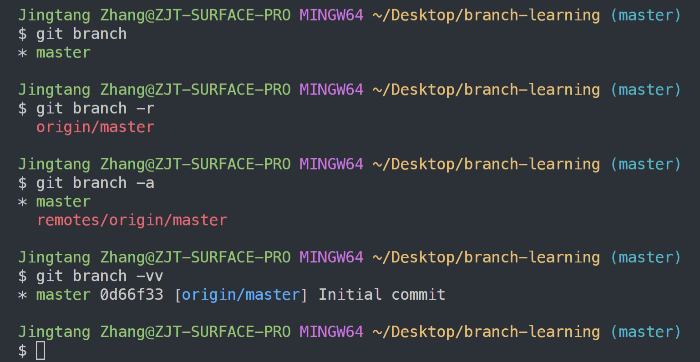
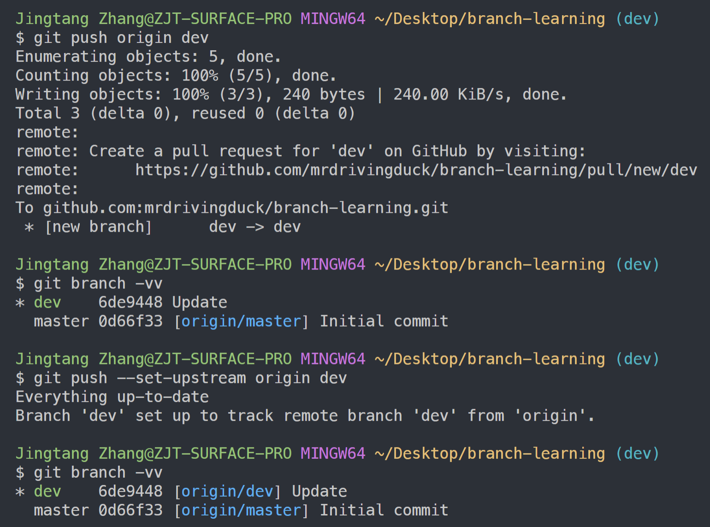
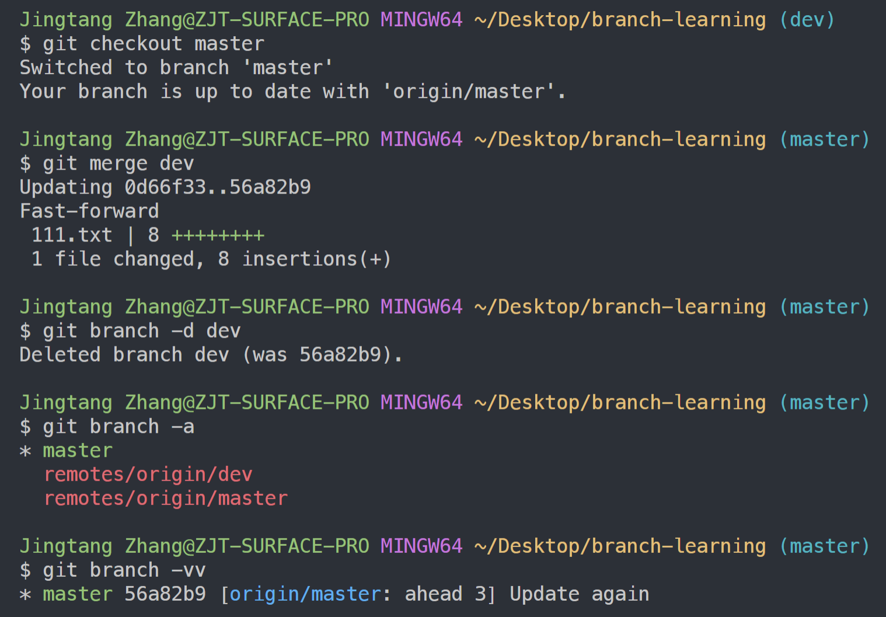
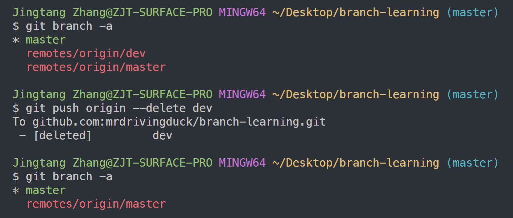
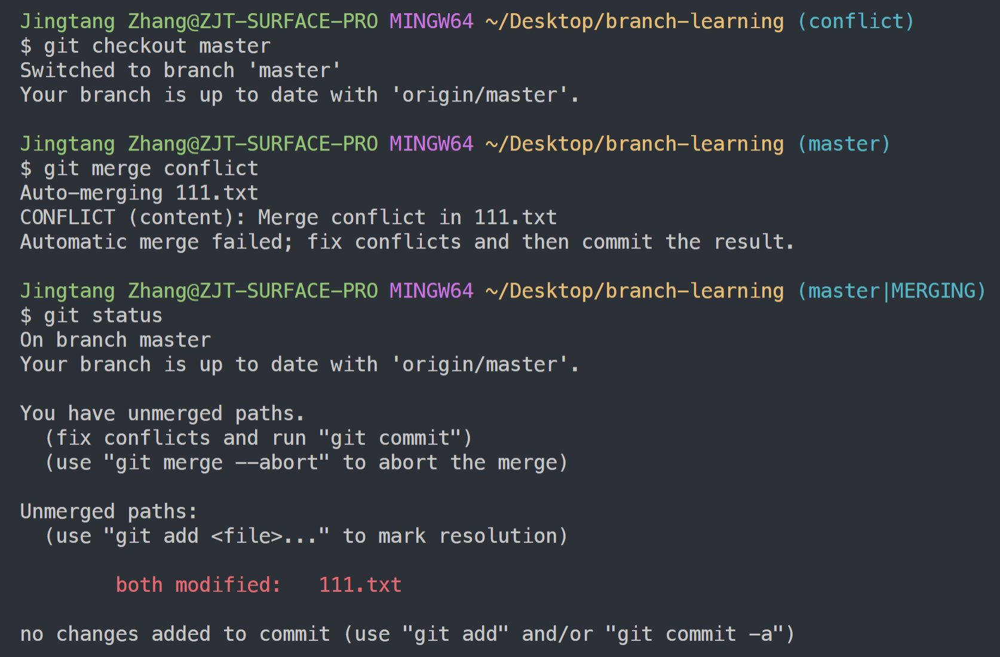
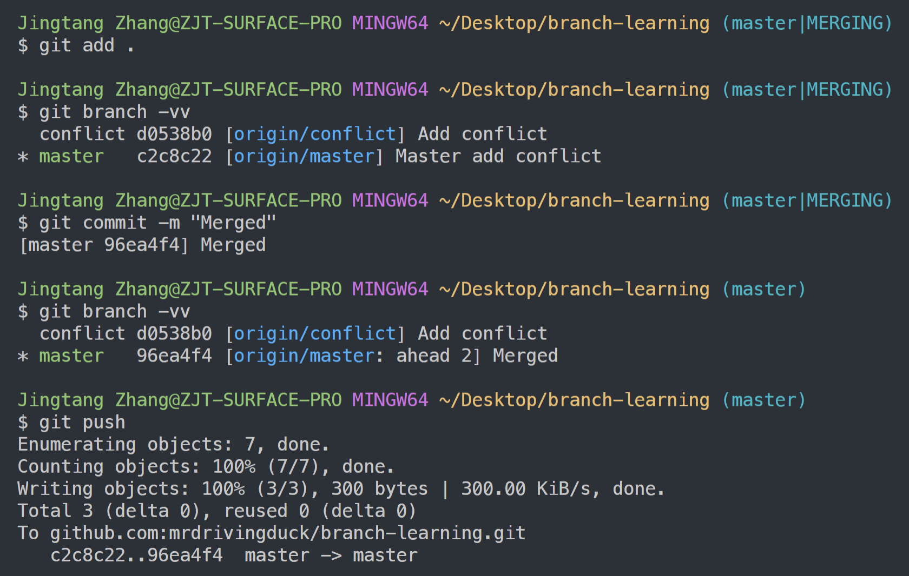
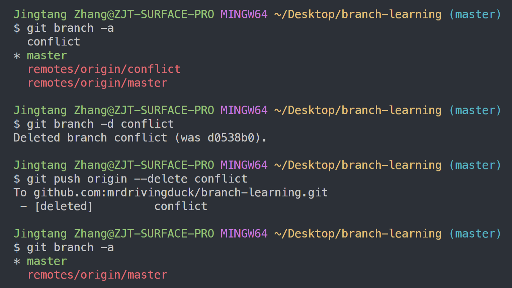

# Git - Branch & Merge Command

Created by : Mr Dk.

2019 / 04 / 22 11:02

Nanjing, Jiangsu, China

---

## About

学习通过 Git Bash 操作分支及其合并的命令及其含义

* 本地分支 / 远程分支
* 分支操作 / 合并操作 / 冲突处理

---

## Branch Commands

### git branch

```bash
$ git branch
```

列出所有的本地分支，并用 `*` 标记当前分支

### git branch -r

```bash
$ git branch -r
```

列出所有远程分支

### git branch -a

```bash
$ git branch -a
```

列出所有本地分支和远程分支

### git branch -vv

```bash
$ git branch -vv
```

查看本地分支及其对应的远程分支

### git branch --set-upstream-to=<branch_name>

```bash
$ git branch --set-upstream-to=origin/dev
```

将本地分支关联到远程分支

### Effect



### git branch <branch_name>

```bash
$ git branch dev
```

创建 `dev` 分支，但依旧停留在当前分支上

### git checkout <branch_name>

```bash
$ git checkout dev
```

切换到 `dev` 分支

此时运行 `git branch -vv`，远程分支中还没有分支和 `dev` 分支对应

如果两个分支上的文件状态不同时

Git 会将文件目录中的文件状态恢复为不同分支对应的状态

### git push --set-upstream origin dev

将本地提交推送到远程提交中的 `dev` 分支，并将本地分支和远程分支关联

### Effect



---

## Merge Commands

当需要将 `dev` 分支合并到 `master` 分支时

首先需要使用 `git checkout master` 切换到 `master` 分支

### git merge <branch_name>

```bash
$ git merge dev
```

将 `dev` 分支合并到当前分支

### git branch -d <branch_name>

```bash
$ git branch -d dev
```

删除本地的 `dev` 分支

### git push origin --delete <branch_name>

删除本地的 `dev` 分支后

远程的 `dev` 分支依旧存在

可以在网页上直接删除

也可以在命令行中直接删除：

```bash
$ git push origin --delete dev
```

### Effect



合并后，本地分支的提交次数应该比远程分支提前（__ahead__）

此时，使用 `git push` 将本地分支的提交到远程分支


此时，本地的 `dev` 分支已被删除，但远程的 `dev` 分支依旧存在

在命令行中将远程 `dev` 删除：



---

## Conflict

人为制造了两个文件状态冲突的分支，并试图进行分支合并

### Effect



产生冲突的部分如下：


目前分支处于 `master|MERGING` 的状态

在解决冲突并 commit 之后，分支回到 `master` 状态，本地分支合并成功

此后将 merge 推送到远程分支



删除合并后的无用本地和远程分支



---

## Summary

一套完整的命令操作 branch 和 merge

以及 conflict 处理的流程是走下来了

感觉对 Git 又熟悉了一些

在具体的冲突处理中

用 Vim 还是算了吧 😅 一点都不直观

还是 Visual Studio Code 里的 Git 插件简洁明了

想成为技术比较厉害的人 对 Git 必须足够熟悉哦 👨‍💻

---

