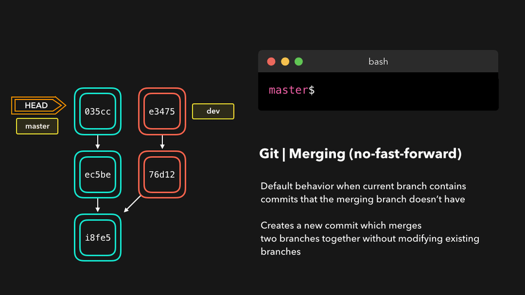

# Git - Rebase

Created by : Mr Dk.

2021 / 10 / 17 0:15

Nanjing, Jiangsu, China

---

## About

`git rebase` 命令有着两种不同的效果：

- 分支变基
- 重写分支历史

可以说是 Git 中最魔法的命令了。

## Rebase for a Branch

场景：一个子分支从主分支的某一次 commit 上分叉，子分支和主分支都分别有独立的 commit。

`git merge` 的操作是将两个分支的最新一次 commit 和两个分支的公共祖先进行一次 **三方合并**，并生成一次新的 commit：



`git rebase` 的做法：找到主分支和子分支的分叉 commit，将子分支基于这次 commit 的修改保存为临时文件。然后将分支的 base 指向主分支的最新一次 commit，并对这次 commit 应用之前保存的修改。结果如下：


之后从主分支 merge 子分支就是一次 fast forward 的合并了：


变基是有风险的。由于被 rebase 分支的祖先 commit 变了，那么该分支内的每一次 commit 的 SHA 都会发生改变。在多人协作时，可不能瞎 rebase。

> 目前遇到的比较多的变基用途是，将自己的独立开发分支与被保护的主分支 rebase，以便对齐团队里所有人 merge 到主分支上的工作。

## Rewriting History

对于一个没有分叉的分支，也可以通过 `git rebase -i <SHA>` 命令 (`i` 表示 interactive，交互式) 来重写任意的 commit 历史。此时输入的参数不再是一个分支名了，而是想要从当前分支历史中开始改写历史的起始 commit 的前一次 commit (想象对链表中的某个节点开始操作则需要先找到它的前驱节点)。如果是希望从分支的第一次 commit 开始改写 (没有前驱节点)，则需要使用特殊的命令：

```bash
git rebase -i --root
```

在交互式的 rebase 中，Git 会将从参数指定 commit 开始的每一次 commit 信息载入，并让用户选择如何处理每一次 commit。默认的处理是 `pick`，即保留这次 commit。

```
# Commands:
# p, pick <commit> = use commit
# r, reword <commit> = use commit, but edit the commit message
# e, edit <commit> = use commit, but stop for amending
# s, squash <commit> = use commit, but meld into previous commit
# f, fixup <commit> = like "squash", but discard this commit's log message
# x, exec <command> = run command (the rest of the line) using shell
# b, break = stop here (continue rebase later with 'git rebase --continue')
# d, drop <commit> = remove commit
# l, label <label> = label current HEAD with a name
# t, reset <label> = reset HEAD to a label
# m, merge [-C <commit> | -c <commit>] <label> [# <oneline>]
# .       create a merge commit using the original merge commit's
# .       message (or the oneline, if no original merge commit was
# .       specified). Use -c <commit> to reword the commit message.
```

以上为所有可选的命令：

- pick (p) 表示保留这次 commit
- reword (r) 表示保留这次 commit，但是编辑 commit 信息
- edit (e) 表示使用这次 commit，但重新修订它 (编辑 commit 信息 / 添加或移除 commit 的文件)，可被用于拆分提交
- squash (s) 表示使用这次 commit，但是把这次 commit 合并到前一次 commit 中
- fixup (f) 与 squash 类似，但是丢弃掉 commit log
- exec (x) 在这次 commit 上执行 shell 命令
- break (b) 表示停在这次 commit 上 (使用 `git rebase --continue` 继续)
- drop (d) 表示移除这次 commit
- label (l) 表示给当前 commit 打上标签
- reset (t) 表示将当前 commit 恢复标签
- merge (m) 表示创建一个 merge commit

通过在交互式命令行中编辑每次 commit 之前的命令，就可以对每一次 commit 实现相应的动作。包括但不限于：

- 合并几次 commit 为一次
  
- 拆分一次 commit 为多次
- 删除某次 commit
  
- 编辑某次 commit 的 commit message
- 在每次 commit 上修改 commit 邮箱地址
- ...

最近新学习到一条开发规范。从主分支拉出一条分支用于开发 feature 之后，在合入主分支之前，要把 feature 分支上的所有 commit 压缩为一个 commit，再合入。

为什么要这样干？查了查 _ZhiHu_，总结了一下：

1. 很多 commit 只是带有实验性质或暂存性质，并没有必要真正成为一次 commit
2. 将逻辑上相似的多个 commit 压缩到一次 commit 里，可以给它一个描述性很强的 commit message
3. 其它分支上的开发者并没有必要了解你的分支内的 `fix` / `fix again`
4. 好的 commit 应当能够简洁明了地反映一个项目是如何被开发出来的

提问中还给出了 [Vue.js 的 commit 历史](https://www.zhihu.com/question/61283395/answer/186725319) 作为范本。我认为值得学习。我觉得自己以前有着太多的无效 commit 了，特别是有几个反复的 fix。现在想来幸亏是自己一个人的项目，不然让别人看也是够无语的。

合并多次 commit 的直接做法就是 `git rebase` 命令：

```bash
git rebase -i <commit_id>
```

这里的 commit id 为要合并的几个 commit 的再前一个 commit。相当于要对链表中的三个节点进行合并，你必须找到这三个节点的前一个节点。不然如何将合并后的新节点链回去呢？

例子：

```console
$ git log
commit c44d371b4e8fe65ed515b1fe3986b7a5b7eb0a83 (HEAD -> master)
Author: mrdrivingduck <xxxxxxxxx@qq.com>
Date:   Sat May 29 10:44:52 2021 +0800

    Commit 4

commit 488e75ec020761a176688ed071c2049f3ebf6073
Author: mrdrivingduck <xxxxxxxxx@qq.com>
Date:   Sat May 29 10:44:40 2021 +0800

    Commit 3

commit ffe162164d4bdeaf1da285852f90860c3c0dc2a2
Author: mrdrivingduck <xxxxxxxxx@qq.com>
Date:   Sat May 29 10:44:23 2021 +0800

    Commit 2

commit 298e31375c1acab77eccfea320c7646cd2dbddea
Author: mrdrivingduck <xxxxxxxxx@qq.com>
Date:   Sat May 29 10:44:06 2021 +0800

    Commit 1

```

现在想把最新的三个 commit (2、3、4) 合并。那么首先需要这三个 commit 的之前一次 commit (Commit 1) 的 commit hash。

```bash
git rebase -i 298e31375c1acab77eccfea320c7646cd2dbddea
```

这时，会出来一个文件编辑界面：

```
pick ffe1621 Commit 2
pick 488e75e Commit 3
pick c44d371 Commit 4

# Rebase 298e313..c44d371 onto 298e313 (3 commands)
#
# Commands:
# p, pick <commit> = use commit
# r, reword <commit> = use commit, but edit the commit message
# e, edit <commit> = use commit, but stop for amending
# s, squash <commit> = use commit, but meld into previous commit
# f, fixup <commit> = like "squash", but discard this commit's log message
# x, exec <command> = run command (the rest of the line) using shell
# b, break = stop here (continue rebase later with 'git rebase --continue')
# d, drop <commit> = remove commit
# l, label <label> = label current HEAD with a name
# t, reset <label> = reset HEAD to a label
# m, merge [-C <commit> | -c <commit>] <label> [# <oneline>]
# .       create a merge commit using the original merge commit's
# .       message (or the oneline, if no original merge commit was
# .       specified). Use -c <commit> to reword the commit message.
#
# These lines can be re-ordered; they are executed from top to bottom.
#
# If you remove a line here THAT COMMIT WILL BE LOST.
#
# However, if you remove everything, the rebase will be aborted.
#
# Note that empty commits are commented out
```

最开头列出了将要操作的 commit，以及操作命令。带 `#` 的是注释，里面详细解释了操作命令。对于合并，我们应该 **pick** 最老的一次 commit，然后将后面的两次 commit **squash** 到前面的 commit 中。因此，编辑这个文件，将后两个 `pick` 改为 `squash` 或 `s`，保存。

保存后，将会进入下一个文件编辑界面：

```
# This is a combination of 3 commits.
# This is the 1st commit message:

Commit 2

# This is the commit message #2:

Commit 3

# This is the commit message #3:

Commit 4

# Please enter the commit message for your changes. Lines starting
# with '#' will be ignored, and an empty message aborts the commit.
#
# Date:      Sat May 29 10:44:23 2021 +0800
#
# interactive rebase in progress; onto 298e313
# Last commands done (3 commands done):
#    s 488e75e Commit 3
#    s c44d371 Commit 4
# No commands remaining.
# You are currently rebasing branch 'master' on '298e313'.
#
# Changes to be committed:
#       modified:   a.txt
#
```

除去注释外，这里实际上包含了三次 commit 的 commit message。编辑这个文件，删掉原有的 commit message，为合并后的 commit 指定一条 commit message，保存：

```
# This is a combination of 3 commits.
Merged commit!

# Please enter the commit message for your changes. Lines starting
# with '#' will be ignored, and an empty message aborts the commit.
#
# Date:      Sat May 29 10:44:23 2021 +0800
#
# interactive rebase in progress; onto 298e313
# Last commands done (3 commands done):
#    s 488e75e Commit 3
#    s c44d371 Commit 4
# No commands remaining.
# You are currently rebasing branch 'master' on '298e313'.
#
# Changes to be committed:
#       modified:   a.txt
#
```

完成后，rebase 操作就成功了：

```console
$ git rebase -i 298e31375c1acab77eccfea320c7646cd2dbddea
[detached HEAD 2a81aad] Merged commit!
 Date: Sat May 29 10:44:23 2021 +0800
 1 file changed, 2 insertions(+)
Successfully rebased and updated refs/heads/master.

$ git log
commit 2a81aadb7c1168e8c34af735b1686c617e7d5be3 (HEAD -> master)
Author: mrdrivingduck <xxxxxxxxx@qq.com>
Date:   Sat May 29 10:44:23 2021 +0800

    Merged commit!

commit 298e31375c1acab77eccfea320c7646cd2dbddea
Author: mrdrivingduck <xxxxxxxxx@qq.com>
Date:   Sat May 29 10:44:06 2021 +0800

    Commit 1

```

## References

[3.6 Git 分支 - 变基](https://git-scm.com/book/zh/v2/Git-%E5%88%86%E6%94%AF-%E5%8F%98%E5%9F%BA)

[7.6 Git 工具 - 重写历史](https://git-scm.com/book/zh/v2/Git-%E5%B7%A5%E5%85%B7-%E9%87%8D%E5%86%99%E5%8E%86%E5%8F%B2)

[Lydia Hallie - 🌳🚀 CS Visualized: Useful Git Commands](https://dev.to/lydiahallie/cs-visualized-useful-git-commands-37p1)

[工作中必备 git 技能详解](https://yonghaowu.github.io/2017/06/18/TheGitYouShouldKnow/)
