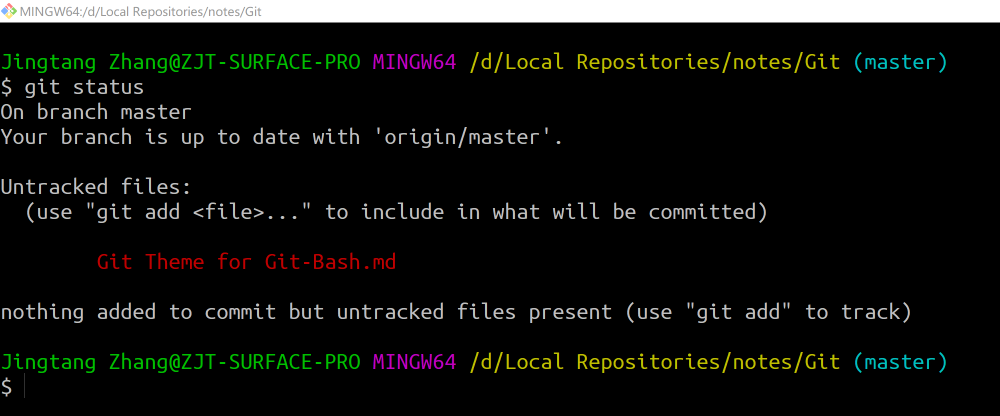
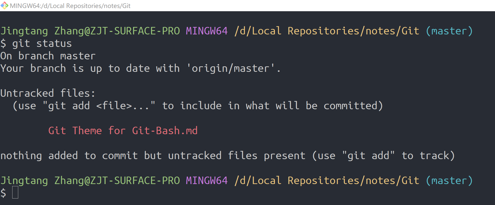

# Git - Theme for Git-Bash

Created by : Mr Dk.

2019 / 04 / 25 15:16

Nanjing, Jiangsu, China

---

## Why

记得大二第一次使用 [Atom](https://atom.io/)

便爱上了默认自带的 _One Dark_ 配色

后来开始使用 Visual Studio Code 以后

依旧通过插件使用着 _One Dark_ 配色

比较好用的是这款：https://github.com/Binaryify/OneDark-Pro

后来为了消除不同软件间的切换导致视觉上的不适

在使用 Typora 进行 MarkDown 文本编辑时

也使用了官方提供的类似配色主题 - _LostKeys Dark_

然而对于 Git Bash，却一直用着默认的黑色 Terminal 主题

虽然在 Visual Studio Code 中内嵌了以现有配色启动 Git Bash 的功能

但 Git Bash 的主题我还是想调成 _One Dark_ 的配色风格

---

## How

在 Git Bash 的设置中有设置主题的选项

但是没有我想要的 One Dark 主题

所以显然只能自己设定了

在 `C:\Users\<UserName>` 下能够找到 Git Bash 的配置文件 `.minttyrc`

---

## Basic Settings

设定了字体、字号、窗口大小、窗口透明度等：

（这些部分其实可以在 Git Bash 的 GUI 设置中完成）

```
Font=Ubuntu Mono
FontHeight=18
Transparency=low
Columns=100
Rows=30
BoldAsFont=yes
FontSmoothing=full
AllowBlinking=yes
```

---

## Background Color Style

设定了背景色、前景色、Cursor 的颜色和样式：

在 _One Dark Pro_ 主题的[源代码](https://github.com/Binaryify/OneDark-Pro/blob/master/src/editor.json)中分别找到这几个选项的颜色

```javascript
{
  "name": "One Dark Pro",
  "type": "dark",
  "colors": {
    "editor.background": "#282c34",
    "editor.foreground": "#abb2bf"
  }
}
```

将十六进制字符串分别转化为十进制的 RGB 即可：

```
ForegroundColour=200,200,200
BackgroundColour=40,44,52
CursorColour=200,200,200
CursorType=block
```

---

## Text Color Style

应该是覆盖了原有的颜色文字字符串对应的默认颜色

* 比如说原来的 `green` 对应的颜色是 `#008000`
* 现在可以通过显式将 `green` 声明为 `#98c379`，覆盖原有的原色

在 _One Dark Pro_ 主题的源代码中找到所有 Terminal 相关的颜色：

```javascript
{
  "name": "One Dark Pro",
  "type": "dark",
  "colors": {
    "terminal.foreground": "#c8c8c8",
    "terminal.ansiBlack": "#2d3139",
    "terminal.ansiBlue": "#61afef",
    "terminal.ansiGreen": "#98c379",
    "terminal.ansiYellow": "#e5c07b",
    "terminal.ansiCyan": "#56b6c2",
    "terminal.ansiMagenta": "#c678dd",
    "terminal.ansiRed": "#e06c75",
    "terminal.ansiWhite": "#d7dae0",
    "terminal.ansiBrightBlack": "#7f848e",
    "terminal.ansiBrightBlue": "#528bff",
    "terminal.ansiBrightGreen": "#98c379",
    "terminal.ansiBrightYellow": "#e5c07b",
    "terminal.ansiBrightCyan": "#56b6c2",
    "terminal.ansiBrightMagenta": "#7e0097",
    "terminal.ansiBrightRed": "#f44747",
    "terminal.ansiBrightWhite": "#d7dae0"
  }
}
```

将十六进制字符串分别转化为十进制的 RGB 即可：

```
Green=152,195,121
Black=45,49,57
Blue=97,175,239
Yellow=229,192,123
Cyan=86,182,194
Magenta=198,120,221
Red=224,108,117
White=215,218,224
BrightBlack=127,132,142
BrightBlue=82,139,255
BrightGreen=152,195,121
BrightYellow=229,192,123
BrightCyan=86,182,194
BrightMagenta=126,0,151
BrightRed=244,71,71
BrightWhite=215,218,224
```

---

## Summary

默认的 Git Bash 主题简直是看着让人窒息：



使用 _One Dark_ 主题之后：



妈诶 舒服了好多 :yum:

一直觉得研究颜色对人的情绪的影响是件很有意思的事情

并对视觉上的舒适有一种与生俱来的执著，对 code 也好，对 editor 也好

所以大三的时候一度想读 __人机交互 (HCI)__ 的研究生 并在以后做一名 __UED__？

* _UED (User Experience Designer) 用户体验设计师_

但个人感觉需要对设计学、美学、心理学要有一定的天赋和灵感才行

而且也没有遇上很好的机会 所以作罢 :pensive:

总之 这个主题一直让我觉得很舒心

也不知道是谁最先创造的

如果有机会 挺想见见他/她 :grin:

---

