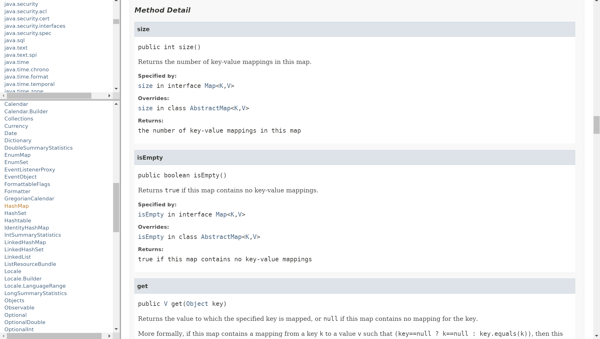

# Java - _Javadoc_

Created by : Mr Dk.

2020 / 02 / 19 12:36

Ningbo, Zhejiang, China

---

## What is _Javadoc_ ?

[_Javadoc_](https://www.oracle.com/technetwork/java/javase/documentation/index-jsp-135444.html) 是 _Sun_ 开发的 Java 文档生成工具。该工具可以从 Java 源代码的注释中生成 HTML 格式的 API 文档。HTML 格式可以将相关文档通过超链接连接在一起。

_Javadoc_ 中使用的 __doc comments__ 格式是记录 Java 类的行业标准。以前，通常由专业的技术文档编写者来编写软件的独立文档，是这些文档与代码本身保持同步非常困难。_Javadoc_ 使得文档可以直接内嵌在代码中，从而解决了代码与文档的同步问题。

_Javadoc_ 不会影响 Java 代码执行的性能。在编译时，注释会被移除。

## _Javadoc_ Structure

通过标准的多行注释 `/*` 和 `*/` 在代码中编写注释 - 其中，起始标记具有额外的星号 `/**`。注释中：

1. 第一段是对所标记的对象 (类、函数、变量) 的文字描述
2. 第二段是不同数量的描述性标签

```java
/**
 * Some statements...
 *
 * @author xxx
 * @version xxx
 * @since xxx
 */
```

_Javadoc_ 中支持的部分标签：

| Tag & Parameter                                              | Usage                                  | Applies to                            |
| ------------------------------------------------------------ | -------------------------------------- | ------------------------------------- |
| `@author <name>`                                             | 作者                                   | Class, Interface, Enum                |
| `@version <version>`                                         | 软件的当前版本                         | Class, Interface, Enum                |
| `@since <since_version>`                                     | 该功能开始出现的第一个版本             | Class, Interface, Enum, Field, Method |
| `@see <reference>`                                           | 指向其它元素或文档的链接               | Class, Interface, Enum, Field, Method |
| `@param <name> <description>`                                | 描述函数的一个参数                     | Method                                |
| `@return <description>`                                      | 描述函数的返回值                       | Method                                |
| `@exception <class_name> <description>` / `@throws <class_name> <description>` | 描述函数中会抛出的异常                 | Method                                |
| `@deprecated <description>`                                  | 描述一个已经过时的函数                 | Class, Interface, Enum, Field, Method |
| `{ @link <reference> }`                                      | 链接到其它位置 (网页)                  | Class, Interface, Enum, Field, Method |
| `{ @linkplain <reference> <text> }`                          | 与前者相同，但是显示的文本可以不是链接 | Class, Interface, Enum, Field, Method |
| `{ @inheritDoc }`                                            | 拷贝被重写函数的描述                   | Overriding Method                     |
| `{ @value <STATIC_FIELD> }`                                  | 返回静态域的值                         | Static Field                          |

## Examples of _Javadoc_ in _JDK 8_

```java
/**
 * An {@code int} value that may be updated atomically.  See the
 * {@link java.util.concurrent.atomic} package specification for
 * description of the properties of atomic variables. An
 * {@code AtomicInteger} is used in applications such as atomically
 * incremented counters, and cannot be used as a replacement for an
 * {@link java.lang.Integer}. However, this class does extend
 * {@code Number} to allow uniform access by tools and utilities that
 * deal with numerically-based classes.
 *
 * @since 1.5
 * @author Doug Lea
*/
public class AtomicInteger extends Number implements java.io.Serializable {
    // ...
}
```

```java
/**
 * Atomically updates the current value with the results of
 * applying the given function to the current and given values,
 * returning the previous value. The function should be
 * side-effect-free, since it may be re-applied when attempted
 * updates fail due to contention among threads.  The function
 * is applied with the current value as its first argument,
 * and the given update as the second argument.
 *
 * @param x the update value
 * @param accumulatorFunction a side-effect-free function of two arguments
 * @return the previous value
 * @since 1.8
 */
public final int getAndAccumulate(int x,
                                    IntBinaryOperator accumulatorFunction) {
    int prev, next;
    do {
        prev = get();
        next = accumulatorFunction.applyAsInt(prev, x);
    } while (!compareAndSet(prev, next));
    return prev;
}
```

```java
/**
 * Inserts the specified element at the end of this deque if it is
 * possible to do so immediately without violating capacity restrictions,
 * returning {@code true} upon success and {@code false} if no space is
 * currently available.
 * When using a capacity-restricted deque, this method is generally
 * preferable to the {@link #addLast(Object) addLast} method, which can
 * fail to insert an element only by throwing an exception.
 *
 * @param e the element to add
 * @throws ClassCastException {@inheritDoc}
 * @throws NullPointerException if the specified element is null
 * @throws IllegalArgumentException {@inheritDoc}
 */
boolean offerLast(E e);
```

## _Javadoc_ Effect



## Issue: Include Reference to Unit Test Classes in _Javadoc_

Explaination on [StackOverflow](https://stackoverflow.com/questions/45160647/include-link-to-unit-test-classes-in-javadoc) .

试图在 Java 代码中使用 `@see` 指向对应的单元测试类，失败。想来也有道理：

* 单元测试是用于测试 Java 代码的，因此在单元测试中使用 `@see` 指向对应的 Java 代码合情合理
* 而 Java 代码不是为单元测试而设计的，因此从 Java 代码中引用对应的测试类不合理

---

