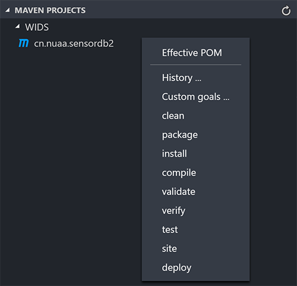
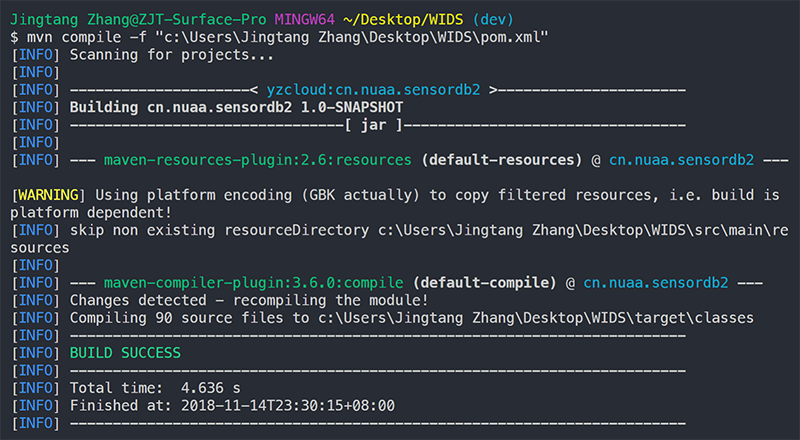
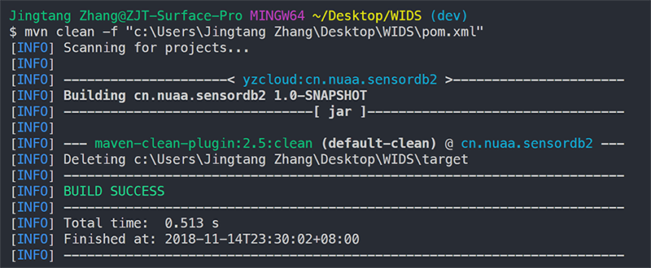

# Java - Maven 项目构建工具

Created by : Mr Dk.

2018 / 11 / 03 15:01

Nanjing, Jiangsu, China

---

## About

*Apache Maven* 是一个项目管理和综合工具。提供一个 **项目对象模型文件 (POM)** 的概念来管理项目的构建、相关性和文档。还能够自动下载项目依赖库。

## Installation

从 Apache official 上下载 Maven 的可执行文件并解压。

### Windows

1. 添加环境变量 `MAVEN_HOME` - `C:\Program Files\apache-maven-3.6.3`
2. 在环境变量 `PATH` 中加入 `%MAVEN_HOME%\bin`

### Linux

```bash
vim /etc/profile
```

```
export MAVEN_HOME=/opt/module/apache-maven-3.3.9
export MAVEN_REPO=/opt/module/apache-maven-3.3.9/m2/repository
export PATH=$PATH:$MAVEN_HOME/bin
```

```bash
source /etc/profile
```

检测是否成功:

```console
$ mvn -version
Apache Maven 3.6.3 (cecedd343002696d0abb50b32b541b8a6ba2883f)
Maven home: C:\Program Files\apache-maven-3.6.3
Java version: 1.8.0_231, vendor: Oracle Corporation, runtime: C:\Program Files\Java\jre1.8.0_231
Default locale: zh_CN, platform encoding: GBK
OS name: "windows 10", version: "10.0", arch: "amd64", family: "windows"
```

## Configuration

Maven 默认从 **中央存储库** (`http://repo1.maven.org/maven2/`) 自动下载依赖资源。由于国内的网络环境问题，可以修改 Maven 的配置文件，添加国内镜像，从而加快下载速度。官方文档教程：[Apache Maven - Guide to Mirror Settings](http://maven.apache.org/guides/mini/guide-mirror-settings.html)。

首先找到 Maven 的配置文件：

* Windows 下 - `${user.home}/.m2/settings.xml` 
* Linux 下 - `maven/conf/setting.xml` (似乎 Windows 也 OK？？？ 😧)

在配置文件中加入国内镜像 (阿里云为例):

```xml
<settings>
  <mirrors>
        
    <mirror>  
      <id>nexus-aliyun</id>  
      <name>Nexus aliyun</name>
      <url>http://maven.aliyun.com/nexus/content/groups/public</url>
      <mirrorOf>central</mirrorOf>  
    </mirror> 
        
  </mirrors>
</settings>
```

## Project

在 Eclipse 中新建一个 Maven project，里面有很多个工程模板，根据需求选择 (一般选择 `quickstart` 即可)，填写 `groupId`、`artifactId`、`version`。Maven 通过这三个元素唯一确定一个工程：

* `groupId` - the unique identifier of the organization or group that created the project
* `artifactId` - unique base name of the primary artifact being generated by this project 
* `groupId` 和 `artifactId` 也会组合为源代码路径 `/src` 下的默认包名

根据需要设置 `JRE System Library`。如果需要引入依赖：

* 定位到工程根目录的 `pom.xml` 文件中的 `<dependencies>` 内
* 加入依赖的定义组 `<dependency>`，其中包括依赖项目的 `groupId`、`artifactId`、`version`，以及 `scope` (部署阶段，若不加则默认所有阶段)

配置保存后 Maven 会将依赖的 `.jar` 文件下载到 *Maven* 默认的本地存储库下 - `${user.home}/.m2/repository/`。`.jar` 文件下载完毕后，会出现在 `Build Path` 的 `Maven Dependencies` 中。之后直接在 `src/` 目录下进行编码即可，依赖的类可以随时被 `import`。

与当前工程有关的信息全部都在 `pom.xml` 中，包括各子路径的作用等。右键工程，点击 `Maven/Update Project` 可重新构建工程并下载依赖。

```xml
<project>
  <dependencies>
  
    <dependency>
      <groupId>junit</groupId>
      <artifactId>junit</artifactId>
      <version>3.8.1</version>
      <scope>test</scope>
    </dependency>
    
    <dependency>
      <groupId>io.vertx</groupId>
      <artifactId>vertx-core</artifactId>
      <version>3.5.4</version>
    </dependency>
    
  </dependencies>
</project>
```

## Command

在 cmd 中直接运行命令

* `mvn compile` - 将 Java 源文件编译为 `.class` 文件
* `mvn test` - 测试，并生成测试报告
* `mvn clean` - 将以前编译的 `.class` 文件删除
* `mvn package` - 打包
* `mvn install` - 打包并放入 `maven` 本地仓库中
* ...

在 eclipse 中的操作步骤：

* 选择 `Run As`
* 选择 `Maven build `
* 在其中的 `Goals` 中填入对应的命令 - 如 `compile`、`install` 等

在 Visual Studio Code 中的 *Maven for Java* 插件的帮助下可直接运行命令：



`mvn compile` 命令：



`mvn clean` 命令：



编译前，需要在 `pom.xml` 文件中指定编译所需的 JDK 版本和编码格式，以及指定 `maven-compiler-plugins` 的版本 `<version></version>`。

```xml
<build>
  <plugins>
    <plugin>
      <groupId>org.apache.maven.plugins</groupId>
      <artifactId>maven-compiler-plugin</artifactId>
      <version>3.6.0</version>
      <configuration>
        <source>1.8</source>
        <target>1.8</target>
        <encoding>UTF-8</encoding>
      </configuration>
    </plugin>
  </plugins>
</build>
```

---

## Summary

其实以前经常看到 *Maven* 这个东西，特别是在用别人的代码的时候但是没有花心思研究。

今天学习 *Vert.x* 框架的时候，写了一些 demo 准备上传到 GitHub 上，突然发现工程目录下 `lib/` 里的文件有 80 MB。包括 *Vert.x* 的各种 `.jar` 文件以及其依赖文件，传上去既影响速度也没有必要。所以把整个工程构建成 Maven project，这样不再需要上传依赖的库了。

---

