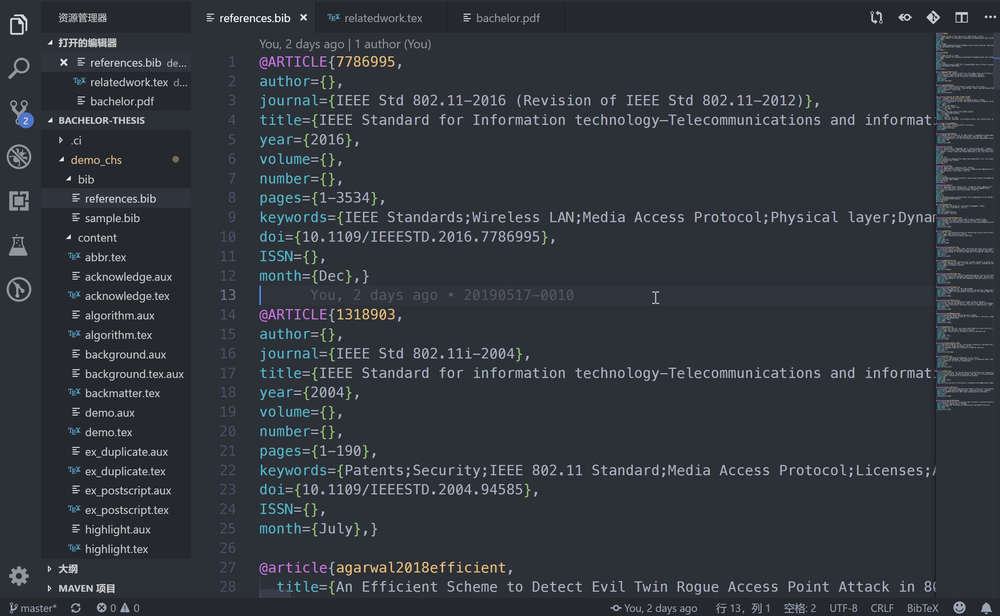

# LaTeX - BibTeX Reference

Created by : Mr Dk.

2019 / 05 / 18 13:56

Nanjing, Jiangsu, China

---

## About

使用 BibTeX 生成论文中的参考文献。

*BibTeX* is reference management software for formatting lists of references.

---

## Register

在 [*Google Scholar*](https://scholar.google.com/)、[*dblp*](https://dblp.uni-trier.de/) 等网站中，对于某篇 论文/专利/标准文档 等文献资料，点击 export，选择 export BibTeX 的选项。导出的格式如下：

```latex
@ARTICLE{7786995, 
author={}, 
journal={IEEE Std 802.11-2016 (Revision of IEEE Std 802.11-2012)}, 
title={IEEE Standard for Information technology—Telecommunications and information exchange between systems Local and metropolitan area networks—Specific requirements - Part 11: Wireless LAN Medium Access Control (MAC) and Physical Layer (PHY) Specifications}, 
year={2016}, 
volume={}, 
number={}, 
pages={1-3534}, 
keywords={IEEE Standards;Wireless LAN;Media Access Protocol;Physical layer;Dynamic scheduling;Information exchange;Authentication;White spaces;Array signal processing;2.4 GHz;256-QAM;3650 MHz;4.9 GHz;5 GHz;5.9 GHz;60 GHz;advanced encryption standard;AES;audio;beamforming;carrier sense multiple access/collision avoidance;CCMP;channel switching;clustering;contention based access period;Counter mode with Cipherblock chaining Message authentication code Protocol;confidentiality;CSMA/CA;DFS;direct link;directional multi-gigabit;dynamic allocation of service period;dynamic extension of service period;dynamic frequency selection;dynamic truncation of service period;E911;EDCA;emergency alert system;emergency services;fast session transfer;forwarding;GCMP;generic advertisement service;high throughput;IEEE 802.11™;international roaming;interworking;interworking with external networks;LAN;local area network;MAC;management;measurement;medium access control;media-independent handover;medium access controller;mesh;MIH;millimeter-wave;MIMO;MIMO-OFDM;multi-band operation;multi-hop;multi-user MIMO;multiple input multiple output;network advertisement;network discovery;network management;network selection;noncontiguous frequency segments;OCB;path-selection;personal basic service set;PHY;physical layer;power saving;QoS;quality of service;quality-of-service management frame;radio;radio frequency;RF;radio resource;radio management;relay operation;spatial sharing;SSPN;subscriber service provider;television white spaces;TPC;transmit power control;video;wireless access in vehicular environments;wireless LAN;wireless local area network;WLAN;wireless network management;zero-knowledge proof}, 
doi={10.1109/IEEESTD.2016.7786995}, 
ISSN={}, 
month={Dec},}
```

将此格式的文本复制到 LaTeX 目录中的 `xxx.bib` 文件中，并在 `xxx.tex` 中引入：

* BibTeX 的样式
* BibTeX 的具体信息，e.g. `references.bib`

```latex
\bibliographystyle{nuaabib} % styple
\bibliography{bib/references} % ATTENTION: NO '.bib'
```

此时，该引用条目仅被注册。如果在论文中没有被声明引用，将不会被排版到最终的参考文献中。

---

## Usage

在论文中，引用相关论文：

* 使用 `\cite{<id>}`
* `<id>` 为 `.bib` 文件中该条目的标识
* 排版时会自动在 `.bib` 文件中寻找对应 id 的条目

```latex
\subsection{IEEE 802.11 认证、关联和加密}

IEEE 802.11标准及其修订案 \cite{7786995} 规定，
接入点和客户端设备之间需要进行“四次握手”完成认证和关联。
首先由客户端设备发送认证请求（Authentication Request），
在接入点回应后（Authentication Response），
客户端设备发送关联请求（Association Request），
当接入点回应关联响应（Association Response）后，四次握手完成。
```

`\cite{}` 在文章中将会被渲染为 `[]`，并添加超链接到参考文献页面

显示效果如下：



---

## Summary

这个东西就很舒服 😈。对于引用格式一直很头大，不知道对于不同类型的文献分别应该怎么写。使用 BibTeX 不仅不用操心格式的问题 而且效率超高。此外，不需要担心编号的问题，因为编号会在排版过程中自动完成 ✔️。编写 LaTeX 时只需要用 `\cite{}` 引用 `.bib` 中的 ID 即可。

---

