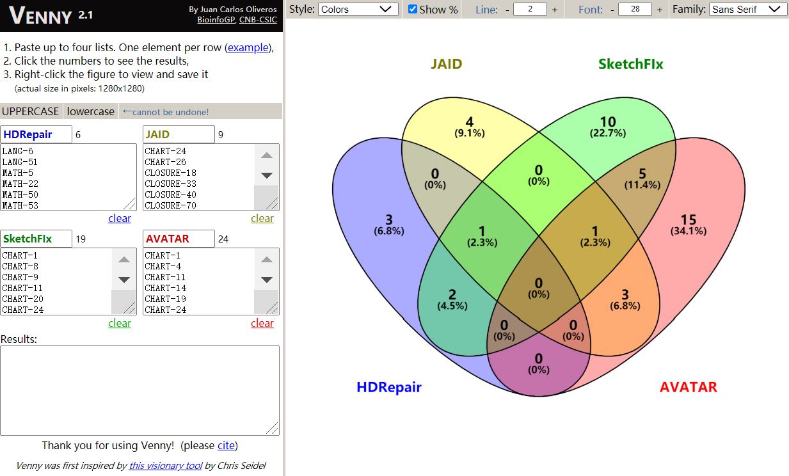
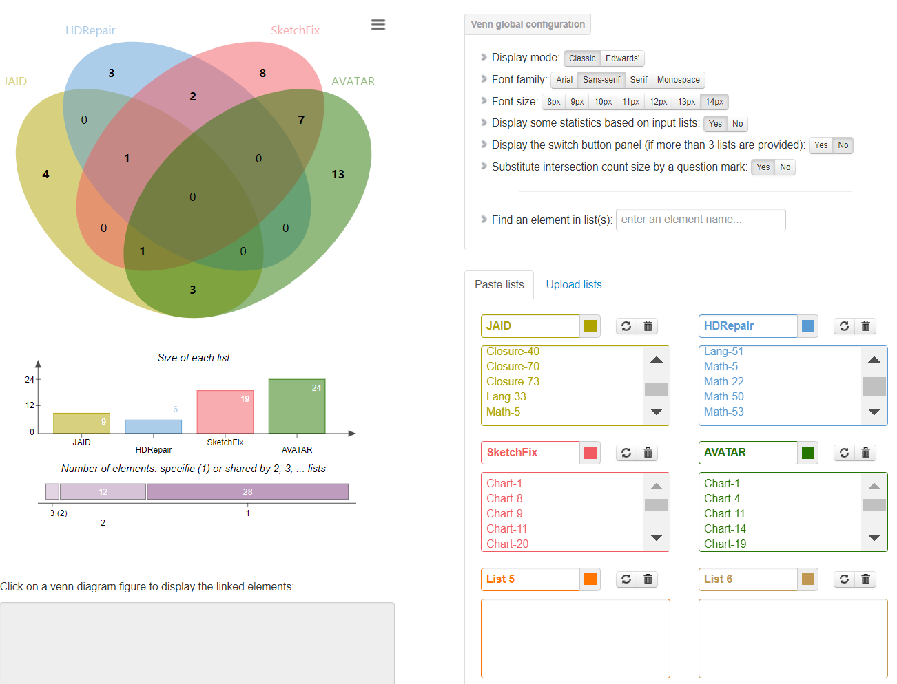
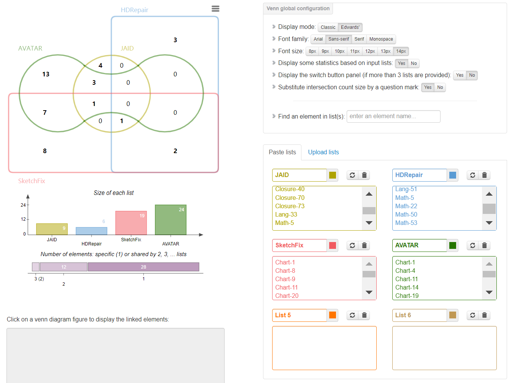
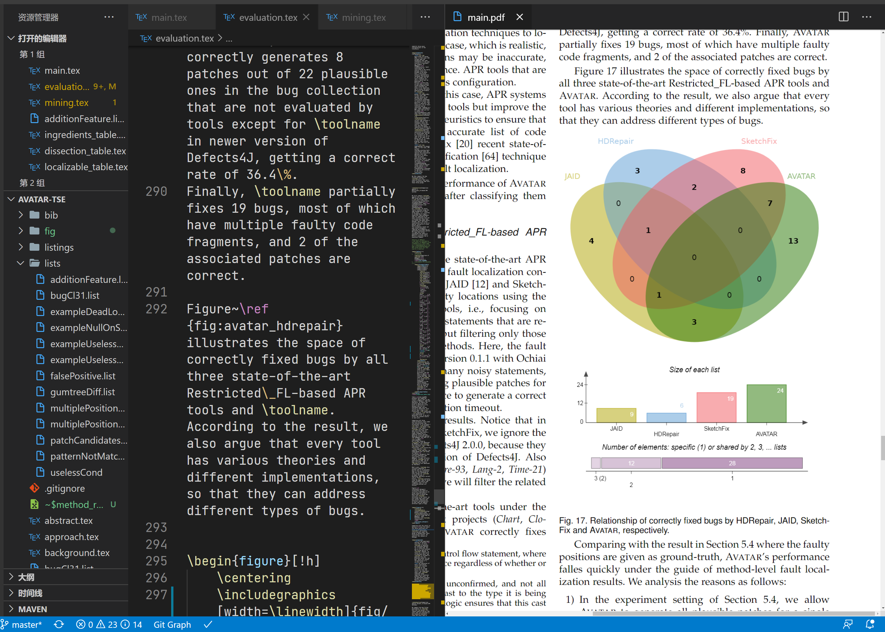

# Venn Diagram

Created by : Mr Dk.

2020 / 07 / 29 14:53

Nanjing, Jiangsu, China

---

## Draw Venn Diagram

今天遇到需要在论文中插入 Venn 图的需求。Venn 图用于展示不同集合之间的数学或逻辑关系，比如集合是否相交，是否包含等。由英国数学家 John Venn 于 1881 年发明。如果想要在论文中插入衣服 Venn 图，主要分为两步：

1. 绘制
2. 转换为合适的格式并插入

绘制 Venn 图最专业的方式是使用 R。但自从 2018 年写了一点 R 以后现在基本不想碰了。所以就记录几个能在线绘制 Venn 图的网站。一个 [博客](http://blog.sciencenet.cn/blog-3406804-1159241.html) 总结了比较全面的 Venn 图绘制方式。

### [Venny](https://bioinfogp.cnb.csic.es/tools/venny/index.html)

* 最多支持四个集合的 Venn 图绘制
* 带颜色 (但颜色不能自行修改)
* 似乎只支持导出为 `.png` 格式

效果如下：

### [Jvenn](http://jvenn.toulouse.inra.fr/app/index.html)

强推这个网站，功能齐全：

* 最多支持六个集合的 Venn 图
* 两种显示模式 (经典 / Edwards 😥)
* 是否基于输入数据显示相关图表
* 自行定义每个集合的颜色
* 支持导出 `.csv` / `.png` / `.svg`

效果如下：

有一个缺点是黄色的那个集合的集合名称 (图中的 `JAID`) 不能过长，否则在导出的图片中就显示不完全了。

### [Bioinformatics & Evolutionary Genomics](http://bioinformatics.psb.ugent.be/webtools/Venn/)

功能挺强大，还支持直接上传样本文件。但是画出来不太好看，不推荐。

## Format Conversion

为了便于插入 *LaTeX* 中，一般选择 `.svg` 格式的矢量图。而我的论文模板里不支持插入 `.svg`，我也不想添加额外的 *LaTeX* 宏包了。所以找了 [一个国外的良心网站](https://cloudconvert.com/)，免费支持大量格式的在线转换。并且转换出的 `.pdf` 图片尺寸适宜，布局居中，可以直接插入论文中。

> 这里不吹不黑，还是单纯表扬一下这个网站吧，真的很良心，质量好不收费。国内的一些网站转换质量极差，还特么收钱...

将上述第二个网站中的效果图导出为 `.svg` 格式后，在这个网站上转为 `.pdf` 格式，然后插入论文中。效果如下，看起来还不错：

---

