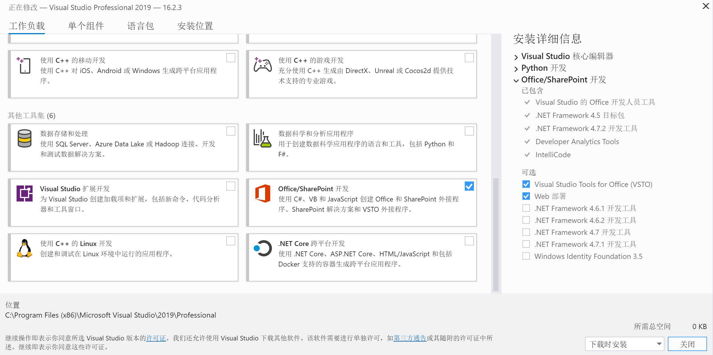
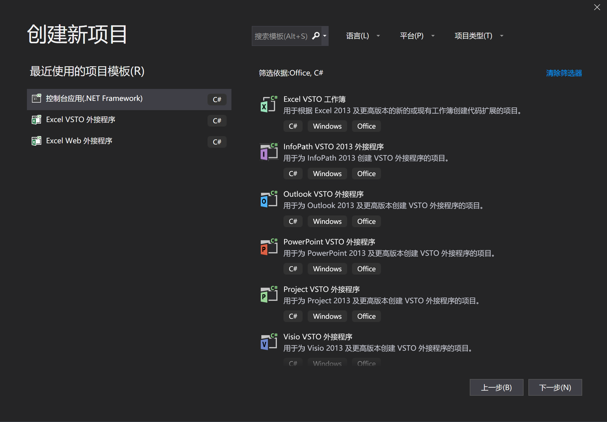
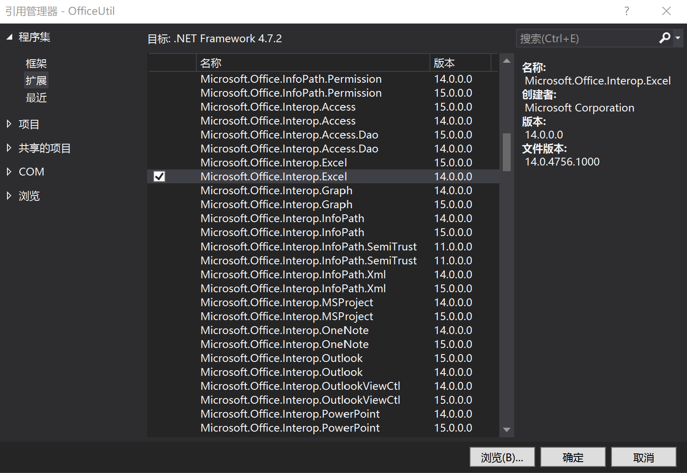

# MS Office - Application

Created by : Mr Dk.

2019 / 08 / 29 16:50

Ningbo, Zhejiang, China

---

## How to develop an Office application?

- Visual Studio
- Visual Studio Tools for Office
- Microsoft Office

## Visual Studio Tools



在这一步中，包含了 Visual Studio 对于 Office 应用的项目模板支持，以及操作 Office 的动态链接库。



## Application

当然，以上模板是用于开发嵌入在 Office 程序内的加载项，而如果只是想开发一个独立的控制台应用，用于自动化地操作 Office 的功能，那么建立一个 C# 的控制台应用程序即可。

在新项目中，需要添加 Office 扩展作为引用。以开发 Excel 的应用为例：



然后在程序中声明引用：

```c#
using Excel = Microsoft.Office.Interop.Excel;
```

---

## Summary

正在开发一些有用的 Office 工具，而 [参考文档](https://docs.microsoft.com/en-us/dotnet/api/microsoft.office.tools?view=vsto-2017) 是 2017 版本的 API，2019 似乎没有。

当然学习是需要点时间的。早知道就不用手动帮我爹解锁那么多的 Excel 表格了。

---
