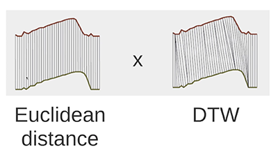
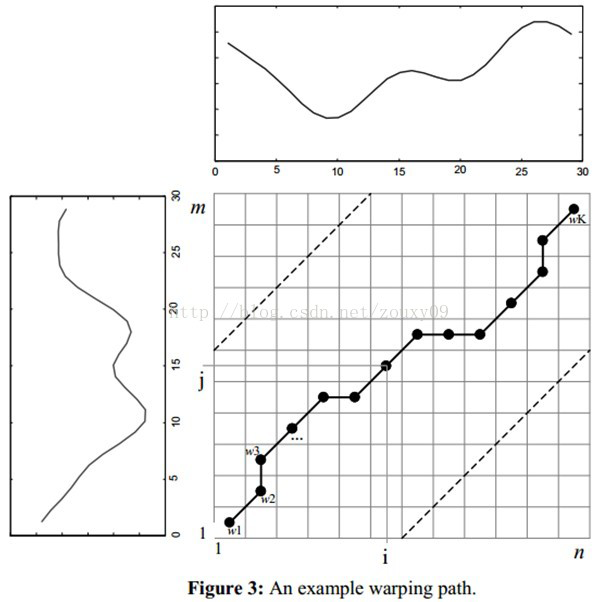

# Machine Learning - DTW

Created by : Mr Dk.

2019 / 03 / 19 21:14

Nanjing, Jiangsu, China

---

### About

DTW (Dynamic Time Warping) 动态时间规整算法

* One of the most used measure of the similarity between two time series
* Originally designed to treat automatic speech recognition
* Optimal global alignment between two time series, exploiting temporal distortions between them

将两个序列在时序上进行一定的压缩，使两个序列之间的距离之和最小

早期用于语音识别，解决了发音长短不一的模式匹配问题

---

### Theory

如果两个序列的长度不等

需要采用动态规划的方法对齐两个序列

对于序列 A 和 B，对应长度分别为 `n`、`m`

构造一个 `n × m` 的矩阵：

矩阵元素 `(i, j)` 表示 `Ai` 和 `Bj` 两点之间的距离（通常为欧氏距离）

* 即两个序列中每一对点之间的距离

算法归结为：__寻找一条通过此网格若干点的路径，使得全局距离之和最小__

* 映射表示为：`W = w1, w2, ..., wk`

算法约束：

* 边界条件 - 序列各部分的先后次序不可能改变，即在矩阵的左下角出发，右上角结束
* 连续性 - 只能和相邻点对齐，不能跨点匹配，保证两个序列中的每个坐标都在映射中出现
* 单调性 - 映射应随时间单调进行，即被匹配过的点不能再被匹配，即映射线不能相交

结合连续性和单调性约束，每个点的路径只可能有三个方向：

* 右
* 上
* 右上

> 物理含义：模板序列中的一个点可能对应测试序列中的好几个点。比如同一个音节，有的时候发音快，有的时候发音慢。在两个序列进行匹配时，要把发音快的那个点匹配到发音慢的那几个点上

---

### Implementation

fastdtw - https://github.com/slaypni/fastdtw -- Python

---

### Reference

https://www.youtube.com/watch?v=_K1OsqCicBY

https://www.cnblogs.com/Daringoo/p/4095508.html

---

### Summary

这个算法之前在读论文的时候遇到过

用于处理长度不同的时间序列的相似性问题

我准备用它来进行 Evil Twin 的报文分析

Evil Twin 由于存在很明显的转发特性

因此捕获到的报文会存在一定的相似性

但是由于报文捕获不能保证 100% 的捕获率

会有一些报文遗漏 导致时间序列长度不相等

用 DTW 算法或许刚好可以解决这个问题

---

