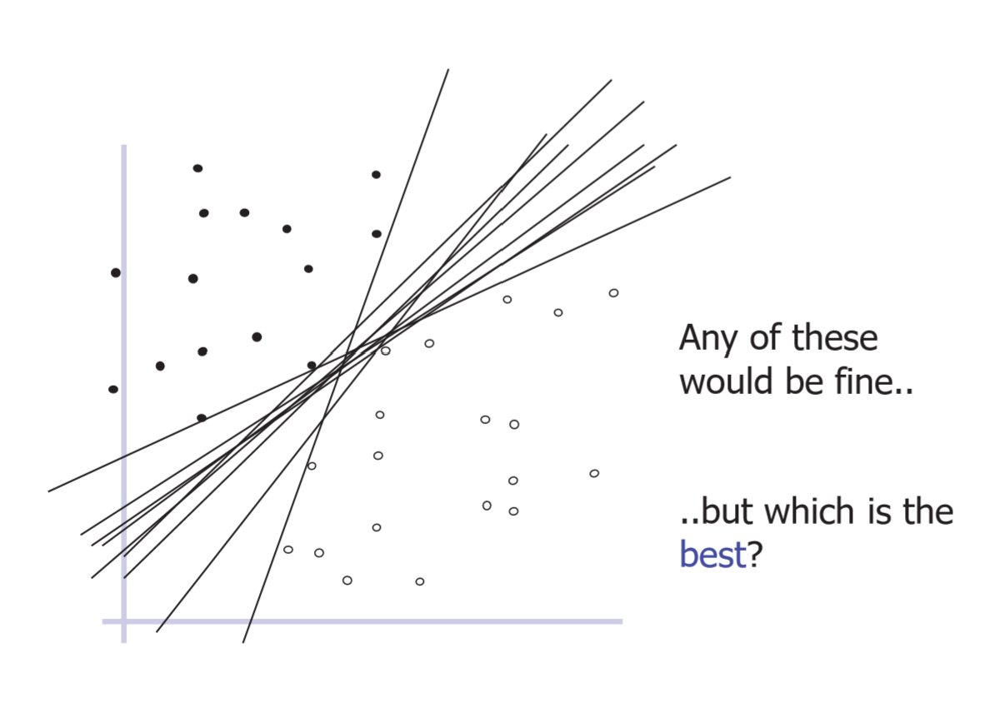
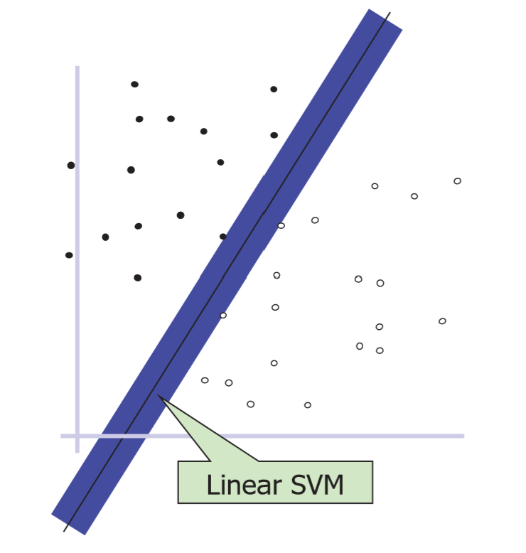

# Machine Learning - SVM

Created by : Mr Dk.

2020 / 01 / 01 20:59

Nanjing, Jiangsu, China

---

## About

支持向量机 (Support Vector Machine) 是一种监督学习模型

是一个线性分类器

也可以改进为聚类算法，进行支持向量聚类

---

## Theory (No Math Version)

以二维空间为例

目的: 找一个线性函数 (直线)，将两类样本分开

这样的函数 (边界) 可以有很多个:



选哪一个最好呢？

当然是选择将两类样本分得尽可能开的那一个函数

这一衡量指标称为 __margin__

* 将边界拓宽后，在接触到两类数据点之前的最大宽度



SVM 就是使 margin 最大的那个边界

---

## Linearly Non-Separable Data

问题: 如果一些数据的分布无法用线性函数分开怎么办？

### Solution 1 - Slack Variables

松弛变量: 允许分类器对一些样本犯错

### Solution 2 - Kernel

借助核函数，将数据映射到维度更高的空间中

* 比如，对于一维数据 `x`，用一个函数将其映射到二维空间 `x, y`
* 然后可以找到一个二维函数将这些点分开

---

## More Than Two Classes

对于非二分类问题

将任务分为 N 个二分类问题

* Class 1 VS Class [2-N]
* Class 2 VS Class 1, [3-N]
* ...
* Class N VS Class [1, N-1]

最后，选择使数据距离分类器最远的分类作为分类结果

---

## _LibSVM_

* `svm-train`
* `svm-predict`
* `svm-scale`

### Data Format

训练数据和测试数据的格式

```
<label> <index1>:<value1> <index2>:<value2> ...
...
...
...
```

* `<label>`
  * 在分类任务中，是一个整数 (支持多分类)
  * 在回归任务中，可以是任何实数
  * 在测试数据中，仅被用于计算准确率和错误率
* `<index1>:<value1>` 给定了一个特征及其对应的值
  * `index` 是从 1 开始的整数，代表特征的 index
  * `value` 是特征的值

对于分类，如果训练数据只含有一类，会产生警告

### SVM Train

```
Usage: svm-train [options] training_set_file [model_file]
options:
-s svm_type : set type of SVM (default 0)
	0 -- C-SVC		(multi-class classification)
	1 -- nu-SVC		(multi-class classification)
	2 -- one-class SVM
	3 -- epsilon-SVR	(regression)
	4 -- nu-SVR		(regression)
-t kernel_type : set type of kernel function (default 2)
	0 -- linear: u'*v
	1 -- polynomial: (gamma*u'*v + coef0)^degree
	2 -- radial basis function: exp(-gamma*|u-v|^2)
	3 -- sigmoid: tanh(gamma*u'*v + coef0)
	4 -- precomputed kernel (kernel values in training_set_file)
-d degree : set degree in kernel function (default 3)
-g gamma : set gamma in kernel function (default 1/num_features)
-r coef0 : set coef0 in kernel function (default 0)
-c cost : set the parameter C of C-SVC, epsilon-SVR, and nu-SVR (default 1)
-n nu : set the parameter nu of nu-SVC, one-class SVM, and nu-SVR (default 0.5)
-p epsilon : set the epsilon in loss function of epsilon-SVR (default 0.1)
-m cachesize : set cache memory size in MB (default 100)
-e epsilon : set tolerance of termination criterion (default 0.001)
-h shrinking : whether to use the shrinking heuristics, 0 or 1 (default 1)
-b probability_estimates : whether to train a SVC or SVR model for probability estimates, 0 or 1 (default 0)
-wi weight : set the parameter C of class i to weight*C, for C-SVC (default 1)
-v n: n-fold cross validation mode
-q : quiet mode (no outputs)
```

可以选择 SVM 的类型为分类、回归、单分类

还可以选择核函数类型

### SVM Predict

```
Usage: svm-predict [options] test_file model_file output_file
options:
-b probability_estimates: whether to predict probability estimates, 0 or 1 (default 0); for one-class SVM only 0 is supported
```

需要输入模型文件和测试文件

### SVM Scale

```
Usage: svm-scale [options] data_filename
options:
-l lower : x scaling lower limit (default -1)
-u upper : x scaling upper limit (default +1)
-y y_lower y_upper : y scaling limits (default: no y scaling)
-s save_filename : save scaling parameters to save_filename
-r restore_filename : restore scaling parameters from restore_filename
```

缩放数据，用于数据的规范化

将每维数据 (每个特征) 缩放到一个指定的目标区间中 (默认为 [-1, 1])

从而使每维数据都具有相同的权重

---

## References

http://parnec.nuaa.edu.cn/huangsj/

https://github.com/cjlin1/libsvm

---

