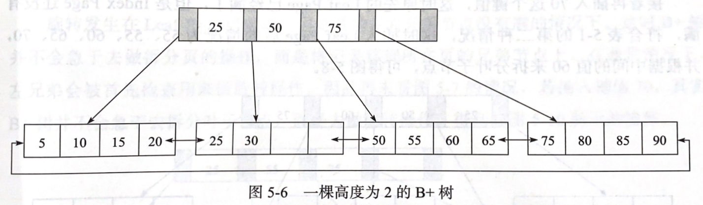

# InnoDB - Index

Created by : Mr Dk.

2020 / 10 / 16 15:27

Nanjing, Jiangsu, China

---

## B+ Tree

B+ 树是为磁盘或其它直接存取辅助设备设计的一种 **平衡查找树**。B+ 树中，所有记录结点都按 key 值大小顺序存放在 **同一层叶子结点** 上，且各个叶子结点之间以指针连接。

B+ 树的插入操作：首先根据要插入的 key 找到可以被插入的叶子结点，然后插入；如果叶子结点已满，则会引发叶子结点的分裂，甚至级联引发上层结点的分裂。由于 B+ 树主要用于磁盘，页拆分即意味着会产生磁盘操作，因此在可能的条件下应尽可能减少结点分裂的次数。如果叶子结点的左右兄弟结点还没有满的前提下，可以进行一次旋转操作，把值交换到兄弟结点上的空位里去；如果没有剩余空位，再进行结点分裂。

B+ 树的删除操作 - 需要使用 fill factor 来控制树的删除变化，即每个结点需要保证至少被填满 (50%)，否则这个结点就没有存在的必要了，而是应当被合并到其它结点中。首先根据要删除的 key 值找到叶子结点，直接删除；如果叶子结点的 fill factor 还没有达到阈值，则删除流程结束；如果删除 key 后结点的 fill factor 已经小于阈值，那么需要将结点中的剩余 key 并入其兄弟结点中。

## B+ Tree Index

数据库中的 B+ 树一般都在 2-4 层，也就是说查找某一 key 值的行记录最多只需要 2-4 次 I/O。其中，B+ 树索引可被分为 **聚集索引 (Clustered Index)** 和 **辅助索引 (Secondary Index)**，不同点在于，叶子结点是否存放一整行的信息。

### Clustered Index

聚集索引是按照每张表的 primary key 构造的 B+ 树，同时，叶子结点中存放的是 **整张表** 的行记录数据 - 因此索引的叶子结点也被称为 **数据页**，每个数据页都通过一个双向链表来进行连接。可以认为，数据也是索引的一部分。由于实际数据页的存放只能按照一个顺序，因此每张表只能拥有一个聚集索引，即按照一棵 B+ 树进行排序。在大多数情况下，查询优化器倾向于使用聚集索引，因为查询能够直接在索引的叶子结点上找到数据；另外，聚集索引也能够很快进行特定范围值内的查询。

在聚集索引中，叶子结点 (数据页) 上存放的是完整的每行记录，每个叶子结点上包含多行。而非叶子结点只存放 key 和指向数据页的偏移量 (指针)，而不是完整的行记录。由此可以看出，B+ 树索引的查询最终只能查询到某个行记录所在的数据页 (叶子结点)。将这个叶子结点载入内存后，再根据数据页中的 page directory 对页内的行记录进行二分查找，直到查到想要的 key 值。

聚集索引的存储在物理上并不是连续的，而在逻辑上是连续的 - 通过叶子结点之间的双向链表进行维护。

聚集索引对于主键的 **排序查找** 和 **范围查找** 速度很快。因为聚集索引本身就是有序的，并可以根据查询范围对不需要访问呢的数据页进行剪枝，减少 I/O 次数。

### Secondary Index

对于辅助索引来说，叶子结点并不包含行记录的完整数据。辅助索引的叶子结点包含：

- Key 值
- Bookmark (书签) - 保存 **key 对应的行数据** 的 **聚集索引键**

辅助索引的存在并不影响数据在聚集索引中的组织，所以每张表上可以有多个辅助索引。InnoDB 通过辅助索引叶子结点获得聚集索引的 key，然后再通过聚集索引找到完整的行记录。也就是说，逻辑 I/O 次数为查询辅助索引的次数 + 查询聚集索引的次数。

## Index Separation

数据库中 B+ 树的结点并不一定简单地从结点的中间记录位置开始分裂。如果插入按自增顺序进行，将会导致插入性能极其低下。InnoDB 存储引擎的 Page Header 中的以下几个部分保存了之前插入的信息：

- `PAGE_LAST_INSERT`
- `PAGE_DIRECTION`
- `PAGE_N_DIRECTION`

通过这些信息来决定结点应当如何分裂：

- 如果插入是随机的，那么就以页的中间记录作为分裂点
- 若向 **同方向** 的插入数量已经达到 5，且待插入记录的前一条记录之后还有三条记录，则以定位记录之后的第三条记录作为分裂点
- 自增插入时，分裂点就是待插入记录的前一条记录，分裂出的新结点中只有待插入记录

## Index Management

用户可以设置对整列数据进行索引，也可以设置为只索引一个列开头部分的数据。什么样的列比较适合建立索引呢？一般的经验是，在访问表中 **很少一部分** 数据时，使用 B+ 树才有意义：

- 性别 / 地区 / 类型等数据的 **可取值范围很小**，称为 _低选择性数据_
- 当字段取值范围很广，几乎没有重复数据时，称为 _高选择性数据_

B+ 树索引较为适合高选择性数据。

如何查看数据的选择性高低呢？索引中记录了一个 cardinality 值，表示索引中不重复记录数量的估值。这个值越小，说明重复的数据越多，说明需要用到索引的必要越小。

由于不同存储引擎对 B+ 树索引的实现各不相同，所以对 cardinality 的统计是在存储引擎层进行的。对索引的更新操作可能是非常频繁的，如果每次发生索引变动都对该值进行统计，开销过大。数据库中对该值的统计、更新都是通过 **采样** 的方法进行；并且也不会在每次发生索引更新时就进行统计。Cardinality 发生更新的时机：

- 表中 1/16 的数据已经发生变化
- 表中数据更新次数已经超过 2000000000 (防止更新只在某几行数据中反复发生)

InnoDB 存储引擎默认对 8 个叶子结点进行采样：

- 取得索引中所有叶子结点的数量 A
- 随机取 8 个页，统计每个页中不同记录的个数 (P1 - P8)
- 预估 cardinality = (P1 + ... + P8) / 8 \* A

由此可见，这个值不是一个精确的值；另外，由于采样的随机性，每次得到的值也都是不同的 (除非索引 <= 8 页)。可以使用参数控制采样的页个数，以及对索引中 `NULL` 值的处理行为。

## Index Usage

### OLTP / OLAP

对于不同的应用，使用索引的意义可能不一样。对于 OLTP 业务，查询操作只会从数据库中获取一小部分数据，此时建立索引才是有意义的；对于 OLAP 业务，由于需要访问表中大量数据，建立索引意义不大。但是，由于 OLAP 业务中有时也需要从时间维度对数据进行筛选，所以索引也是有一定意义的。

### Union Index

联合索引指的是对表上的多个列进行索引，即 key 值数量 ≥ 2。与单 key 的 B+ 树索引类似，联合索引中的第一个 key 是有序的。而对于第一个 key 相同的数据来说，第二个 key 又是有序的。这里就涉及到联合索引中的 **最左匹配** 问题，即，联合索引可以匹配到 SQL 语句查询条件中最左边的范围查询之前的查询条件。

> 假设 (a, b, c, d) 上有联合索引，那么 `WHERE a = 1 and b = 2 and c > 3 and d = 4` 的查询中，a、b、c 是可以匹配到联合索引的，而 d 不行，因为遇到了 c 的范围查询，必须遍历所有 c > 3 的块才能寻找 d = 4 的页。

这个问题来源于联合索引的全局无序、局部有序。当联合索引中的前一个列遇上等值查询时，联合索引中下一个列的数据才是有序的。

当查询中同时有单个 key 的索引与联合索引同时可用时，将优先使用单个 key 的索引 - 因为理论上单 key 索引占用的空间更小，一个页内可以存放的索引记录数更多。

### Covering Index

直接从辅助索引中得到查询的记录，而不需要查询聚集索引。比如，由于辅助索引中已经包含了聚集索引 key 的信息，当过滤条件为聚集索引 key 并且查询目标也是聚集索引 key 时，就不再需要查询聚集索引了。

另外，在一些统计任务中，比如 `COUNT(*)`，由于辅助索引远小于聚集索引，选择辅助索引进行查询可以减少 I/O 操作。

### 不使用索引的情况

当用户要选取的数据是整行信息 (如 `SELECT * FROM orderdetails WHERE orderid > 10000 and orderid < 102000`)，有两种查询计划：

- 扫描 `orderid` 上的辅助索引 (有序)，然后查询聚集索引 (离散读)
- 直接查询聚集索引 (顺序读)

当访问数据量较小时，选择前者；否则选择后者。

### Index Hint

显式告诉优化器使用哪个索引。

- 防止优化器错误地选择索引
- 可供选择的索引多，优化器选择执行计划的开销高于 SQL 语句本身

## Optimization

### Multi-Range Read Optimization

在查询辅助索引时，首先将得到辅助索引值 (按辅助索引排序) 放到一个缓存中，按照 **主键** 顺序进行排序，然后再按照主键排序顺序进行书签查找。这样可以将书签查找时 (离散度) 缓存页被换出的概率降到最低，从而减少 I/O 次数。

### Index Condition Pushdown (ICP) Optimization

通常，在进行索引查询时，首先根据索引来查找记录，然后再根据 `WHERE` 的条件来过滤记录。ICP 使得 MySQL 会在取出索引的同时，判断是否可以进行 `WHERE` 条件的过滤 (即过滤放在存储引擎层)。当然，`WHERE` 可以过滤的条件是，已有索引能够覆盖过滤条件。

## More

### Hash Index

实现思想上与 Java 中的 HashMap 类似。

数据库自身还会对热点列建立 _自适应哈希索引_，DBA 无法进行干预。由于 hash 索引的特性，只能进行字典类型的查找 (等值查找)，对范围查询就无能为力了。

### Inverted Index

倒排索引用于存储单词与一个或多个文档之间的映射关系：

- Inverted file index - {单词, 单词所在文档的 ID}
- Full inverted index - {单词, (单词所在文档的 ID, 文档中的具体位置)}

---

## References

[知乎专栏 - 面试官：谈谈你对 MySQL 联合索引的认识？](https://zhuanlan.zhihu.com/p/115778804)

---
