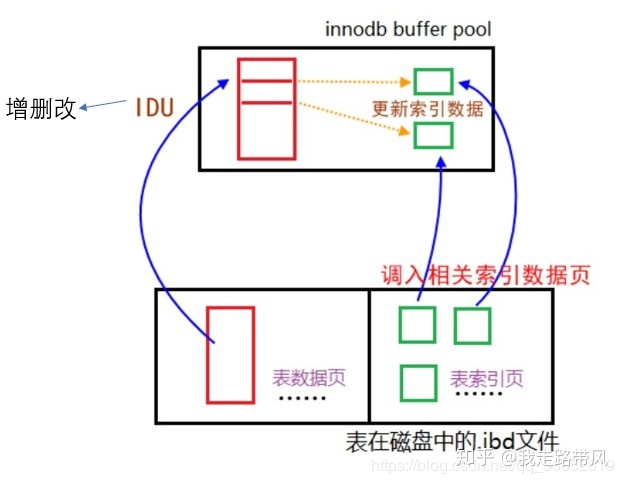
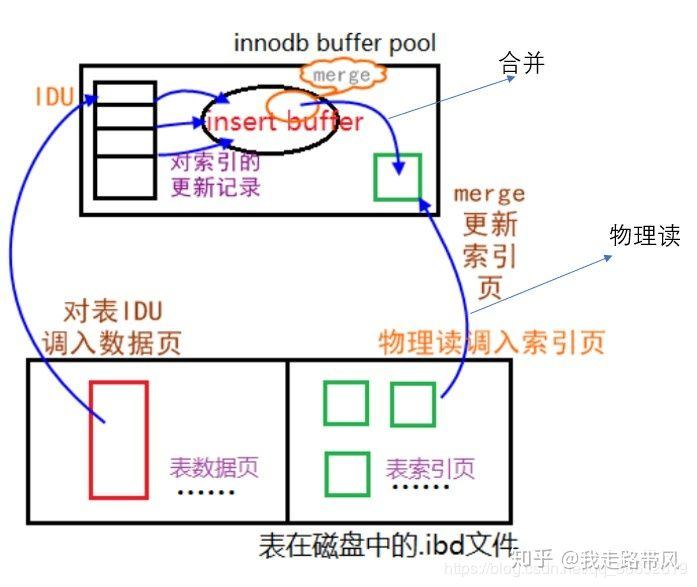

# InnoDB - Insert Buffer

Created by : Mr Dk.

2020 / 10 / 10 11:09

Nanjing, Jiangsu, China

---

## Background

在 InnoDB 存储引擎中，主键是唯一的标识符。通常，应用程序中行记录的插入顺序是按照主键递增的顺序进行插入的 (auto increment)。因此，主键是聚集索引，插入这样的一行是有序的，一般不需要磁盘的随机读取 (离散访问)，很快就能完成。然而，不可能每张表上都只有一个聚集索引，通常还会有多个 **非聚集** 的 **辅助索引 (secondary index)**。在插入操作中，数据页的存放还是按照主键顺序存放，而非聚集索引的叶子结点插入则不再是顺序存放了，这时需要离散地访问非聚集索引页 (B+ 树索引的特性决定)。有没有什么办法可以在插入操作时提高非聚集索引页的访问效率，从而提升性能呢？

## Introduction

InnoDB 存储引擎设计了 Insert Buffer，对满足以下两个条件的索引，提升了插入的性能：

- 索引是非聚集索引 (二级索引)
- 索引不是唯一 (unique) 的 - 因为判断插入记录的唯一性会发生离散读取，使 Insert Buffer 失去意义

对于非聚集索引的插入或更新，不是直接插入索引页中，而是首先判断插入的非聚集索引所在页是否在 Insert Buffer 中。如果在，则直接插入；如果不在，则先放入一个 Insert Buffer 对象中。数据库对外表现为，非聚集索引的叶子结点已经修改完毕；但是实际上并没有，而是存放在 Insert Buffer 中。之后，数据库会以一定的频率进行 Insert Buffer 和非聚集索引页的 merge 操作。这里，性能提升来源于 merge 期间，对一个索引页的多次修改操作能够合并到一次操作中。

如果没有 Insert Buffer，那么对索引页的修改是这样的 (来自 [知乎](https://www.zhihu.com/) 用户 [_我走路带风_](https://www.zhihu.com/people/yizhi-lin-yuan))：

而有了 Insert Buffer 后：

可以看到，性能提升的点在于调入内存物理页的减少。

Insert Buffer 会占用内存缓冲池的一部分。在写操作比较密集的情况下，Insert Buffer 会占用过多的内存缓冲池。这一点可以通过参数进行控制。

## Change Buffer

在 InnoDB 1.0.x 之后引入了 Change Buffer，是 Insert Buffer 的升级，使得 InnoDB 可以对 DML 操作都进行缓冲：

- `INSERT` - Insert Buffer
- `DELETE` - Delete Buffer
- `UPDATE` - Purge Buffer

适用的对象依然是 **非唯一的非聚集索引**。

## Implementation

Insert Buffer 的数据结构是一棵 B+ 树。在 MySQL 4.1 之前，每张表都有一棵 Insert Buffer B+ 树；现在，只有一棵全局的 Insert Buffer B+ 树，存放在 **共享表空间** 中 (因此使用独立表空间文件恢复表数据时，可能会导致失败，因为一些辅助索引的数据可能还在共享表空间的 Insert Buffer 中)。

B+ 树的非叶子结点用于查询，其中包含的信息有：

- Space key - 待插入记录所在表的表空间 ID
- Marker - 兼容老版本 Insert Buffer
- Offset (page number) - 页所在偏移量

当需要向某个非聚集索引页写入时 (space key + offset)，如果页不在内存缓冲池中，就构造一个这样的 search key，并插入到 Insert Buffer B+ 树的叶子结点中。另外，对于 B+ 树的叶子结点，还有几个额外的字段结构：

- Metadata
  - `IBUF_REC_OFFSET_COUNT` - 排序每个记录进入 buffer 的顺序
  - `IBUF_REC_OFFSET_TYPE`
  - `IBUF_REC_OFFSET_FLAGS`
- Record

另外，需要有一个特殊的页用来标记每个索引页的剩余可用空间，这个页的类型为 Insert Buffer Bitmap。

## Merge

Insert Buffer 的合并时机：

- 当非聚集索引页被读入缓冲池时 (检查 Insert Buffer Bitmap 确认该页是否有数据在 Insert Buffer 中)
- Insert Buffer Bitmap 追踪的非聚集索引页已经没有可用空间了，则强制将非聚集索引页调入内存并合并
- Master thread 的周期性任务，InnoDB 随机选择 Insert Buffer B+ 树中的一个表进行 merge (公平性)

---

## References

[知乎专栏 - MySQL 之 InnoDB 引擎 Change Buffer](https://zhuanlan.zhihu.com/p/63348794)

---
