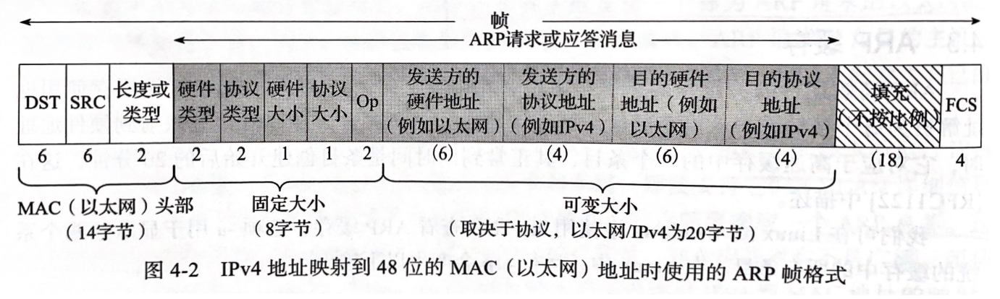

# Network - ARP

Created by : Mr Dk.

2020 / 10 / 24 👨‍💻 16:55

Nanjing, Jiangsu, China

---

## About

IP 协议的设计目标：为 **跨越不同类型物理网络** (以太网 / 无线局域网 / ...) 的分组交换提供互操作。因此，在分组最终交换到链路层时，肯定需要将网络层软件使用的 *IP 地址* 转换为底层网络硬件使用的 *物理地址*，因为帧需要通过正确的硬件地址定位到正确的网络接口。对于网络硬件来说，物理地址由 **设备制造商** 定义，并永久存储在设备中，不会改变；对于网络层软件来说，IP 地址通常从附近网络的 *地址池* 中获得，在系统启用或配置时分配。

**地址解析协议 (Address Resolution Protocol)** 是一个通用的协议，用于发现两个地址之间映射关系的过程。在设计上，它支持多种地址之间的映射，但是实际中只用于 32-bit IPv4 地址与以太网 48-bit MAC 地址之间的映射。它能够维持地址的 **动态映射** - 即随时间自动变化，不需要人为重新配置。

## 直接交付

特指 **一个广播网络内** (不需要额外路由器参与，链路层能够将消息交付到连接到它的所有网络设备) 的 ARP 发现过程。

1. 应用程序 (应用层) 要求 TCP 协议 (传输层) 建立一条到 `10.0.0.1` (网络层) 的连接
2. 发送主机需要将目标 IPv4 地址转换为对应的物理硬件地址
3. ARP 发送一个 **链路层广播**，询问 *如果你将 `10.0.0.1` 配置为你的 IPv4 地址，请向我回应你的 MAC 地址*
4. 广播域下所有设备接收到 ARP 请求，使用该 IPv4 地址的设备回复 ARP 应答 (不是广播)，包含自身的 IP 地址和 MAC 地址，同时学习 (记录) 发送请求设备的 IPv4 地址与 MAC 地址的映射供以后使用
5. ARP 应答被请求设备接收，请求方将目标 IPv4 地址与 MAC 地址的映射记录
6. 请求方使用目标 MAC 地址封装链路层帧并发送

ARP 高效运行的关键是每个主机和路由器维护的 ARP 缓存，用于为每个网络接口维护网络层地址到硬件地址的最新映射。

## ARP Frame Format

前面的白色部分为数据链路层帧的头部，包含目的 MAC 地址和源 MAC 地址 - 对于 ARP 请求来说，目的地址为 `ff:ff:ff:ff:ff:ff` (广播地址)；*长度或类型* 字段对于 ARP 帧来说固定为 `0x0806`。

*硬件类型* 和 *协议类型* 分别指代要映射的两类地址的类型，比如 IP 地址 ⇄ MAC 地址；*硬件大小* 和 *协议大小* 分别指代两类地址的字节长度。`Op` 字段指示了帧的操作类型：

* ARP 请求
* ARP 应答
* RARP 请求
* RARP 应答

之后四个字段即为四个映射地址：

* 发送方硬件地址 (MAC 地址)
* 发送方协议地址 (IP 地址)
* 目的硬件地址 (MAC 地址)
* 目的协议地址 (IP 地址)

ARP 帧将会被填充封装为最小以太网帧并发送。如果 ARP 缓存中的条目有效，那么 ARP 交换过程不会发生。

## ARP Proxy

ARP 代理通过发出 ARP 相应，让 ARP 请求的发送者认为代理就是目的主机，但实际上目的主机可能在其它地方 (或根本不存在)。

> 在历史上用于让两个物理网络互相隐蔽对方，在两个网络相连的路由器上运行 ARP 代理。

## Free ARP

一台主机发送寻找 **自身** MAC 地址的 ARP 请求，即目标 IP 地址填的是自己的 IP 地址。目标：

1. 使主机能够确定是否有另一台主机配置了相同的 IPv4 地址
2. 若当前主机改变了自身的 MAC 地址，发出 ARP 请求的广播后，缓存原条目的所有主机都将更新条目

## ACD

*RFC 5227* 规定了 *IPv4 的地址冲突检测 (ACD)*，其中定义了：

* ARP 探测分组 - 查看 IPv4 地址是否被广播域下其它系统使用，发送方 IP 地址被设置为 0 避免缓存污染
* ARP 通告分组 - 通告发送方使用候选 IPv4 地址的意图 (宣誓主权)，发送方 IP 地址和目的 IP 地址被填为候选 IP 地址

当接口被唤醒或启用时，先发送 ARP 探测分组。确定没有其它设备冲突使用候选 IP 地址后，开始每隔两秒向广播域中发送 ARP 通告分组，表示自身正在使用这个 IP 地址。ACD 是一个 **持续** 的过程。

## Attack

最直接的 ARP 攻击方式是假扮一个主机对 ARP 请求做出应答：

* 如果受害主机不存在，就很难被发现
* 如果受害主机存在，比较容易被发现，因为每个 ARP 请求对应了多个应答

ARP 的静态条目可用于避免额外的 ARP 请求 / 应答，设计的本意是对重要的主机使用静态条目以保证安全。但大多数的 ARP 实现都会使用 ARP 应答提供的条目覆盖静态条目缓存，从而容易被欺骗。

---

