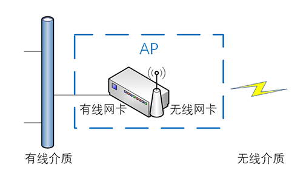
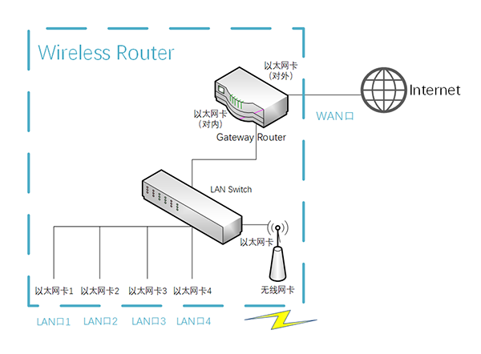

# Device - Wireless AP 无线接入点

Created by : Mr Dk.

2018 / 11 / 18 00:27

Nanjing, Jiangsu, China

---

### About

无线网络接入点（Access Point, AP），俗称 _热点（Hotspot）_

### Function

* 服务模式
  * 使若干个无线设备能够接入有线网络
* 客户模式
  * 与其它 _AP_ 进行连接，延展网络的覆盖范围

### Type

* 纯接入点设备 - _AP_
  * 只负责无线设备的接入
  * 通常作为无线局域网的扩展使用
* 路由交换接入一体设备 - _无线路由器_
  * 一般是无线局域网的 __核心__

### Architecture

可将 _AP_ 视为一个无线交换机

一个传统意义上的交换机为两个有线的网络传输介质交换数据

_AP_ 为有线传输介质和无线传输介质交换数据

使连接在有线传输介质上的设备和无线传输介质上的设备处于同一子网中

### Wireless Router 无线路由器

无线路由器可以理解为带有路由、交换、接入三种功能的一体化设备

* 内部路由器负责将内部局域网通过 _WAN_ 口与外网相连
* 内部交换机负责交换内部局域网的数据
* 设备可通过若干个 _LAN_ 口以有线的方式接入局域网
* 设备也可以通过 _AP_ 以无线的方式接入局域网
* 不管有线接入还是无线接入，设备都处于同一个子网中

---

### Summary

在了解了集线器、交换机、路由器、_AP_ 等几款网络设备的原理后

终于弄清楚了

交换机与路由器的区别

_AP_ 与无线路由器的区别

最近在读无线入侵检测系统内网检测的相关论文

反复提到了相关概念

因而对这些概念进行了深入的学习

---

