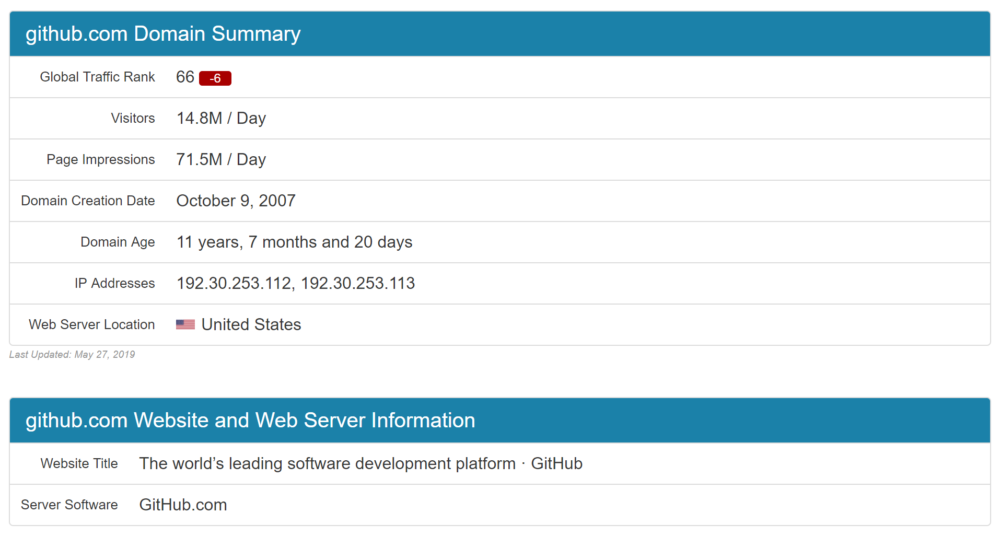
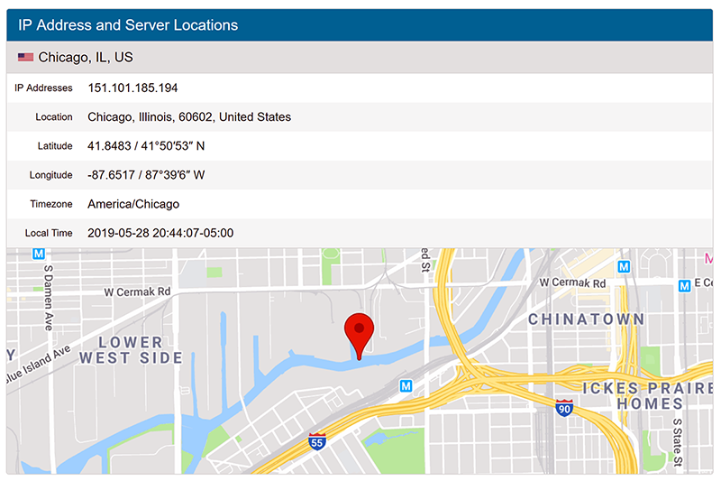
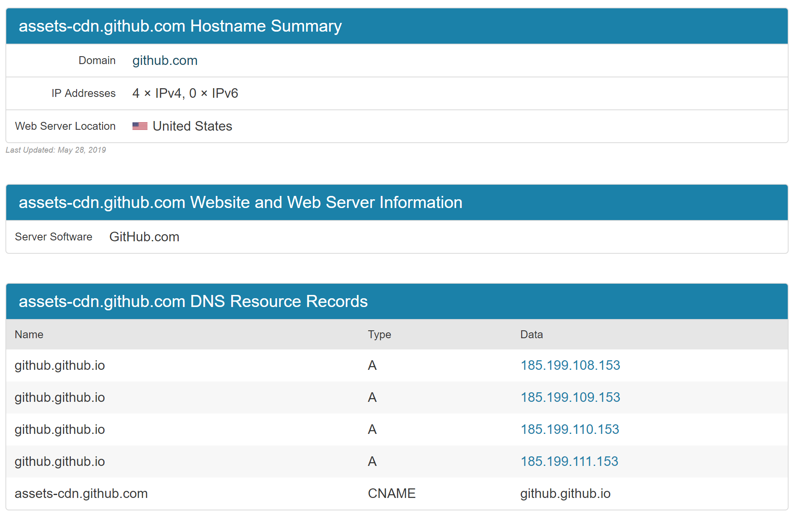

# Network - GitHub Accelerating

Created by : Mr Dk.

2019 / 05 / 29 10:07

Nanjing, Jiangsu, China

---

## About

国内访问 GitHub 龟速 🐢

但由于 GitHub 没有被 GTW 封禁

梯子会将 GitHub 的域名过滤

不会通过国外的服务器访问

需要修改本机的 DNS 缓存

当访问 GitHub 时

直接使用本机的 DNS 映射

连接到对应的 IP 地址

从而绕过国内的 DNS 解析服务器

> 相当于手动解析 GitHub 的域名

---

## GitHub IP Address

```
github.com
github.global.ssl.fastly.net
assets-cdn.github.com
```

在 <https://www.ipaddress.com/> 中，分别查询这三个域名的 IP 地址：

`github.com`



`github.global.ssl.fastly.net`



`assets-cdn.github.com`



---

## Add DNS Record

### Windows

打开 `C:\Windows\System32\drivers\etc\hosts` （管理员权限）

在最后加上刚才查询到的 IP 地址

注意事项：

1. `#` 用于注释
2. 每条记录单独一行
3. IP 地址在第一列，域名在第二列

```
# Copyright (c) 1993-2009 Microsoft Corp.
#
# This is a sample HOSTS file used by Microsoft TCP/IP for Windows.
#
# This file contains the mappings of IP addresses to host names. Each
# entry should be kept on an individual line. The IP address should
# be placed in the first column followed by the corresponding host name.
# The IP address and the host name should be separated by at least one
# space.
#
# Additionally, comments (such as these) may be inserted on individual
# lines or following the machine name denoted by a '#' symbol.
#
# For example:
#
#      102.54.94.97     rhino.acme.com          # source server
#       38.25.63.10     x.acme.com              # x client host

# localhost name resolution is handled within DNS itself.
#	127.0.0.1       localhost
#	::1             localhost

# Github
151.101.185.194 github.global.ssl.fastly.net
192.30.253.112 github.com
192.30.253.113 github.com
185.199.108.153 assets-cdn.github.com
185.199.109.153 assets-cdn.github.com
185.199.110.153 assets-cdn.github.com
185.199.111.153 assets-cdn.github.com
```

添加完成后，保存文件，刷新 DNS 缓存使之生效：

```
> ipconfig /flushdns
```

---

## Summary

从三月份开始到现在，快三个月了

每次登上 GitHub 都有一些人的头像刷新不出来

一直觉着很奇怪 凭啥在别人的电脑上都能显示出来呢？ 😑

今天突然想起来 💡 以前为了加速 GitHub 配置过 DNS 记录

其中有很多条记录已经过期或无效了

我的电脑直接根据这些记录访问那些过期的 IP 地址

自然刷新不出头像

今天重新查询了 IP 地址并更新了记录

所有 Follower 和 Following 的头像全部都能正常显示了 🎉

---

