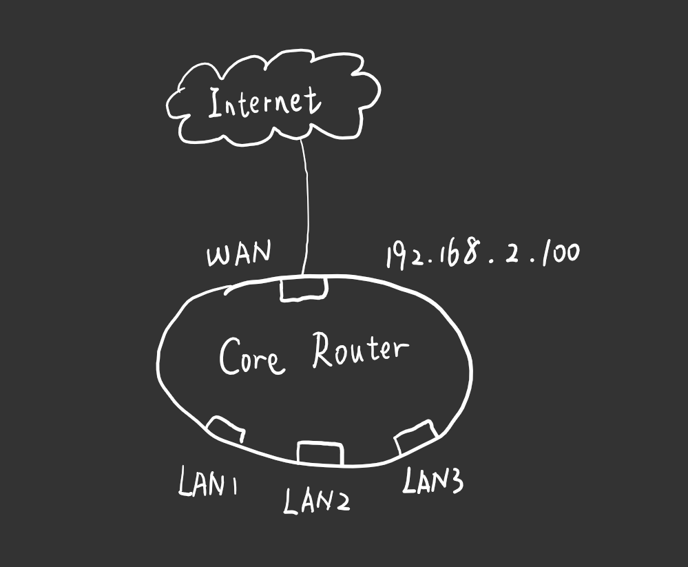
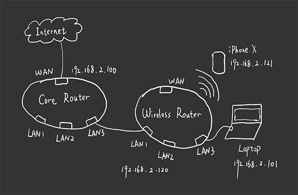
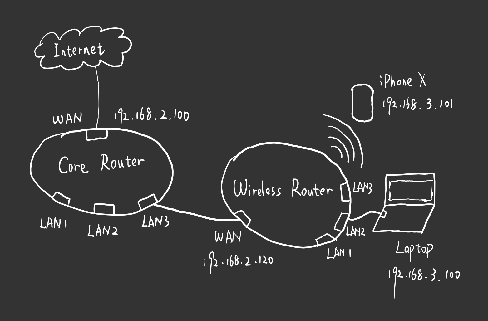
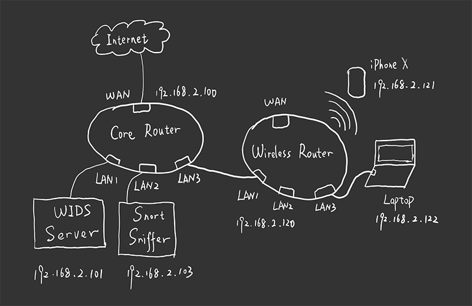

# Device - LAN Construction

Created by : Mr Dk.

2018 / 12 / 20 20:40

Nanjing, Jiangsu, China

---

## Infrastructure

一台 __无线路由器__ 作为局域网的网关与核心

* _WAN_ 口通过 _PPPoE_ 拨号连接到 _Internet_
* 无线功能被关闭
* 所有的 _LAN_ 口可用于局域网的组建
* 网段：`192.168.2.0` & `255.255.255.0`
* 路由器本身的地址/网关地址 - `192.168.2.100`

## 第一种接入方式

另一台无线路由器

* 将 _LAN_ 口连入 _Laptop_，进入管理界面
* 将 _LAN_ 侧的 _IP_ 地址配置为与局域网处于同一网段 `192.168.2.120`
* 关闭 _DHCP_ 服务器，_IP_ 地址由局域网核心统一分配
* 将无线路由器的 _LAN_ 口与核心路由器的 _LAN_ 口连接，接入局域网
* 无线终端通过无线路由器接入局域网
* 有线终端通过剩余的任意 _LAN_ 口也可以接入局域网

## 第二种接入方式

接入方式与上一种相同

* 开启路由器内置的 _AP_ 模式 - _LAN_ 口桥接

## 第三种接入方式

将核心路由器的 _LAN_ 口与无线路由器的 _WAN_ 口相连

- [x] 接入无线路由器的设备与核心局域网不在同一网段中，_ping_ 不通核心局域网的设备
- [ ] 依旧可以接入互联网 - ？

## 数据包嗅探位置

问题：

* _Snort Sniffer_ `192.168.2.103` 可以嗅探到的设备：
  * `192.168.2.100`（Gateway）
  * `192.168.2.101`（WIDS Server）
  * `192.168.2.121`（接入 _AP_ 的无线设备）
  * `192.168.2.122`（接入 _AP_ 的有线设备）
* 但是无法嗅探到 _AP_ 本身 `192.168.2.120` 
  * 如果手动从 _WIDS Server_ `192.168.2.101` 上 _ping_ _AP_ `192.168.2.120`，可以 _ping_ 通
  * 手动发送的 _ICMP ping_ 报文会被 _Snort Sniffer_ 嗅探到

---

## Summary

迷 :cold_sweat: :cold_sweat: :cold_sweat:

如果使用被动嗅探

将无法察觉接入的 _AP_ 本身

但是如果使用主动嗅探

攻击者又可以通过不回应设备发现的方式避免被嗅探

这该咋搞搞。。。。。。

---

