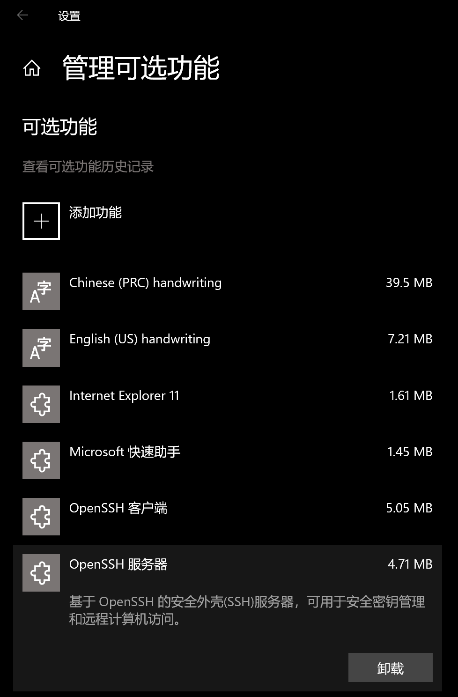
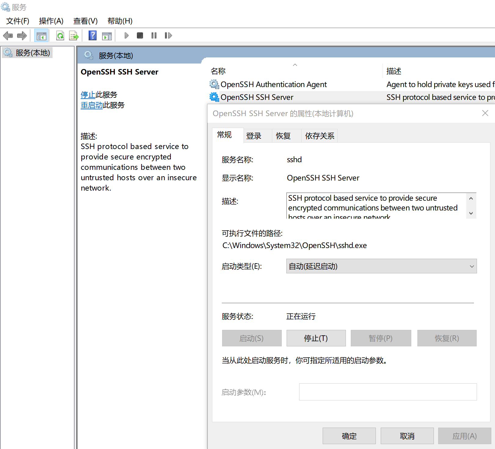

# Network - SCP

Created by : Mr Dk.

2019 / 06 / 14 13:42

Nanjing, Jiangsu, China

---

## About

**Secure Copy Protocol (SCP)** 是一款用于在本地与远程主机之间安全传输文件的协议，基于 Secure Shell (SSH) 协议。其本身既代表一个协议，又代表实现该协议的程序。OpenSSH 中包含了 SCP 的实现

> According to OpenSSH developers in April 2019 the scp protocol is outdated, inflexible and not readily fixed.

---

## Usage

```
scp [-346BCpqrv] [-c cipher] [-F ssh_config] [-i identity_file]
    [-l limit] [-o ssh_option] [-P port] [-S program] source ... target
```

简易写法：

```
scp [options] file_source file_target
```

其中 `source` 和 `target` 的格式：

```
[user@]host:file1 file2 ...
```

如果在 SSH 的 `config` 中配置了远程用户：

```
Host hostwind
    HostName 23.254.225.164
    User root
    IdentityFile ~/.ssh/id_rsa
```

那么可以直接使用 Host 作为 source 或者 target：

```
scp [] host1:... host2:...
```

若拷贝目录，则加入 `-r`。

---

## Theory

想要使用 SCP，需要：

* 远程服务器上运行 SSH 服务器
* 本地机器上运行 SSH 客户端

换句话说，由于 SCP 基于 SSH。只有本地机器能够通过 SSH 连接到远程机器，才能使用 SCP

### Linux Configuration

一般来说，Linux 上已经自带了 SSH 客户端，可通过如下命令测试：

```bash
$ ssh
usage: ssh [-46AaCfGgKkMNnqsTtVvXxYy] [-b bind_address] [-c cipher_spec]
           [-D [bind_address:]port] [-E log_file] [-e escape_char]
           [-F configfile] [-I pkcs11] [-i identity_file]
           [-J [user@]host[:port]] [-L address] [-l login_name] [-m mac_spec]
           [-O ctl_cmd] [-o option] [-p port] [-Q query_option] [-R address]
           [-S ctl_path] [-W host:port] [-w local_tun[:remote_tun]]
           [user@]hostname [command]
```

如果没有安装 SSH 服务器的话：

* 安装 `openssh-server`
* 启动 sshd 服务

### Windows Configuration

Windows 10 的较新版本已经内置了 OpenSSH，但是默认只安装 OpenSSH Client。在 Win 10 - `设置 - 应用 - 管理可选功能 - 添加功能` 中，找到 OpenSSH 服务器并安装：



在系统 `服务` 中，找到 `OpenSSH SSH Server`，并启动该服务：



---

## Summary

以上配置完成后：

* Linux ⇔ Linux
* Windows ⇔ Windows
* Windows ⇔ Linux

应当是全部可以实现互相 SSH 以及 SCP 了。

接下来就是一些小问题，比如不同 OS 上路径表示方式的差异。Linux 上可以用 `~/dir/...` 来表示当前用户主目录；而在 Windows 上不识别 `~`，所以使用 `./dir/...` 就可以了。

SCP 可以轻松实现能够互相通过 SSH 连接的设备之间的文件传输。所以，可以借助远程服务器下载外网资源，再通过 SCP 传回本地；或者借助高速的局域网连接，实现同一局域网内设备之间的文件传递。比 U 盘来的高效多了...... 🤗

---

