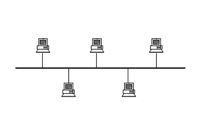
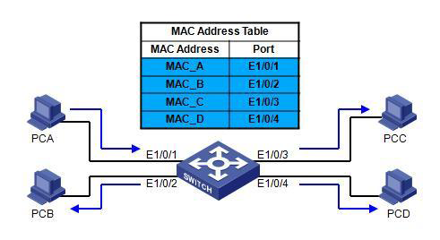

# Device - Switch 交换机

Created by : Mr Dk.

2018 / 11 / 17 20:01

Nanjing, Jiangsu, China

---

### Origin

__局域网__（__L__ocal __A__rea __N__etwork, __LAN__），又称 __内网__。指覆盖局部区域（如办公室或楼层）的计算机网络。

局域网的 __网络拓扑结构__ 主要分为总线形、环形与星形三种；__网络传输介质__ 主要采用双绞线、同轴电缆、光纤。

__局域网介质访问控制协议__（Medium Access Control, MAC）是针对多结点争用共享的网络传输介质而制定的控制协议，其核心是 __介质访问控制方法__，工作在 __数据链路层__。

* 环形拓扑结构
  * 通常采用 _令牌环协议（Token Ring）_
* 总线形拓扑结构
  * 通常采用 _令牌总线协议（Token Bus）_
  * 或 _CSMA/CD（Carrier Sense Multiple Access with Collision Detection）_ - _IEEE 802.3 标准_

应用了 _CSMA/CD_ 协议的 _以太网（Ethernet）_ 技术已在局域网应用中占据了绝对的优势。

### Theory

在总线形拓扑结构中，各结点共享的网络传输介质被认为是 __总线__。

所有连接到同一条总线的设备处在一个 _网段（Network Segment）_ 内。

一个 _网段_ 就是一个 __冲突域__ （Collision Domain）

* 整个网段上连接的所有设备都应该检测到介质访问冲突
* 当介质访问冲突发生时，应有相应的退避方法

### Development

随着局域网规模的扩大，若所有结点共享同一个网络传输介质，网络效率急剧下降。

解决思路： __共享介质方式__ &rarr; __交换方式__

### Switch - 交换机

大部分工作在 __数据链路层__，因此又被称为 __二层交换机（Layer 2 Switch）__。

交换机有多个端口，可以同时在多个端口上对网段或设备建立 __并发连接__。

交换机在缓存中维护一个端口号与 _MAC_ 地址的映射表，通过一套硬件完成数据转发。

由于多个端口可以并发连接，设备的冲突域由 __整个网段__ 缩小为 __两个端口__。

交换技术：

* 端口交换 
  * 实际上是在 _物理层_ 上完成的，没有改变共享传输介质的特点，不是真正意义的交换
* 信元交换
  * 采用固定长度的信元进行交换，便于用硬件实现，成本昂贵
* 帧交换
  * 目前应用最广的交换技术
  * 分类
    * 直接交换 - 只要接收并检测到目的地址字段，就直接将帧转发，不做校验 - 追求效率
    * 存储转发交换 - 完整接收帧后，进行差错检测；若校验正确，再转发 - 追求安全性

### Mode

* 学习（Learning）
  * 收到来自某端口的请求数据包，在映射表中加入该数据包中的源 _MAC_ 地址与端口的映射关系
* 洪泛（flooding）
  * 目标 _MAC_ 地址不在映射表中，则向除了源端口以外的所有端口转发数据包
  * 收到来自对应端口的应答数据包，在映射表中加入该数据包中源 _MAC_ 地址与端口的映射关系
  * 如果收到广播包，则向所有端口广播
* 转发（Forwarding）
  * 若目标 _MAC_ 地址在映射表中，则直接向映射端口转发数据包
* 过滤（Filtering）
  * 若目标 _MAC_ 地址对应的端口与来源端口一致，则不处理该数据包
* 老化（Aging）
  * 映射表中的每一条目采用时间戳记录最后一次访问时间，早于阈值的记录将被清除

### VLAN

虚拟局域网建立在交换机上，以 __软件__ 方式来实现逻辑工作组的划分与管理。

同一逻辑组的成员可以属于不同网段，也可以连接在不同的互联交换机上。

### More

能够处理第三层网络协议的三层交换机

四层交换机

七层交换机

......

---

### Summary

一直弄不清楚交换机和路由器的概念

今天好好学习一下

---

