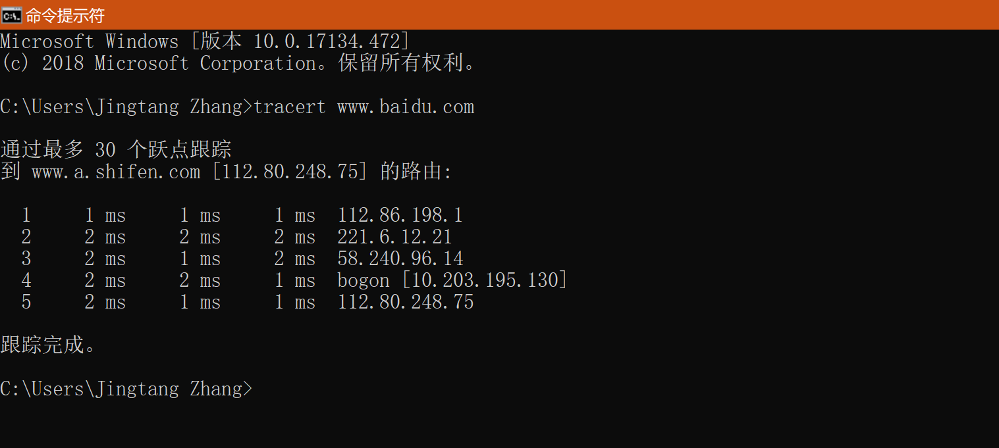
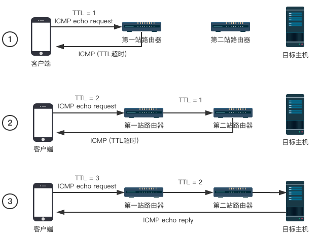
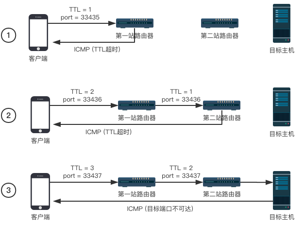

# Network - Traceroute

Created by : Mr Dk.

2018 / 12 / 26 11:24

Nanjing, Jiangsu, China

---

## About

*Traceroute* 是用来检测从 **发出数据包的主机** 到 **目标主机** 之间所经过的网关数量的工具。在 *Windows* 下叫做 *tracert*，可以定位从发送主机到目标主机之间的所有路由器。主要原理：操纵数据包中的 `TTL` 字段进行步步试探。

*Windows* 下的 *tracert*：

* 当前主机 IP 地址为 `[153.3.101.244]`，尝试对 *Baidu* 进行 traceroute
* 默认参数最大 TTL 为 30
* 默认参数对每个 TTL 发出 3 个探测包

## TTL

*TTL (Time-To-Live)* 是 IP 数据包中的一个字段，指定了数据包最多能经过几次路由器：

* IP 数据包每经过一次路由器，`TTL` 的值就会被减掉 `1`
* `TTL` 被减至 `0` 时，该数据包将被路由器丢弃，不再继续转发，同时路由器向源地址发送一个超时报文

## Theory

*Traceroute* 的原理是，向目的地址发送 `TTL` 从 `1` 开始逐渐增大的数据包：

* `TTL == 1` 时，第一跳路由器将会返回超时报文
* `TTL == 2` 时，第二跳路由器将会返回超时报文
* ......
* 直到 `TTL` 的值能够到达目的地址，目的地址返回一个确认信号（可能是不同形式的）
* 或者到达最大 `TTL` 限制，也没有到达目的地址

## Implementation Based on ICMP

发送 ICMP echo request，实际上就是 *ping* 命令。如果 TTL 超时，将会返回 `ICMP-TTL-Exceeded` 报文；如果到达目的地址，将会返回 `ICMP echo reply` 报文，暗示 traceroute 结束。

可能出现的问题：

* 有些服务器或防火墙会因为安全原因不回复 `ICMP echo reply`
* 有些路由器会 **安静** 地丢掉 TTL 减小到 0 的数据包，即不返回 TTL 超时报文

## Implementation Based on UDP

发送 UDP 数据包，使用一个大于 `30000` 的端口号。如果 TTL 超时，将返回 `ICMP-TTL-Exceeded`；如果到达目的地址，由于服务器通常不会使用大于 `30000` 的端口号，将返回 `ICMP-port-unreachable`，暗示 traceroute 结束。

可能出现的问题：

* UDP 由于经常被用来做网络攻击 (无需连接，没有状态约束)，因此 ISP 出于安全考虑会采用端口白名单，只有在白名单端口中的数据包才能通过
* 服务器可能出于安全原因不提供 UDP 服务
* 可能被防火墙过滤

## References

图片来自 [简书](https://www.jianshu.com/p/75a5822d0eec)。

---

