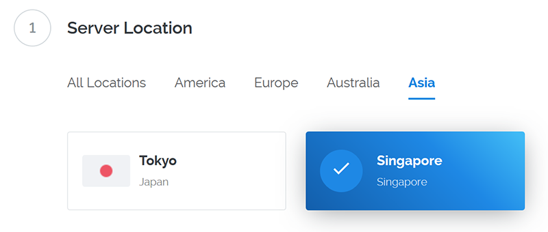
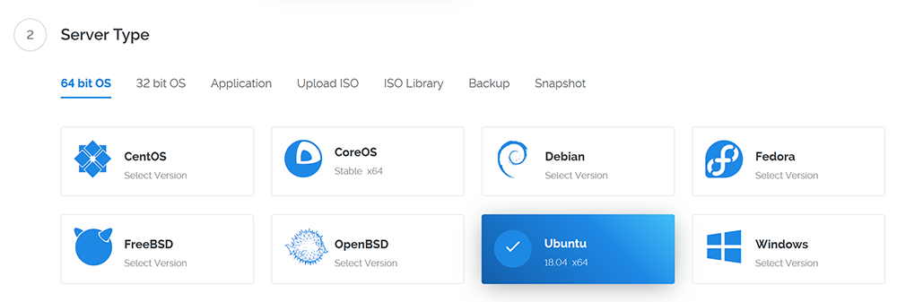
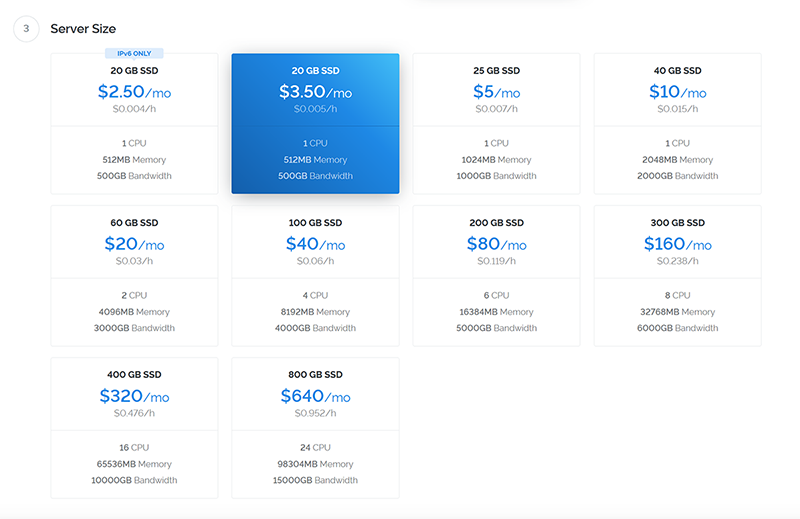
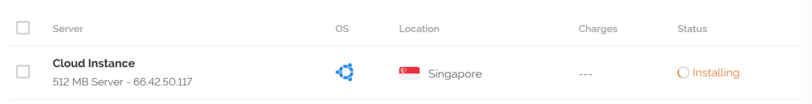
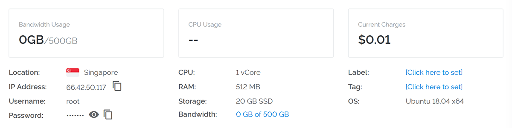

# Network - Vultr VPS Configuration

Created by : Mr Dk.

2019 / 01 / 29 18:08

Ningbo, Zhejiang, China

---

### Register

略

### Deploy New Instance

选择 _Vultr Cloud Compute (VC2)_ 类型

### Server Location

* 为了连接延迟较低，尽可能选择亚洲的服务器
* 日本的 _IP_ 地址被封的可能性比较大，所以选用新加坡的



### Server Type

为了熟悉起见我选择了 _Ubuntu 18.04 x64_



### Server Size

用于科学上网，不用特别高的配置

选择屌丝配置已经足够（主要是穷 :sob:）



### Others

其余配置一切默认

部署、安装实例



### Connection

部署完成后，通过如下配置使用 _SSH_ 连接到 _VPS_



### Shadowsocks

#### Installation

```bash
$ apt update
$ apt install python-pip python-gevent python-m2crypto
$ pip install --upgrade setuptools
$ pip install shadowsocks
```

#### Configuration

```bash
$ mkdir /etc/shadowsocks
$ vim /etc/shadowsocks/config.json
```

```json
{
    "server":"IP Address",
    "server_port":443,
    "password":"Password",
    "timeout":600,
    "method":"aes-256-cfb",
    "fast_open": false
}
```

#### Modification

```bash
$ vim /usr/local/lib/python2.7/dist-packages/shadowsocks/crypto/openssl.py
```

替换 `libcrypto.EVP_CIPHER_CTX_cleanup` 为 `libcrypto.EVP_CIPHER_CTX_reset`

* 这是 _Ubuntu 18.04_ 中才有的毛病
* 替换位置在第 `52` 行和第 `111` 行

#### Start Up

```bash
$ ssserver -c /etc/shadowsocks/config.json -d start
```

#### Stop

```bash
$ ssserver -c /etc/shadowsocks/config.json -d stop
```

---

### Summary

记录一下

下次自己部署 _VPS_ 就不用百度了

---

