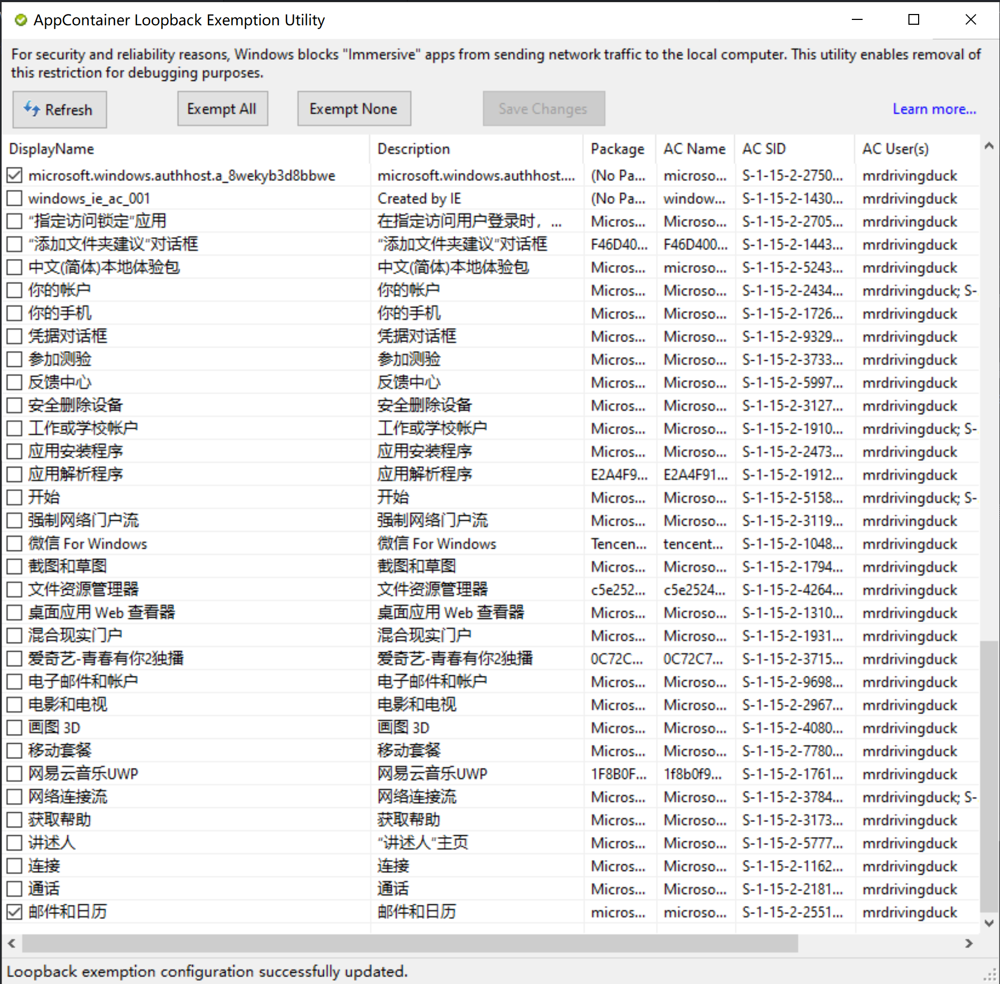
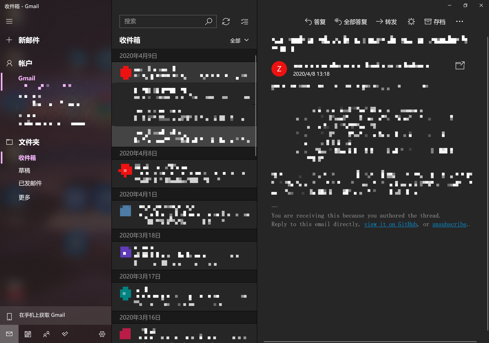

# Network - Windows 10 Mail APP

Created by : Mr Dk.

2020 / 04 / 13 13:49

Ningbo, Zhejiang, China

---

一直觉得 Windows 10 自带的邮件 APP 颜值挺高的，想用。无奈它好像支持不了 *GMail*，所以一直用的是 *网易邮箱大师*。最近突然寻思，让邮件 APP 走代理是不是就可以用 *GMail* 了？在知乎上看到一个靠谱答案 - [Windows 10 的邮件怎么添加并同步 Gmail？](https://www.zhihu.com/question/53079836/answer/224262489)。

原来，Windows 10 中的 APP 全部运行在 sandbox 的虚拟环境中，在网络上与 `localhost` 是隔离的，因此没有办法使用本地代理。有一个 [小型工具软件](../resource/EnableLoopback.exe) 能够配置 Windows APP 访问本地 loopback，从而能够访问代理。

在其中，对两个选项打钩：

- [x] `microsoft.windoes.authhost.a` (不知道干啥的)
- [x] `邮件和日历` APP

然后点击 `Save Changes` 按钮即可。再到 Win10 Mail APP 中配置 *GMail*，就能通过代理成功完成配置：

---

