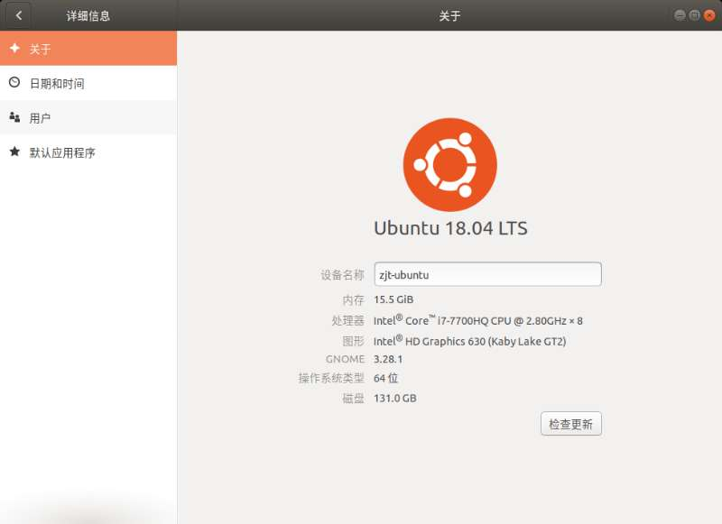
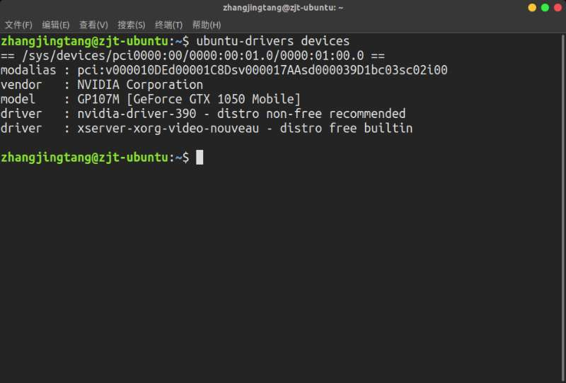
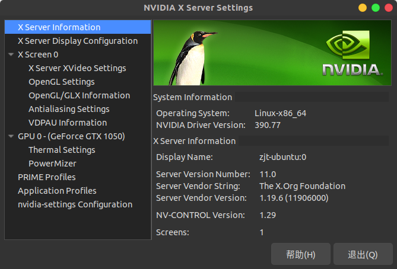
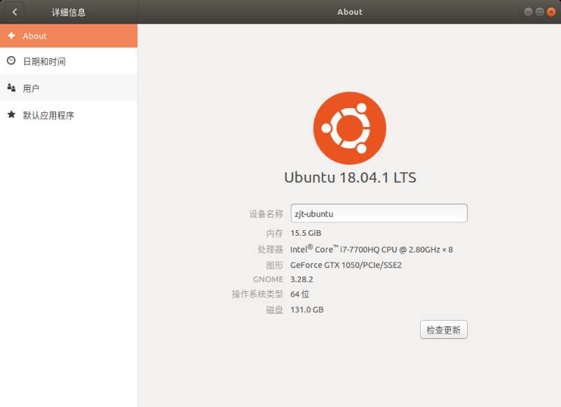

# Linux - Ubuntu Installation on Lenovo R720

Created by : Mr Dk.

2019 / 01 / 17 15:45

Nanjing, Jiangsu, China

---

## GPU Problem

系统安装完毕后 重启

结果整个界面卡死

应该是显卡冲突的问题

进入系统后 发现 *Ubuntu* 使用了集成显卡

没有使用 *NVIDIA*



因此需要安装 *NVIDIA* 的附加驱动

```bash
$ ubuntu-drivers devices
```



```bash
$ sudo ubuntu-drivers autoinstall
```

之后重启电脑，查看效果





---

## Wireless Interface Problem

在 *Terminal* 中输入：

```bash
$ rfkill list all
```

*Lenovo R720* 的无线网卡被硬件关闭了

因此在操作系统中无法通过软件打开

通过列一个黑名单，将硬件关闭屏蔽

```bash
$ sudo touch /etc/modprobe.d/ideapad.conf
$ sudo gedit /etc/modprobe.d/ideapad.conf 
```

```
blacklist ideapad_laptop
```

保存文件并关闭，移除设备：

```bash
$ sudo modprobe -r ideapad_laptop 
```

重启电脑

---

## Summary

坑真多 不过现在终于成功装上了双系统 :smile:

第一次在高性能的机器上裸装 *Linux* 了

不用再受虚拟机的资源限制了

---

