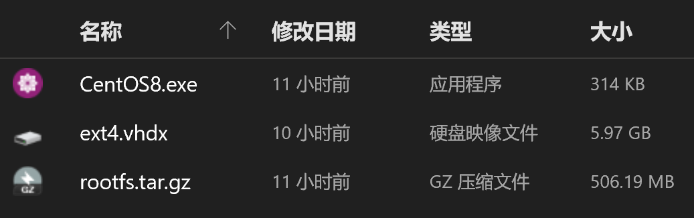

# WSL: CentOS 8

Created by : Mr Dk.

2021 / 09 / 09 10:46

Ningbo, Zhejiang, China

---

## Background

最近两天参加 *PolarDB* [开源](https://github.com/alibaba/PolarDB-for-PostgreSQL) 相关的开发，需要配置一个 CentOS 的环境 (果然，离开公司就没有 *Alibaba Linux* 可以用了)。手边只有一台 Surface 的我当然还是选择 WSL2 啦~

发现 CentOS 系列在 *Microsoft Store* 中并没有可以下载的 distribution。经过了解，网上说需要付费 (我咋连付费的都没发现)，要么就用开源版本手动安装。所以记录一次手动安装的过程。

## Download and Install

首先可以在 GitHub 上 [CentOS-WSL](https://github.com/mishamosher/CentOS-WSL) 项目的 [release](https://github.com/mishamosher/CentOS-WSL/releases) 中下载压缩包并解压。



双击 `CentOS8.exe` 即可开始安装并注册到 WSL 中。安装完毕后，再次双击 `CentOS8.exe`，就能以 root 用户登录进入系统。

## Uninstall

```powershell
.\CentOS8.exe clean
```

## Add New User

一直用 root 用户进行操作终究是不太好。最好是能够创建一个可登录的个人用户，偶尔 `sudo` 才对。创建新用户并设置密码：

```bash
useradd mrdrivingduck
passwd mrdrivingduck
```

后续发现新用户执行 `sudo` 命令时会有报错：

```
mrdrivingduck not in the sudoers file. This incident will be reported.
```

因此，还需要把新创建的用户加入到 `/etc/sudoers` 文件中。这个文件是只读的，所以暂时将这个文件的权限设置为可写，写完以后再重置回去：

```bash
sudo chmod u+w /etc/sudoers
sudo chmod u-w /etc/sudoers
```

在上述两条命令的中间，`/etc/sudoers` 是可以被编辑的。在最后加上下面的任意一行：

```
mrdrivingduck ALL=(ALL) ALL
%mrdrivingduck ALL=(ALL) ALL
mrdrivingduck ALL=(ALL) NOPASSWD: ALL
%mrdrivingduck ALL=(ALL) NOPASSWD: ALL
```

`mrdrivingduck` 和 `%mrdrivingduck` 的区别是，是用户还是用户组；`NOPASSWD` 的含义为，执行 sudo 命令时是否需要输入密码。

接下来，可以把 CentOS 的默认登录用户直接设置为新用户：

```powershell
.\CentOS8.exe config --default-user mrdrivingduck
```

通过 WSL 命令也可以看到，目前两个 distribution 都启动了：

```powershell
PS C:\Users\mrdrivingduck> wsl -l -v
  NAME            STATE           VERSION
* Ubuntu-20.04    Running         2
  CentOS8         Running         2
```

## Migration

很尴尬的一件事，刚才的 CentOS8 的文件夹解压在桌面了。想把它挪到 C 盘的某个位置去。所以先让 WSL 停止：

```powershell
wsl --shutdown CentOS8
```

接下来，直接移动文件肯定是不对的。因为 WSL 并不知道虚拟机的新位置。根据 stackoverflow 上的一个回答，发现 GitHub 上有一个非官方的迁移工具 [LxRunOffline](https://github.com/DDoSolitary/LxRunOffline)。使用 Windows 下的软件包管理工具 [Chocolatey](https://chocolatey.org/) 安装后，直接使用以下命令就可以无缝完成迁移，体验非常不错：

```powershell
lxrunoffline move -n CentOS8 -d <dest_folder>
```

其中 `CentOS8` 可以替换为任意 distribution 的名称。

---

## References

[ZhiHu - 在 Windows 10 上使用 WSL 安装 CentOS](https://zhuanlan.zhihu.com/p/272735470)

[CSDN - 解决 Linux 下 sudo 更改文件权限报错](https://blog.csdn.net/sinat_36118270/article/details/62899093)

[stackoverflow - Where are the files inside wsl2 physically stored?](https://stackoverflow.com/questions/64185560/where-are-the-files-inside-wsl2-physically-stored)

[博客园 - WSL2 Linux 设置默认用户](https://www.cnblogs.com/microestc/articles/13042072.html)

