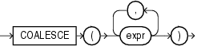

# PL/SQL - COALESCE

Created by : Mr Dk.

2020 / 01 / 07 15:59

Nanjing, Jiangsu, China

---

## COALESCE

### Syntax



返回表达式 list 中第一个非空表达式 (必须至少有两个表达式)

如果所有的表达式都为 NULL，那么函数返回 NULL

使用 __short-circuit evaluation__ 的原则

> 短路求值，比如在 `&&` 或 `||` 已经能够判断结果时就结束

### Example

是 `NVL` 函数的一般化

```plsql
SELECT product_id, list_price, min_price,
       COALESCE(0.9*list_price, min_price, 5) "Sale"
  FROM product_information
  WHERE supplier_id = 102050
  ORDER BY product_id;

PRODUCT_ID LIST_PRICE  MIN_PRICE       Sale
---------- ---------- ---------- ----------
      1769         48                  43.2
      1770                    73         73
      2378        305        247      274.5
      2382        850        731        765
      3355                                5
```

---

## References

https://docs.oracle.com/en/database/oracle/oracle-database/19/sqlrf/COALESCE.html#GUID-3F9007A7-C0CA-4707-9CBA-1DBF2CDE0C87

---

