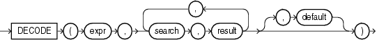

# PL/SQL - DECODE

Created by : Mr Dk.

2020 / 01 / 07 16:06

Nanjing, Jiangsu, China

---

## DECODE

### Syntax



`DECODE` 会将 `expr` 依次与 `search` 进行比较

如果相等，就返回对应的 `result`

如果与所有 `search` 都不相等，则返回 `default`

* 如果 `default` 缺省，那么就返回 NULL

在逻辑上，与高级语言的 `switch` `case` `default` 相同

### Example

```plsql
SELECT product_id,
       DECODE (warehouse_id, 1, 'Southlake', 
                             2, 'San Francisco', 
                             3, 'New Jersey', 
                             4, 'Seattle',
                                'Non domestic') "Location" 
  FROM inventories
  WHERE product_id < 1775
  ORDER BY product_id, "Location";
```

---

## References

https://docs.oracle.com/en/database/oracle/oracle-database/19/sqlrf/DECODE.html#GUID-39341D91-3442-4730-BD34-D3CF5D4701CE

---

