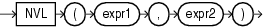
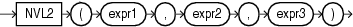

# PL/SQL - NVL/NVL2

Created by : Mr Dk.

2020 / 01 / 07 15:38

Nanjing, Jiangsu, China

---

## NVL

### Syntax



`NVL` 可以将查询中的 NULL 替换为字符串

* 如果 `expr1` 为空，则 `NVL` 返回 `expr2`
* 如果 `expr1` 不为空，则 `NVL` 返回 `expr1`

`expr1` 和 `expr2` 可以是任何数据类型

如果它们的数据类型不同，Oracle 数据库将会隐式转换

如果无法隐式转换，则会返回错误

### Example

```plsql
SELECT last_name, NVL(TO_CHAR(commission_pct), 'Not Applicable') commission
  FROM employees
  WHERE last_name LIKE 'B%'
  ORDER BY last_name;
 
LAST_NAME                 COMMISSION
------------------------- ----------------------------------------
Baer                      Not Applicable
Baida                     Not Applicable
Banda                     .1
Bates                     .15
Bell                      Not Applicable
Bernstein                 .25
Bissot                    Not Applicable
Bloom                     .2
Bull                      Not Applicable
```

---

## NVL2

### Syntax



可以根据特定表达式为 NULL 或非 NULL，决定查询返回的值

* 如果 `expr1` 非空，则返回 `expr2`
* 如果 `expr1` 为空，则返回 `expr3`

`expr1` 可以是任意类型

`expr2` 和 `expr3` 可以是除了 `LONG` 以外的任意类型

且如果数据类型不相同，也会进行隐式数据类型转换

### Example

```plsql
SELECT last_name, salary,
       NVL2(commission_pct, salary + (salary * commission_pct), salary) income
  FROM employees
  WHERE last_name like 'B%'
  ORDER BY last_name;

LAST_NAME                     SALARY     INCOME
------------------------- ---------- ----------
Baer                           10000      10000
Baida                           2900       2900
Banda                           6200       6820
Bates                           7300       8395
Bell                            4000       4000
Bernstein                       9500      11875
Bissot                          3300       3300
Bloom                          10000      12000
Bull                            4100       4100
```

---

## References

https://docs.oracle.com/en/database/oracle/oracle-database/19/sqlrf/NVL.html#GUID-3AB61E54-9201-4D6A-B48A-79F4C4A034B2

https://docs.oracle.com/en/database/oracle/oracle-database/19/sqlrf/NVL2.html#GUID-414D6E81-9627-4163-8AC2-BD24E57742AE

---

