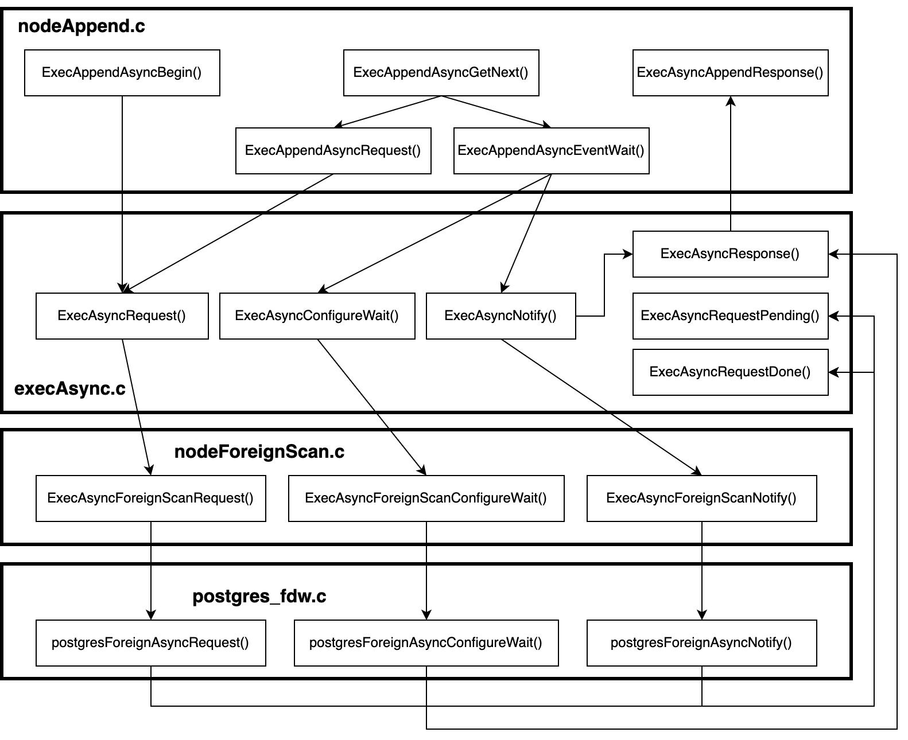

# PostgreSQL - FDW Asynchronous Execution

Created by : Mr Dk.

2022 / 07 / 05 17:49

Hangzhou, Zhejiang, China

---

Foreign Data Wrapper（FDW）是 PostgreSQL 提供的一个非常有意思的特性，中文翻译为 **外部数据包装器**。从字面意思上，PostgreSQL 数据库能够通过 FDW 扩展来操作当前数据库以外的数据。这些外部的数据源可以是：

- 文件
- 关系型数据库（PostgreSQL / Oracle / MySQL / ...）
- 非关系型数据库
- Git 仓库
- 网页
- 大数据平台（Hadoop / Hive / ...）
- ...（尽情遐想）😏

PostgreSQL 内核中定义了 FDW 回调函数接口，这个接口在形式上是一个装满了函数指针的结构体 `FdwRoutine`。这些函数指针会在 PostgreSQL 内核的优化器和执行器的关键位置上被回调，以完成操纵外部数据。服务于每一种外部数据源的 FDW 都需要提供一个 `FdwRoutine` 结构体。如果要对一种新的外部数据源实现 FDW 扩展，主要工作就是填充 `FdwRoutine` 结构体中的函数指针，实现对这种外部数据源的操作逻辑。

由于涉及到操纵数据库外部的数据，一个不可避免的因素出现了：性能。与操作数据库内的数据不同，操纵外部数据可能会带来额外的网络 I/O 开销和计算开销（序列化/反序列化）。受制于目前 PostgreSQL 内核执行器的执行模型，使用 FDW 操纵外部数据使用了与操纵本地数据一致的 **同步执行模型**，在性能有很大的提升空间。

PostgreSQL 14 首次为 FDW 引入了 **异步执行模型**。虽然目前支持的场景较为有限，但依旧能够有效并行化一些操纵远程数据的场景，提升执行效率。本文将从原理和实现上对异步执行功能进行分析。源码版本基于 PostgreSQL 14 的稳定分支 `REL_14_STABLE`，commit 号截止至：

```
commit fb81a93a6442e55d8c7376a01c27cb5d6c062c80
Author: Thomas Munro <tmunro@postgresql.org>
Date:   Fri Jul 1 12:05:52 2022 +1200
```

## Background

### FDW

FDW 是 PostgreSQL 提供的一个特性，它能够让用户在 PostgreSQL 中创建 **外部表（Foreign Table）**。外部表将被作为代理，用于访问外部数据源。当用户对外部表发起查询时，FDW 会负责把查询进行一定的形式转换后访问外部数据源，并负责将外部数据源返回的数据转换回 PostgreSQL 的结果形式，让用户觉得查询一个外部数据源好像和查询一个数据库内的普通表一样没什么区别。目前 PostgreSQL 官方提供了两个 FDW 实现：

- `file_fdw`：使用户能够创建代表普通文件的外部表
- `postgres_fdw`：使用户能够创建代表另一个 PostgreSQL 数据库表的外部表

其余大量的第三方 FDW 插件及其源码可以参考 [这里](https://wiki.postgresql.org/wiki/Foreign_data_wrappers)，它们都实现了 FDW 对外暴露出的函数接口 [`FdwRoutine`](https://www.postgresql.org/docs/14/fdw-callbacks.html)：

```c
/*
 * FdwRoutine is the struct returned by a foreign-data wrapper's handler
 * function.  It provides pointers to the callback functions needed by the
 * planner and executor.
 *
 * More function pointers are likely to be added in the future.  Therefore
 * it's recommended that the handler initialize the struct with
 * makeNode(FdwRoutine) so that all fields are set to NULL.  This will
 * ensure that no fields are accidentally left undefined.
 */
typedef struct FdwRoutine
{
    NodeTag     type;

    /* Functions for scanning foreign tables */
    GetForeignRelSize_function GetForeignRelSize;
    GetForeignPaths_function GetForeignPaths;
    GetForeignPlan_function GetForeignPlan;
    BeginForeignScan_function BeginForeignScan;
    IterateForeignScan_function IterateForeignScan;
    ReScanForeignScan_function ReScanForeignScan;
    EndForeignScan_function EndForeignScan;

    /*
     * Remaining functions are optional.  Set the pointer to NULL for any that
     * are not provided.
     */

    /* Functions for remote-join planning */
    GetForeignJoinPaths_function GetForeignJoinPaths;

    /* Functions for remote upper-relation (post scan/join) planning */
    GetForeignUpperPaths_function GetForeignUpperPaths;

    /* Functions for updating foreign tables */
    AddForeignUpdateTargets_function AddForeignUpdateTargets;
    PlanForeignModify_function PlanForeignModify;
    BeginForeignModify_function BeginForeignModify;
    ExecForeignInsert_function ExecForeignInsert;
    ExecForeignBatchInsert_function ExecForeignBatchInsert;
    GetForeignModifyBatchSize_function GetForeignModifyBatchSize;
    ExecForeignUpdate_function ExecForeignUpdate;
    ExecForeignDelete_function ExecForeignDelete;
    EndForeignModify_function EndForeignModify;
    BeginForeignInsert_function BeginForeignInsert;
    EndForeignInsert_function EndForeignInsert;
    IsForeignRelUpdatable_function IsForeignRelUpdatable;
    PlanDirectModify_function PlanDirectModify;
    BeginDirectModify_function BeginDirectModify;
    IterateDirectModify_function IterateDirectModify;
    EndDirectModify_function EndDirectModify;

    /* Functions for SELECT FOR UPDATE/SHARE row locking */
    GetForeignRowMarkType_function GetForeignRowMarkType;
    RefetchForeignRow_function RefetchForeignRow;
    RecheckForeignScan_function RecheckForeignScan;

    /* Support functions for EXPLAIN */
    ExplainForeignScan_function ExplainForeignScan;
    ExplainForeignModify_function ExplainForeignModify;
    ExplainDirectModify_function ExplainDirectModify;

    /* Support functions for ANALYZE */
    AnalyzeForeignTable_function AnalyzeForeignTable;

    /* Support functions for IMPORT FOREIGN SCHEMA */
    ImportForeignSchema_function ImportForeignSchema;

    /* Support functions for TRUNCATE */
    ExecForeignTruncate_function ExecForeignTruncate;

    /* Support functions for parallelism under Gather node */
    IsForeignScanParallelSafe_function IsForeignScanParallelSafe;
    EstimateDSMForeignScan_function EstimateDSMForeignScan;
    InitializeDSMForeignScan_function InitializeDSMForeignScan;
    ReInitializeDSMForeignScan_function ReInitializeDSMForeignScan;
    InitializeWorkerForeignScan_function InitializeWorkerForeignScan;
    ShutdownForeignScan_function ShutdownForeignScan;

    /* Support functions for path reparameterization. */
    ReparameterizeForeignPathByChild_function ReparameterizeForeignPathByChild;

    /* Support functions for asynchronous execution */
    IsForeignPathAsyncCapable_function IsForeignPathAsyncCapable;
    ForeignAsyncRequest_function ForeignAsyncRequest;
    ForeignAsyncConfigureWait_function ForeignAsyncConfigureWait;
    ForeignAsyncNotify_function ForeignAsyncNotify;
} FdwRoutine;
```

如注释所描述，这些函数指针会在 PostgreSQL 内核的优化器和执行器中被回调，完成 FDW 所需要实现的功能。比如 `postgres_fdw` 就会在这些回调函数中使用 [libpq](https://www.postgresql.org/docs/current/libpq.html)（PostgreSQL 客户端与服务端进程交互的 API 协议 C 语言库）与一个远程的 PostgreSQL 数据库建立连接并获取数据。FDW 能够在一定程度上体现 PostgreSQL 的可扩展性。

### Execution Model of PostgreSQL Executor

PostgreSQL 内核的执行器使用 **迭代器模型**（又称火山模型，流水线模型）设计。与多数编程语言使用迭代器的方式类似，执行器包含了三个执行阶段：

- 初始化（打开迭代器）
- 执行（如果还有更多数据，则获取数据）
- 清理（关闭迭代器）

对照 Java 迭代器：

```java
List<String> items = new ArrayList<>();
Iterator<String> iter = items.iterator();
while (iter.hasNext()) {
    String next = iter.next();
}
// iter close is done by GC
```

执行器的每一个物理算子都会实现这三个函数。当 PostgreSQL 的 planner 输出一棵物理计划树以后，在执行器初始化阶段，执行器会从计划树根节点的物理算子开始，调用物理算子的初始化函数；这个物理算子的初始化函数又会递归调用其下层算子的初始化函数，直到执行流到达计划树的叶子节点。执行器执行阶段和清理阶段的逻辑也采用了类似的递归形式实现。

PostgreSQL 内核中的绝大多数物理算子都是一元或二元的，即该算子需要从自己的一个或两个下层物理算子（孩子节点）中获取元组，并完成在当前物理算子中需要完成的事。物理算子是一元还是二元可以通过 `EXPLAIN` 命令从执行计划中看出来。

比如说 Sort（排序）算子就是一个一元算子，它只需要从它的下层物理算子获取所有元组，并根据排序的 key 完成排序，然后将排序后的第一个元组返回上层物理算子即可：

> 在 PostgreSQL `EXPLAIN` 打印的物理计划中，`->` 的缩进层次对应了物理计划树的层级关系。

```sql
->  Sort  (cost=5726599.94..5789078.79 rows=24991540 width=9)
      Sort Key: lineitem_1.l_orderkey
      ->  Parallel Seq Scan on lineitem lineitem_1  (cost=0.00..1374457.40 rows=24991540 width=9)
```

而 Hash Join（哈希连接）算子就是一个二元算子，它需要先从一个下层物理算子中获取所有元组并构造哈希表，然后从另一个下层物理算子中依次获取元组，并在哈希表中进行哈希探测和连接：

```sql
->  Hash Join  (cost=6032162.96..6658785.84 rows=138372 width=24)
      Hash Cond: (orders.o_orderkey = lineitem_1.l_orderkey)
      ->  Seq Scan on orders  (cost=0.00..410917.44 rows=15000544 width=20)
      ->  Hash  (cost=6029892.31..6029892.31 rows=138372 width=4)
```

### Append Operator

Append 是所有算子中的一个奇葩，它破坏了上述计划树类似二叉树的结构。让我们试想，假设要扫描一个带有多于两个子分区的分区表，如果只能产生一棵二叉树，那么会产生一个什么样的计划树呢？形状一定会很奇怪吧。😅

让我们看看目前 PostgreSQL 对分区表扫描的执行计划吧：

```sql
                              QUERY PLAN
----------------------------------------------------------------------
 Append  (cost=0.00..307.30 rows=15820 width=8)
   ->  Seq Scan on mc2p0  (cost=0.00..32.60 rows=2260 width=8)
   ->  Seq Scan on mc2p1  (cost=0.00..32.60 rows=2260 width=8)
   ->  Seq Scan on mc2p2  (cost=0.00..32.60 rows=2260 width=8)
   ->  Seq Scan on mc2p3  (cost=0.00..32.60 rows=2260 width=8)
   ->  Seq Scan on mc2p4  (cost=0.00..32.60 rows=2260 width=8)
   ->  Seq Scan on mc2p5  (cost=0.00..32.60 rows=2260 width=8)
   ->  Seq Scan on mc2p_default  (cost=0.00..32.60 rows=2260 width=8)
```

Append 算子就是用来解决这个问题的，它可以有多于两个下层物理算子。事实上，在 Append 算子 `src/backend/executor/nodeAppend.c` 的注释中就可以了解到，Append 算子并不使用其它物理算子所使用的 **左右孩子指针** 来引用下层算子，而是持有一个 **链表**，链表中包含了它需要引用的所有下层物理算子，个数不受限。下层物理算子的子树被称为子计划：

```c
/*
 *   NOTES
 *      Each append node contains a list of one or more subplans which
 *      must be iteratively processed (forwards or backwards).
 *      Tuples are retrieved by executing the 'whichplan'th subplan
 *      until the subplan stops returning tuples, at which point that
 *      plan is shut down and the next started up.
 *
 *      Append nodes don't make use of their left and right
 *      subtrees, rather they maintain a list of subplans so
 *      a typical append node looks like this in the plan tree:
 *
 *                 ...
 *                 /
 *              Append -------+------+------+--- nil
 *              /   \         |      |      |
 *            nil   nil      ...    ...    ...
 *                               subplans
 */
```

如注释所示意的，在执行器的执行阶段，Append 算子会依次从它的下层物理算子（子计划）中获取元组并返回上层算子，当一个子计划中的数据枯竭（返回 NULL）后，就开始从下一个子计划开始获取，直到压榨完链表中所有的子计划为止。

因为 Append 算子的特殊性，它被广泛用于需要将来自多方的数据进行融合的场合，包括 FDW。比如说一个分区表的子分区分布在多个 PostgreSQL 实例上，就需要通过 Append 算子来做汇聚：

```sql
                                       QUERY PLAN
----------------------------------------------------------------------------------------
 Aggregate  (cost=8882.01..8882.02 rows=1 width=8)
   Output: count(*)
   ->  Append  (cost=100.00..8382.00 rows=200001 width=0)
         ->  Foreign Scan on public.p1 pt_1  (cost=100.00..3641.00 rows=100000 width=0)
               Remote SQL: SELECT NULL FROM public.loct1
         ->  Foreign Scan on public.p2 pt_2  (cost=100.00..3641.00 rows=100000 width=0)
               Remote SQL: SELECT NULL FROM public.loct2
         ->  Foreign Scan on public.p3 pt_3  (cost=100.00..100.00 rows=1 width=0)
               Remote SQL: SELECT NULL FROM public.loct3
(9 rows)
```

这里我们就需要注意了：Append 算子是依次 **串行同步** 地执行每一个子计划的。当其中某个子计划与其在数据库内执行相比需要执行较长时间（通过网络 I/O 外发请求 + 在远程机器上执行）时，FDW 的性能是相当低的。这也是之前 PostgreSQL 执行模型的一个局限：只考虑了如何执行数据库内的操作，并没有为 FDW 这种场景做专门的优化。

## Asynchronized Execution

经过上面的分析可以发现，在 FDW 场景中，PostgreSQL 的执行模型有着很大的提升空间。原先，一个子计划需要等待前一个子计划执行完毕以后才可以开始执行。那么能不能一次性让所有的外库子计划全部开始执行，然后开始同步执行一部分库内的计划，同时等待所有外库子计划的执行结果呢？这样所有外库都在并行执行查询，而等待外库执行结果的时间又可以被用于执行库内的计划，从而能够极大提升执行效率。

这就是 PostgreSQL 14 引入的 **FDW 异步执行** 特性的设计思路。目前这一特性暂时只被实现在了 Append 算子与其直接下游 ForeignScan 算子之间，且暂时仅支持 `postgres_fdw` 的异步执行。未来或许会再做扩展。其主要的实现思路为：

- 在 Append 算子的实现 `src/backend/executor/nodeAppend.c` 中，引入对同步子计划和异步子计划的分别处理
  - `ExecAppendAsyncBegin()`
  - `ExecAppendAsyncGetNext()`
  - `ExecAppendAsyncRequest()`
  - `ExecAppendAsyncEventWait()`
  - `ExecAsyncAppendResponse()`
- 在 `src/backend/executor/execAsync.c` 中，引入了异步执行的抽象中间层
  - `ExecAsyncRequest()`
  - `ExecAsyncConfigureWait()`
  - `ExecAsyncNotify()`
  - `ExecAsyncResponse()`
  - `ExecAsyncRequestPending()`
  - `ExecAsyncRequestDone()`
- 在外部表扫描层 `src/backend/executor/nodeForeignScan.c` 中，将执行流引入 FDW 的异步执行函数中
  - `ExecAsyncForeignScanRequest()`
  - `ExecAsyncForeignScanConfigureWait()`
  - `ExecAsyncForeignScanNotify()`
- 在 `postgres_fdw` 的实现 `contrib/postgres_fdw/postgres_fdw.c` 中，实现支持异步执行的接口函数
  - `postgresForeignAsyncRequest()`
  - `postgresForeignAsyncConfigureWait()`
  - `postgresForeignAsyncNotify()`

从上述函数命名可以看出，FDW 的异步执行功能实现在四个层次上。其中，上层的 Append 算子会调用异步抽象层的函数，异步抽象层的函数进而调用 ForeignScan 算子的函数，再进而调用 `postgres_fdw` 的异步执行函数。整体操作分为三个步骤：

1. 异步发送请求（只发送请求，不等待结果）
2. 配置等待事件集合，轮询等待事件
3. 等待事件触发后，封装执行结果并返回给上层（Append）算子

函数调用关系为：



接下来从上到下对每一层的代码进行分析。

> 源代码中的 `//` 注释是本人添加的说明。由于 PostgreSQL 内核中不允许出现这种风格的注释，我正好使用这种注释风格与原有内核注释加以区别。

### Append 算子

首先，FDW 异步执行特性引入了一个新的选项 `async_capable`。它同时是一个服务器级别和表级别的选项，指示对应的数据库服务器和服务器上的表是否可以被异步执行。表级别的选项将会覆盖服务器级别的选项。只要外部表的这个参数被设置为 `true`，那么优化器就会产生异步执行的计划树：

```sql
                                          QUERY PLAN
----------------------------------------------------------------------------------------------
 Aggregate  (cost=8882.01..8882.02 rows=1 width=8)
   Output: count(*)
   ->  Append  (cost=100.00..8382.00 rows=200001 width=0)
         ->  Async Foreign Scan on public.p1 pt_1  (cost=100.00..3641.00 rows=100000 width=0)
               Remote SQL: SELECT NULL FROM public.loct1
         ->  Async Foreign Scan on public.p2 pt_2  (cost=100.00..3641.00 rows=100000 width=0)
               Remote SQL: SELECT NULL FROM public.loct2
         ->  Async Foreign Scan on public.p3 pt_3  (cost=100.00..100.00 rows=1 width=0)
               Remote SQL: SELECT NULL FROM public.loct3
(9 rows)
```

#### ExecInitAppend

在 Append 算子的初始化阶段，即函数 `ExecInitAppend()` 中，需要为其下层所有的子计划分配好 `PlanState` 指针数组以便能够引用下层算子，然后递归调用每一个下层算子的初始化函数。在这个过程中，顺便统计一下哪几个子计划是可以被异步执行的：

```c
// 分配指向所有下层算子 PlanState 的指针数组
appendplanstates = (PlanState **) palloc(nplans *
                                         sizeof(PlanState *));

/*
 * call ExecInitNode on each of the valid plans to be executed and save
 * the results into the appendplanstates array.
 *
 * While at it, find out the first valid partial plan.
 */
j = 0;
asyncplans = NULL;
nasyncplans = 0;
firstvalid = nplans;
i = -1;

// 遍历每一个合法子计划，递归调用每一个下层算子的初始化函数
while ((i = bms_next_member(validsubplans, i)) >= 0)
{
    Plan       *initNode = (Plan *) list_nth(node->appendplans, i);

    /*
     * Record async subplans.  When executing EvalPlanQual, we treat them
     * as sync ones; don't do this when initializing an EvalPlanQual plan
     * tree.
     */
    // 在 bitmap 中记录异步子计划的个数和位置
    if (initNode->async_capable && estate->es_epq_active == NULL)
    {
        asyncplans = bms_add_member(asyncplans, j);
        nasyncplans++;
    }

    /*
     * Record the lowest appendplans index which is a valid partial plan.
     */
    // 记录好第一个将要被执行的下层算子
    if (i >= node->first_partial_plan && j < firstvalid)
        firstvalid = j;

    // 把下层算子构建完成的 PlanState 记录到刚才分配的指针数组中
    appendplanstates[j++] = ExecInitNode(initNode, estate, eflags);
}
```

在明确哪些子计划需要被异步执行以后，还需要为每一个异步子计划分配一个 `AsyncRequest` 结构体。这个结构体被用于与下层算子传递请求状态和执行结果：

```c
// 如果有异步执行的子计划
if (nasyncplans > 0)
{
    // 分配所有子计划的 AsyncRequest 的指针数组
    appendstate->as_asyncrequests = (AsyncRequest **)
        palloc0(nplans * sizeof(AsyncRequest *));

    // 通过 bitmap 找到每一个需要被异步执行的子计划
    i = -1;
    while ((i = bms_next_member(asyncplans, i)) >= 0)
    {
        AsyncRequest *areq;

        // 分配 AsyncRequest 结构体内存
        areq = palloc(sizeof(AsyncRequest));
        // 数据请求方：Append 算子
        areq->requestor = (PlanState *) appendstate;
        // 被请求方：Append 算子的下层算子（ForeignScan 算子）
        areq->requestee = appendplanstates[i];
        areq->request_index = i;

        // AsyncRequest 中保存的状态和结果的初始化
        areq->callback_pending = false;
        areq->request_complete = false;
        areq->result = NULL;

        appendstate->as_asyncrequests[i] = areq;
    }

    // 为异步子计划分配元组缓存槽
    appendstate->as_asyncresults = (TupleTableSlot **)
        palloc0(nasyncplans * sizeof(TupleTableSlot *));

    // 对合法的同步子计划和异步子计划进行分类
    // 分别保存到不同的 bitmap 中
    if (appendstate->as_valid_subplans != NULL)
        classify_matching_subplans(appendstate);
}
```

#### ExecAppend

当 Append 算子第一次被执行时，将会立刻开启所有异步子计划的执行。当然，由于是异步的，所以只是把请求发出去了，并不阻塞等待结果。通过调用异步抽象层的 `ExecAppendAsyncBegin()` 完成：

```c
/*
 * If this is the first call after Init or ReScan, we need to do the
 * initialization work.
 */
// 第一次调用 ExecAppend，需要选择第一个子计划开始执行
if (!node->as_begun)
{
    Assert(node->as_whichplan == INVALID_SUBPLAN_INDEX);
    Assert(!node->as_syncdone);

    /* Nothing to do if there are no subplans */
    if (node->as_nplans == 0)
        return ExecClearTuple(node->ps.ps_ResultTupleSlot);

    // 如果有异步子计划，立刻开始执行
    /* If there are any async subplans, begin executing them. */
    if (node->as_nasyncplans > 0)
        ExecAppendAsyncBegin(node);

    // 选择下一个要被同步执行的计划
    // 如果同步子计划和异步子计划都没有了，就向上层算子返回空槽，Append 的执行结束
    /*
     * If no sync subplan has been chosen, we must choose one before
     * proceeding.
     */
    if (!node->choose_next_subplan(node) && node->as_nasyncremain == 0)
        return ExecClearTuple(node->ps.ps_ResultTupleSlot);

    Assert(node->as_syncdone ||
           (node->as_whichplan >= 0 &&
            node->as_whichplan < node->as_nplans));

    // 第一次 ExecAppend 的初始化完毕，下次不再进入
    /* And we're initialized. */
    node->as_begun = true;
}
```

初始化结束后，就是不断从子计划中递归获取元组了。让我们看看异步执行做了什么样的改造：

```c
// 接上一段代码的初始化，目前 ExecAppend 的初始化已结束
// 应该已经选中了一个子计划准备开始执行
// 从当前选中的子计划开始不断调用 ExecProcNode 递归获取元组
for (;;)
{
    PlanState  *subnode;

    CHECK_FOR_INTERRUPTS();

    // 首先，尝试从刚才已经开启执行的异步子计划中获取一个元组
    // 如果能够获取到一个元组，那么立刻返回
    /*
     * try to get a tuple from an async subplan if any
     */
    if (node->as_syncdone || !bms_is_empty(node->as_needrequest))
    {
        if (ExecAppendAsyncGetNext(node, &result))
            return result;
        Assert(!node->as_syncdone);
        Assert(bms_is_empty(node->as_needrequest));
    }

    // 没能从任何异步子计划中获取到元组
    // 那么找到目前正在被执行的同步子计划
    /*
     * figure out which sync subplan we are currently processing
     */
    Assert(node->as_whichplan >= 0 && node->as_whichplan < node->as_nplans);
    subnode = node->appendplans[node->as_whichplan];

    // 从同步子计划中获取一个元组
    /*
     * get a tuple from the subplan
     */
    result = ExecProcNode(subnode);

    // 同步子计划的结果非空，那么返回结果
    if (!TupIsNull(result))
    {
        /*
         * If the subplan gave us something then return it as-is. We do
         * NOT make use of the result slot that was set up in
         * ExecInitAppend; there's no need for it.
         */
        return result;
    }

    // 同步子计划结果为空，
    // 说明这个同步子计划执行结束，需要选择下一个被执行的同步子计划

    // 在结束这个同步子计划的迭代前
    // 先对异步子计划的等待事件集合来一次轮询
    // 这样下一次循环或许可以从异步子计划中获取到元组
    /*
     * wait or poll for async events if any. We do this before checking
     * for the end of iteration, because it might drain the remaining
     * async subplans.
     */
    if (node->as_nasyncremain > 0)
        // 轮询，并处理触发的事件
        ExecAppendAsyncEventWait(node);

    // 如果同步子计划和异步子计划全部执行完毕，那么返回空槽结束 Append 算子的执行
    // 否则指向下一个将要被执行的同步子计划
    /* choose new sync subplan; if no sync/async subplans, we're done */
    if (!node->choose_next_subplan(node) && node->as_nasyncremain == 0)
        return ExecClearTuple(node->ps.ps_ResultTupleSlot);

    // 进入下一次循环
}
```

然后我们进一步分析上面的代码中用到的几个异步执行函数。

#### ExecAppendAsyncBegin

该函数用于向所有合法的异步子计划请求元组。由于是异步执行，因此只管发送请求，不管接收结果。其中将会调用到下一层（也就是异步抽象层）的 `ExecAsyncRequest()` 函数：

```c
/* ----------------------------------------------------------------
 *      ExecAppendAsyncBegin
 *
 *      Begin executing designed async-capable subplans.
 * ----------------------------------------------------------------
 */
static void
ExecAppendAsyncBegin(AppendState *node)
{
    // ...

    /* Initialize state variables. */
    node->as_syncdone = bms_is_empty(node->as_valid_subplans);
    node->as_nasyncremain = bms_num_members(node->as_valid_asyncplans);

    // 如果没有任何异步子计划需要被执行，那么直接返回
    /* Nothing to do if there are no valid async subplans. */
    if (node->as_nasyncremain == 0)
        return;

    // 通过 bitmap 遍历每一个合法的异步子计划
    /* Make a request for each of the valid async subplans. */
    i = -1;
    while ((i = bms_next_member(node->as_valid_asyncplans, i)) >= 0)
    {
        AsyncRequest *areq = node->as_asyncrequests[i];

        Assert(areq->request_index == i);
        Assert(!areq->callback_pending);

        /* Do the actual work. */
        // 调用异步抽象层的函数，向异步子计划请求元组
        ExecAsyncRequest(areq);
    }
}
```

#### ExecAppendAsyncGetNext

该函数从任意一个异步子计划中获取下一个元组，并保存到输入参数中的元组缓存槽 `result` 中。如果函数结束时元组缓存槽中包含了有效结果，那么函数返回 `true`，否则返回 `false`。

```c
/* ----------------------------------------------------------------
 *      ExecAppendAsyncGetNext
 *
 *      Get the next tuple from any of the asynchronous subplans.
 * ----------------------------------------------------------------
 */
static bool
ExecAppendAsyncGetNext(AppendState *node, TupleTableSlot **result)
{
    *result = NULL;

    /* We should never be called when there are no valid async subplans. */
    Assert(node->as_nasyncremain > 0);

    // 异步地请求子计划
    // 如果该函数在 result 中产生了有效结果，那么直接返回 true
    /* Request a tuple asynchronously. */
    if (ExecAppendAsyncRequest(node, result))
        return true;

    // 没有产生有效结果

    // 还有异步子计划没执行完
    while (node->as_nasyncremain > 0)
    {
        CHECK_FOR_INTERRUPTS();

        // 轮询等待事件
        // 如果有就绪事件，并触发回调并保存执行结果
        /* Wait or poll for async events. */
        ExecAppendAsyncEventWait(node);

        // 异步地请求子计划
        // 如果该函数在 result 中产生了有效结果，那么直接返回 true
        /* Request a tuple asynchronously. */
        if (ExecAppendAsyncRequest(node, result))
            return true;

        // 没能从异步子计划中获取到任何元组
        // 如果目前还有同步计划没执行完，那么跳出循环，先去执行同步子计划
        /* Break from loop if there's any sync subplan that isn't complete. */
        if (!node->as_syncdone)
            break;
        // 如果同步子计划已全部执行完，只剩下异步子计划了
        // 那么循环从这里绕回，继续等待异步子计划的执行结果
    }

    // 至此，异步计划已全部执行完
    /*
     * If all sync subplans are complete, we're totally done scanning the
     * given node.  Otherwise, we're done with the asynchronous stuff but must
     * continue scanning the sync subplans.
     */
    // 如果同步计划也全都执行完了，那么整个 Append 算子的执行就结束了，向上级算子返回空槽
    if (node->as_syncdone)
    {
        Assert(node->as_nasyncremain == 0);
        *result = ExecClearTuple(node->ps.ps_ResultTupleSlot);
        return true;
    }

    // 这一轮调用没能得到任何有效结果，返回 false
    return false;
}
```

#### ExecAppendAsyncRequest

该函数用于异步地请求一个元组，也会调用异步抽象层的 `ExecAsyncRequest()`。同样，如果函数结束时元组缓存槽 `result` 中包含了有效结果，那么函数返回 `true`，否则返回 `false`。

```c
/* ----------------------------------------------------------------
 *      ExecAppendAsyncRequest
 *
 *      Request a tuple asynchronously.
 * ----------------------------------------------------------------
 */
static bool
// 如果调用中包含有效结果，那么返回 true
ExecAppendAsyncRequest(AppendState *node, TupleTableSlot **result)
{
    Bitmapset  *needrequest;
    int         i;

    // 如果不需要向任何异步子计划发送请求，那么直接返回
    /* Nothing to do if there are no async subplans needing a new request. */
    if (bms_is_empty(node->as_needrequest))
    {
        Assert(node->as_nasyncresults == 0);
        return false;
    }

    // 如果已有异步计划产生结果了
    // 那么使返回结果槽指向对应异步子计划的结果槽，然后直接返回
    /*
     * If there are any asynchronously-generated results that have not yet
     * been returned, we have nothing to do; just return one of them.
     */
    if (node->as_nasyncresults > 0)
    {
        --node->as_nasyncresults;
        *result = node->as_asyncresults[node->as_nasyncresults];
        return true;
    }

    // 至此，说明所有异步子计划的结果槽都已经空了

    // 根据 bitmap 为每一个需要被请求的异步子计划发送请求
    // 并重置 bitmap
    /* Make a new request for each of the async subplans that need it. */
    needrequest = node->as_needrequest;
    node->as_needrequest = NULL;
    i = -1;
    while ((i = bms_next_member(needrequest, i)) >= 0)
    {
        AsyncRequest *areq = node->as_asyncrequests[i];

        // 发起请求
        // 如果异步子计划产生结果
        // 那么将子计划的元组缓存槽加入到 Append 节点的结果槽数组中
        /* Do the actual work. */
        ExecAsyncRequest(areq);
    }
    bms_free(needrequest);

    // 当前已有异步子计划产生了结果
    // 使返回结果槽指向 Append 节点结果槽中的最后一个槽，并返回
    /* Return one of the asynchronously-generated results if any. */
    if (node->as_nasyncresults > 0)
    {
        --node->as_nasyncresults;
        *result = node->as_asyncresults[node->as_nasyncresults];
        return true;
    }

    // 至此，没有获取到任何有效结果，返回 false
    return false;
}
```

#### ExecAppendAsyncEventWait

该函数用于配制所有异步子计划想要监听的事件集合，然后向 OS 内核轮询这个事件集合。如果触发了监听事件，那么回调并处理事件。其中用到了异步抽象层的 `ExecAsyncConfigureWait()` 以配置监听事件，以及 `ExecAsyncNotify()` 以处理事件。

```c
/* ----------------------------------------------------------------
 *      ExecAppendAsyncEventWait
 *
 *      Wait or poll for file descriptor events and fire callbacks.
 * ----------------------------------------------------------------
 */
static void
ExecAppendAsyncEventWait(AppendState *node)
{
    int         nevents = node->as_nasyncplans + 1;
    long        timeout = node->as_syncdone ? -1 : 0;
    WaitEvent   occurred_event[EVENT_BUFFER_SIZE];
    int         noccurred;
    int         i;

    /* We should never be called when there are no valid async subplans. */
    Assert(node->as_nasyncremain > 0);

    // 创建一个事件等待集合
    // 添加监听 PostMaster 退出的事件
    node->as_eventset = CreateWaitEventSet(CurrentMemoryContext, nevents);
    AddWaitEventToSet(node->as_eventset, WL_EXIT_ON_PM_DEATH, PGINVALID_SOCKET,
                      NULL, NULL);

    // 对每一个异步子计划，如果当前子计划的请求已经发送
    // 那么将子计划需要监听的文件描述符添加到事件等待集合中
    /* Give each waiting subplan a chance to add an event. */
    i = -1;
    while ((i = bms_next_member(node->as_asyncplans, i)) >= 0)
    {
        AsyncRequest *areq = node->as_asyncrequests[i];

        if (areq->callback_pending)
            ExecAsyncConfigureWait(areq);
    }

    // 如果除了监听 PostMaster 进程退出以外没有其它事件需要监听了
    // 即没有任何异步子计划的事件需要监听，那么直接返回
    /*
     * No need for further processing if there are no configured events other
     * than the postmaster death event.
     */
    if (GetNumRegisteredWaitEvents(node->as_eventset) == 1)
    {
        FreeWaitEventSet(node->as_eventset);
        node->as_eventset = NULL;
        return;
    }

    // 最多只监听 EVENT_BUFFER_SIZE 个事件
    // 因为 WaitEvent 数组的空间有限
    /* We wait on at most EVENT_BUFFER_SIZE events. */
    if (nevents > EVENT_BUFFER_SIZE)
        nevents = EVENT_BUFFER_SIZE;

    /*
     * If the timeout is -1, wait until at least one event occurs.  If the
     * timeout is 0, poll for events, but do not wait at all.
     */
    // 向 OS 内核轮询！
    noccurred = WaitEventSetWait(node->as_eventset, timeout, occurred_event,
                                 nevents, WAIT_EVENT_APPEND_READY);
    FreeWaitEventSet(node->as_eventset);
    node->as_eventset = NULL;
    if (noccurred == 0)
        return;

    // 处理本轮轮询中触发的事件
    /* Deliver notifications. */
    for (i = 0; i < noccurred; i++)
    {
        WaitEvent  *w = &occurred_event[i];

        /*
         * Each waiting subplan should have registered its wait event with
         * user_data pointing back to its AsyncRequest.
         */
        // 异步子计划的 Socket 读事件被触发
        if ((w->events & WL_SOCKET_READABLE) != 0)
        {
            AsyncRequest *areq = (AsyncRequest *) w->user_data;

            if (areq->callback_pending)
            {
                /*
                 * Mark it as no longer needing a callback.  We must do this
                 * before dispatching the callback in case the callback resets
                 * the flag.
                 */
                // 复位异步子计划的请求状态
                areq->callback_pending = false;

                /* Do the actual work. */
                // 处理 Socket 读事件
                ExecAsyncNotify(areq);
            }
        }
    }
}
```

#### ExecAsyncAppendResponse

这个函数比较特殊。前几个函数都是 Append 算子的函数主动调用下层（异步抽象层）的函数；而这是一个回调函数，由异步抽象层函数获取到结果以后调用，将获取到的执行结果保存到 Append 算子的返回结果槽中。

```c
/* ----------------------------------------------------------------
 *      ExecAsyncAppendResponse
 *
 *      Receive a response from an asynchronous request we made.
 * ----------------------------------------------------------------
 */
void
ExecAsyncAppendResponse(AsyncRequest *areq)
{
    AppendState *node = (AppendState *) areq->requestor;
    TupleTableSlot *slot = areq->result;

    /* The result should be a TupleTableSlot or NULL. */
    Assert(slot == NULL || IsA(slot, TupleTableSlot));

    // 异步子计划的请求还没有获取到结果，那么直接返回
    /* Nothing to do if the request is pending. */
    if (!areq->request_complete)
    {
        /* The request would have been pending for a callback. */
        Assert(areq->callback_pending);
        return;
    }

    // 异步子计划已经获取到结果

    // 如果子计划的返回结果槽为空，那么说明这个异步子计划的执行已经结束
    // 递减剩余的异步子计划数量，然后返回
    /* If the result is NULL or an empty slot, there's nothing more to do. */
    if (TupIsNull(slot))
    {
        /* The ending subplan wouldn't have been pending for a callback. */
        Assert(!areq->callback_pending);
        --node->as_nasyncremain;
        return;
    }

    // 如果子计划的返回结果槽不为空
    // 那么将返回结果槽保存到 Append 算子的 as_asyncresults 数组中
    /* Save result so we can return it. */
    Assert(node->as_nasyncresults < node->as_nasyncplans);
    node->as_asyncresults[node->as_nasyncresults++] = slot;

    // 标记这个异步子计划，表示它准备好进行下一次请求
    /*
     * Mark the subplan that returned a result as ready for a new request.  We
     * don't launch another one here immediately because it might complete.
     */
    node->as_needrequest = bms_add_member(node->as_needrequest,
                                          areq->request_index);
}
```

### 异步抽象层

这一层存在的目的应该是为了在两层物理算子之间传递请求状态和执行结果，并方便以后支持其它算子的异步化改造。下面直接开始分析这一层次上的所有函数。

#### ExecAsyncRequest

该函数被 Append 算子的 `ExecAppendAsyncBegin()` 和 `ExecAppendAsyncRequest()` 调用，主要功能是异步地向下层的 ForeignScan 算子请求元组，执行结果不通过返回值返回。如果下层算子产生了有效结果，那么回调上层 Append 算子的函数传递执行结果。

```c
/*
 * Asynchronously request a tuple from a designed async-capable node.
 */
void
ExecAsyncRequest(AsyncRequest *areq)
{
    // ...

    // 目前的被请求者算子仅支持 ForeignScan
    switch (nodeTag(areq->requestee))
    {
        // 向 ForeignScan 算子异步请求结果
        case T_ForeignScanState:
            ExecAsyncForeignScanRequest(areq);
            break;
        default:
            /* If the node doesn't support async, caller messed up. */
            elog(ERROR, "unrecognized node type: %d",
                 (int) nodeTag(areq->requestee));
    }

    // 如果子计划产生了结果，那么调用请求者（Append）算子的回调函数
    ExecAsyncResponse(areq);

    // ...
}
```

#### ExecAsyncConfigureWait

该函数被 Append 算子的 `ExecAppendAsyncEventWait()` 调用，将调用下层 ForeignScan 算子的相应函数以便 FDW 能够配置自己想要监听的文件描述符和及其读事件。

```c
/*
 * Give the asynchronous node a chance to configure the file descriptor event
 * for which it wishes to wait.  We expect the node-type specific callback to
 * make a single call of the following form:
 *
 * AddWaitEventToSet(set, WL_SOCKET_READABLE, fd, NULL, areq);
 */
void
ExecAsyncConfigureWait(AsyncRequest *areq)
{
    // ...

    switch (nodeTag(areq->requestee))
    {
        // 目前唯一合法的下层节点是 ForeignScan
        case T_ForeignScanState:
            ExecAsyncForeignScanConfigureWait(areq);
            break;
        default:
            /* If the node doesn't support async, caller messed up. */
            elog(ERROR, "unrecognized node type: %d",
                 (int) nodeTag(areq->requestee));
    }

    // ...
}
```

#### ExecAsyncNotify

该函数被 Append 算子的 `ExecAppendAsyncEventWait()` 函数调用，说明下层算子正在监听的文件描述符上触发了读事件。所以该函数将调用下层 ForeignScan 算子的相应函数，从正在监听的文件描述符上获取数据并组装元组；然后回调 Append 算子的 `ExecAsyncAppendResponse()` 函数传递元组。

```c
/*
 * Call the asynchronous node back when a relevant event has occurred.
 */
void
ExecAsyncNotify(AsyncRequest *areq)
{
    // ...

    switch (nodeTag(areq->requestee))
    {
        // 调用 ForeignScan 算子的相应函数
        // 使其从文件描述符上获取数据并组装元组
        case T_ForeignScanState:
            ExecAsyncForeignScanNotify(areq);
            break;
        default:
            /* If the node doesn't support async, caller messed up. */
            elog(ERROR, "unrecognized node type: %d",
                 (int) nodeTag(areq->requestee));
    }

    // 回调，传递元组到 Append 算子中
    ExecAsyncResponse(areq);

    // ...
}
```

#### ExecAsyncResponse

该函数用于触发上层算子的回调函数，以传递从 FDW 获取到的元组。目前支持的上层算子只有 Append。

```c
/*
 * Call the requestor back when an asynchronous node has produced a result.
 */
void
ExecAsyncResponse(AsyncRequest *areq)
{
    switch (nodeTag(areq->requestor))
    {
        // 目前合法的请求方算子只有 Append
        // 回调并传递结果元组
        case T_AppendState:
            ExecAsyncAppendResponse(areq);
            break;
        default:
            /* If the node doesn't support async, caller messed up. */
            elog(ERROR, "unrecognized node type: %d",
                 (int) nodeTag(areq->requestor));
    }
}
```

#### ExecAsyncRequestPending / ExecAsyncRequestDone

这两个函数用于保存一个异步请求的进行状态和执行结果。

```c
/*
 * A requestee node should call this function to deliver the tuple to its
 * requestor node.  The requestee node can call this from its ExecAsyncRequest
 * or ExecAsyncNotify callback.
 */
void
ExecAsyncRequestDone(AsyncRequest *areq, TupleTableSlot *result)
{
    // 请求已完成
    // 状态：完成
    // 结果：在参数中
    areq->request_complete = true;
    areq->result = result;
}

/*
 * A requestee node should call this function to indicate that it is pending
 * for a callback.  The requestee node can call this from its ExecAsyncRequest
 * or ExecAsyncNotify callback.
 */
void
ExecAsyncRequestPending(AsyncRequest *areq)
{
    // 新的请求已经发起
    // 状态：未完成，进行中
    // 结果：空
    areq->callback_pending = true;
    areq->request_complete = false;
    areq->result = NULL;
}
```

### ForeignScan 算子

从这一层中可以看出，异步执行特性在 FDW API 中加入了四个新的函数指针：

```c
typedef struct FdwRoutine
{
    // ...

    /* Support functions for asynchronous execution */
    IsForeignPathAsyncCapable_function IsForeignPathAsyncCapable;
    ForeignAsyncRequest_function ForeignAsyncRequest;
    ForeignAsyncConfigureWait_function ForeignAsyncConfigureWait;
    ForeignAsyncNotify_function ForeignAsyncNotify;
} FdwRoutine;
```

其中第一个函数指针被 PostgreSQL 优化器用于判断是否可以产生一个带有异步执行的执行计划。后面三个函数指针被执行器分别用于：异步发起请求、轮询请求结果、回调处理请求结果。

由于目前异步执行仅对 `postgres_fdw` 做了支持，因此这一层目前的逻辑很简单：就是转而调用 `postgres_fdw` 对应功能的函数指针。这一层存在的意义是，方便以后对其它的 FDW 插件也支持异步执行。下面简单列出被异步抽象层调用的三个函数：

```c
/* ----------------------------------------------------------------
 *      ExecAsyncForeignScanRequest
 *
 *      Asynchronously request a tuple from a designed async-capable node
 * ----------------------------------------------------------------
 */
void
ExecAsyncForeignScanRequest(AsyncRequest *areq)
{
    ForeignScanState *node = (ForeignScanState *) areq->requestee;
    FdwRoutine *fdwroutine = node->fdwroutine;

    Assert(fdwroutine->ForeignAsyncRequest != NULL);
    fdwroutine->ForeignAsyncRequest(areq);
}

/* ----------------------------------------------------------------
 *      ExecAsyncForeignScanConfigureWait
 *
 *      In async mode, configure for a wait
 * ----------------------------------------------------------------
 */
void
ExecAsyncForeignScanConfigureWait(AsyncRequest *areq)
{
    ForeignScanState *node = (ForeignScanState *) areq->requestee;
    FdwRoutine *fdwroutine = node->fdwroutine;

    Assert(fdwroutine->ForeignAsyncConfigureWait != NULL);
    fdwroutine->ForeignAsyncConfigureWait(areq);
}

/* ----------------------------------------------------------------
 *      ExecAsyncForeignScanNotify
 *
 *      Callback invoked when a relevant event has occurred
 * ----------------------------------------------------------------
 */
void
ExecAsyncForeignScanNotify(AsyncRequest *areq)
{
    ForeignScanState *node = (ForeignScanState *) areq->requestee;
    FdwRoutine *fdwroutine = node->fdwroutine;

    Assert(fdwroutine->ForeignAsyncNotify != NULL);
    fdwroutine->ForeignAsyncNotify(areq);
}
```

### Postgres FDW

在 `postgres_fdw` 中对 FDW API 中新增的四个函数指针进行了实现。

```c
/*
 * Foreign-data wrapper handler function: return a struct with pointers
 * to my callback routines.
 */
Datum
postgres_fdw_handler(PG_FUNCTION_ARGS)
{
    FdwRoutine *routine = makeNode(FdwRoutine);

    // ...

    /* Support functions for asynchronous execution */
    routine->IsForeignPathAsyncCapable = postgresIsForeignPathAsyncCapable;
    routine->ForeignAsyncRequest = postgresForeignAsyncRequest;
    routine->ForeignAsyncConfigureWait = postgresForeignAsyncConfigureWait;
    routine->ForeignAsyncNotify = postgresForeignAsyncNotify;

    PG_RETURN_POINTER(routine);
}
```

#### postgresIsForeignPathAsyncCapable

这个函数会被优化器回调，判断是否可以对一个外部表产生异步执行计划。其逻辑非常简单：判断外部表选项中的 `async_capable` 是否为 `true` 即可：

```c
/*
 * postgresIsForeignPathAsyncCapable
 *      Check whether a given ForeignPath node is async-capable.
 */
static bool
postgresIsForeignPathAsyncCapable(ForeignPath *path)
{
    RelOptInfo *rel = ((Path *) path)->parent;
    PgFdwRelationInfo *fpinfo = (PgFdwRelationInfo *) rel->fdw_private;

    return fpinfo->async_capable;
}
```

#### postgresForeignAsyncRequest

该函数承接上层算子异步地请求元组的要求。

```c
/*
 * postgresForeignAsyncRequest
 *      Asynchronously request next tuple from a foreign PostgreSQL table.
 */
static void
postgresForeignAsyncRequest(AsyncRequest *areq)
{
    produce_tuple_asynchronously(areq, true);
}

/*
 * Asynchronously produce next tuple from a foreign PostgreSQL table.
 */
static void
produce_tuple_asynchronously(AsyncRequest *areq, bool fetch)
{
    ForeignScanState *node = (ForeignScanState *) areq->requestee;
    PgFdwScanState *fsstate = (PgFdwScanState *) node->fdw_state;
    AsyncRequest *pendingAreq = fsstate->conn_state->pendingAreq;
    TupleTableSlot *result;

    // 目前请求还没有开始
    /* This should not be called if the request is currently in-process */
    Assert(areq != pendingAreq);

    // 下一个要返回的元组的 index 已经超出元组数组的长度了
    // 说明 FDW 中缓存的元组已经被消耗殆尽，需要 FETCH 更多元组
    /* Fetch some more tuples, if we've run out */
    if (fsstate->next_tuple >= fsstate->num_tuples)
    {
        /* No point in another fetch if we already detected EOF, though */
        // 当前连接还没有到达 EOF
        // 占用连接，并发送 FETCH 请求
        if (!fsstate->eof_reached)
        {
            /* Mark the request as pending for a callback */
            ExecAsyncRequestPending(areq);
            /* Begin another fetch if requested and if no pending request */
            if (fetch && !pendingAreq)
                fetch_more_data_begin(areq);
        }
        // 当前连接已经到达 EOF
        // 将连接状态设置为已完成，并向上层传递空的结果
        else
        {
            /* There's nothing more to do; just return a NULL pointer */
            result = NULL;
            /* Mark the request as complete */
            ExecAsyncRequestDone(areq, result);
        }
        return;
    }

    // FDW 缓存的元组还没有被消耗殆尽
    // 那么调用 ForeignScan 节点的 next 函数获取一个元组
    // ForeignScan 节点的 next 函数最终也会调用到 FDW 的 routine 函数中：
    // IterateDirectModify / IterateForeignScan
    /* Get a tuple from the ForeignScan node */
    result = areq->requestee->ExecProcNodeReal(areq->requestee);

    // 返回元组不为空，本次请求成功
    // 将本次请求的状态设置为完成，将结果元组保存，返回
    if (!TupIsNull(result))
    {
        /* Mark the request as complete */
        ExecAsyncRequestDone(areq, result);
        return;
    }

    // 返回元组为空，说明 FDW 中缓存的元组已经消耗殆尽
    /* We must have run out of tuples */
    Assert(fsstate->next_tuple >= fsstate->num_tuples);

    /* Fetch some more tuples, if we've not detected EOF yet */
    // 当前连接还没有到达 EOF
    // 占用连接，并发送 FETCH 请求
    if (!fsstate->eof_reached)
    {
        /* Mark the request as pending for a callback */
        ExecAsyncRequestPending(areq);
        /* Begin another fetch if requested and if no pending request */
        if (fetch && !pendingAreq)
            fetch_more_data_begin(areq);
    }
    // 当前连接已经到达 EOF
    // 将连接状态设置为已完成，并向上层传递空的结果
    else
    {
        /* There's nothing more to do; just return a NULL pointer */
        result = NULL;
        /* Mark the request as complete */
        ExecAsyncRequestDone(areq, result);
    }
}

/*
 * Begin an asynchronous data fetch.
 *
 * Note: this function assumes there is no currently-in-progress asynchronous
 * data fetch.
 *
 * Note: fetch_more_data must be called to fetch the result.
 */
static void
fetch_more_data_begin(AsyncRequest *areq)
{
    ForeignScanState *node = (ForeignScanState *) areq->requestee;
    PgFdwScanState *fsstate = (PgFdwScanState *) node->fdw_state;
    char        sql[64];

    // 此时连接已经被当前这次请求占用
    Assert(!fsstate->conn_state->pendingAreq);

    /* Create the cursor synchronously. */
    // 如果用于 FETCH 的 cursor 还没有被创建
    // 那么同步地创建 cursor
    if (!fsstate->cursor_exists)
        create_cursor(node);

    /* We will send this query, but not wait for the response. */
    snprintf(sql, sizeof(sql), "FETCH %d FROM c%u",
             fsstate->fetch_size, fsstate->cursor_number);

    // 通过 libpq 库发送 FETCH 请求，不等待结果
    if (PQsendQuery(fsstate->conn, sql) < 0)
        pgfdw_report_error(ERROR, NULL, fsstate->conn, false, fsstate->query);

    /* Remember that the request is in process */
    fsstate->conn_state->pendingAreq = areq;
}
```

#### postgresForeignAsyncConfigureWait

该函数主要用于把需要监听的文件描述符（与外部数据库的连接）及其 Socket 读事件添加到等待事件集合中，以便后续的事件轮询。如果当前已经有可以返回的元组，那么直接返回。

```c
/*
 * postgresForeignAsyncConfigureWait
 *      Configure a file descriptor event for which we wish to wait.
 */
static void
postgresForeignAsyncConfigureWait(AsyncRequest *areq)
{
    ForeignScanState *node = (ForeignScanState *) areq->requestee;
    PgFdwScanState *fsstate = (PgFdwScanState *) node->fdw_state;
    AsyncRequest *pendingAreq = fsstate->conn_state->pendingAreq;
    AppendState *requestor = (AppendState *) areq->requestor;
    WaitEventSet *set = requestor->as_eventset;

    // 连接目前应当已经被一个请求占用了
    /* This should not be called unless callback_pending */
    Assert(areq->callback_pending);

    /*
     * If process_pending_request() has been invoked on the given request
     * before we get here, we might have some tuples already; in which case
     * complete the request
     */
    // 如果已经有元组缓存在 FDW 中
    // 那么将结果返回给请求方（Append 算子），并按需开启下一次异步请求
    if (fsstate->next_tuple < fsstate->num_tuples)
    {
        // 将当前元组返回上层
        // 如果有需要，异步请求下一个元组
        complete_pending_request(areq);
        // 如果请求已经结束，那么直接返回
        if (areq->request_complete)
            return;
        // 如果请求还未结束，那么新一轮请求应该已经被发起了
        // 此时请求的状态应该是进行中
        Assert(areq->callback_pending);
    }

    // 此时 FDW 中已经没有缓存元组了
    /* We must have run out of tuples */
    Assert(fsstate->next_tuple >= fsstate->num_tuples);

    // 等待事件集合中应该已经注册了监听 PostMaster 退出的事件
    /* The core code would have registered postmaster death event */
    Assert(GetNumRegisteredWaitEvents(set) >= 1);

    /* Begin an asynchronous data fetch if not already done */
    // 如果 FETCH 请求还没有开始，那么现在开始
    if (!pendingAreq)
        fetch_more_data_begin(areq);
    // ...

    // 将 Socket 的读事件添加到等待事件集合中
    AddWaitEventToSet(set, WL_SOCKET_READABLE, PQsocket(fsstate->conn),
                      NULL, areq);
}

/*
 * Complete a pending asynchronous request.
 */
static void
complete_pending_request(AsyncRequest *areq)
{
    /* The request would have been pending for a callback */
    // 目前连接应该正被本次请求占用
    Assert(areq->callback_pending);

    /* Unlike AsyncNotify, we unset callback_pending ourselves */
    // 释放当前 FETCH 请求对连接的占用
    areq->callback_pending = false;

    /* We begin a fetch afterwards if necessary; don't fetch */
    // 如果有需要，重新占用连接并发起下一次 FETCH 请求
    produce_tuple_asynchronously(areq, false);

    /* Unlike AsyncNotify, we call ExecAsyncResponse ourselves */
    // 将本轮请求的结果传递给 Append 算子
    ExecAsyncResponse(areq);

    /* Also, we do instrumentation ourselves, if required */
    // 统计元组个数
    if (areq->requestee->instrument)
        InstrUpdateTupleCount(areq->requestee->instrument,
                              TupIsNull(areq->result) ? 0.0 : 1.0);
}

/*
 * Process a pending asynchronous request.
 */
void
process_pending_request(AsyncRequest *areq)
{
    ForeignScanState *node = (ForeignScanState *) areq->requestee;
    PgFdwScanState *fsstate PG_USED_FOR_ASSERTS_ONLY = (PgFdwScanState *) node->fdw_state;

    /* The request would have been pending for a callback */
    // 此时连接应该正被一个请求占用
    Assert(areq->callback_pending);

    /* The request should be currently in-process */
    // 当前正在占用连接的请求应该就是传入参数中的请求
    Assert(fsstate->conn_state->pendingAreq == areq);

    // 接收 FETCH 请求的结果，组装并缓存元组
    fetch_more_data(node);

    /*
     * If we didn't get any tuples, must be end of data; complete the request
     * now.  Otherwise, we postpone completing the request until we are called
     * from postgresForeignAsyncConfigureWait()/postgresForeignAsyncNotify().
     */
    // 如果 FETCH 的结果中没有任何元组
    if (fsstate->next_tuple >= fsstate->num_tuples)
    {
        /* Unlike AsyncNotify, we unset callback_pending ourselves */
        // 结束占用连接
        areq->callback_pending = false;
        /* Mark the request as complete */
        // 连接已完成，将结果设置为 NULL
        ExecAsyncRequestDone(areq, NULL);
        /* Unlike AsyncNotify, we call ExecAsyncResponse ourselves */
        // 回调 Append 算子的函数，传递执行结果
        ExecAsyncResponse(areq);
    }
}
```

#### postgresForeignAsyncNotify

该函数用于处理监听的文件描述符上触发的 Socket 读事件。读事件被触发后，该函数可以从文件描述符上获取数据。将获取到的数据组装为元组后，保存在 FDW 内用于缓存元组的数组中。其它函数可以调用 ForeignScan 算子的 `ForeignNext()` 函数进而调用到 FDW 的 `IterateForeignScan` 函数指针，从而获取 FDW 缓存的元组。

```c
/*
 * postgresForeignAsyncNotify
 *      Fetch some more tuples from a file descriptor that becomes ready,
 *      requesting next tuple.
 */
static void
postgresForeignAsyncNotify(AsyncRequest *areq)
{
    ForeignScanState *node = (ForeignScanState *) areq->requestee;
    PgFdwScanState *fsstate = (PgFdwScanState *) node->fdw_state;

    /* The core code would have initialized the callback_pending flag */
    // 此时请求状态已经被设置为结束了
    Assert(!areq->callback_pending);

    /*
     * If process_pending_request() has been invoked on the given request
     * before we get here, we might have some tuples already; in which case
     * produce the next tuple
     */
    // 如果 FDW 中还有缓存的元组，那么异步请求下一个元组并返回
    if (fsstate->next_tuple < fsstate->num_tuples)
    {
        produce_tuple_asynchronously(areq, true);
        return;
    }

    // FDW 缓存的元组已经消耗殆尽
    /* We must have run out of tuples */
    Assert(fsstate->next_tuple >= fsstate->num_tuples);

    /* The request should be currently in-process */
    Assert(fsstate->conn_state->pendingAreq == areq);

    /* On error, report the original query, not the FETCH. */
    if (!PQconsumeInput(fsstate->conn))
        pgfdw_report_error(ERROR, NULL, fsstate->conn, false, fsstate->query);

    // 获取数据并组装为元组
    fetch_more_data(node);
    // 异步请求下一个元组
    produce_tuple_asynchronously(areq, true);
}

/*
 * Fetch some more rows from the node's cursor.
 */
static void
fetch_more_data(ForeignScanState *node)
{
    PgFdwScanState *fsstate = (PgFdwScanState *) node->fdw_state;
    PGresult   *volatile res = NULL;
    MemoryContext oldcontext;

    /*
     * We'll store the tuples in the batch_cxt.  First, flush the previous
     * batch.
     */
    fsstate->tuples = NULL;
    MemoryContextReset(fsstate->batch_cxt);
    oldcontext = MemoryContextSwitchTo(fsstate->batch_cxt);

    /* PGresult must be released before leaving this function. */
    PG_TRY();
    {
        PGconn     *conn = fsstate->conn;
        int         numrows;
        int         i;

        // 异步执行
        if (fsstate->async_capable)
        {
            Assert(fsstate->conn_state->pendingAreq);

            /*
             * The query was already sent by an earlier call to
             * fetch_more_data_begin.  So now we just fetch the result.
             */
            // 因为 FETCH 的请求已经在之前被发出去了
            // 所以这里直接获取 FETCH 的结果
            res = pgfdw_get_result(conn, fsstate->query);
            /* On error, report the original query, not the FETCH. */
            if (PQresultStatus(res) != PGRES_TUPLES_OK)
                pgfdw_report_error(ERROR, res, conn, false, fsstate->query);

            /* Reset per-connection state */
            fsstate->conn_state->pendingAreq = NULL;
        }
        else
        {
            // ...
        }

        // 分配在 FDW 中缓存元组的内存
        /* Convert the data into HeapTuples */
        numrows = PQntuples(res);
        fsstate->tuples = (HeapTuple *) palloc0(numrows * sizeof(HeapTuple));
        fsstate->num_tuples = numrows;
        fsstate->next_tuple = 0;

        // 遍历获取到的每一行数据
        for (i = 0; i < numrows; i++)
        {
            Assert(IsA(node->ss.ps.plan, ForeignScan));

            // 组装元组
            fsstate->tuples[i] =
                make_tuple_from_result_row(res, i,
                                           fsstate->rel,
                                           fsstate->attinmeta,
                                           fsstate->retrieved_attrs,
                                           node,
                                           fsstate->temp_cxt);
        }

        /* Update fetch_ct_2 */
        if (fsstate->fetch_ct_2 < 2)
            fsstate->fetch_ct_2++;

        /* Must be EOF if we didn't get as many tuples as we asked for. */
        fsstate->eof_reached = (numrows < fsstate->fetch_size);
    }
    PG_FINALLY();
    {
        if (res)
            PQclear(res);
    }
    PG_END_TRY();

    MemoryContextSwitchTo(oldcontext);
}
```

## Summary

吃透上面的代码后可以发现，异步执行特性遵循一个很重要的原则：**尽量不让任何人闲着** 😂。当代码执行到 Append 算子时，它会立刻对所有的外表子计划发起异步请求，然后马上开始执行需要在本地执行的子计划，并不阻塞等待外表子计划的执行结果。之后执行流每次进入 Append 算子时，都会轮询 I/O 事件查看外表子计划的异步执行结果是否已经产生——如果产生，那么获取结果，并立刻发送下一轮的异步请求。这样，无论是当前数据库还是远程数据库，都在尽可能地并行推进一个物理计划的执行。其性能自然会优于原先的同步阻塞执行模型。

这让我想起了一个现实生活中的例子。前段时间我去办理户籍业务，由于当时是周末，只开了一个服务窗口，所以我排了大约一个多小时的队才办理成功。在排队的一个多小时里，我好奇地观察了这个窗口的业务处理流程，发现了一个很有意思的现象：窗口工作人员会把到号的人喊到窗口，然后把一个表格给到号的人现场填写，工作人员等待表格填写完毕后，将表格中的内容录入系统完成办理。绝大部分时候，表格录入的时间远小于表格填写的时间。这里或许有两个可以优化的点：

1. 其它正在排队的人可以利用排队时间填写表格
2. 工作人员等待表格填写的时间，可以用于录入其他人的表格

这里我们不去讨论现实生活中的种种复杂因素，比如表格可能会被填错，需要窗口人员现场指导等。我只是觉得这个过程像极了 FDW：表格填写对应了耗时较久的外部数据操作；表格录入对应了耗时较短的库内数据操作。FDW 的异步执行就是通过上述两个优化点，提升了运行效率。

## References

[GitHub - postgres/postgres - Add support for asynchronous execution](https://github.com/postgres/postgres/commit/27e1f14563cf982f1f4d71e21ef247866662a052)

[Parallel execution of postgres_fdw scan’s in PG-14 (Important step forward for horizontal scaling)](https://www.highgo.ca/2021/06/28/parallel-execution-of-postgres_fdw-scans-in-pg-14-important-step-forward-for-horizontal-scaling/)

[PostgreSQL's Foreign Data Wrapper](https://thoughtbot.com/blog/postgres-foreign-data-wrapper)

[PostgreSQL: Documentation - Chapter 34. libpq — C Library](https://www.postgresql.org/docs/current/libpq.html)

[PostgreSQL: Documentation - 57.2. Foreign Data Wrapper Callback Routines](https://www.postgresql.org/docs/14/fdw-callbacks.html)
