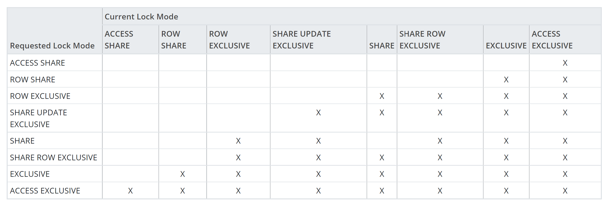
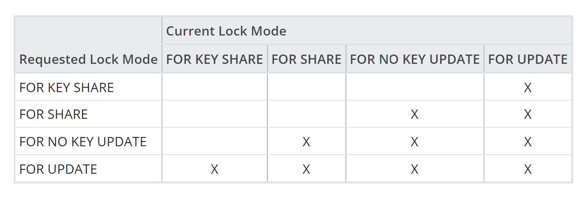

# PostgreSQL - Locking

Created by : Mr Dk.

2021 / 05 / 30 21:45

Hangzhou, Zhejiang, China

---

## About

PostgreSQL 中使用各种各样的 **锁** 对表的并发访问进行控制。大部分的 PG 命令都会自动获取合适的锁，以防止命令执行期间表被删除或修改。

## Table-level Locks

所有的 **表级锁**。获取方式：

- 执行某些特定的 SQL 命令，会自动获取相应的表级锁
- 使用 `LOCK` 命令显式获取表级锁

> 虽然这些锁里有些名字中带有 *row*，但是实际上都是表级锁。这是命名上的历史遗留问题。

锁之间实际差别是，相互之间是否冲突：

- 两个事务不能在同一时间获取同一个表上相互冲突的锁
- 同一个事务不与自己冲突
- 有一些锁是自冲突的，只能被一个事务持有

```c
/* NoLock is not a lock mode, but a flag value meaning "don't get a lock" */
#define NoLock                  0

#define AccessShareLock         1   /* SELECT */
#define RowShareLock            2   /* SELECT FOR UPDATE/FOR SHARE */
#define RowExclusiveLock        3   /* INSERT, UPDATE, DELETE */
#define ShareUpdateExclusiveLock 4  /* VACUUM (non-FULL),ANALYZE, CREATE INDEX
                                     * CONCURRENTLY */
#define ShareLock               5   /* CREATE INDEX (WITHOUT CONCURRENTLY) */
#define ShareRowExclusiveLock   6   /* like EXCLUSIVE MODE, but allows ROW
                                     * SHARE */
#define ExclusiveLock           7   /* blocks ROW SHARE/SELECT...FOR UPDATE */
#define AccessExclusiveLock     8   /* ALTER TABLE, DROP TABLE, VACUUM FULL,
                                     * and unqualified LOCK TABLE */

#define MaxLockMode             8
```

在源代码中，定义了以上锁类型，以及锁的使用场景。锁兼容性定义如下。通过对该数组与锁请求进行与运算，就可以得知是否发生锁冲突。

```c
/*
 * Data structures defining the semantics of the standard lock methods.
 *
 * The conflict table defines the semantics of the various lock modes.
 */
static const LOCKMASK LockConflicts[] = {
    0,

    /* AccessShareLock */
    LOCKBIT_ON(AccessExclusiveLock),

    /* RowShareLock */
    LOCKBIT_ON(ExclusiveLock) | LOCKBIT_ON(AccessExclusiveLock),

    /* RowExclusiveLock */
    LOCKBIT_ON(ShareLock) | LOCKBIT_ON(ShareRowExclusiveLock) |
    LOCKBIT_ON(ExclusiveLock) | LOCKBIT_ON(AccessExclusiveLock),

    /* ShareUpdateExclusiveLock */
    LOCKBIT_ON(ShareUpdateExclusiveLock) |
    LOCKBIT_ON(ShareLock) | LOCKBIT_ON(ShareRowExclusiveLock) |
    LOCKBIT_ON(ExclusiveLock) | LOCKBIT_ON(AccessExclusiveLock),

    /* ShareLock */
    LOCKBIT_ON(RowExclusiveLock) | LOCKBIT_ON(ShareUpdateExclusiveLock) |
    LOCKBIT_ON(ShareRowExclusiveLock) |
    LOCKBIT_ON(ExclusiveLock) | LOCKBIT_ON(AccessExclusiveLock),

    /* ShareRowExclusiveLock */
    LOCKBIT_ON(RowExclusiveLock) | LOCKBIT_ON(ShareUpdateExclusiveLock) |
    LOCKBIT_ON(ShareLock) | LOCKBIT_ON(ShareRowExclusiveLock) |
    LOCKBIT_ON(ExclusiveLock) | LOCKBIT_ON(AccessExclusiveLock),

    /* ExclusiveLock */
    LOCKBIT_ON(RowShareLock) |
    LOCKBIT_ON(RowExclusiveLock) | LOCKBIT_ON(ShareUpdateExclusiveLock) |
    LOCKBIT_ON(ShareLock) | LOCKBIT_ON(ShareRowExclusiveLock) |
    LOCKBIT_ON(ExclusiveLock) | LOCKBIT_ON(AccessExclusiveLock),

    /* AccessExclusiveLock */
    LOCKBIT_ON(AccessShareLock) | LOCKBIT_ON(RowShareLock) |
    LOCKBIT_ON(RowExclusiveLock) | LOCKBIT_ON(ShareUpdateExclusiveLock) |
    LOCKBIT_ON(ShareLock) | LOCKBIT_ON(ShareRowExclusiveLock) |
    LOCKBIT_ON(ExclusiveLock) | LOCKBIT_ON(AccessExclusiveLock)

};
```



关于这些锁分类的渊源，[这篇文章](https://www.modb.pro/db/26462) 分析得比较透彻。锁模型的发展经过了以下几个阶段：

1. 经典的读锁 / 写锁模型
2. 引入 MVCC 后的读锁 / 写锁模型
3. 引入行级锁后的意向锁模型
4. 引入自斥锁之后的最终锁模型

场景有些复杂，以后再逐个搞清楚 😑。

## Row-level Locks

同一个事务可以持有在同一行上相互冲突的行级锁，甚至是不同的子事务中；但两个事务不能获取同一行上相冲突的锁。行级锁不影响查询，只会阻塞同一行的 writer 和 locker。

```c
/*
 * Possible lock modes for a tuple.
 */
typedef enum LockTupleMode
{
    /* SELECT FOR KEY SHARE */
    LockTupleKeyShare,
    /* SELECT FOR SHARE */
    LockTupleShare,
    /* SELECT FOR NO KEY UPDATE, and UPDATEs that don't modify key columns */
    LockTupleNoKeyExclusive,
    /* SELECT FOR UPDATE, UPDATEs that modify key columns, and DELETE */
    LockTupleExclusive
} LockTupleMode;
```



## Page-level Locks

页级别的 share / exclusive 锁用于控制共享缓冲池中的页面读写。在 fetch 或 update 一行后，锁将会立刻释放。应用开发人员无需关心。

## Selecting for Share and Update

上述各级别的锁中，很多都是为了服务于 `select for update / share`。这是干啥用的？

```sql
FOR UPDATE [ OF table_name [, ...] ] [ NOWAIT ]
```

```sql
FOR SHARE [ OF table_name [, ...] ] [ NOWAIT ]
```

根据官方文档，其作用为，使 SELECT 语句中获取到的所有 **行** 被上锁，以防止其它事务中的 UPDATE / DELETE。

- `SELECT FOR UPDATE` 不允许其它事务的 `SELECT FOR UPDATE`
- `SELECT FOR SHARE` 允许其它事务的 `SELECT FOR SHARE`

如果锁冲突，将会使另一个事务的操作请求阻塞。因此可以指定 `NOWAIT` 来决定锁冲突时是等待还是报错。

## References

[PostgreSQL Documentation 11 - 13.3. Explicit Locking](https://www.postgresql.org/docs/11/explicit-locking.html)

[PostgreSQL Documentation 11 - 52.73. pg_locks](https://www.postgresql.org/docs/11/view-pg-locks.html)

[PostgreSQL Documentation 11 - LOCK](https://www.postgresql.org/docs/11/sql-lock.html)

