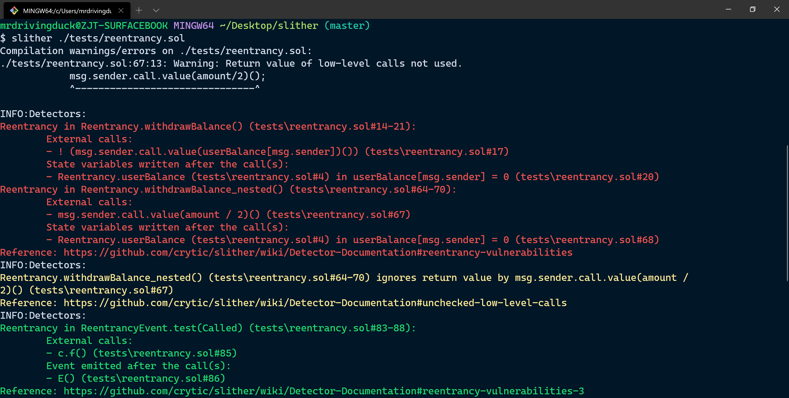

# Solidity - Slither

Created by : Mr Dk.

2020 / 02 / 28 18:57

Ningbo, Zhejiang, China

---

## About _Slither_

是一个 Python 3 实现的 Solidity 静态分析框架。

根据 _slither_ 的 [论文](https://arxiv.org/abs/1908.09878)，该工具借由 Solidity 编译器产生的 AST，恢复出继承关系图、控制流图等重要信息；并将 Solidity 代码转换为 _SSA_ (Static Single Assessment) 形式的中间表示形式 - _SlithIR_ 。最终，对这种中间表示形式进行代码分析，从而进行威胁检测和代码优化。

## _SlithIR_

为什么需要中间表示形式？

编译器通常可能会将一个程序转换为 AST。然而，编译器可以继续使用各种信息丰富 AST，以便于进行深入的程序分析。比如，Solidity 中有继承机制，这意味着函数可以在当前 contract 源代码以外被定义。IR 可以使这些函数线性化，从而便于对函数执行流进行分析。

类似于 C 语言、LLVM IR、x86 汇编代码。C 语言很明确地进行了函数调用，但缺失了底层系统的细节，比如访问位置的具体信息等；而对于 x86 汇编来说，又缺失了函数调用的传递细节。而 LLVM IR 同时保留了细节信息，因此能够进行深入的程序分析和代码优化。

### Variables

状态变量、局部变量、常量等

暂时型变量、引用型变量

### Operators

赋值、一元、二元操作符

解引用、取成员操作符

函数调用操作符 (多种)

### SSA

这个概念在 LLVM 中也有，但是我暂时还是没有办法理解它的作用。从形式上看，就是将表达式转化为 __每个变量只能被赋值一次__ 的形式。这么做有利于分析，但是具体怎么个有利，以后再深入研究。

## Python API

对于上述过程有所了解后，API 的用处就显而易见了。API 接收一个 Solidity 源文件作为输入，并将输入分析为一个 Slither 对象：

```python
from slither.slither import Slither

slither = Slither('file.sol')
```

首先，通过这个 Slither 对象，可以获得所有的 Contract 对象：

* `contracts()` - 源文件中所有的 contract
* `contracts_derived()` - 源文件中所有非继承 contract
* `get_contract_from_name()` - 返回指定名称的 contract

对于每一个 Contract 对象：

* `name()` - 得到 contract 的名称
* `functions()` - 得到 contract 中所有的函数 (Function 对象)
* `modifiers()` - 得到 contract 中所有的 modifier
* `inheritance()` - 所有继承的 contract
* `get_xxx()` - 取得 Function 对象、StateVariable 对象等

对于每一个 Function 对象或 Modifier 对象：

* `name()` - 函数名
* `nodes()` - 得到函数中所有的 CFG 结点对象 (Node)
* `entry_point()` - CFG 的入口结点
* `variables_read()` / `variables_written()` - 被读取或写入的变量列表
* `state_variables_read()` / `state_variables_written()` - 被读取或写入的状态变量列表

对于变量，则有很多不同的类型 - 状态变量、局部变量等，具有属性如变量名、是否被初始化等。

对于 CFG 结点对象 Node，其中包含：

* `type()` - 返回结点的类型
* `expression()` - 与该结点相关的表达式 (Expression)
* 读取/写入 的 变量/状态变量

而一个 Expression 对象则是一个基于 AST 的代码表示。

基于这些 API，就可以根据不同威胁种类的特定模式，实现对应的检测逻辑。已经内置的代码分析有：

* read/write - 识别对于变量的读写
* protected functions - 只有 contract owner 有权限执行的函数
* data dependency analysis - 对于数据依赖进行的分析 (某个变量是否依赖于另一个变量)

## Detectors

检测器使用上述 API 对代码进行分析，从而实现威胁检测或代码优化。目前已经实现了 [40 个检测器](https://github.com/crytic/slither/blob/master/README.md#detectors)。

其中每一个检测器的骨架如下：

```python
from slither.detectors.abstract_detector import AbstractDetector, DetectorClassification


class Skeleton(AbstractDetector):
    """
    Documentation
    """

    ARGUMENT = 'mydetector' # slither will launch the detector with slither.py --detect mydetector
    HELP = 'Help printed by slither'
    IMPACT = DetectorClassification.HIGH
    CONFIDENCE = DetectorClassification.HIGH

    WIKI = ''

    WIKI_TITLE = ''
    WIKI_DESCRIPTION = ''
    WIKI_EXPLOIT_SCENARIO = ''
    WIKI_RECOMMENDATION = ''

    def _detect(self):
        info = 'This is an example!'

        finding = self.generate_json_result(info)
        return [finding]
```

对于每一种攻击，在 _slither_ 的 [WIKI](https://github.com/crytic/slither/wiki/Detector-Documentation#reentrancy-vulnerabilities) 中阐述了威胁发生的原因与示例的威胁场景。在相应的检测器中，定义了这种威胁的严重程度，和分析这个威胁的信心。

对于每一种威胁，重写 `_detect()` 函数实现相应的检测逻辑，然后返回一系列的 finding，即 _slither_ 在分析结束后将会打印的信息 (类似编译器的警告信息)。另外还有几个用于辅助的函数，可以将指定的变量 / 结点 / 函数 / contract 加入到最终的 finding 中。Finding 中的信息可以集成到 IDE 里作为代码静态分析的提示。

以 `unused_state_variables` 为例。这个检测器用于检测 contract 中所有未被使用的状态变量：

```python
"""
Module detecting unused state variables
"""

from slither.detectors.abstract_detector import AbstractDetector, DetectorClassification
from slither.core.solidity_types import ArrayType
from slither.visitors.expression.export_values import ExportValues
from slither.core.variables.state_variable import StateVariable
from slither.formatters.variables.unused_state_variables import format

class UnusedStateVars(AbstractDetector):
    """
    Unused state variables detector
    """

    ARGUMENT = 'unused-state'
    HELP = 'Unused state variables'
    IMPACT = DetectorClassification.INFORMATIONAL
    CONFIDENCE = DetectorClassification.HIGH

    WIKI = 'https://github.com/crytic/slither/wiki/Detector-Documentation#unused-state-variables'


    WIKI_TITLE = 'Unused state variables'
    WIKI_DESCRIPTION = 'Unused state variable.'
    WIKI_EXPLOIT_SCENARIO = ''
    WIKI_RECOMMENDATION = 'Remove unused state variables.'

    def detect_unused(self, contract):
        if contract.is_signature_only():
            return None
        # Get all the variables read in all the functions and modifiers

        all_functions = (contract.all_functions_called + contract.modifiers)
        variables_used = [x.state_variables_read for x in all_functions]
        variables_used += [x.state_variables_written for x in all_functions if not x.is_constructor_variables]

        array_candidates = [x.variables for x in all_functions]
        array_candidates = [i for sl in array_candidates for i in sl] + contract.state_variables
        array_candidates = [x.type.length for x in array_candidates if isinstance(x.type, ArrayType) and x.type.length]
        array_candidates = [ExportValues(x).result() for x in array_candidates]
        array_candidates = [i for sl in array_candidates for i in sl]
        array_candidates = [v for v in array_candidates if isinstance(v, StateVariable)]


        # Flat list
        variables_used = [item for sublist in variables_used for item in sublist]
        variables_used = list(set(variables_used + array_candidates))

        # Return the variables unused that are not public
        return [x for x in contract.variables if
                x not in variables_used and x.visibility != 'public']

    def _detect(self):
        """ Detect unused state variables
        """
        results = []
        for c in self.slither.contracts_derived:
            unusedVars = self.detect_unused(c)
            if unusedVars:
                for var in unusedVars:
                    info = [var, " is never used in ", c, "\n"]
                    json = self.generate_result(info)
                    results.append(json)

        return results

    @staticmethod
    def _format(slither, result):
        format(slither, result)

```

其中，在 `_detect()` 函数中，调用了 _slither_ 提供的 API，对源文件中的每一个 contract 进行遍历，并调用 `detect_unused()` 进行检测 - 如果有未被使用的状态变量，则加入到 `results` 变量中，作为分析结束后的提示。在 `detect_unused()` 中，收集 contract 中会使用到的所有函数，并提取函数中对变量的读写操作进行分析。如果操作满足特定的模式，就能得出未被使用的状态变量，完成检测。

---

## Example

举一个 __重入__ (Reentrancy) 威胁的例子。想象如下的场景：

```solidity
function withdrawBalance() public{
    // send userBalance[msg.sender] ethers to msg.sender
    // if msg.sender is a contract, it will call its fallback function
    if( ! (msg.sender.call.value(userBalance[msg.sender])() ) ){
        revert();
    }
    userBalance[msg.sender] = 0;
}
```

这是一个退款的场景。用户在合约内存有一定的 Ether，想要退款。该合约先将用户在该合约中的余额通过转账退回给用户，然后更新合约中记账的数据结构。然而，当调用转账的函数时，如果用户也是一个 contract，就会触发用户的 fallback function - 在该函数中，恶意用户可能又会调用一次退款函数。此时，由于记账的数据结构还没有更新，合约就会重复退款给用户，以此类推。

检测这种威胁的原则就是，搜索 CFG，在一次外部调用之后，是否出现了对状态变量的写入操作。

## Installation && Usage

首先安装 _slither_ 本身：

```console
$ pip3 install slither-analyzer
```

由于 _slither_ 需要编译器的 AST，因此需要 [_sloc_](https://github.com/ethereum/solidity/) 编译器。

使用 _slither_ 对一个具有重入威胁的合约进行分析：



---

## Summary

根据 _slither_ 的论文，从三个角度与其它的静态分析工具进行了对比：

* 性能 - 分析是否快速
* 鲁棒性 - 分析是否经常失败
* 准确率 - 分析是否出现误报

在这三个方面，_slither_ 都优于其它的工具。

---

