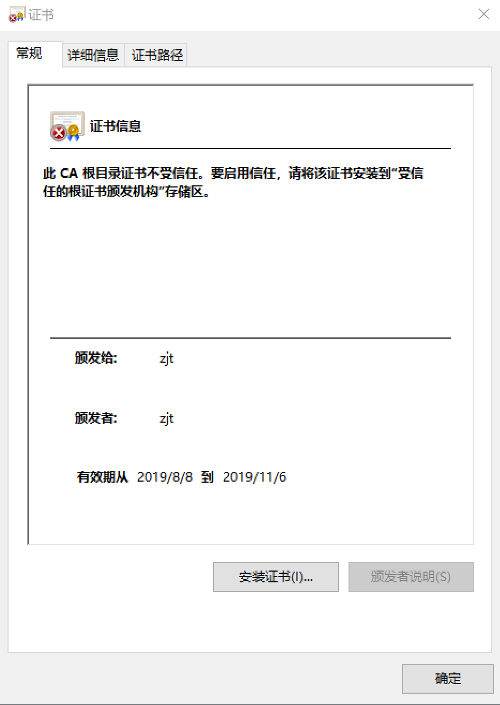
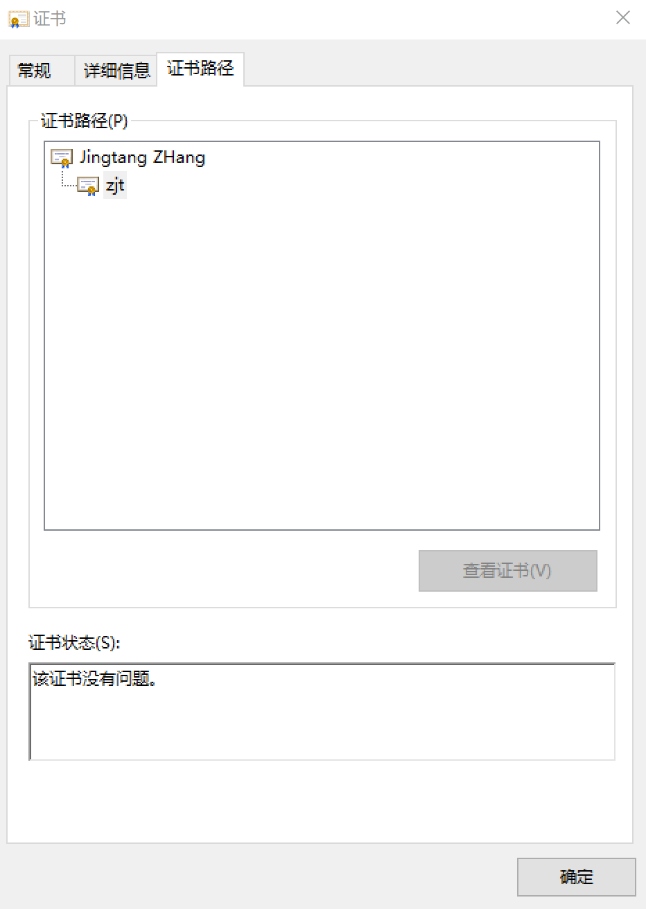
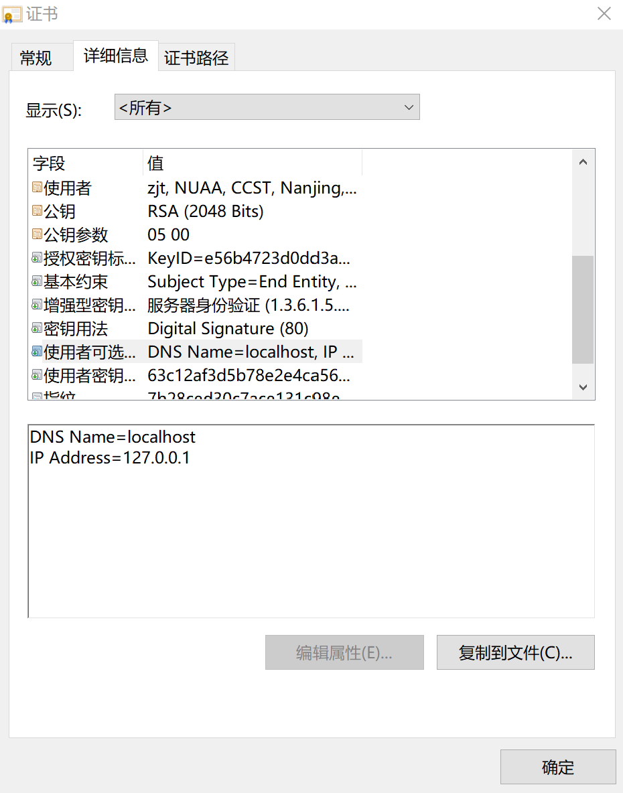

# Vert.x Core - HTTPS

Created by : Mr Dk.

2019 / 08 / 08 14:19

Nanjing, Jiangsu, China

---

为了写一个 HTTPS 的 server + client，总计折腾了 36h 左右 😌。自卑 + 自闭。

相关工作涉及 [密钥管理和数字证书](https://mrdrivingduck.github.io/#/markdown?repo=notes&path=Cryptography%2FCryptography%20Keystore%20%26%20Certificates.md)

---

## HTTPS Vert.x Implementation

其实最终的编程很简单。在实例化 `HttpServer` 和 `HttpClient` 时：

* 添加选项 `.setSsl(true)` - 开启 SSL
* 添加选项 `.setKeyStoreOptions()` 或 `.setTrustOptions()` - 发放证书或信任证书

证书可以以多种形式存在，比如 `.jks` 、 `.pem` 、`pfx` 等。在 keystore 中，有两类条目：

* PrivateKeyEntry
  * 由 `setKeyStoreOptions()` 来设置
  * 通常用于向对方发送证书
* trustedCertEntry
  * 由 `setTrustOptions()` 来设置
  * 通常用于接受并信任对方的证书

通常来说，HttpServer 应当设置 `setKeyStoreOptions()`，向客户端发放自己的证书；而 HttpClient 设置 `setTrustOptions()`，信任服务器发放的证书。这样双方就可以完成 SSL 握手

> 如果 HttpClient 需要向 HttpServer 发放证书，即客户端向服务器认证自己的身份，实现双向认证。那么 HttpClient 也就需要设置 `setKeyStoreOptions()`，读取 keystore 中的 PrivateKeyEntry 条目。

### HTTP Server

假设已经有一个存放 PrivateKeyEntry 的 keystore - `test.jks`。这是一个自签名的证书：

```console
别名: test
创建日期: 2019-8-8
条目类型: PrivateKeyEntry
证书链长度: 1
证书[1]:
所有者: CN=zjt, OU=NUAA, O=CCST, L=Nanjing, ST=Jiangsu, C=CN
发布者: CN=zjt, OU=NUAA, O=CCST, L=Nanjing, ST=Jiangsu, C=CN
序列号: 2a10ada1
有效期为 Thu Aug 08 11:37:02 CST 2019 至 Wed Nov 06 11:37:02 CST 2019
证书指纹:
         MD5:  6F:AA:F5:A0:63:90:8A:C5:77:E0:30:1B:E5:3D:57:ED
         SHA1: 20:2F:F6:0E:39:DD:B7:FC:56:C0:42:BD:61:B9:D9:99:7A:58:75:DA
         SHA256: 08:00:9E:16:D7:9F:94:DA:65:7B:4C:70:FB:B7:4B:A7:3F:27:31:3B:98:A7:F5:82:0B:EB:8E:55:9F:FE:03:17
签名算法名称: SHA256withRSA
主体公共密钥算法: 2048 位 RSA 密钥
版本: 3

扩展:

#1: ObjectId: 2.5.29.19 Criticality=false
BasicConstraints:[
  CA:true
  PathLen:2147483647
]

#2: ObjectId: 2.5.29.17 Criticality=false
SubjectAlternativeName [
  DNSName: localhost
  IPAddress: 127.0.0.1
]

#3: ObjectId: 2.5.29.14 Criticality=false
SubjectKeyIdentifier [
KeyIdentifier [
0000: 8E 0F 6B 16 AA E7 B9 6E   A1 E1 85 67 07 14 A2 10  ..k....n...g....
0010: 42 F5 52 ED                                        B.R.
]
]


*******************************************
*******************************************
```

将该 keystore 文件路径和密码交给 Vert.x 框架，即可完成服务器实例化：

```java
package iot.zjt;

import io.vertx.core.Vertx;
import io.vertx.core.http.HttpServerOptions;
import io.vertx.core.net.JksOptions;

public final class Server {

    public static void main(String[] args) {

        Vertx vertx = Vertx.vertx();

        HttpServerOptions options = new HttpServerOptions()
            .setPort(12444)
            .setHost("localhost")
            .setSsl(true)
            .setKeyStoreOptions(
                new JksOptions()
                    .setPath("test.jks")
                    .setPassword("123123")
            );
        
        vertx.createHttpServer(options).requestHandler(request -> {
            System.out.println("request");
            request.response().end("Hello");
        }).listen(serv -> {
            if (serv.succeeded()) {
                System.out.println("Start listening");
            } else {
                System.out.println(serv.cause().getMessage());
            }
        });
    }
}
```

### HTTP Client

假设已经有一个存放 trustedCertEntry 的 keystore (我把这个条目也放在 `test.jks` 中了)。即，客户端信任这个自签名证书：

```console
别名: client
创建日期: 2019-8-8
条目类型: trustedCertEntry

所有者: CN=zjt, OU=NUAA, O=CCST, L=Nanjing, ST=Jiangsu, C=CN
发布者: CN=zjt, OU=NUAA, O=CCST, L=Nanjing, ST=Jiangsu, C=CN
序列号: 2a10ada1
有效期为 Thu Aug 08 11:37:02 CST 2019 至 Wed Nov 06 11:37:02 CST 2019
证书指纹:
         MD5:  6F:AA:F5:A0:63:90:8A:C5:77:E0:30:1B:E5:3D:57:ED
         SHA1: 20:2F:F6:0E:39:DD:B7:FC:56:C0:42:BD:61:B9:D9:99:7A:58:75:DA
         SHA256: 08:00:9E:16:D7:9F:94:DA:65:7B:4C:70:FB:B7:4B:A7:3F:27:31:3B:98:A7:F5:82:0B:EB:8E:55:9F:FE:03:17
签名算法名称: SHA256withRSA
主体公共密钥算法: 2048 位 RSA 密钥
版本: 3

扩展:

#1: ObjectId: 2.5.29.19 Criticality=false
BasicConstraints:[
  CA:true
  PathLen:2147483647
]

#2: ObjectId: 2.5.29.17 Criticality=false
SubjectAlternativeName [
  DNSName: localhost
  IPAddress: 127.0.0.1
]

#3: ObjectId: 2.5.29.14 Criticality=false
SubjectKeyIdentifier [
KeyIdentifier [
0000: 8E 0F 6B 16 AA E7 B9 6E   A1 E1 85 67 07 14 A2 10  ..k....n...g....
0010: 42 F5 52 ED                                        B.R.
]
]


*******************************************
*******************************************
```

同样，将该文件的路径和密码交给 Vert.x 框架，并实例化客户端。也可以默认使客户端信任所有的证书：

* `.setTrustAll(true)`

```java
package iot.zjt;

import io.vertx.core.Vertx;
import io.vertx.core.http.HttpClientOptions;
import io.vertx.core.net.JksOptions;

public final class Client {

    public static void main(String[] args) {
        
        Vertx vertx = Vertx.vertx();

        HttpClientOptions options = new HttpClientOptions()
            .setDefaultPort(12444)
            .setDefaultHost("localhost")
            // .setTrustAll(true)
            .setTrustOptions(
                new JksOptions()
                    .setPath("test.jks")
                    .setPassword("123123")
            )
            .setSsl(true);
        
        vertx.createHttpClient(options).get("/", response -> {
            System.out.println(response.statusCode());
        }).end();
    }
}
```

---

## Certificate Generation

可以看到，上面的实现中，都需要用到 `.jks` 文件，以及其中的 entry。如何使用 JDK 自带的 keytool 工具进行证书生成呢？

基本概念：

* keytool 对每个 keystore 生成一个 `.jks` 文件
* 对于 keystore 中的每一个条目，都有一个唯一的 alias
* 每次操作 keystore 时，都需要指定 alias 和 keystore

### Self-signed Certificate Generation

产生一个自签名的证书，生成一对公私钥，指定 RSA 叭。 🤔

```console
$ keytool -genkeypair \
    -alias <alias> \
    -keystore <key_store.jks> \
    -keyalg <RSA...>
    ...
```

### Explore Keystore

查看 keystore 中的所有 entry ：

```console
$ keytool -list -v \
    -keystore <key_store.jks>
```

```console
密钥库类型: jks
密钥库提供方: SUN

您的密钥库包含 1 个条目

别名: test
创建日期: 2019-8-8
条目类型: PrivateKeyEntry
证书链长度: 1
证书[1]:
所有者: CN=zjt, OU=NUAA, O=CCST, L=Nanjing, ST=Jiangsu, C=CN
发布者: CN=zjt, OU=NUAA, O=CCST, L=Nanjing, ST=Jiangsu, C=CN
序列号: 2a10ada1
有效期为 Thu Aug 08 11:37:02 CST 2019 至 Wed Nov 06 11:37:02 CST 2019
证书指纹:
         MD5:  6F:AA:F5:A0:63:90:8A:C5:77:E0:30:1B:E5:3D:57:ED
         SHA1: 20:2F:F6:0E:39:DD:B7:FC:56:C0:42:BD:61:B9:D9:99:7A:58:75:DA
         SHA256: 08:00:9E:16:D7:9F:94:DA:65:7B:4C:70:FB:B7:4B:A7:3F:27:31:3B:98:A7:F5:82:0B:EB:8E:55:9F:FE:03:17
签名算法名称: SHA256withRSA
主体公共密钥算法: 2048 位 RSA 密钥
版本: 3

扩展:

#1: ObjectId: 2.5.29.19 Criticality=false
BasicConstraints:[
  CA:true
  PathLen:2147483647
]

#2: ObjectId: 2.5.29.17 Criticality=false
SubjectAlternativeName [
  DNSName: localhost
  IPAddress: 127.0.0.1
]

#3: ObjectId: 2.5.29.14 Criticality=false
SubjectKeyIdentifier [
KeyIdentifier [
0000: 8E 0F 6B 16 AA E7 B9 6E   A1 E1 85 67 07 14 A2 10  ..k....n...g....
0010: 42 F5 52 ED                                        B.R.
]
]


*******************************************
*******************************************


Warning:
JKS 密钥库使用专用格式。建议使用 "keytool -importkeystore -srckeystore .\test.jks -destkeystore .\test.jks -deststoretype pkcs12" 迁移到行业标准格式 PKCS12。
```

可以看到，所谓的自签名证书：

* 证书的 **所有者 (subject)** 和 **发布者 (issuer)** 相同
* 如果发布者是 CA，那么这个证书就是根证书，存放在 OS 的 root program 中
* 否则，没有人可以认证该证书的合法性

可以导出这个证书看一看：

```console
$ keytool -export \
    -alias <alias> \
    -keystore <key_store.jks> \
    -file <output.cer>
```



当然啦，这个证书可以被安装到 OS 信任的根证书列表中。这样的话，用这个证书的下级证书开启 HTTPS 服务器后，可以直接从浏览器中通过 `htts://...` 访问。因为浏览器最终信任的是 OS root program 中的根证书。

### Certificate Request

通常来说，自签名证书需要生成 **证书签名请求文件 CSR**，并提交给 CA 进行签名。

```console
$ keytool -certreq \
    -alias <alias> \
    -keystore <key_store.jks> \
    -file <request.csr>
```

### Certificate Signature

提交的 CSR 被签名后，证书的 subject 和 issuer 就不一样了，issuer 变为 CA。提交给 CA 进行签名 - 要 💰、要 ⌚。所以可以自己模拟 CA 来进行签名：

* CA 也有自己的公私钥对，所以按照上述自签名证书的生成方法产生公私钥对
* 用模拟 CA 的私钥对 CSR 进行签名
* 将 CA 的自签名证书 (根证书) 和签名后的证书一起返还给签名请求方 (subject)

```console
$ keytool -gencert \
    -alias <root_ca> \
    -keystore <root_ca_key_store.jks> \
    -infile <request.csr> \
    -outfile <signed.cer> \
    -ext ...
```

如果说 CA 的根证书已经被 OS 信任，那么签名后的证书也会被 OS 信任 (证书链)。



### Certificate Import

接下来，需要把 CA 的 root 证书和被签名后的证书，导入回 subject 的 keystore。其中，CA 的 root 证书以另一个 alias 导入为 trustedCertEntry 条目。而被签名后的证书需要以和之前相同的 alias 导入：

* 导入为 PrivateKeyEntry 条目
* 覆盖之前的自签名证书

```console
$ keytool -importcert \
    -alias <root> \
    -keystore <key_store.jks> \
    -file <root_ca.cer> \
是否信任此证书? [否]:  y
证书已添加到密钥库中
$ keytool -importcert \
    -alias <alias> \
    -keystore <key_store.jks> \
    -file <signed.cer> \
证书回复已安装在密钥库中
```

由此，该 keystore 信任了根证书，将 CA 的 root 证书加入了 keystore 的 trustedCertEntry。同时，该 keystore 存储了 subject 生成的证书的证书链。

* 将证书链加入 keystore 的 PrivateKeyEntry 中
* 链的最终源头是 CA 的 root 证书，自签名自认证
* 链的每一级证书用于认证下一级证书的公钥

最终的效果如下：

```console
密钥库类型: jks
密钥库提供方: SUN

您的密钥库包含 2 个条目

别名: root
创建日期: 2019-8-8
条目类型: trustedCertEntry

所有者: CN=Jingtang Zhang, OU=NUAA, O=CCST, L=Nanjing, ST=Jiangsu, C=CN
发布者: CN=Jingtang Zhang, OU=NUAA, O=CCST, L=Nanjing, ST=Jiangsu, C=CN
序列号: 303ebd1e
有效期为 Thu Aug 08 10:45:23 CST 2019 至 Wed Nov 06 10:45:23 CST 2019
证书指纹:
         MD5:  BE:62:0C:35:21:9A:5B:59:C3:D2:D9:A1:20:36:00:22
         SHA1: 59:64:70:F3:28:62:B4:3F:95:92:91:D9:12:34:01:56:61:83:36:77
         SHA256: 76:B9:53:60:83:FE:02:7E:B7:BF:FF:7D:33:45:91:5B:F4:09:59:E8:7E:52:57:6C:E3:8E:FE:88:19:B2:5A:4D
签名算法名称: SHA256withRSA
主体公共密钥算法: 2048 位 RSA 密钥
版本: 3

扩展:

#1: ObjectId: 2.5.29.19 Criticality=false
BasicConstraints:[
  CA:true
  PathLen:0
]

#2: ObjectId: 2.5.29.15 Criticality=false
KeyUsage [
  Key_CertSign
]

#3: ObjectId: 2.5.29.14 Criticality=false
SubjectKeyIdentifier [
KeyIdentifier [
0000: E5 6B 47 23 D0 DD 3A 81   C0 80 2A E1 40 CD DF 0C  .kG#..:...*.@...
0010: 2F F5 53 6C                                        /.Sl
]
]


*******************************************
*******************************************


别名: localhost
创建日期: 2019-8-8
条目类型: PrivateKeyEntry
证书链长度: 2
证书[1]:
所有者: CN=zjt, OU=NUAA, O=CCST, L=Nanjing, ST=Jiangsu, C=CN
发布者: CN=Jingtang Zhang, OU=NUAA, O=CCST, L=Nanjing, ST=Jiangsu, C=CN
序列号: 2e8f8760
有效期为 Thu Aug 08 13:30:07 CST 2019 至 Wed Nov 06 13:30:07 CST 2019
证书指纹:
         MD5:  61:63:98:6F:3D:C7:7D:47:00:CD:F0:73:30:22:54:8D
         SHA1: CF:4A:A6:8D:5E:61:C5:08:E7:06:3D:22:68:49:FA:75:E5:58:66:F0
         SHA256: 4C:F9:DA:62:56:43:92:04:34:AC:95:F8:3C:CE:21:D5:F3:24:1E:CC:67:88:86:3E:FE:F0:95:94:D4:0C:BE:0E
签名算法名称: SHA256withRSA
主体公共密钥算法: 2048 位 RSA 密钥
版本: 3

扩展:

#1: ObjectId: 2.5.29.35 Criticality=false
AuthorityKeyIdentifier [
KeyIdentifier [
0000: E5 6B 47 23 D0 DD 3A 81   C0 80 2A E1 40 CD DF 0C  .kG#..:...*.@...
0010: 2F F5 53 6C                                        /.Sl
]
]

#2: ObjectId: 2.5.29.14 Criticality=false
SubjectKeyIdentifier [
KeyIdentifier [
0000: D7 55 7B 55 D6 33 70 C3   37 A7 58 8A 10 9A 66 8A  .U.U.3p.7.X...f.
0010: 9B 4E D5 13                                        .N..
]
]

证书[2]:
所有者: CN=Jingtang Zhang, OU=NUAA, O=CCST, L=Nanjing, ST=Jiangsu, C=CN
发布者: CN=Jingtang Zhang, OU=NUAA, O=CCST, L=Nanjing, ST=Jiangsu, C=CN
序列号: 303ebd1e
有效期为 Thu Aug 08 10:45:23 CST 2019 至 Wed Nov 06 10:45:23 CST 2019
证书指纹:
         MD5:  BE:62:0C:35:21:9A:5B:59:C3:D2:D9:A1:20:36:00:22
         SHA1: 59:64:70:F3:28:62:B4:3F:95:92:91:D9:12:34:01:56:61:83:36:77
         SHA256: 76:B9:53:60:83:FE:02:7E:B7:BF:FF:7D:33:45:91:5B:F4:09:59:E8:7E:52:57:6C:E3:8E:FE:88:19:B2:5A:4D
签名算法名称: SHA256withRSA
主体公共密钥算法: 2048 位 RSA 密钥
版本: 3

扩展:

#1: ObjectId: 2.5.29.19 Criticality=false
BasicConstraints:[
  CA:true
  PathLen:0
]

#2: ObjectId: 2.5.29.15 Criticality=false
KeyUsage [
  Key_CertSign
]

#3: ObjectId: 2.5.29.14 Criticality=false
SubjectKeyIdentifier [
KeyIdentifier [
0000: E5 6B 47 23 D0 DD 3A 81   C0 80 2A E1 40 CD DF 0C  .kG#..:...*.@...
0010: 2F F5 53 6C                                        /.Sl
]
]


*******************************************
*******************************************
```

这个 `.jks` 文件可用于 Vert.x HTTPS 服务器的输入。

在对应的 HTTPS 客户端上：

* 配置 `.jks` 文件中的 trustedCertEntry 包含了该证书，那么就可以建立连接
* 但是浏览器不行，因为浏览器只信任 OS 上的根证书
* 除非把模拟 CA 的根证书加入 OS 的信任根证书列表中

---

## Certificate Extension

上述过程中产生的证书，确实是正确的证书，但是放到 Vert.x HTTPS Server 上之后，无论是浏览器，还是 HTTPS Client，都是无法访问的。哪怕把模拟 CA 的根证书加入了 OS 的信任列表。原因在于，被签名后的证书，需要与 IP 地址或域名等绑定，这些信息保存在证书的 **X.509 证书扩展** 中。CA 在对证书签名时，会将扩展信息加在证书中。参考 keytool 的官方文档：

```
-ext {name{:critical} {=value}}

Denotes an X.509 certificate extension. The option can be used in -genkeypair and -gencert to embed extensions into the certificate generated, or in -certreq to show what extensions are requested in the certificate request. The option can appear multiple times. The name argument can be a supported extension name (see Named Extensions) or an arbitrary OID number. The value argument, when provided, denotes the argument for the extension. When value is omitted, that means that the default value of the extension or the extension requires no argument. The :critical modifier, when provided, means the extension's isCritical attribute is true; otherwise, it is false. You can use :c in place of :critical.
```

扩展的内容包括：

* BC / Basic Constraints - `ca:{true|false},pathlen:<len>`
  * 是否是 CA 证书？
* KU / Key Usage - `digitalSignature/keyCertSign/...`
  * 密钥用于数字签名 / 证书签名 / ...
* EKU / Extended Key Usage - `serverAuth/clientAuth/codeSigning/emailProtection/...`
  * 密钥还能用于服务端认证 / 客户端认证 / ...
* **SAN / Subject Alternative Name** - `type:value`，type 可以是 `EMAIL/URI/DNS/IP/OID`
  * 这是最重要的一项 - 如果想要服务器能够被访问，这一项不能少
  * 域名可以用 `DNS`，IP 地址可以用 `IP`
* IAN / Issuer Alternative Name
  * 与 SAN 相同
* SIA / Subject Info Access
* AIA / Authority Info Access

在上述对证书签名的步骤中，加入这些 extension：

```console
$ keytool -gencert \
    -alias <root_ca> \
    -keystore <root_ca_key_store.jks> \
    -infile <request.csr> \
    -outfile <signed.cer> \
    -ext BC=ca:false
    -ext KU=digitalSignature
    -ext EKU=serverAuth
    -ext SAN=DNS:localhost,ip:127.0.0.1
```

产生的签名证书导入 keystore 后，可以看到，根证书带有 3 个扩展，被签名的证书带有 6 个扩展：

```console
别名: localhost
创建日期: 2019-8-8
条目类型: PrivateKeyEntry
证书链长度: 2
证书[1]:
所有者: CN=zjt, OU=NUAA, O=CCST, L=Nanjing, ST=Jiangsu, C=CN
发布者: CN=Jingtang Zhang, OU=NUAA, O=CCST, L=Nanjing, ST=Jiangsu, C=CN
序列号: 2043d288
有效期为 Thu Aug 08 13:52:08 CST 2019 至 Wed Nov 06 13:52:08 CST 2019
证书指纹:
         MD5:  FF:0A:B4:D7:7A:7F:6D:CA:6F:C1:9F:AB:54:27:D2:7B
         SHA1: 85:A2:AB:11:FC:5B:D2:18:75:10:FB:2C:EA:0E:20:EC:69:63:A9:16
         SHA256: 61:71:C9:D3:7B:2D:40:28:B6:0A:78:73:9E:6F:8E:42:4D:4C:7F:9A:F4:69:6E:3D:64:88:EE:08:2E:B5:89:48
签名算法名称: SHA256withRSA
主体公共密钥算法: 2048 位 RSA 密钥
版本: 3

扩展:

#1: ObjectId: 2.5.29.35 Criticality=false
AuthorityKeyIdentifier [
KeyIdentifier [
0000: E5 6B 47 23 D0 DD 3A 81   C0 80 2A E1 40 CD DF 0C  .kG#..:...*.@...
0010: 2F F5 53 6C                                        /.Sl
]
]

#2: ObjectId: 2.5.29.19 Criticality=false
BasicConstraints:[
  CA:false
  PathLen: undefined
]

#3: ObjectId: 2.5.29.37 Criticality=false
ExtendedKeyUsages [
  serverAuth
]

#4: ObjectId: 2.5.29.15 Criticality=false
KeyUsage [
  DigitalSignature
]

#5: ObjectId: 2.5.29.17 Criticality=false
SubjectAlternativeName [
  DNSName: localhost
  IPAddress: 127.0.0.1
]

#6: ObjectId: 2.5.29.14 Criticality=false
SubjectKeyIdentifier [
KeyIdentifier [
0000: D7 55 7B 55 D6 33 70 C3   37 A7 58 8A 10 9A 66 8A  .U.U.3p.7.X...f.
0010: 9B 4E D5 13                                        .N..
]
]

证书[2]:
所有者: CN=Jingtang Zhang, OU=NUAA, O=CCST, L=Nanjing, ST=Jiangsu, C=CN
发布者: CN=Jingtang Zhang, OU=NUAA, O=CCST, L=Nanjing, ST=Jiangsu, C=CN
序列号: 303ebd1e
有效期为 Thu Aug 08 10:45:23 CST 2019 至 Wed Nov 06 10:45:23 CST 2019
证书指纹:
         MD5:  BE:62:0C:35:21:9A:5B:59:C3:D2:D9:A1:20:36:00:22
         SHA1: 59:64:70:F3:28:62:B4:3F:95:92:91:D9:12:34:01:56:61:83:36:77
         SHA256: 76:B9:53:60:83:FE:02:7E:B7:BF:FF:7D:33:45:91:5B:F4:09:59:E8:7E:52:57:6C:E3:8E:FE:88:19:B2:5A:4D
签名算法名称: SHA256withRSA
主体公共密钥算法: 2048 位 RSA 密钥
版本: 3

扩展:

#1: ObjectId: 2.5.29.19 Criticality=false
BasicConstraints:[
  CA:true
  PathLen:0
]

#2: ObjectId: 2.5.29.15 Criticality=false
KeyUsage [
  Key_CertSign
]

#3: ObjectId: 2.5.29.14 Criticality=false
SubjectKeyIdentifier [
KeyIdentifier [
0000: E5 6B 47 23 D0 DD 3A 81   C0 80 2A E1 40 CD DF 0C  .kG#..:...*.@...
0010: 2F F5 53 6C                                        /.Sl
]
]


*******************************************
*******************************************
```

其中，被签名证书的扩展中带有了 `DNSName: localhost` 和 `IPAddress: 127.0.0.1`。此时，将该 `.jks` 文件输入 Vert.x HTTPS Server。在 Vert.x HTTPS Client 中发起请求，host 可以填写 `localhost` 或 `127.0.0.1`。接收到的 status code 为 200，代表请求成功

如果模拟 CA 的根证书被加入 OS 的信任列表，那么在浏览器中也可以访问 `https://localhost:<port>` - 建立的是 HTTPS 安全连接。

查看证书信息：



---

## Reference

https://docs.oracle.com/javase/8/docs/technotes/tools/windows/keytool.html

https://github.com/FiloSottile/mkcert

https://vertx.io/docs/vertx-core/java/#ssl

https://www.jianshu.com/p/8e065153f315

---

## Summary

除了 *keytool* 以外，*openssl* 也提供了制作证书的工具，本质上是一样的，都是以指定的格式生成证书、签名。里面的坑实在是不少...一直成功不了的原因在于漏掉了证书中的 SAN 扩展。直到使用了 GitHub 上的 [mkcert](https://github.com/FiloSottile/mkcert)，并对比了一下这个工具产生的证书和我制作的证书有什么区别，才发现了 SAN 的作用。

研究 SSL/TLS 算是解开了很长时间以来的一个心结吧，以后不用写裸奔的 HTTP 程序啦。 😭

---

