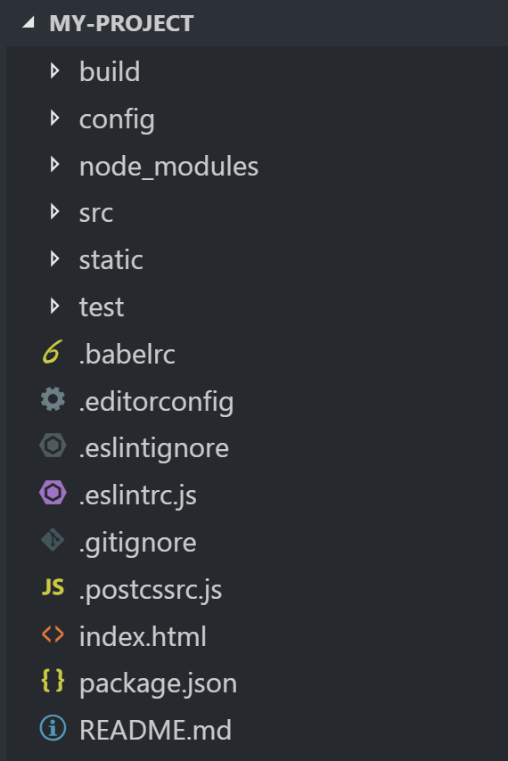
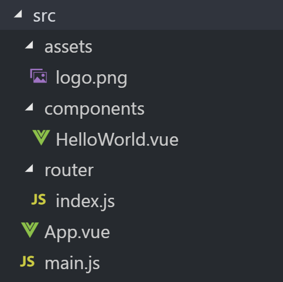

# Vue.js - Basic

Created by : Mr Dk.

2019 / 02 / 22 12:33

Nanjing, Jiangsu, China

---

## Declarative Rendering

Vue.js 的核心是一个允许采用简洁的模板语法来声明式地将数据渲染进 DOM 的系统

```vue
<!DOCTYPE html>
<html>
<head>
<meta charset="utf-8">
<title>Declarative Rendering</title>
<script src="https://unpkg.com/vue/dist/vue.js"></script>
</head>
<body>
<div id="app">
  <p>{{ message }}</p>
  <p>{{ details() }}</p>
</div>

<script>
new Vue({
  el: '#app',
  data: {
    message: 'Hello Vue.js!'
  }
  methods: {
    details: function() {
      return this.message + "嘿嘿嘿";
    }
  }
})
</script>
</body>
</html>
```

每个 Vue.js 应用都需要通过实例化 Vue 来实现：

* `el` 参数是 DOM 中的 id，意味着该实例与对应 id 的标签绑定，只会在该标签的 DOM 子树中起作用
* `data` 用于定义所有的数据属性
* `method` 用于定义函数
* `{{  }}` 用于输出属性或函数返回值

当一个 Vue 实例被创建时

它向 Vue 的响应式系统中加入了其 `data` 对象中能找到的所有的属性

当这些属性的值发生改变时

html 视图将也会产生相应的变化

---

## Start from One Page Application

以上代码通常出现在教程中

而使用 Vue.js 命令行生成的项目结构不太一样



| Directory/File  | Description                  |
| --------------- | ---------------------------- |
| `build\`        | 项目构建（webpack）相关代码  |
| `config\`       | 配置目录                     |
| `node_modules\` | npm 加载的项目依赖           |
| `src\`          | 源代码目录                   |
| `static\`       | 静态资源目录（图片、字体等） |
| `test\`         | 测试目录                     |
| `index.html`    | 首页入口文件                 |
| `package.json`  | 项目配置文件                 |

其中，源代码目录 `src\` 如下：



| Directory/File | Description                            |
| -------------- | -------------------------------------- |
| `assets\`      | 放置 LOGO 等图片                       |
| `components\`  | 组件                                   |
| `router\`      | 路由                                   |
| `App.vue`      | 项目入口文件，也可以直接将组件写在这里 |
| `main.js`      | 项目核心文件                           |

总体来看：

* 最外层的 `index.html` 定义了页面，将其中的某一 `<div>` 划分为由 Vue.js 渲染
* `main.js` 实例化了 Vue 对象
  * 通过 `el` 绑定到了 `index.html` 对应 `<div>` 的 DOM 中
  * 使用 `router` 将 URL 与 `components\` 中的组件映射
  * 在实例中注册局部组件 `App`
* 在 `App.vue` 中实现 `index.html` 中 `<div>` 组件的具体内容

---

## Reactive

一旦数据与 HTML DOM 绑定

如果数据的值被改变，那么 HTML 将会立刻改变

在 `.vue` 文件（组件）中，将组件名 `name`、数据 `data`、方法 `methods` 暴露出来：

```vue
<template>
  <div id="app">
    <p>{{ site }}</p>
    <p>{{ test() }}</p>
  </div>
</template>

<script>
export default {
  name: 'App', 
  data: function () {
    return {
      site: '666'
    }
  },
  methods: {
    test: function () {
      return '888'
    }
  }
}
</script>
```

__ATTENTION: 数据需要用函数的形式返回__ - https://github.com/vuejs/vue/issues/1032

---

## Summary

Vue.js 的运作机制 搞...搞清了吗 😓

可能需要边学边理解了

---

