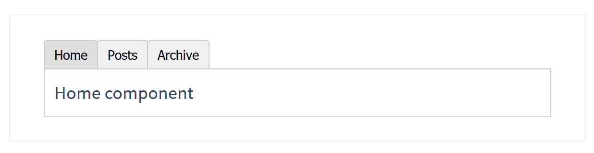

# Vue.js - Dynamic Component

Created by : Mr Dk.

2019 / 02 / 23 16:46

Nanjing, Jiangsu, China

---

## Background

建立一个标签页，顶端有三个标签按钮，下面是标签的显示区域，只显示其中一个标签页。点哪个按钮显示哪个标签页。

如下图所示：



---

## Design

每个标签页对应一个组件，用一个变量记录目前选中的组件名，用 `v-for` 迭代上面的三个按钮，并设置 `v-on:click`，在点击时将变量修改为对应的组件名。

在下部的区域中为组件预留位置：

```vue
<component></component>
```

并使用 `v-bind:is="..."` 动态切换组件，参数可以是：

* 已注册组件的名字
* 一个组件的选项对象

比如使用一个 `computed` 函数，返回组件名。也可以直接使用表达式拼接出组件名 - `v-bind:is="'tab-' + currentTab"`

---

## Implementation

首先在程序入口注册组件，并实例化 Vue：

```javascript
Vue.component('tab-first', {
  template: '<div>First component</div>'
})

Vue.component('tab-second', {
  template: '<div>Second component</div>'
})

Vue.component('tab-third', {
  template: '<div>Third component</div>'
})

new Vue({
  el: '#pp',
  components: { App },
  template: '<App/>'
})
```

界面布局和逻辑实现：

```vue
<template>
  <div id="app">
    <button
      v-for="tab in tabs"
      v-bind:key="tab"
      v-on:click="currentTab = tab"
      >{{ tab }}</button>
    <component v-bind:is="currentTabComponent"></component>
  </div>
</template>

<script>
export default {
  name: 'App',
  data: function () {
    return {
      currentTab: 'first',                // 记录目前选中的标签
      tabs: ['first', 'second', 'third']  // 所有的标签 - 按钮名
    }
  },
  computed: {
    currentTabComponent: function () {
      // 返回已注册的组件名
      return 'tab-' + this.currentTab
    }
  }
}
</script>
```

---

## Keep Alive

每次切换组件时，Vue 都会创建新的组件实例并重新渲染，有时可能会存在性能问题。可不可以在组件之间切换时，保持这些组件的状态呢？(比如保留阅读进度) 即，组件实例能够在它们第一次被创建时缓存下来。

**使用 `<keep-alive></keep-alive>` 将动态组件包裹起来。**

```vue
<!-- 失活的组件将会被缓存！-->
<keep-alive>
  <component v-bind:is="currentTabComponent"></component>
</keep-alive>
```

---

