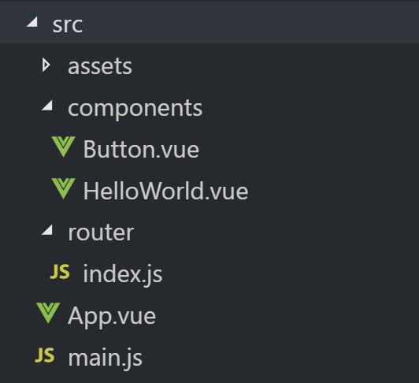

# Vue.js - Router

Created by : Mr Dk.

2019 / 02 / 26 23:15

Nanjing, Jiangsu, China

---

### About

Vue Router - 将组件映射到路由，然后告诉 Vue Router 在哪里渲染它们

---

### Installation

#### CDN/Download

在 `<script></script>` 标签中直接加载

#### NPM

```bash
$ npm install vue-router
```

如果在一个模块化工程中使用，需要使用 `Vue.use()` 明确安装路由功能

```javascript
import Vue from 'vue'
import Router from 'vue-router'

Vue.use(Router)
```

---

### Relationship



1. 在 `/components` 中实现组件

2. 在 `/router/index.js` 中实例化 Router，并配置组件和路由

   ```javascript
   import Vue from 'vue'
   import Router from 'vue-router'
   
   import HelloWorld from '@/components/HelloWorld'
   import Button from '@/components/Button'
   
   Vue.use(Router)
   
   export default new Router({
     routes: [
       {
         path: '/',
         name: 'HelloWorld',
         component: HelloWorld
       },
       {
         path: '/button',
         name: 'Button',
         component: Button
       }
     ]
   })
   ```

3. 在 `main.js` 中实例化 Vue，并配置 Router

   ```javascript
   import Vue from 'vue'
   import App from './App'
   import router from './router'
   
   Vue.config.productionTip = false
   
   /* eslint-disable no-new */
   new Vue({
     el: '#pp',
     components: { App },
     template: '<App/>',
     router: router
   })
   ```

4. 在 `App.vue` 中指定组件渲染的位置和组件跳转的链接

---

### Template

`<router-view></router-view>` 用于标识渲染位置

`<router-link></router-link>` 是用于设置导航链接的组件

* 用 `to` 属性指定链接
* `<router-link></router-link>` 默认会被渲染成 `<a></a>` 标签

```vue
<template>
  <div id="app">
    <p>
      <router-link to="/component1">Component1</router-link>
      <router-link to="/component2">Component2</router-link>
    </p>
    <router-view></router-view>
  </div>
</template>
```

---

### Attributes of `router-link`

`to` - 目标路由的链接，可带参数，点击后会将值传递到 `router.push()`

`replace` - 调用 `router.replace()`，__导航后不会留下 history 记录__

`append` - 在当前相对路径之后追加路径

`tag` - 指定 `<router-link></router-link>` 的渲染标签

......

---

### Summary

把 Vue Router 看完

生成的 Vue.js 工程的整体逻辑大概就明白了

---

