# Wireless - IEEE 802.11 Frame Structure

Created by : Mr Dk.

2019 / 01 / 20 15:44

Nanjing, Jiangsu, China

---

### General Format

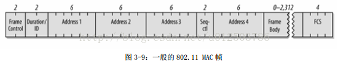

* _MPDU_ - _MAC_ 层协议数据单元
  * _MAC Header_
    * _Frame Control_
    * _Duration ID_
    * _Address 1_
    * _Address 2_
    * _Address 3_
    * _Sequence Control_
    * _Address 4_
  * _Frame Body_ - ( _Control Frame_ 没有 _Frame Body_ ) &rarr; __MAC payload__
  * _FCS_ - checksum for _Header_ & _Frame Body_

| Fields           | Description                      | Length (Bytes) |
| ---------------- | -------------------------------- | -------------- |
| Frame Control    | ...                              | `2`            |
| Duration ID      | _Network Allocation Vector, NAV_ | `2`            |
| Address 1        | /                                | `6`            |
| Address 2        | /                                | `6`            |
| Address 3        | /                                | `6`            |
| Sequence Control | 用于帧重组以及丢弃               | `2`            |
| Address 4        | /                                | `6`            |
| Frame Body       | /                                | /              |
| FCS              | _CRC_                            | `4`            |

#### Frame Control

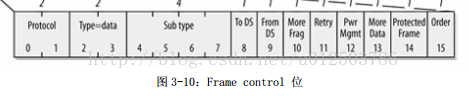

| Fields           | Description                                    | Length (bits) |
| ---------------- | ---------------------------------------------- | ------------- |
| Protocol Version | _MAC_ version                                  | `2`           |
| Type             | `Management` / `Control` / `Data` / `Reserved` | `2`           |
| SubType          | ...                                            | `4`           |
| To DS            | Distributed System                             | `1`           |
| From DS          | Distributed System                             | `1`           |
| More Fragment    | /                                              | `1`           |
| Retry            | /                                              | `1`           |
| Power Management | /                                              | `1`           |
| More Data        | /                                              | `1`           |
| Protected Frame  | Frame body 是否被 _WEP_ 算法加密               | `1`           |
| Order            | /                                              | `1`           |

---

### Data Frame

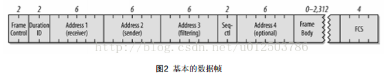

| Sub-Type   | Frame Type                  | Number   |
| ---------- | --------------------------- | -------- |
| `0000`     | Data                        | `0`      |
| `0001`     | Data + CF-Ack               | `1`      |
| `0010`     | Data + CF-Poll              | `2`      |
| `0011`     | Data + CF-Ack + CF-Poll     | `3`      |
| `0100`     | Null                        | `4`      |
| `0101`     | CF-Ack                      | `5`      |
| `0110`     | CF-Poll                     | `6`      |
| `0111`     | CF-Ack + CF-Poll            | `7`      |
| `1000`     | QoS Data                    | `8`      |
| `1001`     | QoS Data + CF-Ack           | `9`      |
| `1010`     | QoS Data + CF-Poll          | `10`     |
| `1011`     | QoS Data + CF-Ack + CF-Poll | `11`     |
| `1100`     | QoS Null                    | `12`     |
| ~~`1101`~~ | ~~Reserved~~                | ~~`13`~~ |
| `1110`     | QoS CF-Poll                 | `14`     |
| `1111`     | QoS CF-Ack CF-Poll          | `15`     |

#### IBSS Frame

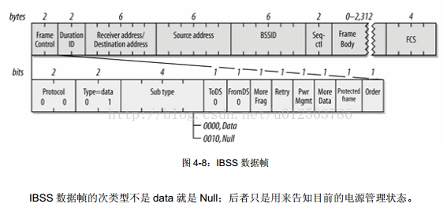

#### From AP Frame

区分 _TA_ 和 _SA_

* _802.11_ 标准将应答发送到 _Transmitter Address_ （发送端 _AP_）
* 上层协议会将应答发送给 _Source Address_

#### To AP Frame

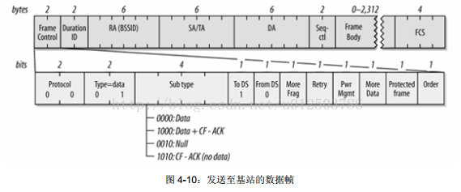

#### WDS Frame

当 _AP_ 被部署为无线桥接时，_Address4_ 会被用到

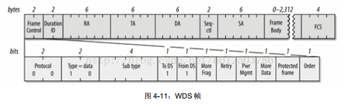

---

### Control Frame

| Sub-Type          | Frame Type      | Number      |
| ----------------- | --------------- | ----------- |
| ~~`0000 - 0110`~~ | ~~Reserved~~    | ~~`0 - 6`~~ |
| `0111`            | 控制包裹        | `7`         |
| `1000`            | 块确认请求      | `8`         |
| `1001`            | 块确认          | `9`         |
| `1010`            | PS-Poll         | `10`        |
| `1011`            | RTS             | `11`        |
| `1100`            | CTS             | `12`        |
| `1101`            | ACK             | `13`        |
| `1110`            | CF-End          | `14`        |
| `1111`            | CF-End + CF-Ack | `15`        |

#### RTS Frame

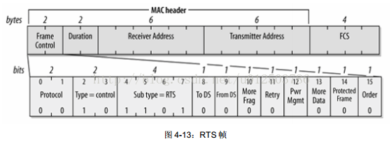

* 在 _CSMA/CA_ 中用于取得传输介质的控制权

#### CTS Frame

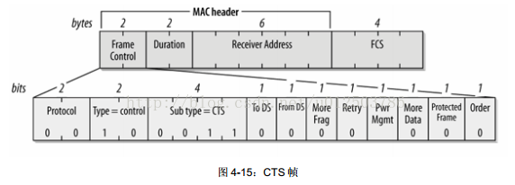

* “允许发送”

#### ACK Frame

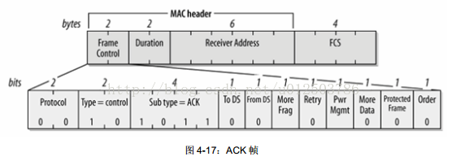

* “应答”

#### PS-Poll Frame

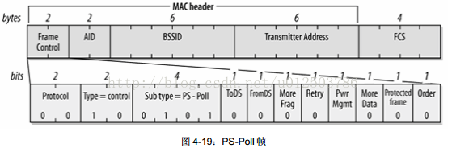

---

### Management Frame

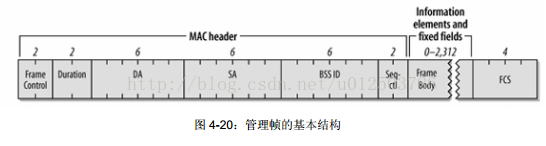

_Frame Body_ 中包含固定字段（_Fixed Fields_）和长度不定的 _Information Elements_

根据 _Frame Control_ 中的 _Sub-Type_，可以分为许多中子类型：

| Sub-Type          | Frame Type              | Number      |
| ----------------- | ----------------------- | ----------- |
| `0000`            | Association Request     | `0`         |
| `0001`            | Association Response    | `1`         |
| `0010`            | Re-association Request  | `2`         |
| `0011`            | Re-association Response | `3`         |
| `0100`            | Probe Request           | `4`         |
| `0101`            | Probe Response          | `5`         |
| ~~`0110 - 0111`~~ | ~~Reserved~~            | ~~`6 - 7`~~ |
| `1000`            | Beacon                  | `8`         |
| `1001`            | ATIM                    | `9`         |
| `1010`            | Disassociation          | `10`        |
| `1011`            | Authentication          | `11`        |
| `1100`            | Deauthentication        | `12`        |
| `1101`            | 功能帧                  | `13`        |
| `1110`            | 无需确认的功能帧        | `14`        |
| ~~`1111`~~        | ~~Reserved~~            | ~~`15`~~    |

#### Authentication Frame

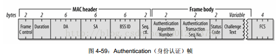

#### Association Request Frame

* 经过 _Authentication_ 后进行，试图加入网络

#### Re-association Request Frame

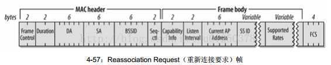

#### (Re-)Association Response Frame

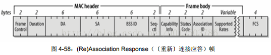

#### Disassociation & De-authentication Frame

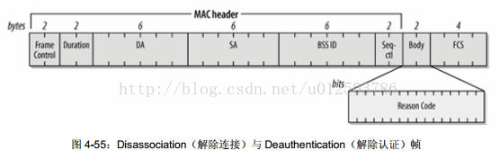

#### Beacon Frame

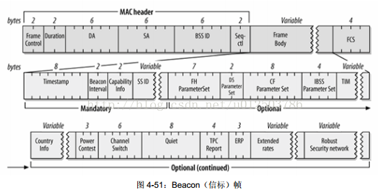

* 定期发送 _Beacon_ 帧以宣告某个网络的存在

#### Probe Request Frame

* 收到该帧的 _STA_ 会判断对方能否加入网络

#### Probe Response Frame

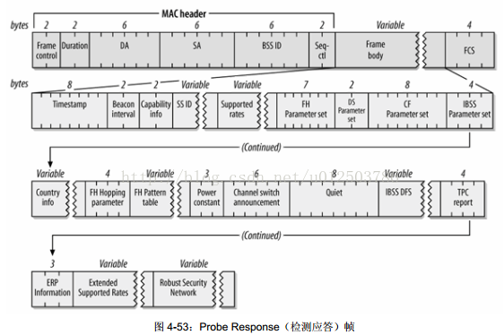

#### ATIM Frame

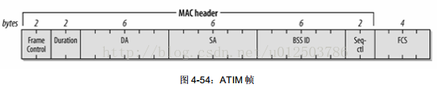

---

### References

https://blog.csdn.net/u012503786/article/details/78783874

https://blog.csdn.net/sinat_22991367/article/details/73005140

https://blog.csdn.net/chengwenyao18/article/details/7176090

https://www.cnblogs.com/hzl6255/p/4084173.html

---

### Summary

在 _IEEE_ 官网下载了 _802.11_ 标准文档

但是有 _3000_ 多页的 _PDF_

实在是吃不消

在 _CSDN_ 上看了一些资料

算是快速入门了解一下

可以马上应用到 _Scapy_ 的 _Packet Manipulation_ 中

---

