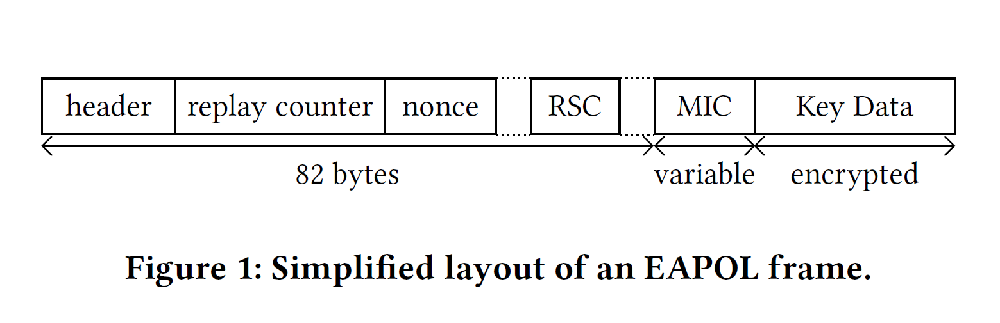
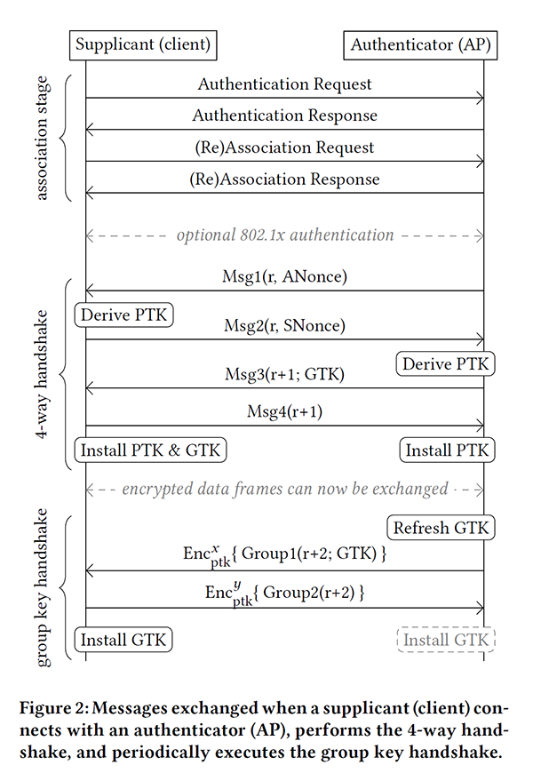

# Wireless - IEEE 802.11i Amendment

Created by : Mr Dk.

2018 / 12 / 07 17:24

Nanjing, Jiangsu, China

---

### About

目前所有使用不同版本的 _WPA_ 保护的 _Wi-Fi_ 都是安全的

所有安全技术都依赖于 _IEEE 802.11i_ 修正案中定义的 __四次握手__ （_4-way handshake_）

### Background

在研究人员发现 _WEP_ 协议已经基本不起作用后

_IEEE_ 提供了一个更为有效的解决方案，即 _802.11i_ 修正案：

* 定义了 __四次握手__ 机制
* 定义了两种 __数据机密性及完整性__ 协议
  * _(WPA-)TKIP_
  * _(AES-)CCMP_

在 _802.11i_ 正处于开发阶段时，_Wi-Fi_ 联盟已经授权设备使用 _802.11i D3.0_ - _WPA_

_802.11i D9.0_ 为该修正案的最终版本 - _WPA2_

由于 _WPA_ 和 _WPA2_ 都基于 _802.11i_，因此在技术层面上几乎相同，主要区别在于：

* _WPA2_ 支持更为安全的 _CCMP_，_TKIP_ 作为可选项
* _WPA_ 支持 _TKIP_

所有受 _WPA / WPA2_ 的网络都需要使用 __四次握手__ 机制

- [x] 四次握手、组密钥握手、_CCMP_ 协议已被正式地证明为是安全的

### Authentication and Association

一个客户端想要连接到一个 _Wi-Fi_ 网络中时，需要与 _AP_ 进行双向的 __认证__、__关联__

但 __实际上的认证__ 是在后来的 __四次握手__ 中完成的，这里仅进行 __开放系统认证__

在认证完成后，客户端发起 __关联__ 请求，请求中包含客户端想要使用的加密方式

_AP_ 会回应给客户端，通知客户端关联成功或失败

### The 4-way Handshake

#### Key Generation

四次握手基于 _Pairwise Master Key (PMK)_ 进行双向认证

在此过程中，协商一个新的会话密钥，称为 _Pairwise Transient Key (PTK)_

在四次握手中：

* 客户端被称为 _supplicant_
* _AP_ 被称为 _authenticator_

_PMK_ 的来源：

* _802.11i_ 个人版中的 _pre-shared key (PSK)_
* _802.11i_ 企业版中，使用 _802.1x_ 认证协商获得

_PTK_ 的产生：

* _PMK_
* _Authenticator Nonce (ANonce)_
* _Supplicant Nonce (SNonce)_
* _Authenticator MAC Address_
* _Supplicant MAC Address_

_PTK_ 一经产生后，会被拆分为三部分：

* _Key Confirmation Key (KCK)_
* _Key Encryption Key (KEK)_
* _Temporal Key (TK)_

_KCK_ 和 _KEK_ 用于保护握手信息

_TK_ 配合 __数据机密性协议__ 保护之后的数据帧

* 如果使用了 _WPA2_ 协议，四次握手中也会传输 _Group Temporal Key (GTK)_

#### EAPOL

四次握手中的每一条信息都使用 _EAPOL_ 帧

* _header_ 定义了该信息是四次握手中的哪一条信息（1/2/3/4）
* _replay counter_ 用于检测重发的帧
  * _Authenticator_ 在传输一帧后将 _replay counter_ 增加
  * _Supplicant_ 在回复时使用与接收到的 _EAPOL_ 帧相同的 _replay counter_
* _nonce_ 用于传递双方产生的随机数，用于产生一个全新的会话密钥
* _Receive Sequence Counter (RSC)_ 在传输 _GTK_ 时，携带 _GTK_ 的第一个包的编号
* _Key Data_ 存放 _GTK_ 本身，并被 _KEK_ 加密
* _Message Integrity Check (MIC)_ 存放整个帧的 _KCK_ 认证

#### The Handshake

* _Authenticator &rarr; Supplicant_
  * 携带 _ANonce_
  * 是唯一没有被 _MIC_ 保护的 _EAPOL_ 消息
  * _Supplicant_ 收到 _ANonce_ 后，生成 _SNonce_ 并计算 _PTK_
* _Supplicant &rarr; Authenticator_
  * 携带 _SNonce_
  * _Authenticator_ 得到 _SNonce_ 后，也可以计算出 _PTK_
* _Authenticator &rarr; Supplicant_
  * 发送 _GTK_
* _Supplicant &rarr; Authenticator_
  * 回应确认
  * _Supplicant_ 安装 _PTK_ 和 _GTK_
  * _Authenticator_ 在收到回应后也安装 _PTK_；_GTK_ 在 _AP_ 启动时已被安装

在一个已有的连接中，_PTK_ 可以用一次新的四次握手刷新

这四次握手的消息使用已有的 _PTK_ 配合消息机密性协议进行加密

### Confidentiality and Integrity Protocols

_802.11i_ 修正案定义了两个 __数据机密性协议__：

* _Temporal Key Integrity Protocol (TKIP)_ - 由于存在安全问题而不被赞成使用
* _(AES-)CCMP_ - 目前被广泛使用

_2012_ 年，_802.11ad_ 修正案加入了 _Galios/Counter Mode Protocol (GCMP)_

#### TKIP

当使用 _TKIP_ 时，_PTK_ 中的 _TK_ 被进一步拆分为：

* _128-bit_ 的加密密钥
* 两个 _64-bit_ 的 _Message Integrity Check (MIC)_ 密钥
  * 第一个 _MIC key_ 用于 _AP_ 到客户端的通信
  * 第二个 _MIC key_ 用于客户端到 _AP_ 的通信

每一个数据包都有一个密钥，用于 _RC4_ 的加密，密钥由以下三者混合而成：

* _128-bit_ 的加密密钥
* 发送方 _MAC Address_
* 一个增长的 _48-bit nonce_
  * 传输一帧后增加
  * 被接收方当做 _replay counter_ 使用
  * 安装 _TK_ 时被初始化为 _1_

消息完整性由 _Michael Algorithm_ 保证

* 该算法可以被反推
* 如果知道明文和 _MIC_ 值，就可以反推出 _MIC key_

#### CCMP

_CCMP_ 协议基于工作在 _CCM (Counter mode with CBC-MAC)_ 模式下的 _AES_ 加密

这是一种 _Authenticated Encryption with Associated Data, AEAD_ 算法

* 对于特定的密钥，不会有 _IV_ 的重复，因此是安全的
* _IV_ 由以下三部分拼接而成：
  * 发送者的 _MAC Address_
  * _48-bit nonce_
  * _additional flags derived from the transmitted frame_
* _48-bit nonce_ 也被接收方当做 _replay counter_ 使用
  * 在发送每一帧之前增加 _1_
  * _TK_ 安装时被初始化为 _0_
* 保证了 _IV_ 不会被重复使用
* _TK_ 被直接用于双向通信

#### GCMP

_GCMP_ 协议基于 _AES-GCM_

* 使用计数器模式进行加密
* _GHASH_ 函数保证密文完整性

与 _CCMP_ 协议类似，_GCMP_ 协议也是一种 _AEAD_ 算法：

* _IV_ 由以下两部分拼接而成：
  * 发送方 _MAC Address_
  * _48-bit nonce_
* _48-bit nonce_ 也被接收方当做 _replay counter_ 使用
  * 在发送每一帧之前增加 _1_
  * _TK_ 安装时被初始化为 _0_
* 保证了 _IV_ 不会被重复使用
* _TK_ 被直接用于双向通信
* 如果 _nonce_ 被重复使用的话，就可能通过 _GHASH_ 函数复现 _authentication key_

### The Group Key Handshake

_Authenticator_ 周期性地刷新 _GTK_

并使用 _Group Key Handshake_ 将新的 _GTK_ 发布到所有的客户端上

- [x] _Group Key Handshake_ 已被证明是安全的

握手过程：

* _Authenticator_ 向所有 _Supplicant_ 发送 _EAPOL_ 消息
  * _Data_ 域包含新的 _GTK_（使用 _KEK_ 加密）
  * _RSC_ 域中包含 _replay counter_
* _Supplicant_ 回应，确认收到新的 _GTK_

取决于具体实现，_authenticator_ 安装 _GTK_ 的时机可能会有不同：

* 发送 _msg1_ 之后
* 收到所有 _Supplicant_ 的回应 _msg2_ 后

两个握手消息都使用 _EAPOL_ 帧发送：

* 由于此时 _PTK_ 已经安装完毕，两个 _EAPOL_ 帧整体被数据机密性协议加密保护

如果一个客户端想要发送 __广播__ 或 __多播__ 消息：

* 先发送一个 __单播__ 消息到 _AP_
* _AP_ 将数据帧使用 _GTK_ 加密
* _AP_ 将加密后的数据帧广播到所有的客户端

---

### Summary

这是 _KRACK_ 攻击的 _CCS_ 论文的 _Background_ 部分

详细讲解了 _IEEE 802.11i_ 修正案以及四次握手机制

在很多的细节上讲得很到位

学习了

---

